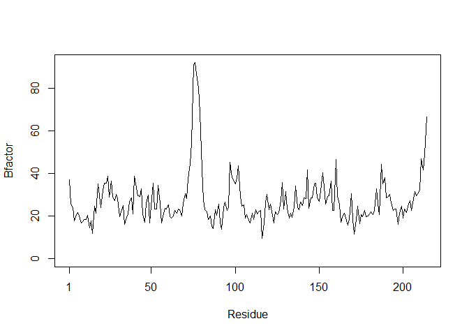
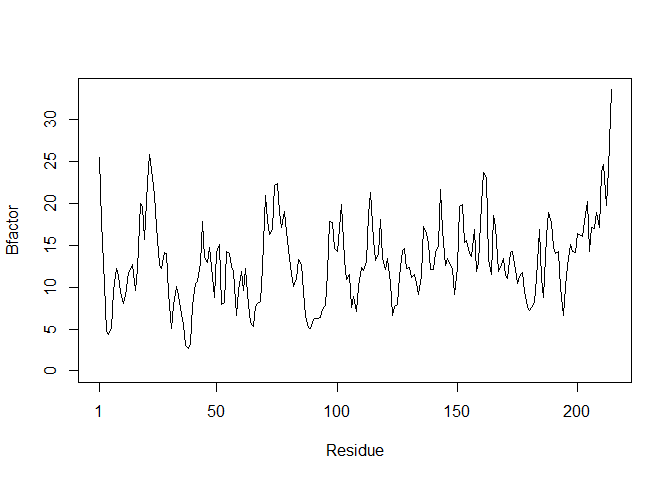
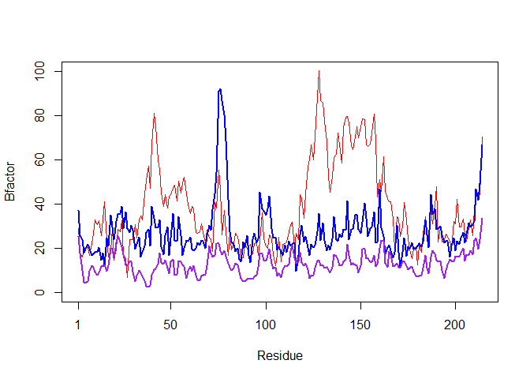

Class 6: R Function
================
Nathaniel Bloom
1/23/2020

# Functions

## Level 2 Header

### Level 3 Header

**File Import** Exploration Main read function in R is ‘read.table()’
Read in txt files

``` r
t1 <- read.table("test1 (1).txt", sep = ",", header = TRUE)
```

Or just use ‘read.csv()’

``` r
t1 <- read.csv("test1 (1).txt")
t1
```

    ##   Col1 Col2 Col3
    ## 1    1    2    3
    ## 2    4    5    6
    ## 3    7    8    9
    ## 4    a    b    c

``` r
t2 <- read.table("test2.txt", sep = "$", header= TRUE)
t2
```

    ##   Col1 Col2 Col3
    ## 1    1    2    3
    ## 2    4    5    6
    ## 3    7    8    9
    ## 4    a    b    c

``` r
t3 <- read.table("test3.txt")
t3
```

    ##   V1 V2 V3
    ## 1  1  6  a
    ## 2  2  7  b
    ## 3  3  8  c
    ## 4  4  9  d
    ## 5  5 10  e

# Back to Functions

Example 1

``` r
add <- function(x, y=1) {
 # Sum the input x and y
 x + y
}
```

Use This Function

``` r
add(7, 3)
```

    ## [1] 10

Vector as an input

``` r
add(c(1, 2, 3, 4))
```

    ## [1] 2 3 4 5

Will add 5 to everything

``` r
add(c(1, 2, 3, 4), 5)
```

    ## [1] 6 7 8 9

each vector represents X and Y respectively

``` r
add(c(1, 2, 3, 4), c(1,2,3,4))
```

    ## [1] 2 4 6 8

``` r
#add(c(1, 2, 3, 4), 1, 2, 4)
```

Too many arguments b/c function only allows two arguments

What is ‘range()’ function

``` r
x <- c(1,1,3,11,12)
max(x)
```

    ## [1] 12

``` r
min(x)
```

    ## [1] 1

``` r
range(x)
```

    ## [1]  1 12

Our second function

``` r
rescale <- function(x) {
 rng <-range(x)
 (x - rng[1]) / (rng[2] - rng[1])
}
```

``` r
rescale(x)
```

    ## [1] 0.0000000 0.0000000 0.1818182 0.9090909 1.0000000

More Testing

``` r
rescale(1:10)
```

    ##  [1] 0.0000000 0.1111111 0.2222222 0.3333333 0.4444444 0.5555556 0.6666667
    ##  [8] 0.7777778 0.8888889 1.0000000

``` r
# how do we get this to work 
rescale( c(1,2,NA,3,10) )
```

    ## [1] NA NA NA NA NA

``` r
x<- c(1,2,NA,4,5)
rng<- range(x, na.rm =TRUE)
rng
```

    ## [1] 1 5

New function to deal with NA

``` r
rescale2 <- function(x) {
 rng <-range(x, na.rm = TRUE)
 (x - rng[1]) / (rng[2] - rng[1])
}
```

``` r
rescale2(c(1,2,NA,4,5))
```

    ## [1] 0.00 0.25   NA 0.75 1.00

rescale 3

``` r
rescale3 <- function(x, na.rm=TRUE, plot=FALSE) {
 rng <-range(x, na.rm=na.rm)
 
 print("Hello")
 
 answer <- (x - rng[1]) / (rng[2] - rng[1])
 print("is it me you are looking for?")
 
 if(plot) {
   print("Dont sing again!")
  plot(answer, typ="b", lwd=4)
 }
 print("I can see it in ...")
 return(answer)
 
}
```

``` r
rescale3(x, plot=FALSE)
```

    ## [1] "Hello"
    ## [1] "is it me you are looking for?"
    ## [1] "I can see it in ..."

    ## [1] 0.00 0.25   NA 0.75 1.00

use library to call a function when needed Hands on worksheet

``` r
library(bio3d)
s1 <- read.pdb("4AKE") # kinase with drug
```

    ##   Note: Accessing on-line PDB file

``` r
s2 <- read.pdb("1AKE") # kinase no drug
```

    ##   Note: Accessing on-line PDB file
    ##    PDB has ALT records, taking A only, rm.alt=TRUE

``` r
s3 <- read.pdb("1E4Y") # kinase with drug
```

    ##   Note: Accessing on-line PDB file

``` r
s1.chainA <- trim.pdb(s1, chain="A", elety="CA")
s2.chainA <- trim.pdb(s2, chain="A", elety="CA")
s3.chainA <- trim.pdb(s3, chain="A", elety="CA")
s1.b <- s1.chainA$atom$b
s2.b <- s2.chainA$atom$b
s3.b <- s3.chainA$atom$b
plotb3(s1.b, typ="l", ylab="Bfactor")
```

<!-- -->

``` r
plotb3(s2.b, typ="l", ylab="Bfactor")
```

<!-- -->

``` r
plotb3(s3.b, typ="l", ylab="Bfactor")
```

<!-- -->

``` r
library(bio3d)
s1 <- read.pdb("4AKE")
```

    ##   Note: Accessing on-line PDB file

    ## Warning in get.pdb(file, path = tempdir(), verbose = FALSE): C:
    ## \Users\natha\AppData\Local\Temp\RtmpioTAij/4AKE.pdb exists. Skipping download

``` r
s1.chainA <- trim.pdb(s1, chain="A", elety="CA")
print(s1.chainA)
```

    ## 
    ##  Call:  trim.pdb(pdb = s1, chain = "A", elety = "CA")
    ## 
    ##    Total Models#: 1
    ##      Total Atoms#: 214,  XYZs#: 642  Chains#: 1  (values: A)
    ## 
    ##      Protein Atoms#: 214  (residues/Calpha atoms#: 214)
    ##      Nucleic acid Atoms#: 0  (residues/phosphate atoms#: 0)
    ## 
    ##      Non-protein/nucleic Atoms#: 0  (residues: 0)
    ##      Non-protein/nucleic resid values: [ none ]
    ## 
    ##    Protein sequence:
    ##       MRIILLGAPGAGKGTQAQFIMEKYGIPQISTGDMLRAAVKSGSELGKQAKDIMDAGKLVT
    ##       DELVIALVKERIAQEDCRNGFLLDGFPRTIPQADAMKEAGINVDYVLEFDVPDELIVDRI
    ##       VGRRVHAPSGRVYHVKFNPPKVEGKDDVTGEELTTRKDDQEETVRKRLVEYHQMTAPLIG
    ##       YYSKEAEAGNTKYAKVDGTKPVAEVRADLEKILG
    ## 
    ## + attr: atom, helix, sheet, seqres, xyz,
    ##         calpha, call

``` r
s1 <- read.pdb("4AKE") # kinase with drug
```

    ##   Note: Accessing on-line PDB file

    ## Warning in get.pdb(file, path = tempdir(), verbose = FALSE): C:
    ## \Users\natha\AppData\Local\Temp\RtmpioTAij/4AKE.pdb exists. Skipping download

> Q1 what does ‘read.pdb()’ return?

Returns list of 8 things of class “pdb”, “sse”

``` r
class(s1)
```

    ## [1] "pdb" "sse"

``` r
aa321(s1$seqres)
```

    ##   [1] "M" "R" "I" "I" "L" "L" "G" "A" "P" "G" "A" "G" "K" "G" "T" "Q" "A" "Q"
    ##  [19] "F" "I" "M" "E" "K" "Y" "G" "I" "P" "Q" "I" "S" "T" "G" "D" "M" "L" "R"
    ##  [37] "A" "A" "V" "K" "S" "G" "S" "E" "L" "G" "K" "Q" "A" "K" "D" "I" "M" "D"
    ##  [55] "A" "G" "K" "L" "V" "T" "D" "E" "L" "V" "I" "A" "L" "V" "K" "E" "R" "I"
    ##  [73] "A" "Q" "E" "D" "C" "R" "N" "G" "F" "L" "L" "D" "G" "F" "P" "R" "T" "I"
    ##  [91] "P" "Q" "A" "D" "A" "M" "K" "E" "A" "G" "I" "N" "V" "D" "Y" "V" "L" "E"
    ## [109] "F" "D" "V" "P" "D" "E" "L" "I" "V" "D" "R" "I" "V" "G" "R" "R" "V" "H"
    ## [127] "A" "P" "S" "G" "R" "V" "Y" "H" "V" "K" "F" "N" "P" "P" "K" "V" "E" "G"
    ## [145] "K" "D" "D" "V" "T" "G" "E" "E" "L" "T" "T" "R" "K" "D" "D" "Q" "E" "E"
    ## [163] "T" "V" "R" "K" "R" "L" "V" "E" "Y" "H" "Q" "M" "T" "A" "P" "L" "I" "G"
    ## [181] "Y" "Y" "S" "K" "E" "A" "E" "A" "G" "N" "T" "K" "Y" "A" "K" "V" "D" "G"
    ## [199] "T" "K" "P" "V" "A" "E" "V" "R" "A" "D" "L" "E" "K" "I" "L" "G" "M" "R"
    ## [217] "I" "I" "L" "L" "G" "A" "P" "G" "A" "G" "K" "G" "T" "Q" "A" "Q" "F" "I"
    ## [235] "M" "E" "K" "Y" "G" "I" "P" "Q" "I" "S" "T" "G" "D" "M" "L" "R" "A" "A"
    ## [253] "V" "K" "S" "G" "S" "E" "L" "G" "K" "Q" "A" "K" "D" "I" "M" "D" "A" "G"
    ## [271] "K" "L" "V" "T" "D" "E" "L" "V" "I" "A" "L" "V" "K" "E" "R" "I" "A" "Q"
    ## [289] "E" "D" "C" "R" "N" "G" "F" "L" "L" "D" "G" "F" "P" "R" "T" "I" "P" "Q"
    ## [307] "A" "D" "A" "M" "K" "E" "A" "G" "I" "N" "V" "D" "Y" "V" "L" "E" "F" "D"
    ## [325] "V" "P" "D" "E" "L" "I" "V" "D" "R" "I" "V" "G" "R" "R" "V" "H" "A" "P"
    ## [343] "S" "G" "R" "V" "Y" "H" "V" "K" "F" "N" "P" "P" "K" "V" "E" "G" "K" "D"
    ## [361] "D" "V" "T" "G" "E" "E" "L" "T" "T" "R" "K" "D" "D" "Q" "E" "E" "T" "V"
    ## [379] "R" "K" "R" "L" "V" "E" "Y" "H" "Q" "M" "T" "A" "P" "L" "I" "G" "Y" "Y"
    ## [397] "S" "K" "E" "A" "E" "A" "G" "N" "T" "K" "Y" "A" "K" "V" "D" "G" "T" "K"
    ## [415] "P" "V" "A" "E" "V" "R" "A" "D" "L" "E" "K" "I" "L" "G"

``` r
s1$atom
```

    ##        type eleno elety  alt resid chain resno insert       x       y       z
    ## 1      ATOM     1     N <NA>   MET     A     1   <NA> -10.928 -24.892  -9.518
    ## 2      ATOM     2    CA <NA>   MET     A     1   <NA>  -9.901 -24.422 -10.479
    ## 3      ATOM     3     C <NA>   MET     A     1   <NA>  -9.168 -23.266  -9.813
    ## 4      ATOM     4     O <NA>   MET     A     1   <NA>  -9.802 -22.323  -9.346
    ## 5      ATOM     5    CB <NA>   MET     A     1   <NA> -10.585 -23.970 -11.774
    ## 6      ATOM     6    CG <NA>   MET     A     1   <NA>  -9.650 -23.497 -12.856
    ## 7      ATOM     7    SD <NA>   MET     A     1   <NA>  -8.384 -24.690 -13.251
    ## 8      ATOM     8    CE <NA>   MET     A     1   <NA>  -9.002 -25.277 -14.812
    ## 9      ATOM     9     N <NA>   ARG     A     2   <NA>  -7.851 -23.394  -9.673
    ## 10     ATOM    10    CA <NA>   ARG     A     2   <NA>  -7.028 -22.352  -9.051
    ## 11     ATOM    11     C <NA>   ARG     A     2   <NA>  -6.001 -21.906 -10.072
    ## 12     ATOM    12     O <NA>   ARG     A     2   <NA>  -5.150 -22.680 -10.492
    ## 13     ATOM    13    CB <NA>   ARG     A     2   <NA>  -6.337 -22.868  -7.801
    ## 14     ATOM    14    CG <NA>   ARG     A     2   <NA>  -7.222 -22.919  -6.621
    ## 15     ATOM    15    CD <NA>   ARG     A     2   <NA>  -6.632 -23.799  -5.576
    ## 16     ATOM    16    NE <NA>   ARG     A     2   <NA>  -7.440 -23.763  -4.372
    ## 17     ATOM    17    CZ <NA>   ARG     A     2   <NA>  -6.965 -23.881  -3.138
    ## 18     ATOM    18   NH1 <NA>   ARG     A     2   <NA>  -5.664 -24.050  -2.932
    ## 19     ATOM    19   NH2 <NA>   ARG     A     2   <NA>  -7.806 -23.818  -2.112
    ## 20     ATOM    20     N <NA>   ILE     A     3   <NA>  -6.082 -20.641 -10.448
    ## 21     ATOM    21    CA <NA>   ILE     A     3   <NA>  -5.227 -20.106 -11.463
    ## 22     ATOM    22     C <NA>   ILE     A     3   <NA>  -4.540 -18.831 -10.985
    ## 23     ATOM    23     O <NA>   ILE     A     3   <NA>  -5.118 -18.060 -10.228
    ## 24     ATOM    24    CB <NA>   ILE     A     3   <NA>  -6.098 -19.813 -12.702
    ## 25     ATOM    25   CG1 <NA>   ILE     A     3   <NA>  -6.670 -21.108 -13.263
    ## 26     ATOM    26   CG2 <NA>   ILE     A     3   <NA>  -5.337 -19.077 -13.744
    ## 27     ATOM    27   CD1 <NA>   ILE     A     3   <NA>  -7.875 -20.870 -14.122
    ## 28     ATOM    28     N <NA>   ILE     A     4   <NA>  -3.263 -18.691 -11.331
    ## 29     ATOM    29    CA <NA>   ILE     A     4   <NA>  -2.477 -17.496 -11.033
    ## 30     ATOM    30     C <NA>   ILE     A     4   <NA>  -2.299 -16.916 -12.455
    ## 31     ATOM    31     O <NA>   ILE     A     4   <NA>  -1.920 -17.651 -13.376
    ## 32     ATOM    32    CB <NA>   ILE     A     4   <NA>  -1.088 -17.867 -10.428
    ## 33     ATOM    33   CG1 <NA>   ILE     A     4   <NA>  -1.254 -18.305  -8.975
    ## 34     ATOM    34   CG2 <NA>   ILE     A     4   <NA>  -0.134 -16.690 -10.511
    ## 35     ATOM    35   CD1 <NA>   ILE     A     4   <NA>  -0.001 -18.800  -8.363
    ## 36     ATOM    36     N <NA>   LEU     A     5   <NA>  -2.663 -15.647 -12.649
    ## 37     ATOM    37    CA <NA>   LEU     A     5   <NA>  -2.565 -14.983 -13.957
    ## 38     ATOM    38     C <NA>   LEU     A     5   <NA>  -1.444 -13.957 -13.914
    ## 39     ATOM    39     O <NA>   LEU     A     5   <NA>  -1.535 -12.986 -13.177
    ## 40     ATOM    40    CB <NA>   LEU     A     5   <NA>  -3.905 -14.287 -14.286
    ## 41     ATOM    41    CG <NA>   LEU     A     5   <NA>  -4.199 -13.784 -15.709
    ## 42     ATOM    42   CD1 <NA>   LEU     A     5   <NA>  -4.065 -14.897 -16.723
    ## 43     ATOM    43   CD2 <NA>   LEU     A     5   <NA>  -5.602 -13.212 -15.783
    ## 44     ATOM    44     N <NA>   LEU     A     6   <NA>  -0.381 -14.186 -14.680
    ## 45     ATOM    45    CA <NA>   LEU     A     6   <NA>   0.768 -13.265 -14.734
    ## 46     ATOM    46     C <NA>   LEU     A     6   <NA>   0.775 -12.442 -16.033
    ## 47     ATOM    47     O <NA>   LEU     A     6   <NA>   0.313 -12.896 -17.077
    ## 48     ATOM    48    CB <NA>   LEU     A     6   <NA>   2.097 -14.034 -14.657
    ## 49     ATOM    49    CG <NA>   LEU     A     6   <NA>   2.441 -14.999 -13.526
    ## 50     ATOM    50   CD1 <NA>   LEU     A     6   <NA>   3.800 -15.554 -13.804
    ## 51     ATOM    51   CD2 <NA>   LEU     A     6   <NA>   2.436 -14.323 -12.202
    ## 52     ATOM    52     N <NA>   GLY     A     7   <NA>   1.347 -11.252 -15.980
    ## 53     ATOM    53    CA <NA>   GLY     A     7   <NA>   1.394 -10.431 -17.162
    ## 54     ATOM    54     C <NA>   GLY     A     7   <NA>   1.994  -9.074 -16.883
    ## 55     ATOM    55     O <NA>   GLY     A     7   <NA>   1.782  -8.467 -15.829
    ## 56     ATOM    56     N <NA>   ALA     A     8   <NA>   2.748  -8.581 -17.852
    ## 57     ATOM    57    CA <NA>   ALA     A     8   <NA>   3.395  -7.286 -17.735
    ## 58     ATOM    58     C <NA>   ALA     A     8   <NA>   2.367  -6.186 -17.693
    ## 59     ATOM    59     O <NA>   ALA     A     8   <NA>   1.232  -6.380 -18.111
    ## 60     ATOM    60    CB <NA>   ALA     A     8   <NA>   4.341  -7.053 -18.932
    ## 61     ATOM    61     N <NA>   PRO     A     9   <NA>   2.703  -5.066 -17.048
    ## 62     ATOM    62    CA <NA>   PRO     A     9   <NA>   1.751  -3.951 -17.001
    ## 63     ATOM    63     C <NA>   PRO     A     9   <NA>   1.553  -3.408 -18.438
    ## 64     ATOM    64     O <NA>   PRO     A     9   <NA>   2.522  -3.054 -19.124
    ## 65     ATOM    65    CB <NA>   PRO     A     9   <NA>   2.471  -2.924 -16.105
    ## 66     ATOM    66    CG <NA>   PRO     A     9   <NA>   3.927  -3.344 -16.139
    ## 67     ATOM    67    CD <NA>   PRO     A     9   <NA>   3.824  -4.836 -16.122
    ## 68     ATOM    68     N <NA>   GLY     A    10   <NA>   0.310  -3.411 -18.905
    ## 69     ATOM    69    CA <NA>   GLY     A    10   <NA>   0.015  -2.928 -20.242
    ## 70     ATOM    70     C <NA>   GLY     A    10   <NA>  -0.312  -4.025 -21.253
    ## 71     ATOM    71     O <NA>   GLY     A    10   <NA>  -0.853  -3.739 -22.326
    ## 72     ATOM    72     N <NA>   ALA     A    11   <NA>   0.000  -5.277 -20.915
    ## 73     ATOM    73    CA <NA>   ALA     A    11   <NA>  -0.245  -6.408 -21.794
    ## 74     ATOM    74     C <NA>   ALA     A    11   <NA>  -1.725  -6.790 -21.936
    ## 75     ATOM    75     O <NA>   ALA     A    11   <NA>  -2.084  -7.520 -22.854
    ## 76     ATOM    76    CB <NA>   ALA     A    11   <NA>   0.572  -7.611 -21.333
    ## 77     ATOM    77     N <NA>   GLY     A    12   <NA>  -2.573  -6.323 -21.019
    ## 78     ATOM    78    CA <NA>   GLY     A    12   <NA>  -3.997  -6.640 -21.064
    ## 79     ATOM    79     C <NA>   GLY     A    12   <NA>  -4.390  -8.078 -20.715
    ## 80     ATOM    80     O <NA>   GLY     A    12   <NA>  -5.149  -8.694 -21.467
    ## 81     ATOM    81     N <NA>   LYS     A    13   <NA>  -3.911  -8.616 -19.584
    ## 82     ATOM    82    CA <NA>   LYS     A    13   <NA>  -4.260  -9.988 -19.188
    ## 83     ATOM    83     C <NA>   LYS     A    13   <NA>  -5.680 -10.006 -18.658
    ## 84     ATOM    84     O <NA>   LYS     A    13   <NA>  -6.353 -11.031 -18.675
    ## 85     ATOM    85    CB <NA>   LYS     A    13   <NA>  -3.286 -10.535 -18.139
    ## 86     ATOM    86    CG <NA>   LYS     A    13   <NA>  -3.122  -9.642 -16.939
    ## 87     ATOM    87    CD <NA>   LYS     A    13   <NA>  -2.311 -10.303 -15.863
    ## 88     ATOM    88    CE <NA>   LYS     A    13   <NA>  -2.551  -9.626 -14.520
    ## 89     ATOM    89    NZ <NA>   LYS     A    13   <NA>  -1.805  -8.367 -14.274
    ## 90     ATOM    90     N <NA>   GLY     A    14   <NA>  -6.132  -8.842 -18.217
    ## 91     ATOM    91    CA <NA>   GLY     A    14   <NA>  -7.477  -8.701 -17.702
    ## 92     ATOM    92     C <NA>   GLY     A    14   <NA>  -8.531  -9.048 -18.735
    ## 93     ATOM    93     O <NA>   GLY     A    14   <NA>  -9.626  -9.484 -18.386
    ## 94     ATOM    94     N <NA>   THR     A    15   <NA>  -8.180  -8.934 -20.010
    ## 95     ATOM    95    CA <NA>   THR     A    15   <NA>  -9.115  -9.225 -21.105
    ## 96     ATOM    96     C <NA>   THR     A    15   <NA>  -9.729 -10.637 -21.047
    ## 97     ATOM    97     O <NA>   THR     A    15   <NA> -10.866 -10.859 -21.471
    ## 98     ATOM    98    CB <NA>   THR     A    15   <NA>  -8.445  -9.008 -22.522
    ## 99     ATOM    99   OG1 <NA>   THR     A    15   <NA>  -7.462 -10.028 -22.777
    ## 100    ATOM   100   CG2 <NA>   THR     A    15   <NA>  -7.795  -7.613 -22.614
    ## 101    ATOM   101     N <NA>   GLN     A    16   <NA>  -9.003 -11.575 -20.468
    ## 102    ATOM   102    CA <NA>   GLN     A    16   <NA>  -9.497 -12.931 -20.423
    ## 103    ATOM   103     C <NA>   GLN     A    16   <NA> -10.070 -13.344 -19.064
    ## 104    ATOM   104     O <NA>   GLN     A    16   <NA> -10.578 -14.443 -18.909
    ## 105    ATOM   105    CB <NA>   GLN     A    16   <NA>  -8.375 -13.859 -20.883
    ## 106    ATOM   106    CG <NA>   GLN     A    16   <NA>  -8.764 -14.832 -22.010
    ## 107    ATOM   107    CD <NA>   GLN     A    16   <NA>  -9.211 -14.179 -23.318
    ## 108    ATOM   108   OE1 <NA>   GLN     A    16   <NA>  -8.426 -13.538 -24.023
    ## 109    ATOM   109   NE2 <NA>   GLN     A    16   <NA> -10.471 -14.401 -23.676
    ## 110    ATOM   110     N <NA>   ALA     A    17   <NA> -10.089 -12.417 -18.121
    ## 111    ATOM   111    CA <NA>   ALA     A    17   <NA> -10.578 -12.687 -16.783
    ## 112    ATOM   112     C <NA>   ALA     A    17   <NA> -12.046 -13.047 -16.702
    ## 113    ATOM   113     O <NA>   ALA     A    17   <NA> -12.398 -14.055 -16.087
    ## 114    ATOM   114    CB <NA>   ALA     A    17   <NA> -10.276 -11.528 -15.885
    ## 115    ATOM   115     N <NA>   GLN     A    18   <NA> -12.919 -12.231 -17.286
    ## 116    ATOM   116    CA <NA>   GLN     A    18   <NA> -14.357 -12.543 -17.256
    ## 117    ATOM   117     C <NA>   GLN     A    18   <NA> -14.621 -13.930 -17.792
    ## 118    ATOM   118     O <NA>   GLN     A    18   <NA> -15.469 -14.647 -17.276
    ## 119    ATOM   119    CB <NA>   GLN     A    18   <NA> -15.158 -11.560 -18.094
    ## 120    ATOM   120    CG <NA>   GLN     A    18   <NA> -15.836 -10.454 -17.315
    ## 121    ATOM   121    CD <NA>   GLN     A    18   <NA> -16.874  -9.740 -18.151
    ## 122    ATOM   122   OE1 <NA>   GLN     A    18   <NA> -17.676 -10.377 -18.855
    ## 123    ATOM   123   NE2 <NA>   GLN     A    18   <NA> -16.866  -8.410 -18.090
    ## 124    ATOM   124     N <NA>   PHE     A    19   <NA> -13.902 -14.307 -18.842
    ## 125    ATOM   125    CA <NA>   PHE     A    19   <NA> -14.086 -15.630 -19.436
    ## 126    ATOM   126     C <NA>   PHE     A    19   <NA> -13.799 -16.726 -18.404
    ## 127    ATOM   127     O <NA>   PHE     A    19   <NA> -14.609 -17.626 -18.168
    ## 128    ATOM   128    CB <NA>   PHE     A    19   <NA> -13.189 -15.776 -20.691
    ## 129    ATOM   129    CG <NA>   PHE     A    19   <NA> -12.957 -17.207 -21.123
    ## 130    ATOM   130   CD1 <NA>   PHE     A    19   <NA> -14.010 -18.000 -21.575
    ## 131    ATOM   131   CD2 <NA>   PHE     A    19   <NA> -11.689 -17.782 -21.014
    ## 132    ATOM   132   CE1 <NA>   PHE     A    19   <NA> -13.804 -19.340 -21.900
    ## 133    ATOM   133   CE2 <NA>   PHE     A    19   <NA> -11.471 -19.120 -21.337
    ## 134    ATOM   134    CZ <NA>   PHE     A    19   <NA> -12.527 -19.899 -21.778
    ## 135    ATOM   135     N <NA>   ILE     A    20   <NA> -12.648 -16.616 -17.767
    ## 136    ATOM   136    CA <NA>   ILE     A    20   <NA> -12.235 -17.560 -16.776
    ## 137    ATOM   137     C <NA>   ILE     A    20   <NA> -13.256 -17.654 -15.644
    ## 138    ATOM   138     O <NA>   ILE     A    20   <NA> -13.676 -18.743 -15.305
    ## 139    ATOM   139    CB <NA>   ILE     A    20   <NA> -10.849 -17.187 -16.276
    ## 140    ATOM   140   CG1 <NA>   ILE     A    20   <NA>  -9.866 -17.333 -17.431
    ## 141    ATOM   141   CG2 <NA>   ILE     A    20   <NA> -10.417 -18.105 -15.144
    ## 142    ATOM   142   CD1 <NA>   ILE     A    20   <NA>  -8.545 -16.770 -17.128
    ## 143    ATOM   143     N <NA>   MET     A    21   <NA> -13.705 -16.535 -15.090
    ## 144    ATOM   144    CA <NA>   MET     A    21   <NA> -14.712 -16.590 -14.022
    ## 145    ATOM   145     C <NA>   MET     A    21   <NA> -15.991 -17.276 -14.527
    ## 146    ATOM   146     O <NA>   MET     A    21   <NA> -16.523 -18.220 -13.909
    ## 147    ATOM   147    CB <NA>   MET     A    21   <NA> -15.056 -15.189 -13.545
    ## 148    ATOM   148    CG <NA>   MET     A    21   <NA> -13.957 -14.482 -12.818
    ## 149    ATOM   149    SD <NA>   MET     A    21   <NA> -14.247 -12.668 -12.731
    ## 150    ATOM   150    CE <NA>   MET     A    21   <NA> -15.099 -12.499 -11.289
    ## 151    ATOM   151     N <NA>   GLU     A    22   <NA> -16.432 -16.846 -15.699
    ## 152    ATOM   152    CA <NA>   GLU     A    22   <NA> -17.629 -17.379 -16.311
    ## 153    ATOM   153     C <NA>   GLU     A    22   <NA> -17.538 -18.848 -16.683
    ## 154    ATOM   154     O <NA>   GLU     A    22   <NA> -18.543 -19.553 -16.679
    ## 155    ATOM   155    CB <NA>   GLU     A    22   <NA> -17.984 -16.553 -17.535
    ## 156    ATOM   156    CG <NA>   GLU     A    22   <NA> -19.271 -16.996 -18.223
    ## 157    ATOM   157    CD <NA>   GLU     A    22   <NA> -20.171 -15.833 -18.616
    ## 158    ATOM   158   OE1 <NA>   GLU     A    22   <NA> -19.661 -14.689 -18.762
    ## 159    ATOM   159   OE2 <NA>   GLU     A    22   <NA> -21.395 -16.069 -18.773
    ## 160    ATOM   160     N <NA>   LYS     A    23   <NA> -16.347 -19.333 -16.988
    ## 161    ATOM   161    CA <NA>   LYS     A    23   <NA> -16.228 -20.729 -17.365
    ## 162    ATOM   162     C <NA>   LYS     A    23   <NA> -16.122 -21.678 -16.154
    ## 163    ATOM   163     O <NA>   LYS     A    23   <NA> -16.657 -22.792 -16.164
    ## 164    ATOM   164    CB <NA>   LYS     A    23   <NA> -15.026 -20.897 -18.290
    ## 165    ATOM   165    CG <NA>   LYS     A    23   <NA> -15.163 -22.045 -19.276
    ## 166    ATOM   166    CD <NA>   LYS     A    23   <NA> -16.377 -21.832 -20.188
    ## 167    ATOM   167    CE <NA>   LYS     A    23   <NA> -16.556 -22.984 -21.169
    ## 168    ATOM   168    NZ <NA>   LYS     A    23   <NA> -16.822 -24.278 -20.472
    ## 169    ATOM   169     N <NA>   TYR     A    24   <NA> -15.475 -21.213 -15.089
    ## 170    ATOM   170    CA <NA>   TYR     A    24   <NA> -15.265 -22.028 -13.897
    ## 171    ATOM   171     C <NA>   TYR     A    24   <NA> -16.073 -21.622 -12.656
    ## 172    ATOM   172     O <NA>   TYR     A    24   <NA> -16.139 -22.371 -11.694
    ## 173    ATOM   173    CB <NA>   TYR     A    24   <NA> -13.750 -22.093 -13.590
    ## 174    ATOM   174    CG <NA>   TYR     A    24   <NA> -12.969 -22.520 -14.814
    ## 175    ATOM   175   CD1 <NA>   TYR     A    24   <NA> -12.867 -23.870 -15.169
    ## 176    ATOM   176   CD2 <NA>   TYR     A    24   <NA> -12.507 -21.570 -15.724
    ## 177    ATOM   177   CE1 <NA>   TYR     A    24   <NA> -12.343 -24.257 -16.419
    ## 178    ATOM   178   CE2 <NA>   TYR     A    24   <NA> -11.990 -21.940 -16.970
    ## 179    ATOM   179    CZ <NA>   TYR     A    24   <NA> -11.918 -23.280 -17.321
    ## 180    ATOM   180    OH <NA>   TYR     A    24   <NA> -11.500 -23.611 -18.598
    ## 181    ATOM   181     N <NA>   GLY     A    25   <NA> -16.699 -20.456 -12.680
    ## 182    ATOM   182    CA <NA>   GLY     A    25   <NA> -17.460 -20.048 -11.528
    ## 183    ATOM   183     C <NA>   GLY     A    25   <NA> -16.562 -19.793 -10.351
    ## 184    ATOM   184     O <NA>   GLY     A    25   <NA> -16.817 -20.284  -9.254
    ## 185    ATOM   185     N <NA>   ILE     A    26   <NA> -15.548 -18.957 -10.573
    ## 186    ATOM   186    CA <NA>   ILE     A    26   <NA> -14.555 -18.595  -9.561
    ## 187    ATOM   187     C <NA>   ILE     A    26   <NA> -14.380 -17.090  -9.634
    ## 188    ATOM   188     O <NA>   ILE     A    26   <NA> -14.632 -16.480 -10.665
    ## 189    ATOM   189    CB <NA>   ILE     A    26   <NA> -13.164 -19.303  -9.802
    ## 190    ATOM   190   CG1 <NA>   ILE     A    26   <NA> -12.495 -18.788 -11.065
    ## 191    ATOM   191   CG2 <NA>   ILE     A    26   <NA> -13.329 -20.795  -9.973
    ## 192    ATOM   192   CD1 <NA>   ILE     A    26   <NA> -11.387 -19.642 -11.530
    ## 193    ATOM   193     N <NA>   PRO     A    27   <NA> -14.005 -16.463  -8.519
    ## 194    ATOM   194    CA <NA>   PRO     A    27   <NA> -13.805 -15.020  -8.472
    ## 195    ATOM   195     C <NA>   PRO     A    27   <NA> -12.377 -14.587  -8.719
    ## 196    ATOM   196     O <NA>   PRO     A    27   <NA> -11.440 -15.361  -8.564
    ## 197    ATOM   197    CB <NA>   PRO     A    27   <NA> -14.203 -14.694  -7.044
    ## 198    ATOM   198    CG <NA>   PRO     A    27   <NA> -13.650 -15.859  -6.292
    ## 199    ATOM   199    CD <NA>   PRO     A    27   <NA> -14.069 -17.029  -7.158
    ## 200    ATOM   200     N <NA>   GLN     A    28   <NA> -12.216 -13.307  -9.015
    ## 201    ATOM   201    CA <NA>   GLN     A    28   <NA> -10.906 -12.712  -9.244
    ## 202    ATOM   202     C <NA>   GLN     A    28   <NA> -10.476 -12.047  -7.951
    ## 203    ATOM   203     O <NA>   GLN     A    28   <NA> -11.169 -11.188  -7.415
    ## 204    ATOM   204    CB <NA>   GLN     A    28   <NA> -10.968 -11.652 -10.340
    ## 205    ATOM   205    CG <NA>   GLN     A    28   <NA>  -9.661 -10.934 -10.562
    ## 206    ATOM   206    CD <NA>   GLN     A    28   <NA>  -9.785  -9.770 -11.526
    ## 207    ATOM   207   OE1 <NA>   GLN     A    28   <NA> -10.646  -9.759 -12.405
    ## 208    ATOM   208   NE2 <NA>   GLN     A    28   <NA>  -8.915  -8.781 -11.367
    ## 209    ATOM   209     N <NA>   ILE     A    29   <NA>  -9.334 -12.464  -7.439
    ## 210    ATOM   210    CA <NA>   ILE     A    29   <NA>  -8.804 -11.920  -6.211
    ## 211    ATOM   211     C <NA>   ILE     A    29   <NA>  -7.555 -11.176  -6.615
    ## 212    ATOM   212     O <NA>   ILE     A    29   <NA>  -6.773 -11.667  -7.417
    ## 213    ATOM   213    CB <NA>   ILE     A    29   <NA>  -8.363 -13.054  -5.255
    ## 214    ATOM   214   CG1 <NA>   ILE     A    29   <NA>  -9.536 -13.970  -4.895
    ## 215    ATOM   215   CG2 <NA>   ILE     A    29   <NA>  -7.696 -12.466  -4.013
    ## 216    ATOM   216   CD1 <NA>   ILE     A    29   <NA>  -9.074 -15.271  -4.274
    ## 217    ATOM   217     N <NA>   SER     A    30   <NA>  -7.388  -9.976  -6.103
    ## 218    ATOM   218    CA <NA>   SER     A    30   <NA>  -6.192  -9.217  -6.380
    ## 219    ATOM   219     C <NA>   SER     A    30   <NA>  -5.840  -8.669  -4.993
    ## 220    ATOM   220     O <NA>   SER     A    30   <NA>  -6.728  -8.414  -4.181
    ## 221    ATOM   221    CB <NA>   SER     A    30   <NA>  -6.471  -8.124  -7.404
    ## 222    ATOM   222    OG <NA>   SER     A    30   <NA>  -6.760  -6.891  -6.774
    ## 223    ATOM   223     N <NA>   THR     A    31   <NA>  -4.555  -8.536  -4.691
    ## 224    ATOM   224    CA <NA>   THR     A    31   <NA>  -4.144  -8.071  -3.369
    ## 225    ATOM   225     C <NA>   THR     A    31   <NA>  -4.637  -6.676  -2.996
    ## 226    ATOM   226     O <NA>   THR     A    31   <NA>  -4.948  -6.412  -1.835
    ## 227    ATOM   227    CB <NA>   THR     A    31   <NA>  -2.593  -8.247  -3.148
    ## 228    ATOM   228   OG1 <NA>   THR     A    31   <NA>  -1.849  -7.434  -4.063
    ## 229    ATOM   229   CG2 <NA>   THR     A    31   <NA>  -2.210  -9.695  -3.398
    ## 230    ATOM   230     N <NA>   GLY     A    32   <NA>  -4.779  -5.802  -3.983
    ## 231    ATOM   231    CA <NA>   GLY     A    32   <NA>  -5.246  -4.466  -3.685
    ## 232    ATOM   232     C <NA>   GLY     A    32   <NA>  -6.683  -4.515  -3.226
    ## 233    ATOM   233     O <NA>   GLY     A    32   <NA>  -7.057  -3.825  -2.293
    ## 234    ATOM   234     N <NA>   ASP     A    33   <NA>  -7.482  -5.373  -3.848
    ## 235    ATOM   235    CA <NA>   ASP     A    33   <NA>  -8.898  -5.497  -3.509
    ## 236    ATOM   236     C <NA>   ASP     A    33   <NA>  -9.059  -6.134  -2.161
    ## 237    ATOM   237     O <NA>   ASP     A    33   <NA>  -9.866  -5.709  -1.347
    ## 238    ATOM   238    CB <NA>   ASP     A    33   <NA>  -9.636  -6.366  -4.537
    ## 239    ATOM   239    CG <NA>   ASP     A    33   <NA>  -9.907  -5.641  -5.870
    ## 240    ATOM   240   OD1 <NA>   ASP     A    33   <NA>  -9.956  -4.385  -5.901
    ## 241    ATOM   241   OD2 <NA>   ASP     A    33   <NA> -10.093  -6.345  -6.897
    ## 242    ATOM   242     N <NA>   MET     A    34   <NA>  -8.293  -7.191  -1.959
    ## 243    ATOM   243    CA <NA>   MET     A    34   <NA>  -8.292  -7.982  -0.738
    ## 244    ATOM   244     C <NA>   MET     A    34   <NA>  -7.916  -7.163   0.471
    ## 245    ATOM   245     O <NA>   MET     A    34   <NA>  -8.541  -7.301   1.510
    ## 246    ATOM   246    CB <NA>   MET     A    34   <NA>  -7.297  -9.099  -0.907
    ## 247    ATOM   247    CG <NA>   MET     A    34   <NA>  -7.453 -10.222   0.027
    ## 248    ATOM   248    SD <NA>   MET     A    34   <NA>  -6.315 -11.395  -0.602
    ## 249    ATOM   249    CE <NA>   MET     A    34   <NA>  -4.810 -10.551  -0.080
    ## 250    ATOM   250     N <NA>   LEU     A    35   <NA>  -6.861  -6.358   0.341
    ## 251    ATOM   251    CA <NA>   LEU     A    35   <NA>  -6.401  -5.481   1.410
    ## 252    ATOM   252     C <NA>   LEU     A    35   <NA>  -7.534  -4.558   1.789
    ## 253    ATOM   253     O <NA>   LEU     A    35   <NA>  -7.998  -4.564   2.925
    ## 254    ATOM   254    CB <NA>   LEU     A    35   <NA>  -5.237  -4.629   0.933
    ## 255    ATOM   255    CG <NA>   LEU     A    35   <NA>  -3.833  -5.097   1.279
    ## 256    ATOM   256   CD1 <NA>   LEU     A    35   <NA>  -2.837  -4.144   0.655
    ## 257    ATOM   257   CD2 <NA>   LEU     A    35   <NA>  -3.660  -5.108   2.778
    ## 258    ATOM   258     N <NA>   ARG     A    36   <NA>  -7.993  -3.785   0.812
    ## 259    ATOM   259    CA <NA>   ARG     A    36   <NA>  -9.098  -2.856   0.993
    ## 260    ATOM   260     C <NA>   ARG     A    36   <NA> -10.378  -3.506   1.573
    ## 261    ATOM   261     O <NA>   ARG     A    36   <NA> -11.255  -2.819   2.072
    ## 262    ATOM   262    CB <NA>   ARG     A    36   <NA>  -9.389  -2.132  -0.335
    ## 263    ATOM   263    CG <NA>   ARG     A    36   <NA>  -8.223  -1.237  -0.798
    ## 264    ATOM   264    CD <NA>   ARG     A    36   <NA>  -8.593  -0.309  -1.969
    ## 265    ATOM   265    NE <NA>   ARG     A    36   <NA>  -8.576  -0.973  -3.275
    ## 266    ATOM   266    CZ <NA>   ARG     A    36   <NA>  -7.488  -1.132  -4.035
    ## 267    ATOM   267   NH1 <NA>   ARG     A    36   <NA>  -6.310  -0.669  -3.637
    ## 268    ATOM   268   NH2 <NA>   ARG     A    36   <NA>  -7.573  -1.752  -5.206
    ## 269    ATOM   269     N <NA>   ALA     A    37   <NA> -10.457  -4.828   1.555
    ## 270    ATOM   270    CA <NA>   ALA     A    37   <NA> -11.616  -5.549   2.081
    ## 271    ATOM   271     C <NA>   ALA     A    37   <NA> -11.402  -6.114   3.499
    ## 272    ATOM   272     O <NA>   ALA     A    37   <NA> -12.363  -6.482   4.188
    ## 273    ATOM   273    CB <NA>   ALA     A    37   <NA> -11.990  -6.680   1.131
    ## 274    ATOM   274     N <NA>   ALA     A    38   <NA> -10.144  -6.235   3.917
    ## 275    ATOM   275    CA <NA>   ALA     A    38   <NA>  -9.824  -6.758   5.244
    ## 276    ATOM   276     C <NA>   ALA     A    38   <NA> -10.029  -5.651   6.272
    ## 277    ATOM   277     O <NA>   ALA     A    38   <NA> -10.565  -5.876   7.363
    ## 278    ATOM   278    CB <NA>   ALA     A    38   <NA>  -8.382  -7.254   5.269
    ## 279    ATOM   279     N <NA>   VAL     A    39   <NA>  -9.582  -4.457   5.901
    ## 280    ATOM   280    CA <NA>   VAL     A    39   <NA>  -9.687  -3.275   6.731
    ## 281    ATOM   281     C <NA>   VAL     A    39   <NA> -11.142  -3.086   7.134
    ## 282    ATOM   282     O <NA>   VAL     A    39   <NA> -11.490  -3.199   8.307
    ## 283    ATOM   283    CB <NA>   VAL     A    39   <NA>  -9.160  -2.079   5.948
    ## 284    ATOM   284   CG1 <NA>   VAL     A    39   <NA>  -9.642  -0.774   6.535
    ## 285    ATOM   285   CG2 <NA>   VAL     A    39   <NA>  -7.659  -2.132   5.929
    ## 286    ATOM   286     N <NA>   LYS     A    40   <NA> -11.982  -2.853   6.134
    ## 287    ATOM   287    CA <NA>   LYS     A    40   <NA> -13.424  -2.667   6.301
    ## 288    ATOM   288     C <NA>   LYS     A    40   <NA> -13.987  -3.665   7.299
    ## 289    ATOM   289     O <NA>   LYS     A    40   <NA> -14.480  -3.278   8.357
    ## 290    ATOM   290    CB <NA>   LYS     A    40   <NA> -14.113  -2.850   4.943
    ## 291    ATOM   291    CG <NA>   LYS     A    40   <NA> -15.614  -3.110   4.970
    ## 292    ATOM   292    CD <NA>   LYS     A    40   <NA> -16.107  -3.601   3.596
    ## 293    ATOM   293    CE <NA>   LYS     A    40   <NA> -15.513  -4.978   3.218
    ## 294    ATOM   294    NZ <NA>   LYS     A    40   <NA> -15.876  -5.463   1.844
    ## 295    ATOM   295     N <NA>   SER     A    41   <NA> -13.931  -4.945   6.951
    ## 296    ATOM   296    CA <NA>   SER     A    41   <NA> -14.424  -5.983   7.834
    ## 297    ATOM   297     C <NA>   SER     A    41   <NA> -13.399  -6.205   8.925
    ## 298    ATOM   298     O <NA>   SER     A    41   <NA> -12.667  -7.199   8.912
    ## 299    ATOM   299    CB <NA>   SER     A    41   <NA> -14.679  -7.278   7.069
    ## 300    ATOM   300    OG <NA>   SER     A    41   <NA> -15.944  -7.229   6.426
    ## 301    ATOM   301     N <NA>   GLY     A    42   <NA> -13.357  -5.249   9.851
    ## 302    ATOM   302    CA <NA>   GLY     A    42   <NA> -12.442  -5.274  10.976
    ## 303    ATOM   303     C <NA>   GLY     A    42   <NA> -12.241  -6.624  11.622
    ## 304    ATOM   304     O <NA>   GLY     A    42   <NA> -12.844  -6.951  12.639
    ## 305    ATOM   305     N <NA>   SER     A    43   <NA> -11.419  -7.427  10.973
    ## 306    ATOM   306    CA <NA>   SER     A    43   <NA> -11.066  -8.743  11.442
    ## 307    ATOM   307     C <NA>   SER     A    43   <NA>  -9.662  -8.524  12.000
    ## 308    ATOM   308     O <NA>   SER     A    43   <NA>  -9.067  -7.474  11.767
    ## 309    ATOM   309    CB <NA>   SER     A    43   <NA> -11.052  -9.710  10.255
    ## 310    ATOM   310    OG <NA>   SER     A    43   <NA> -10.553  -9.075   9.084
    ## 311    ATOM   311     N <NA>   GLU     A    44   <NA>  -9.130  -9.491  12.735
    ## 312    ATOM   312    CA <NA>   GLU     A    44   <NA>  -7.796  -9.348  13.305
    ## 313    ATOM   313     C <NA>   GLU     A    44   <NA>  -6.751  -8.878  12.279
    ## 314    ATOM   314     O <NA>   GLU     A    44   <NA>  -6.111  -7.846  12.473
    ## 315    ATOM   315    CB <NA>   GLU     A    44   <NA>  -7.367 -10.660  13.969
    ## 316    ATOM   316    CG <NA>   GLU     A    44   <NA>  -5.881 -10.754  14.342
    ## 317    ATOM   317    CD <NA>   GLU     A    44   <NA>  -5.455  -9.816  15.470
    ## 318    ATOM   318   OE1 <NA>   GLU     A    44   <NA>  -6.331  -9.186  16.117
    ## 319    ATOM   319   OE2 <NA>   GLU     A    44   <NA>  -4.227  -9.727  15.711
    ## 320    ATOM   320     N <NA>   LEU     A    45   <NA>  -6.608  -9.602  11.174
    ## 321    ATOM   321    CA <NA>   LEU     A    45   <NA>  -5.639  -9.232  10.148
    ## 322    ATOM   322     C <NA>   LEU     A    45   <NA>  -5.967  -7.886   9.489
    ## 323    ATOM   323     O <NA>   LEU     A    45   <NA>  -5.061  -7.085   9.213
    ## 324    ATOM   324    CB <NA>   LEU     A    45   <NA>  -5.546 -10.327   9.087
    ## 325    ATOM   325    CG <NA>   LEU     A    45   <NA>  -4.790 -11.604   9.463
    ## 326    ATOM   326   CD1 <NA>   LEU     A    45   <NA>  -3.305 -11.337   9.507
    ## 327    ATOM   327   CD2 <NA>   LEU     A    45   <NA>  -5.269 -12.129  10.809
    ## 328    ATOM   328     N <NA>   GLY     A    46   <NA>  -7.263  -7.635   9.274
    ## 329    ATOM   329    CA <NA>   GLY     A    46   <NA>  -7.720  -6.400   8.646
    ## 330    ATOM   330     C <NA>   GLY     A    46   <NA>  -7.338  -5.168   9.421
    ## 331    ATOM   331     O <NA>   GLY     A    46   <NA>  -7.028  -4.119   8.856
    ## 332    ATOM   332     N <NA>   LYS     A    47   <NA>  -7.381  -5.307  10.737
    ## 333    ATOM   333    CA <NA>   LYS     A    47   <NA>  -7.018  -4.236  11.637
    ## 334    ATOM   334     C <NA>   LYS     A    47   <NA>  -5.508  -4.052  11.520
    ## 335    ATOM   335     O <NA>   LYS     A    47   <NA>  -5.031  -2.925  11.418
    ## 336    ATOM   336    CB <NA>   LYS     A    47   <NA>  -7.391  -4.610  13.074
    ## 337    ATOM   337    CG <NA>   LYS     A    47   <NA>  -8.827  -5.132  13.273
    ## 338    ATOM   338    CD <NA>   LYS     A    47   <NA>  -9.840  -4.035  13.570
    ## 339    ATOM   339    CE <NA>   LYS     A    47   <NA> -10.096  -3.117  12.383
    ## 340    ATOM   340    NZ <NA>   LYS     A    47   <NA> -10.995  -1.993  12.789
    ## 341    ATOM   341     N <NA>   GLN     A    48   <NA>  -4.765  -5.164  11.506
    ## 342    ATOM   342    CA <NA>   GLN     A    48   <NA>  -3.304  -5.133  11.385
    ## 343    ATOM   343     C <NA>   GLN     A    48   <NA>  -2.917  -4.401  10.116
    ## 344    ATOM   344     O <NA>   GLN     A    48   <NA>  -2.051  -3.533  10.137
    ## 345    ATOM   345    CB <NA>   GLN     A    48   <NA>  -2.722  -6.553  11.345
    ## 346    ATOM   346    CG <NA>   GLN     A    48   <NA>  -2.593  -7.208  12.705
    ## 347    ATOM   347    CD <NA>   GLN     A    48   <NA>  -2.196  -8.673  12.645
    ## 348    ATOM   348   OE1 <NA>   GLN     A    48   <NA>  -1.031  -9.014  12.438
    ## 349    ATOM   349   NE2 <NA>   GLN     A    48   <NA>  -3.165  -9.548  12.858
    ## 350    ATOM   350     N <NA>   ALA     A    49   <NA>  -3.613  -4.714   9.030
    ## 351    ATOM   351    CA <NA>   ALA     A    49   <NA>  -3.366  -4.114   7.718
    ## 352    ATOM   352     C <NA>   ALA     A    49   <NA>  -3.857  -2.676   7.563
    ## 353    ATOM   353     O <NA>   ALA     A    49   <NA>  -3.302  -1.915   6.761
    ## 354    ATOM   354    CB <NA>   ALA     A    49   <NA>  -3.973  -4.981   6.632
    ## 355    ATOM   355     N <NA>   LYS     A    50   <NA>  -4.921  -2.320   8.284
    ## 356    ATOM   356    CA <NA>   LYS     A    50   <NA>  -5.455  -0.962   8.228
    ## 357    ATOM   357     C <NA>   LYS     A    50   <NA>  -4.451   0.026   8.809
    ## 358    ATOM   358     O <NA>   LYS     A    50   <NA>  -4.229   1.096   8.246
    ## 359    ATOM   359    CB <NA>   LYS     A    50   <NA>  -6.772  -0.858   8.981
    ## 360    ATOM   360    CG <NA>   LYS     A    50   <NA>  -7.296   0.548   9.059
    ## 361    ATOM   361    CD <NA>   LYS     A    50   <NA>  -8.631   0.593   9.767
    ## 362    ATOM   362    CE <NA>   LYS     A    50   <NA>  -9.003   2.007  10.225
    ## 363    ATOM   363    NZ <NA>   LYS     A    50   <NA>  -8.335   2.379  11.514
    ## 364    ATOM   364     N <NA>   ASP     A    51   <NA>  -3.843  -0.341   9.934
    ## 365    ATOM   365    CA <NA>   ASP     A    51   <NA>  -2.842   0.502  10.588
    ## 366    ATOM   366     C <NA>   ASP     A    51   <NA>  -1.627   0.707   9.707
    ## 367    ATOM   367     O <NA>   ASP     A    51   <NA>  -1.145   1.817   9.567
    ## 368    ATOM   368    CB <NA>   ASP     A    51   <NA>  -2.390  -0.104  11.922
    ## 369    ATOM   369    CG <NA>   ASP     A    51   <NA>  -3.425   0.057  13.023
    ## 370    ATOM   370   OD1 <NA>   ASP     A    51   <NA>  -3.719   1.214  13.417
    ## 371    ATOM   371   OD2 <NA>   ASP     A    51   <NA>  -3.930  -0.982  13.500
    ## 372    ATOM   372     N <NA>   ILE     A    52   <NA>  -1.118  -0.375   9.135
    ## 373    ATOM   373    CA <NA>   ILE     A    52   <NA>   0.045  -0.309   8.254
    ## 374    ATOM   374     C <NA>   ILE     A    52   <NA>  -0.174   0.666   7.106
    ## 375    ATOM   375     O <NA>   ILE     A    52   <NA>   0.651   1.538   6.882
    ## 376    ATOM   376    CB <NA>   ILE     A    52   <NA>   0.419  -1.720   7.722
    ## 377    ATOM   377   CG1 <NA>   ILE     A    52   <NA>   1.155  -2.494   8.817
    ## 378    ATOM   378   CG2 <NA>   ILE     A    52   <NA>   1.261  -1.628   6.457
    ## 379    ATOM   379   CD1 <NA>   ILE     A    52   <NA>   1.478  -3.889   8.438
    ## 380    ATOM   380     N <NA>   MET     A    53   <NA>  -1.283   0.505   6.392
    ## 381    ATOM   381    CA <NA>   MET     A    53   <NA>  -1.643   1.374   5.281
    ## 382    ATOM   382     C <NA>   MET     A    53   <NA>  -1.760   2.811   5.757
    ## 383    ATOM   383     O <NA>   MET     A    53   <NA>  -1.244   3.733   5.120
    ## 384    ATOM   384    CB <NA>   MET     A    53   <NA>  -3.012   1.010   4.758
    ## 385    ATOM   385    CG <NA>   MET     A    53   <NA>  -3.118  -0.228   3.941
    ## 386    ATOM   386    SD <NA>   MET     A    53   <NA>  -4.859  -0.224   3.434
    ## 387    ATOM   387    CE <NA>   MET     A    53   <NA>  -4.960   1.325   2.436
    ## 388    ATOM   388     N <NA>   ASP     A    54   <NA>  -2.531   2.991   6.828
    ## 389    ATOM   389    CA <NA>   ASP     A    54   <NA>  -2.778   4.300   7.444
    ## 390    ATOM   390     C <NA>   ASP     A    54   <NA>  -1.495   5.000   7.869
    ## 391    ATOM   391     O <NA>   ASP     A    54   <NA>  -1.418   6.228   7.825
    ## 392    ATOM   392    CB <NA>   ASP     A    54   <NA>  -3.704   4.174   8.667
    ## 393    ATOM   393    CG <NA>   ASP     A    54   <NA>  -5.158   3.935   8.289
    ## 394    ATOM   394   OD1 <NA>   ASP     A    54   <NA>  -5.433   3.561   7.129
    ## 395    ATOM   395   OD2 <NA>   ASP     A    54   <NA>  -6.026   4.124   9.167
    ## 396    ATOM   396     N <NA>   ALA     A    55   <NA>  -0.505   4.224   8.306
    ## 397    ATOM   397    CA <NA>   ALA     A    55   <NA>   0.787   4.770   8.728
    ## 398    ATOM   398     C <NA>   ALA     A    55   <NA>   1.707   4.959   7.530
    ## 399    ATOM   399     O <NA>   ALA     A    55   <NA>   2.870   5.356   7.683
    ## 400    ATOM   400    CB <NA>   ALA     A    55   <NA>   1.438   3.848   9.733
    ## 401    ATOM   401     N <NA>   GLY     A    56   <NA>   1.181   4.654   6.344
    ## 402    ATOM   402    CA <NA>   GLY     A    56   <NA>   1.935   4.782   5.112
    ## 403    ATOM   403     C <NA>   GLY     A    56   <NA>   3.056   3.775   5.051
    ## 404    ATOM   404     O <NA>   GLY     A    56   <NA>   4.089   4.041   4.440
    ## 405    ATOM   405     N <NA>   LYS     A    57   <NA>   2.875   2.656   5.753
    ## 406    ATOM   406    CA <NA>   LYS     A    57   <NA>   3.856   1.578   5.797
    ## 407    ATOM   407     C <NA>   LYS     A    57   <NA>   3.436   0.536   4.783
    ## 408    ATOM   408     O <NA>   LYS     A    57   <NA>   2.258   0.425   4.414
    ## 409    ATOM   409    CB <NA>   LYS     A    57   <NA>   3.954   0.953   7.194
    ## 410    ATOM   410    CG <NA>   LYS     A    57   <NA>   4.758   1.772   8.203
    ## 411    ATOM   411    CD <NA>   LYS     A    57   <NA>   4.726   1.146   9.600
    ## 412    ATOM   412    CE <NA>   LYS     A    57   <NA>   3.291   1.013  10.158
    ## 413    ATOM   413    NZ <NA>   LYS     A    57   <NA>   3.199   0.297  11.484
    ## 414    ATOM   414     N <NA>   LEU     A    58   <NA>   4.411  -0.233   4.332
    ## 415    ATOM   415    CA <NA>   LEU     A    58   <NA>   4.156  -1.240   3.331
    ## 416    ATOM   416     C <NA>   LEU     A    58   <NA>   3.811  -2.553   4.010
    ## 417    ATOM   417     O <NA>   LEU     A    58   <NA>   4.354  -2.881   5.063
    ## 418    ATOM   418    CB <NA>   LEU     A    58   <NA>   5.388  -1.350   2.429
    ## 419    ATOM   419    CG <NA>   LEU     A    58   <NA>   5.291  -1.952   1.032
    ## 420    ATOM   420   CD1 <NA>   LEU     A    58   <NA>   4.016  -1.505   0.294
    ## 421    ATOM   421   CD2 <NA>   LEU     A    58   <NA>   6.545  -1.541   0.293
    ## 422    ATOM   422     N <NA>   VAL     A    59   <NA>   2.833  -3.244   3.441
    ## 423    ATOM   423    CA <NA>   VAL     A    59   <NA>   2.365  -4.528   3.951
    ## 424    ATOM   424     C <NA>   VAL     A    59   <NA>   3.391  -5.614   3.689
    ## 425    ATOM   425     O <NA>   VAL     A    59   <NA>   3.815  -5.824   2.555
    ## 426    ATOM   426    CB <NA>   VAL     A    59   <NA>   1.038  -4.958   3.272
    ## 427    ATOM   427   CG1 <NA>   VAL     A    59   <NA>   0.553  -6.298   3.842
    ## 428    ATOM   428   CG2 <NA>   VAL     A    59   <NA>  -0.018  -3.866   3.440
    ## 429    ATOM   429     N <NA>   THR     A    60   <NA>   3.760  -6.334   4.730
    ## 430    ATOM   430    CA <NA>   THR     A    60   <NA>   4.734  -7.387   4.575
    ## 431    ATOM   431     C <NA>   THR     A    60   <NA>   4.162  -8.657   3.918
    ## 432    ATOM   432     O <NA>   THR     A    60   <NA>   2.963  -8.942   4.000
    ## 433    ATOM   433    CB <NA>   THR     A    60   <NA>   5.351  -7.685   5.918
    ## 434    ATOM   434   OG1 <NA>   THR     A    60   <NA>   4.310  -7.899   6.883
    ## 435    ATOM   435   CG2 <NA>   THR     A    60   <NA>   6.181  -6.502   6.350
    ## 436    ATOM   436     N <NA>   ASP     A    61   <NA>   5.025  -9.410   3.247
    ## 437    ATOM   437    CA <NA>   ASP     A    61   <NA>   4.606 -10.636   2.574
    ## 438    ATOM   438     C <NA>   ASP     A    61   <NA>   3.810 -11.495   3.516
    ## 439    ATOM   439     O <NA>   ASP     A    61   <NA>   2.831 -12.130   3.145
    ## 440    ATOM   440    CB <NA>   ASP     A    61   <NA>   5.820 -11.460   2.149
    ## 441    ATOM   441    CG <NA>   ASP     A    61   <NA>   6.623 -10.810   1.062
    ## 442    ATOM   442   OD1 <NA>   ASP     A    61   <NA>   6.131  -9.825   0.464
    ## 443    ATOM   443   OD2 <NA>   ASP     A    61   <NA>   7.744 -11.306   0.805
    ## 444    ATOM   444     N <NA>   GLU     A    62   <NA>   4.269 -11.502   4.751
    ## 445    ATOM   445    CA <NA>   GLU     A    62   <NA>   3.685 -12.298   5.799
    ## 446    ATOM   446     C <NA>   GLU     A    62   <NA>   2.225 -11.992   6.029
    ## 447    ATOM   447     O <NA>   GLU     A    62   <NA>   1.407 -12.907   6.137
    ## 448    ATOM   448    CB <NA>   GLU     A    62   <NA>   4.506 -12.112   7.072
    ## 449    ATOM   449    CG <NA>   GLU     A    62   <NA>   5.984 -12.590   6.943
    ## 450    ATOM   450    CD <NA>   GLU     A    62   <NA>   6.903 -11.648   6.144
    ## 451    ATOM   451   OE1 <NA>   GLU     A    62   <NA>   6.867 -10.424   6.394
    ## 452    ATOM   452   OE2 <NA>   GLU     A    62   <NA>   7.682 -12.138   5.288
    ## 453    ATOM   453     N <NA>   LEU     A    63   <NA>   1.901 -10.707   6.064
    ## 454    ATOM   454    CA <NA>   LEU     A    63   <NA>   0.529 -10.257   6.268
    ## 455    ATOM   455     C <NA>   LEU     A    63   <NA>  -0.256 -10.493   4.986
    ## 456    ATOM   456     O <NA>   LEU     A    63   <NA>  -1.432 -10.857   5.031
    ## 457    ATOM   457    CB <NA>   LEU     A    63   <NA>   0.509  -8.784   6.658
    ## 458    ATOM   458    CG <NA>   LEU     A    63   <NA>  -0.605  -8.296   7.574
    ## 459    ATOM   459   CD1 <NA>   LEU     A    63   <NA>  -0.221  -6.936   8.069
    ## 460    ATOM   460   CD2 <NA>   LEU     A    63   <NA>  -1.931  -8.226   6.850
    ## 461    ATOM   461     N <NA>   VAL     A    64   <NA>   0.397 -10.331   3.842
    ## 462    ATOM   462    CA <NA>   VAL     A    64   <NA>  -0.278 -10.586   2.587
    ## 463    ATOM   463     C <NA>   VAL     A    64   <NA>  -0.674 -12.043   2.451
    ## 464    ATOM   464     O <NA>   VAL     A    64   <NA>  -1.797 -12.326   2.067
    ## 465    ATOM   465    CB <NA>   VAL     A    64   <NA>   0.561 -10.248   1.381
    ## 466    ATOM   466   CG1 <NA>   VAL     A    64   <NA>  -0.296 -10.350   0.124
    ## 467    ATOM   467   CG2 <NA>   VAL     A    64   <NA>   1.111  -8.875   1.525
    ## 468    ATOM   468     N <NA>   ILE     A    65   <NA>   0.225 -12.977   2.748
    ## 469    ATOM   469    CA <NA>   ILE     A    65   <NA>  -0.115 -14.401   2.626
    ## 470    ATOM   470     C <NA>   ILE     A    65   <NA>  -1.234 -14.782   3.573
    ## 471    ATOM   471     O <NA>   ILE     A    65   <NA>  -2.061 -15.648   3.255
    ## 472    ATOM   472    CB <NA>   ILE     A    65   <NA>   1.124 -15.356   2.772
    ## 473    ATOM   473   CG1 <NA>   ILE     A    65   <NA>   1.655 -15.751   1.390
    ## 474    ATOM   474   CG2 <NA>   ILE     A    65   <NA>   0.734 -16.675   3.418
    ## 475    ATOM   475   CD1 <NA>   ILE     A    65   <NA>   2.201 -14.615   0.586
    ## 476    ATOM   476     N <NA>   ALA     A    66   <NA>  -1.275 -14.102   4.718
    ## 477    ATOM   477    CA <NA>   ALA     A    66   <NA>  -2.297 -14.315   5.740
    ## 478    ATOM   478     C <NA>   ALA     A    66   <NA>  -3.685 -13.867   5.237
    ## 479    ATOM   479     O <NA>   ALA     A    66   <NA>  -4.700 -14.517   5.523
    ## 480    ATOM   480    CB <NA>   ALA     A    66   <NA>  -1.922 -13.562   6.983
    ## 481    ATOM   481     N <NA>   LEU     A    67   <NA>  -3.725 -12.763   4.489
    ## 482    ATOM   482    CA <NA>   LEU     A    67   <NA>  -4.978 -12.266   3.939
    ## 483    ATOM   483     C <NA>   LEU     A    67   <NA>  -5.460 -13.165   2.833
    ## 484    ATOM   484     O <NA>   LEU     A    67   <NA>  -6.653 -13.297   2.644
    ## 485    ATOM   485    CB <NA>   LEU     A    67   <NA>  -4.832 -10.866   3.366
    ## 486    ATOM   486    CG <NA>   LEU     A    67   <NA>  -4.395  -9.691   4.227
    ## 487    ATOM   487   CD1 <NA>   LEU     A    67   <NA>  -4.558  -8.468   3.362
    ## 488    ATOM   488   CD2 <NA>   LEU     A    67   <NA>  -5.226  -9.569   5.501
    ## 489    ATOM   489     N <NA>   VAL     A    68   <NA>  -4.534 -13.774   2.097
    ## 490    ATOM   490    CA <NA>   VAL     A    68   <NA>  -4.880 -14.670   0.987
    ## 491    ATOM   491     C <NA>   VAL     A    68   <NA>  -5.419 -15.970   1.546
    ## 492    ATOM   492     O <NA>   VAL     A    68   <NA>  -6.321 -16.567   0.967
    ## 493    ATOM   493    CB <NA>   VAL     A    68   <NA>  -3.649 -15.001   0.041
    ## 494    ATOM   494   CG1 <NA>   VAL     A    68   <NA>  -4.036 -16.018  -1.022
    ## 495    ATOM   495   CG2 <NA>   VAL     A    68   <NA>  -3.093 -13.752  -0.641
    ## 496    ATOM   496     N <NA>   LYS     A    69   <NA>  -4.876 -16.420   2.671
    ## 497    ATOM   497    CA <NA>   LYS     A    69   <NA>  -5.342 -17.671   3.275
    ## 498    ATOM   498     C <NA>   LYS     A    69   <NA>  -6.732 -17.449   3.875
    ## 499    ATOM   499     O <NA>   LYS     A    69   <NA>  -7.621 -18.294   3.750
    ## 500    ATOM   500    CB <NA>   LYS     A    69   <NA>  -4.342 -18.142   4.321
    ## 501    ATOM   501    CG <NA>   LYS     A    69   <NA>  -4.326 -19.631   4.531
    ## 502    ATOM   502    CD <NA>   LYS     A    69   <NA>  -3.018 -20.052   5.189
    ## 503    ATOM   503    CE <NA>   LYS     A    69   <NA>  -2.716 -19.271   6.489
    ## 504    ATOM   504    NZ <NA>   LYS     A    69   <NA>  -1.350 -19.533   7.084
    ## 505    ATOM   505     N <NA>   GLU     A    70   <NA>  -6.912 -16.286   4.494
    ## 506    ATOM   506    CA <NA>   GLU     A    70   <NA>  -8.182 -15.890   5.071
    ## 507    ATOM   507     C <NA>   GLU     A    70   <NA>  -9.199 -15.792   3.922
    ## 508    ATOM   508     O <NA>   GLU     A    70   <NA> -10.213 -16.489   3.900
    ## 509    ATOM   509    CB <NA>   GLU     A    70   <NA>  -8.017 -14.518   5.740
    ## 510    ATOM   510    CG <NA>   GLU     A    70   <NA>  -9.313 -13.846   6.198
    ## 511    ATOM   511    CD <NA>   GLU     A    70   <NA>  -9.104 -12.459   6.815
    ## 512    ATOM   512   OE1 <NA>   GLU     A    70   <NA>  -8.294 -12.340   7.760
    ## 513    ATOM   513   OE2 <NA>   GLU     A    70   <NA>  -9.759 -11.487   6.367
    ## 514    ATOM   514     N <NA>   ARG     A    71   <NA>  -8.878 -14.966   2.933
    ## 515    ATOM   515    CA <NA>   ARG     A    71   <NA>  -9.735 -14.749   1.788
    ## 516    ATOM   516     C <NA>   ARG     A    71   <NA> -10.196 -15.995   1.081
    ## 517    ATOM   517     O <NA>   ARG     A    71   <NA> -11.393 -16.209   0.943
    ## 518    ATOM   518    CB <NA>   ARG     A    71   <NA>  -9.049 -13.848   0.761
    ## 519    ATOM   519    CG <NA>   ARG     A    71   <NA>  -9.901 -13.566  -0.476
    ## 520    ATOM   520    CD <NA>   ARG     A    71   <NA> -11.097 -12.676  -0.128
    ## 521    ATOM   521    NE <NA>   ARG     A    71   <NA> -11.989 -12.489  -1.266
    ## 522    ATOM   522    CZ <NA>   ARG     A    71   <NA> -12.837 -13.404  -1.713
    ## 523    ATOM   523   NH1 <NA>   ARG     A    71   <NA> -12.950 -14.570  -1.101
    ## 524    ATOM   524   NH2 <NA>   ARG     A    71   <NA> -13.596 -13.143  -2.763
    ## 525    ATOM   525     N <NA>   ILE     A    72   <NA>  -9.268 -16.820   0.618
    ## 526    ATOM   526    CA <NA>   ILE     A    72   <NA>  -9.664 -18.002  -0.136
    ## 527    ATOM   527     C <NA>   ILE     A    72   <NA> -10.391 -19.024   0.700
    ## 528    ATOM   528     O <NA>   ILE     A    72   <NA> -10.702 -20.110   0.229
    ## 529    ATOM   529    CB <NA>   ILE     A    72   <NA>  -8.486 -18.639  -0.878
    ## 530    ATOM   530   CG1 <NA>   ILE     A    72   <NA>  -7.518 -19.277   0.112
    ## 531    ATOM   531   CG2 <NA>   ILE     A    72   <NA>  -7.787 -17.577  -1.728
    ## 532    ATOM   532   CD1 <NA>   ILE     A    72   <NA>  -6.322 -19.871  -0.538
    ## 533    ATOM   533     N <NA>   ALA     A    73   <NA> -10.586 -18.695   1.970
    ## 534    ATOM   534    CA <NA>   ALA     A    73   <NA> -11.326 -19.542   2.895
    ## 535    ATOM   535     C <NA>   ALA     A    73   <NA> -12.815 -19.149   2.819
    ## 536    ATOM   536     O <NA>   ALA     A    73   <NA> -13.678 -19.834   3.379
    ## 537    ATOM   537    CB <NA>   ALA     A    73   <NA> -10.803 -19.373   4.311
    ## 538    ATOM   538     N <NA>   GLN     A    74   <NA> -13.106 -18.019   2.173
    ## 539    ATOM   539    CA <NA>   GLN     A    74   <NA> -14.475 -17.584   1.995
    ## 540    ATOM   540     C <NA>   GLN     A    74   <NA> -15.129 -18.583   1.045
    ## 541    ATOM   541     O <NA>   GLN     A    74   <NA> -14.466 -19.197   0.209
    ## 542    ATOM   542    CB <NA>   GLN     A    74   <NA> -14.526 -16.161   1.484
    ## 543    ATOM   543    CG <NA>   GLN     A    74   <NA> -13.977 -15.201   2.512
    ## 544    ATOM   544    CD <NA>   GLN     A    74   <NA> -14.017 -13.741   2.077
    ## 545    ATOM   545   OE1 <NA>   GLN     A    74   <NA> -13.417 -12.878   2.724
    ## 546    ATOM   546   NE2 <NA>   GLN     A    74   <NA> -14.727 -13.452   0.987
    ## 547    ATOM   547     N <NA>   GLU     A    75   <NA> -16.427 -18.775   1.223
    ## 548    ATOM   548    CA <NA>   GLU     A    75   <NA> -17.200 -19.754   0.468
    ## 549    ATOM   549     C <NA>   GLU     A    75   <NA> -17.335 -19.505  -1.028
    ## 550    ATOM   550     O <NA>   GLU     A    75   <NA> -17.616 -20.435  -1.802
    ## 551    ATOM   551    CB <NA>   GLU     A    75   <NA> -18.569 -19.931   1.139
    ## 552    ATOM   552    CG <NA>   GLU     A    75   <NA> -18.474 -20.343   2.634
    ## 553    ATOM   553    CD <NA>   GLU     A    75   <NA> -19.090 -19.320   3.595
    ## 554    ATOM   554   OE1 <NA>   GLU     A    75   <NA> -18.635 -18.147   3.628
    ## 555    ATOM   555   OE2 <NA>   GLU     A    75   <NA> -20.030 -19.701   4.328
    ## 556    ATOM   556     N <NA>   ASP     A    76   <NA> -17.124 -18.251  -1.429
    ## 557    ATOM   557    CA <NA>   ASP     A    76   <NA> -17.185 -17.880  -2.839
    ## 558    ATOM   558     C <NA>   ASP     A    76   <NA> -15.974 -18.428  -3.616
    ## 559    ATOM   559     O <NA>   ASP     A    76   <NA> -15.989 -18.467  -4.854
    ## 560    ATOM   560    CB <NA>   ASP     A    76   <NA> -17.379 -16.360  -3.028
    ## 561    ATOM   561    CG <NA>   ASP     A    76   <NA> -16.169 -15.533  -2.651
    ## 562    ATOM   562   OD1 <NA>   ASP     A    76   <NA> -15.299 -16.002  -1.907
    ## 563    ATOM   563   OD2 <NA>   ASP     A    76   <NA> -16.100 -14.375  -3.107
    ## 564    ATOM   564     N <NA>   CYS     A    77   <NA> -14.960 -18.897  -2.877
    ## 565    ATOM   565    CA <NA>   CYS     A    77   <NA> -13.764 -19.497  -3.470
    ## 566    ATOM   566     C <NA>   CYS     A    77   <NA> -13.861 -21.002  -3.330
    ## 567    ATOM   567     O <NA>   CYS     A    77   <NA> -12.851 -21.703  -3.328
    ## 568    ATOM   568    CB <NA>   CYS     A    77   <NA> -12.502 -19.027  -2.765
    ## 569    ATOM   569    SG <NA>   CYS     A    77   <NA> -12.229 -17.284  -2.859
    ## 570    ATOM   570     N <NA>   ARG     A    78   <NA> -15.079 -21.502  -3.179
    ## 571    ATOM   571    CA <NA>   ARG     A    78   <NA> -15.293 -22.933  -3.019
    ## 572    ATOM   572     C <NA>   ARG     A    78   <NA> -14.995 -23.694  -4.310
    ## 573    ATOM   573     O <NA>   ARG     A    78   <NA> -14.730 -24.896  -4.269
    ## 574    ATOM   574    CB <NA>   ARG     A    78   <NA> -16.722 -23.179  -2.530
    ## 575    ATOM   575    CG <NA>   ARG     A    78   <NA> -17.100 -24.628  -2.259
    ## 576    ATOM   576    CD <NA>   ARG     A    78   <NA> -18.494 -24.740  -1.607
    ## 577    ATOM   577    NE <NA>   ARG     A    78   <NA> -18.434 -25.043  -0.172
    ## 578    ATOM   578    CZ <NA>   ARG     A    78   <NA> -18.109 -24.167   0.781
    ## 579    ATOM   579   NH1 <NA>   ARG     A    78   <NA> -17.827 -22.907   0.469
    ## 580    ATOM   580   NH2 <NA>   ARG     A    78   <NA> -18.082 -24.551   2.053
    ## 581    ATOM   581     N <NA>   ASN     A    79   <NA> -14.994 -22.988  -5.447
    ## 582    ATOM   582    CA <NA>   ASN     A    79   <NA> -14.722 -23.611  -6.752
    ## 583    ATOM   583     C <NA>   ASN     A    79   <NA> -13.300 -23.366  -7.236
    ## 584    ATOM   584     O <NA>   ASN     A    79   <NA> -12.859 -23.924  -8.236
    ## 585    ATOM   585    CB <NA>   ASN     A    79   <NA> -15.694 -23.098  -7.811
    ## 586    ATOM   586    CG <NA>   ASN     A    79   <NA> -17.134 -23.479  -7.525
    ## 587    ATOM   587   OD1 <NA>   ASN     A    79   <NA> -17.501 -24.650  -7.589
    ## 588    ATOM   588   ND2 <NA>   ASN     A    79   <NA> -17.963 -22.482  -7.234
    ## 589    ATOM   589     N <NA>   GLY     A    80   <NA> -12.593 -22.506  -6.525
    ## 590    ATOM   590    CA <NA>   GLY     A    80   <NA> -11.233 -22.180  -6.869
    ## 591    ATOM   591     C <NA>   GLY     A    80   <NA> -11.157 -20.677  -6.854
    ## 592    ATOM   592     O <NA>   GLY     A    80   <NA> -11.969 -20.005  -6.206
    ## 593    ATOM   593     N <NA>   PHE     A    81   <NA> -10.239 -20.129  -7.628
    ## 594    ATOM   594    CA <NA>   PHE     A    81   <NA> -10.086 -18.686  -7.664
    ## 595    ATOM   595     C <NA>   PHE     A    81   <NA>  -9.076 -18.251  -8.718
    ## 596    ATOM   596     O <NA>   PHE     A    81   <NA>  -8.280 -19.066  -9.186
    ## 597    ATOM   597    CB <NA>   PHE     A    81   <NA>  -9.692 -18.157  -6.275
    ## 598    ATOM   598    CG <NA>   PHE     A    81   <NA>  -8.501 -18.869  -5.645
    ## 599    ATOM   599   CD1 <NA>   PHE     A    81   <NA>  -7.199 -18.586  -6.059
    ## 600    ATOM   600   CD2 <NA>   PHE     A    81   <NA>  -8.687 -19.781  -4.598
    ## 601    ATOM   601   CE1 <NA>   PHE     A    81   <NA>  -6.105 -19.194  -5.440
    ## 602    ATOM   602   CE2 <NA>   PHE     A    81   <NA>  -7.607 -20.386  -3.978
    ## 603    ATOM   603    CZ <NA>   PHE     A    81   <NA>  -6.312 -20.097  -4.396
    ## 604    ATOM   604     N <NA>   LEU     A    82   <NA>  -9.150 -16.980  -9.112
    ## 605    ATOM   605    CA <NA>   LEU     A    82   <NA>  -8.252 -16.401 -10.097
    ## 606    ATOM   606     C <NA>   LEU     A    82   <NA>  -7.502 -15.317  -9.375
    ## 607    ATOM   607     O <NA>   LEU     A    82   <NA>  -8.066 -14.298  -9.018
    ## 608    ATOM   608    CB <NA>   LEU     A    82   <NA>  -9.026 -15.798 -11.273
    ## 609    ATOM   609    CG <NA>   LEU     A    82   <NA>  -8.299 -15.043 -12.386
    ## 610    ATOM   610   CD1 <NA>   LEU     A    82   <NA>  -7.291 -15.935 -13.096
    ## 611    ATOM   611   CD2 <NA>   LEU     A    82   <NA>  -9.336 -14.557 -13.376
    ## 612    ATOM   612     N <NA>   LEU     A    83   <NA>  -6.247 -15.610  -9.077
    ## 613    ATOM   613    CA <NA>   LEU     A    83   <NA>  -5.348 -14.700  -8.398
    ## 614    ATOM   614     C <NA>   LEU     A    83   <NA>  -4.661 -13.917  -9.523
    ## 615    ATOM   615     O <NA>   LEU     A    83   <NA>  -3.934 -14.455 -10.362
    ## 616    ATOM   616    CB <NA>   LEU     A    83   <NA>  -4.371 -15.520  -7.551
    ## 617    ATOM   617    CG <NA>   LEU     A    83   <NA>  -3.488 -14.850  -6.517
    ## 618    ATOM   618   CD1 <NA>   LEU     A    83   <NA>  -4.285 -13.921  -5.611
    ## 619    ATOM   619   CD2 <NA>   LEU     A    83   <NA>  -2.822 -15.949  -5.732
    ## 620    ATOM   620     N <NA>   ASP     A    84   <NA>  -4.938 -12.634  -9.551
    ## 621    ATOM   621    CA <NA>   ASP     A    84   <NA>  -4.443 -11.758 -10.590
    ## 622    ATOM   622     C <NA>   ASP     A    84   <NA>  -3.178 -11.011 -10.155
    ## 623    ATOM   623     O <NA>   ASP     A    84   <NA>  -3.237 -10.195  -9.246
    ## 624    ATOM   624    CB <NA>   ASP     A    84   <NA>  -5.602 -10.799 -10.929
    ## 625    ATOM   625    CG <NA>   ASP     A    84   <NA>  -5.197  -9.652 -11.811
    ## 626    ATOM   626   OD1 <NA>   ASP     A    84   <NA>  -5.003  -9.859 -13.021
    ## 627    ATOM   627   OD2 <NA>   ASP     A    84   <NA>  -5.125  -8.519 -11.300
    ## 628    ATOM   628     N <NA>   GLY     A    85   <NA>  -2.033 -11.320 -10.770
    ## 629    ATOM   629    CA <NA>   GLY     A    85   <NA>  -0.781 -10.634 -10.440
    ## 630    ATOM   630     C <NA>   GLY     A    85   <NA>  -0.128 -10.839  -9.076
    ## 631    ATOM   631     O <NA>   GLY     A    85   <NA>   0.513  -9.917  -8.536
    ## 632    ATOM   632     N <NA>   PHE     A    86   <NA>  -0.348 -12.006  -8.470
    ## 633    ATOM   633    CA <NA>   PHE     A    86   <NA>   0.255 -12.328  -7.186
    ## 634    ATOM   634     C <NA>   PHE     A    86   <NA>   0.346 -13.824  -7.150
    ## 635    ATOM   635     O <NA>   PHE     A    86   <NA>  -0.638 -14.491  -7.401
    ## 636    ATOM   636    CB <NA>   PHE     A    86   <NA>  -0.578 -11.865  -6.000
    ## 637    ATOM   637    CG <NA>   PHE     A    86   <NA>   0.085 -12.155  -4.668
    ## 638    ATOM   638   CD1 <NA>   PHE     A    86   <NA>   1.052 -11.301  -4.155
    ## 639    ATOM   639   CD2 <NA>   PHE     A    86   <NA>  -0.157 -13.345  -3.993
    ## 640    ATOM   640   CE1 <NA>   PHE     A    86   <NA>   1.765 -11.637  -3.008
    ## 641    ATOM   641   CE2 <NA>   PHE     A    86   <NA>   0.563 -13.672  -2.847
    ## 642    ATOM   642    CZ <NA>   PHE     A    86   <NA>   1.516 -12.825  -2.365
    ## 643    ATOM   643     N <NA>   PRO     A    87   <NA>   1.497 -14.371  -6.734
    ## 644    ATOM   644    CA <NA>   PRO     A    87   <NA>   2.733 -13.731  -6.277
    ## 645    ATOM   645     C <NA>   PRO     A    87   <NA>   3.529 -12.859  -7.243
    ## 646    ATOM   646     O <NA>   PRO     A    87   <NA>   3.362 -12.940  -8.445
    ## 647    ATOM   647    CB <NA>   PRO     A    87   <NA>   3.566 -14.926  -5.825
    ## 648    ATOM   648    CG <NA>   PRO     A    87   <NA>   3.097 -16.003  -6.662
    ## 649    ATOM   649    CD <NA>   PRO     A    87   <NA>   1.621 -15.826  -6.597
    ## 650    ATOM   650     N <NA>   ARG     A    88   <NA>   4.370 -11.993  -6.690
    ## 651    ATOM   651    CA <NA>   ARG     A    88   <NA>   5.248 -11.143  -7.479
    ## 652    ATOM   652     C <NA>   ARG     A    88   <NA>   6.734 -11.526  -7.331
    ## 653    ATOM   653     O <NA>   ARG     A    88   <NA>   7.593 -11.006  -8.044
    ## 654    ATOM   654    CB <NA>   ARG     A    88   <NA>   5.080  -9.700  -7.072
    ## 655    ATOM   655    CG <NA>   ARG     A    88   <NA>   3.808  -9.115  -7.543
    ## 656    ATOM   656    CD <NA>   ARG     A    88   <NA>   3.632  -7.743  -7.000
    ## 657    ATOM   657    NE <NA>   ARG     A    88   <NA>   2.337  -7.676  -6.329
    ## 658    ATOM   658    CZ <NA>   ARG     A    88   <NA>   2.174  -7.566  -5.009
    ## 659    ATOM   659   NH1 <NA>   ARG     A    88   <NA>   3.233  -7.457  -4.211
    ## 660    ATOM   660   NH2 <NA>   ARG     A    88   <NA>   0.947  -7.522  -4.489
    ## 661    ATOM   661     N <NA>   THR     A    89   <NA>   7.042 -12.443  -6.414
    ## 662    ATOM   662    CA <NA>   THR     A    89   <NA>   8.423 -12.849  -6.179
    ## 663    ATOM   663     C <NA>   THR     A    89   <NA>   8.469 -14.304  -5.725
    ## 664    ATOM   664     O <NA>   THR     A    89   <NA>   7.450 -14.826  -5.270
    ## 665    ATOM   665    CB <NA>   THR     A    89   <NA>   9.018 -12.014  -5.046
    ## 666    ATOM   666   OG1 <NA>   THR     A    89   <NA>   8.308 -12.308  -3.842
    ## 667    ATOM   667   CG2 <NA>   THR     A    89   <NA>   8.890 -10.535  -5.326
    ## 668    ATOM   668     N <NA>   ILE     A    90   <NA>   9.643 -14.947  -5.829
    ## 669    ATOM   669    CA <NA>   ILE     A    90   <NA>   9.848 -16.353  -5.387
    ## 670    ATOM   670     C <NA>   ILE     A    90   <NA>   9.563 -16.476  -3.899
    ## 671    ATOM   671     O <NA>   ILE     A    90   <NA>   9.058 -17.497  -3.452
    ## 672    ATOM   672    CB <NA>   ILE     A    90   <NA>  11.292 -16.877  -5.667
    ## 673    ATOM   673   CG1 <NA>   ILE     A    90   <NA>  11.481 -17.118  -7.167
    ## 674    ATOM   674   CG2 <NA>   ILE     A    90   <NA>  11.574 -18.178  -4.855
    ## 675    ATOM   675   CD1 <NA>   ILE     A    90   <NA>  12.916 -17.320  -7.596
    ## 676    ATOM   676     N <NA>   PRO     A    91   <NA>   9.982 -15.478  -3.102
    ## 677    ATOM   677    CA <NA>   PRO     A    91   <NA>   9.733 -15.505  -1.668
    ## 678    ATOM   678     C <NA>   PRO     A    91   <NA>   8.248 -15.565  -1.402
    ## 679    ATOM   679     O <NA>   PRO     A    91   <NA>   7.830 -16.255  -0.485
    ## 680    ATOM   680    CB <NA>   PRO     A    91   <NA>  10.304 -14.183  -1.218
    ## 681    ATOM   681    CG <NA>   PRO     A    91   <NA>  11.508 -14.075  -2.055
    ## 682    ATOM   682    CD <NA>   PRO     A    91   <NA>  10.943 -14.403  -3.408
    ## 683    ATOM   683     N <NA>   GLN     A    92   <NA>   7.455 -14.821  -2.175
    ## 684    ATOM   684    CA <NA>   GLN     A    92   <NA>   5.989 -14.839  -2.027
    ## 685    ATOM   685     C <NA>   GLN     A    92   <NA>   5.370 -16.146  -2.508
    ## 686    ATOM   686     O <NA>   GLN     A    92   <NA>   4.463 -16.686  -1.881
    ## 687    ATOM   687    CB <NA>   GLN     A    92   <NA>   5.374 -13.699  -2.800
    ## 688    ATOM   688    CG <NA>   GLN     A    92   <NA>   5.490 -12.400  -2.062
    ## 689    ATOM   689    CD <NA>   GLN     A    92   <NA>   5.209 -11.201  -2.920
    ## 690    ATOM   690   OE1 <NA>   GLN     A    92   <NA>   5.181 -10.077  -2.428
    ## 691    ATOM   691   NE2 <NA>   GLN     A    92   <NA>   5.067 -11.416  -4.222
    ## 692    ATOM   692     N <NA>   ALA     A    93   <NA>   5.895 -16.672  -3.609
    ## 693    ATOM   693    CA <NA>   ALA     A    93   <NA>   5.415 -17.915  -4.186
    ## 694    ATOM   694     C <NA>   ALA     A    93   <NA>   5.724 -19.099  -3.289
    ## 695    ATOM   695     O <NA>   ALA     A    93   <NA>   4.922 -20.004  -3.127
    ## 696    ATOM   696    CB <NA>   ALA     A    93   <NA>   6.049 -18.119  -5.566
    ## 697    ATOM   697     N <NA>   ASP     A    94   <NA>   6.912 -19.096  -2.723
    ## 698    ATOM   698    CA <NA>   ASP     A    94   <NA>   7.335 -20.175  -1.866
    ## 699    ATOM   699     C <NA>   ASP     A    94   <NA>   6.493 -20.235  -0.600
    ## 700    ATOM   700     O <NA>   ASP     A    94   <NA>   6.163 -21.315  -0.132
    ## 701    ATOM   701    CB <NA>   ASP     A    94   <NA>   8.814 -20.013  -1.540
    ## 702    ATOM   702    CG <NA>   ASP     A    94   <NA>   9.487 -21.331  -1.326
    ## 703    ATOM   703   OD1 <NA>   ASP     A    94   <NA>   9.729 -22.033  -2.331
    ## 704    ATOM   704   OD2 <NA>   ASP     A    94   <NA>   9.728 -21.685  -0.153
    ## 705    ATOM   705     N <NA>   ALA     A    95   <NA>   6.127 -19.072  -0.067
    ## 706    ATOM   706    CA <NA>   ALA     A    95   <NA>   5.301 -18.979   1.142
    ## 707    ATOM   707     C <NA>   ALA     A    95   <NA>   3.908 -19.507   0.887
    ## 708    ATOM   708     O <NA>   ALA     A    95   <NA>   3.321 -20.141   1.751
    ## 709    ATOM   709    CB <NA>   ALA     A    95   <NA>   5.225 -17.562   1.644
    ## 710    ATOM   710     N <NA>   MET     A    96   <NA>   3.366 -19.245  -0.292
    ## 711    ATOM   711    CA <NA>   MET     A    96   <NA>   2.051 -19.767  -0.607
    ## 712    ATOM   712     C <NA>   MET     A    96   <NA>   2.112 -21.264  -0.564
    ## 713    ATOM   713     O <NA>   MET     A    96   <NA>   1.181 -21.899  -0.097
    ## 714    ATOM   714    CB <NA>   MET     A    96   <NA>   1.603 -19.350  -1.996
    ## 715    ATOM   715    CG <NA>   MET     A    96   <NA>   0.961 -18.000  -2.012
    ## 716    ATOM   716    SD <NA>   MET     A    96   <NA>   0.720 -17.544  -3.700
    ## 717    ATOM   717    CE <NA>   MET     A    96   <NA>  -0.855 -18.271  -4.003
    ## 718    ATOM   718     N <NA>   LYS     A    97   <NA>   3.198 -21.839  -1.059
    ## 719    ATOM   719    CA <NA>   LYS     A    97   <NA>   3.301 -23.289  -1.077
    ## 720    ATOM   720     C <NA>   LYS     A    97   <NA>   3.358 -23.845   0.332
    ## 721    ATOM   721     O <NA>   LYS     A    97   <NA>   2.708 -24.848   0.632
    ## 722    ATOM   722    CB <NA>   LYS     A    97   <NA>   4.528 -23.758  -1.868
    ## 723    ATOM   723    CG <NA>   LYS     A    97   <NA>   4.538 -25.279  -2.059
    ## 724    ATOM   724    CD <NA>   LYS     A    97   <NA>   5.473 -25.769  -3.159
    ## 725    ATOM   725    CE <NA>   LYS     A    97   <NA>   6.919 -25.770  -2.739
    ## 726    ATOM   726    NZ <NA>   LYS     A    97   <NA>   7.701 -26.651  -3.655
    ## 727    ATOM   727     N <NA>   GLU     A    98   <NA>   4.131 -23.168   1.182
    ## 728    ATOM   728    CA <NA>   GLU     A    98   <NA>   4.337 -23.551   2.575
    ## 729    ATOM   729     C <NA>   GLU     A    98   <NA>   3.073 -23.465   3.401
    ## 730    ATOM   730     O <NA>   GLU     A    98   <NA>   2.905 -24.216   4.359
    ## 731    ATOM   731    CB <NA>   GLU     A    98   <NA>   5.436 -22.698   3.206
    ## 732    ATOM   732    CG <NA>   GLU     A    98   <NA>   6.795 -22.816   2.520
    ## 733    ATOM   733    CD <NA>   GLU     A    98   <NA>   7.554 -24.071   2.911
    ## 734    ATOM   734   OE1 <NA>   GLU     A    98   <NA>   7.983 -24.146   4.087
    ## 735    ATOM   735   OE2 <NA>   GLU     A    98   <NA>   7.733 -24.971   2.047
    ## 736    ATOM   736     N <NA>   ALA     A    99   <NA>   2.197 -22.529   3.058
    ## 737    ATOM   737    CA <NA>   ALA     A    99   <NA>   0.921 -22.393   3.754
    ## 738    ATOM   738     C <NA>   ALA     A    99   <NA>  -0.123 -23.395   3.234
    ## 739    ATOM   739     O <NA>   ALA     A    99   <NA>  -1.263 -23.397   3.704
    ## 740    ATOM   740    CB <NA>   ALA     A    99   <NA>   0.393 -20.971   3.639
    ## 741    ATOM   741     N <NA>   GLY     A   100   <NA>   0.266 -24.217   2.250
    ## 742    ATOM   742    CA <NA>   GLY     A   100   <NA>  -0.621 -25.227   1.679
    ## 743    ATOM   743     C <NA>   GLY     A   100   <NA>  -1.509 -24.747   0.545
    ## 744    ATOM   744     O <NA>   GLY     A   100   <NA>  -2.408 -25.457   0.119
    ## 745    ATOM   745     N <NA>   ILE     A   101   <NA>  -1.248 -23.549   0.046
    ## 746    ATOM   746    CA <NA>   ILE     A   101   <NA>  -2.019 -22.965  -1.036
    ## 747    ATOM   747     C <NA>   ILE     A   101   <NA>  -1.484 -23.407  -2.397
    ## 748    ATOM   748     O <NA>   ILE     A   101   <NA>  -0.587 -22.783  -2.947
    ## 749    ATOM   749    CB <NA>   ILE     A   101   <NA>  -1.952 -21.438  -0.950
    ## 750    ATOM   750   CG1 <NA>   ILE     A   101   <NA>  -2.504 -20.971   0.394
    ## 751    ATOM   751   CG2 <NA>   ILE     A   101   <NA>  -2.757 -20.815  -2.065
    ## 752    ATOM   752   CD1 <NA>   ILE     A   101   <NA>  -2.301 -19.507   0.665
    ## 753    ATOM   753     N <NA>   ASN     A   102   <NA>  -1.995 -24.501  -2.928
    ## 754    ATOM   754    CA <NA>   ASN     A   102   <NA>  -1.521 -24.964  -4.218
    ## 755    ATOM   755     C <NA>   ASN     A   102   <NA>  -2.342 -24.299  -5.311
    ## 756    ATOM   756     O <NA>   ASN     A   102   <NA>  -3.386 -23.727  -5.024
    ## 757    ATOM   757    CB <NA>   ASN     A   102   <NA>  -1.652 -26.481  -4.319
    ## 758    ATOM   758    CG <NA>   ASN     A   102   <NA>  -3.080 -26.931  -4.235
    ## 759    ATOM   759   OD1 <NA>   ASN     A   102   <NA>  -3.741 -26.688  -3.228
    ## 760    ATOM   760   ND2 <NA>   ASN     A   102   <NA>  -3.587 -27.559  -5.301
    ## 761    ATOM   761     N <NA>   VAL     A   103   <NA>  -1.848 -24.340  -6.552
    ## 762    ATOM   762    CA <NA>   VAL     A   103   <NA>  -2.549 -23.751  -7.701
    ## 763    ATOM   763     C <NA>   VAL     A   103   <NA>  -2.460 -24.693  -8.864
    ## 764    ATOM   764     O <NA>   VAL     A   103   <NA>  -1.428 -25.251  -9.138
    ## 765    ATOM   765    CB <NA>   VAL     A   103   <NA>  -1.987 -22.367  -8.166
    ## 766    ATOM   766   CG1 <NA>   VAL     A   103   <NA>  -2.159 -21.336  -7.090
    ## 767    ATOM   767   CG2 <NA>   VAL     A   103   <NA>  -0.546 -22.458  -8.575
    ## 768    ATOM   768     N <NA>   ASP     A   104   <NA>  -3.549 -24.871  -9.570
    ## 769    ATOM   769    CA <NA>   ASP     A   104   <NA>  -3.511 -25.770 -10.690
    ## 770    ATOM   770     C <NA>   ASP     A   104   <NA>  -2.793 -25.183 -11.873
    ## 771    ATOM   771     O <NA>   ASP     A   104   <NA>  -2.163 -25.923 -12.613
    ## 772    ATOM   772    CB <NA>   ASP     A   104   <NA>  -4.927 -26.120 -11.113
    ## 773    ATOM   773    CG <NA>   ASP     A   104   <NA>  -5.708 -26.712 -10.012
    ## 774    ATOM   774   OD1 <NA>   ASP     A   104   <NA>  -5.427 -27.881  -9.675
    ## 775    ATOM   775   OD2 <NA>   ASP     A   104   <NA>  -6.568 -26.002  -9.460
    ## 776    ATOM   776     N <NA>   TYR     A   105   <NA>  -2.969 -23.881 -12.112
    ## 777    ATOM   777    CA <NA>   TYR     A   105   <NA>  -2.364 -23.232 -13.265
    ## 778    ATOM   778     C <NA>   TYR     A   105   <NA>  -1.754 -21.901 -13.021
    ## 779    ATOM   779     O <NA>   TYR     A   105   <NA>  -2.283 -21.077 -12.308
    ## 780    ATOM   780    CB <NA>   TYR     A   105   <NA>  -3.374 -23.004 -14.358
    ## 781    ATOM   781    CG <NA>   TYR     A   105   <NA>  -3.932 -24.246 -14.907
    ## 782    ATOM   782   CD1 <NA>   TYR     A   105   <NA>  -5.070 -24.809 -14.333
    ## 783    ATOM   783   CD2 <NA>   TYR     A   105   <NA>  -3.347 -24.877 -16.002
    ## 784    ATOM   784   CE1 <NA>   TYR     A   105   <NA>  -5.624 -25.978 -14.826
    ## 785    ATOM   785   CE2 <NA>   TYR     A   105   <NA>  -3.896 -26.061 -16.515
    ## 786    ATOM   786    CZ <NA>   TYR     A   105   <NA>  -5.041 -26.598 -15.909
    ## 787    ATOM   787    OH <NA>   TYR     A   105   <NA>  -5.623 -27.759 -16.356
    ## 788    ATOM   788     N <NA>   VAL     A   106   <NA>  -0.694 -21.659 -13.763
    ## 789    ATOM   789    CA <NA>   VAL     A   106   <NA>   0.038 -20.419 -13.718
    ## 790    ATOM   790     C <NA>   VAL     A   106   <NA>   0.133 -20.080 -15.186
    ## 791    ATOM   791     O <NA>   VAL     A   106   <NA>   0.763 -20.799 -15.979
    ## 792    ATOM   792    CB <NA>   VAL     A   106   <NA>   1.436 -20.615 -13.159
    ## 793    ATOM   793   CG1 <NA>   VAL     A   106   <NA>   2.163 -19.304 -13.179
    ## 794    ATOM   794   CG2 <NA>   VAL     A   106   <NA>   1.362 -21.183 -11.754
    ## 795    ATOM   795     N <NA>   LEU     A   107   <NA>  -0.591 -19.041 -15.559
    ## 796    ATOM   796    CA <NA>   LEU     A   107   <NA>  -0.631 -18.614 -16.936
    ## 797    ATOM   797     C <NA>   LEU     A   107   <NA>   0.114 -17.314 -17.072
    ## 798    ATOM   798     O <NA>   LEU     A   107   <NA>  -0.049 -16.424 -16.259
    ## 799    ATOM   799    CB <NA>   LEU     A   107   <NA>  -2.079 -18.414 -17.370
    ## 800    ATOM   800    CG <NA>   LEU     A   107   <NA>  -3.071 -19.535 -17.051
    ## 801    ATOM   801   CD1 <NA>   LEU     A   107   <NA>  -4.463 -19.069 -17.428
    ## 802    ATOM   802   CD2 <NA>   LEU     A   107   <NA>  -2.724 -20.799 -17.807
    ## 803    ATOM   803     N <NA>   GLU     A   108   <NA>   0.979 -17.227 -18.069
    ## 804    ATOM   804    CA <NA>   GLU     A   108   <NA>   1.720 -16.011 -18.301
    ## 805    ATOM   805     C <NA>   GLU     A   108   <NA>   1.173 -15.440 -19.582
    ## 806    ATOM   806     O <NA>   GLU     A   108   <NA>   1.270 -16.058 -20.626
    ## 807    ATOM   807    CB <NA>   GLU     A   108   <NA>   3.209 -16.288 -18.472
    ## 808    ATOM   808    CG <NA>   GLU     A   108   <NA>   4.021 -14.992 -18.546
    ## 809    ATOM   809    CD <NA>   GLU     A   108   <NA>   5.425 -15.174 -19.060
    ## 810    ATOM   810   OE1 <NA>   GLU     A   108   <NA>   5.861 -16.335 -19.245
    ## 811    ATOM   811   OE2 <NA>   GLU     A   108   <NA>   6.082 -14.131 -19.290
    ## 812    ATOM   812     N <NA>   PHE     A   109   <NA>   0.566 -14.273 -19.489
    ## 813    ATOM   813    CA <NA>   PHE     A   109   <NA>  -0.008 -13.621 -20.634
    ## 814    ATOM   814     C <NA>   PHE     A   109   <NA>   1.117 -12.841 -21.283
    ## 815    ATOM   815     O <NA>   PHE     A   109   <NA>   1.519 -11.794 -20.802
    ## 816    ATOM   816    CB <NA>   PHE     A   109   <NA>  -1.113 -12.712 -20.156
    ## 817    ATOM   817    CG <NA>   PHE     A   109   <NA>  -2.099 -12.358 -21.208
    ## 818    ATOM   818   CD1 <NA>   PHE     A   109   <NA>  -3.182 -13.183 -21.451
    ## 819    ATOM   819   CD2 <NA>   PHE     A   109   <NA>  -2.016 -11.127 -21.873
    ## 820    ATOM   820   CE1 <NA>   PHE     A   109   <NA>  -4.186 -12.790 -22.330
    ## 821    ATOM   821   CE2 <NA>   PHE     A   109   <NA>  -3.020 -10.713 -22.763
    ## 822    ATOM   822    CZ <NA>   PHE     A   109   <NA>  -4.107 -11.546 -22.987
    ## 823    ATOM   823     N <NA>   ASP     A   110   <NA>   1.596 -13.334 -22.412
    ## 824    ATOM   824    CA <NA>   ASP     A   110   <NA>   2.733 -12.724 -23.092
    ## 825    ATOM   825     C <NA>   ASP     A   110   <NA>   2.493 -11.719 -24.225
    ## 826    ATOM   826     O <NA>   ASP     A   110   <NA>   1.869 -12.055 -25.224
    ## 827    ATOM   827    CB <NA>   ASP     A   110   <NA>   3.603 -13.856 -23.615
    ## 828    ATOM   828    CG <NA>   ASP     A   110   <NA>   4.915 -13.381 -24.131
    ## 829    ATOM   829   OD1 <NA>   ASP     A   110   <NA>   5.602 -12.653 -23.394
    ## 830    ATOM   830   OD2 <NA>   ASP     A   110   <NA>   5.255 -13.743 -25.276
    ## 831    ATOM   831     N <NA>   VAL     A   111   <NA>   2.979 -10.490 -24.060
    ## 832    ATOM   832    CA <NA>   VAL     A   111   <NA>   2.887  -9.442 -25.089
    ## 833    ATOM   833     C <NA>   VAL     A   111   <NA>   4.222  -8.701 -25.064
    ## 834    ATOM   834     O <NA>   VAL     A   111   <NA>   4.597  -8.130 -24.037
    ## 835    ATOM   835    CB <NA>   VAL     A   111   <NA>   1.783  -8.417 -24.832
    ## 836    ATOM   836   CG1 <NA>   VAL     A   111   <NA>   1.838  -7.346 -25.912
    ## 837    ATOM   837   CG2 <NA>   VAL     A   111   <NA>   0.422  -9.095 -24.811
    ## 838    ATOM   838     N <NA>   PRO     A   112   <NA>   4.967  -8.735 -26.181
    ## 839    ATOM   839    CA <NA>   PRO     A   112   <NA>   6.278  -8.108 -26.392
    ## 840    ATOM   840     C <NA>   PRO     A   112   <NA>   6.342  -6.667 -25.949
    ## 841    ATOM   841     O <NA>   PRO     A   112   <NA>   5.510  -5.839 -26.328
    ## 842    ATOM   842    CB <NA>   PRO     A   112   <NA>   6.471  -8.229 -27.900
    ## 843    ATOM   843    CG <NA>   PRO     A   112   <NA>   5.791  -9.541 -28.202
    ## 844    ATOM   844    CD <NA>   PRO     A   112   <NA>   4.516  -9.418 -27.408
    ## 845    ATOM   845     N <NA>   ASP     A   113   <NA>   7.380  -6.361 -25.189
    ## 846    ATOM   846    CA <NA>   ASP     A   113   <NA>   7.570  -5.021 -24.664
    ## 847    ATOM   847     C <NA>   ASP     A   113   <NA>   7.311  -3.927 -25.661
    ## 848    ATOM   848     O <NA>   ASP     A   113   <NA>   6.638  -2.954 -25.346
    ## 849    ATOM   849    CB <NA>   ASP     A   113   <NA>   8.981  -4.846 -24.090
    ## 850    ATOM   850    CG <NA>   ASP     A   113   <NA>   9.156  -5.514 -22.739
    ## 851    ATOM   851   OD1 <NA>   ASP     A   113   <NA>   8.183  -6.118 -22.218
    ## 852    ATOM   852   OD2 <NA>   ASP     A   113   <NA>  10.276  -5.411 -22.196
    ## 853    ATOM   853     N <NA>   GLU     A   114   <NA>   7.874  -4.067 -26.854
    ## 854    ATOM   854    CA <NA>   GLU     A   114   <NA>   7.702  -3.047 -27.883
    ## 855    ATOM   855     C <NA>   GLU     A   114   <NA>   6.254  -2.841 -28.231
    ## 856    ATOM   856     O <NA>   GLU     A   114   <NA>   5.824  -1.717 -28.432
    ## 857    ATOM   857    CB <NA>   GLU     A   114   <NA>   8.491  -3.383 -29.155
    ## 858    ATOM   858    CG <NA>   GLU     A   114   <NA>   9.983  -3.087 -29.072
    ## 859    ATOM   859    CD <NA>   GLU     A   114   <NA>  10.278  -1.698 -28.530
    ## 860    ATOM   860   OE1 <NA>   GLU     A   114   <NA>   9.791  -0.691 -29.115
    ## 861    ATOM   861   OE2 <NA>   GLU     A   114   <NA>  10.999  -1.629 -27.506
    ## 862    ATOM   862     N <NA>   LEU     A   115   <NA>   5.496  -3.927 -28.286
    ## 863    ATOM   863    CA <NA>   LEU     A   115   <NA>   4.102  -3.807 -28.622
    ## 864    ATOM   864     C <NA>   LEU     A   115   <NA>   3.358  -3.107 -27.513
    ## 865    ATOM   865     O <NA>   LEU     A   115   <NA>   2.516  -2.251 -27.779
    ## 866    ATOM   866    CB <NA>   LEU     A   115   <NA>   3.511  -5.164 -28.966
    ## 867    ATOM   867    CG <NA>   LEU     A   115   <NA>   3.803  -5.594 -30.413
    ## 868    ATOM   868   CD1 <NA>   LEU     A   115   <NA>   5.245  -6.019 -30.624
    ## 869    ATOM   869   CD2 <NA>   LEU     A   115   <NA>   2.878  -6.720 -30.763
    ## 870    ATOM   870     N <NA>   ILE     A   116   <NA>   3.728  -3.409 -26.267
    ## 871    ATOM   871    CA <NA>   ILE     A   116   <NA>   3.103  -2.760 -25.109
    ## 872    ATOM   872     C <NA>   ILE     A   116   <NA>   3.470  -1.267 -25.126
    ## 873    ATOM   873     O <NA>   ILE     A   116   <NA>   2.614  -0.415 -24.873
    ## 874    ATOM   874    CB <NA>   ILE     A   116   <NA>   3.588  -3.359 -23.749
    ## 875    ATOM   875   CG1 <NA>   ILE     A   116   <NA>   3.043  -4.764 -23.535
    ## 876    ATOM   876   CG2 <NA>   ILE     A   116   <NA>   3.142  -2.474 -22.595
    ## 877    ATOM   877   CD1 <NA>   ILE     A   116   <NA>   3.656  -5.447 -22.326
    ## 878    ATOM   878     N <NA>   VAL     A   117   <NA>   4.749  -0.965 -25.368
    ## 879    ATOM   879    CA <NA>   VAL     A   117   <NA>   5.245   0.415 -25.424
    ## 880    ATOM   880     C <NA>   VAL     A   117   <NA>   4.421   1.195 -26.442
    ## 881    ATOM   881     O <NA>   VAL     A   117   <NA>   3.957   2.288 -26.146
    ## 882    ATOM   882    CB <NA>   VAL     A   117   <NA>   6.727   0.499 -25.869
    ## 883    ATOM   883   CG1 <NA>   VAL     A   117   <NA>   7.159   1.924 -25.890
    ## 884    ATOM   884   CG2 <NA>   VAL     A   117   <NA>   7.626  -0.269 -24.949
    ## 885    ATOM   885     N <NA>   ASP     A   118   <NA>   4.209   0.600 -27.617
    ## 886    ATOM   886    CA <NA>   ASP     A   118   <NA>   3.433   1.204 -28.704
    ## 887    ATOM   887     C <NA>   ASP     A   118   <NA>   1.970   1.386 -28.331
    ## 888    ATOM   888     O <NA>   ASP     A   118   <NA>   1.332   2.373 -28.722
    ## 889    ATOM   889    CB <NA>   ASP     A   118   <NA>   3.514   0.345 -29.971
    ## 890    ATOM   890    CG <NA>   ASP     A   118   <NA>   4.943   0.221 -30.524
    ## 891    ATOM   891   OD1 <NA>   ASP     A   118   <NA>   5.836   1.012 -30.129
    ## 892    ATOM   892   OD2 <NA>   ASP     A   118   <NA>   5.176  -0.685 -31.360
    ## 893    ATOM   893     N <NA>   ARG     A   119   <NA>   1.432   0.417 -27.601
    ## 894    ATOM   894    CA <NA>   ARG     A   119   <NA>   0.045   0.469 -27.172
    ## 895    ATOM   895     C <NA>   ARG     A   119   <NA>  -0.177   1.561 -26.158
    ## 896    ATOM   896     O <NA>   ARG     A   119   <NA>  -1.291   2.021 -25.996
    ## 897    ATOM   897    CB <NA>   ARG     A   119   <NA>  -0.402  -0.871 -26.581
    ## 898    ATOM   898    CG <NA>   ARG     A   119   <NA>  -0.466  -1.996 -27.607
    ## 899    ATOM   899    CD <NA>   ARG     A   119   <NA>  -0.728  -3.357 -26.986
    ## 900    ATOM   900    NE <NA>   ARG     A   119   <NA>  -0.775  -4.407 -28.009
    ## 901    ATOM   901    CZ <NA>   ARG     A   119   <NA>  -1.142  -5.667 -27.779
    ## 902    ATOM   902   NH1 <NA>   ARG     A   119   <NA>  -1.483  -6.048 -26.555
    ## 903    ATOM   903   NH2 <NA>   ARG     A   119   <NA>  -1.159  -6.553 -28.768
    ## 904    ATOM   904     N <NA>   ILE     A   120   <NA>   0.887   2.045 -25.538
    ## 905    ATOM   905    CA <NA>   ILE     A   120   <NA>   0.711   3.053 -24.516
    ## 906    ATOM   906     C <NA>   ILE     A   120   <NA>   1.254   4.431 -24.787
    ## 907    ATOM   907     O <NA>   ILE     A   120   <NA>   0.517   5.400 -24.674
    ## 908    ATOM   908    CB <NA>   ILE     A   120   <NA>   1.236   2.547 -23.145
    ## 909    ATOM   909   CG1 <NA>   ILE     A   120   <NA>   0.346   1.416 -22.638
    ## 910    ATOM   910   CG2 <NA>   ILE     A   120   <NA>   1.276   3.673 -22.121
    ## 911    ATOM   911   CD1 <NA>   ILE     A   120   <NA>   1.037   0.511 -21.647
    ## 912    ATOM   912     N <NA>   VAL     A   121   <NA>   2.528   4.551 -25.133
    ## 913    ATOM   913    CA <NA>   VAL     A   121   <NA>   3.078   5.887 -25.342
    ## 914    ATOM   914     C <NA>   VAL     A   121   <NA>   2.273   6.717 -26.340
    ## 915    ATOM   915     O <NA>   VAL     A   121   <NA>   2.068   7.923 -26.134
    ## 916    ATOM   916    CB <NA>   VAL     A   121   <NA>   4.584   5.868 -25.722
    ## 917    ATOM   917   CG1 <NA>   VAL     A   121   <NA>   5.349   4.958 -24.784
    ## 918    ATOM   918   CG2 <NA>   VAL     A   121   <NA>   4.781   5.470 -27.167
    ## 919    ATOM   919     N <NA>   GLY     A   122   <NA>   1.727   6.045 -27.355
    ## 920    ATOM   920    CA <NA>   GLY     A   122   <NA>   0.963   6.738 -28.375
    ## 921    ATOM   921     C <NA>   GLY     A   122   <NA>  -0.485   7.032 -28.044
    ## 922    ATOM   922     O <NA>   GLY     A   122   <NA>  -1.349   6.906 -28.917
    ## 923    ATOM   923     N <NA>   ARG     A   123   <NA>  -0.785   7.399 -26.803
    ## 924    ATOM   924    CA <NA>   ARG     A   123   <NA>  -2.167   7.692 -26.465
    ## 925    ATOM   925     C <NA>   ARG     A   123   <NA>  -2.349   9.062 -25.856
    ## 926    ATOM   926     O <NA>   ARG     A   123   <NA>  -1.581   9.486 -24.985
    ## 927    ATOM   927    CB <NA>   ARG     A   123   <NA>  -2.818   6.581 -25.616
    ## 928    ATOM   928    CG <NA>   ARG     A   123   <NA>  -2.507   6.553 -24.137
    ## 929    ATOM   929    CD <NA>   ARG     A   123   <NA>  -3.358   5.488 -23.448
    ## 930    ATOM   930    NE <NA>   ARG     A   123   <NA>  -2.966   5.312 -22.058
    ## 931    ATOM   931    CZ <NA>   ARG     A   123   <NA>  -2.623   4.145 -21.522
    ## 932    ATOM   932   NH1 <NA>   ARG     A   123   <NA>  -2.660   3.036 -22.248
    ## 933    ATOM   933   NH2 <NA>   ARG     A   123   <NA>  -2.262   4.081 -20.248
    ## 934    ATOM   934     N <NA>   ARG     A   124   <NA>  -3.333   9.767 -26.416
    ## 935    ATOM   935    CA <NA>   ARG     A   124   <NA>  -3.720  11.125 -26.034
    ## 936    ATOM   936     C <NA>   ARG     A   124   <NA>  -5.060  11.016 -25.300
    ## 937    ATOM   937     O <NA>   ARG     A   124   <NA>  -5.944  10.262 -25.718
    ## 938    ATOM   938    CB <NA>   ARG     A   124   <NA>  -3.900  11.999 -27.286
    ## 939    ATOM   939    CG <NA>   ARG     A   124   <NA>  -2.811  11.864 -28.356
    ## 940    ATOM   940    CD <NA>   ARG     A   124   <NA>  -1.474  12.515 -27.972
    ## 941    ATOM   941    NE <NA>   ARG     A   124   <NA>  -0.534  12.491 -29.098
    ## 942    ATOM   942    CZ <NA>   ARG     A   124   <NA>   0.496  11.652 -29.205
    ## 943    ATOM   943   NH1 <NA>   ARG     A   124   <NA>   0.753  10.780 -28.236
    ## 944    ATOM   944   NH2 <NA>   ARG     A   124   <NA>   1.286  11.701 -30.273
    ## 945    ATOM   945     N <NA>   VAL     A   125   <NA>  -5.232  11.816 -24.257
    ## 946    ATOM   946    CA <NA>   VAL     A   125   <NA>  -6.439  11.778 -23.450
    ## 947    ATOM   947     C <NA>   VAL     A   125   <NA>  -7.066  13.153 -23.227
    ## 948    ATOM   948     O <NA>   VAL     A   125   <NA>  -6.369  14.167 -23.167
    ## 949    ATOM   949    CB <NA>   VAL     A   125   <NA>  -6.127  11.154 -22.049
    ## 950    ATOM   950   CG1 <NA>   VAL     A   125   <NA>  -5.422   9.809 -22.206
    ## 951    ATOM   951   CG2 <NA>   VAL     A   125   <NA>  -5.255  12.093 -21.214
    ## 952    ATOM   952     N <NA>   HIS     A   126   <NA>  -8.388  13.205 -23.159
    ## 953    ATOM   953    CA <NA>   HIS     A   126   <NA>  -9.028  14.474 -22.864
    ## 954    ATOM   954     C <NA>   HIS     A   126   <NA>  -9.128  14.522 -21.346
    ## 955    ATOM   955     O <NA>   HIS     A   126   <NA> -10.022  13.905 -20.756
    ## 956    ATOM   956    CB <NA>   HIS     A   126   <NA> -10.424  14.602 -23.466
    ## 957    ATOM   957    CG <NA>   HIS     A   126   <NA> -11.085  15.901 -23.122
    ## 958    ATOM   958   ND1 <NA>   HIS     A   126   <NA> -10.399  17.097 -23.110
    ## 959    ATOM   959   CD2 <NA>   HIS     A   126   <NA> -12.338  16.183 -22.694
    ## 960    ATOM   960   CE1 <NA>   HIS     A   126   <NA> -11.198  18.057 -22.679
    ## 961    ATOM   961   NE2 <NA>   HIS     A   126   <NA> -12.380  17.529 -22.421
    ## 962    ATOM   962     N <NA>   ALA     A   127   <NA>  -8.212  15.261 -20.728
    ## 963    ATOM   963    CA <NA>   ALA     A   127   <NA>  -8.159  15.378 -19.275
    ## 964    ATOM   964     C <NA>   ALA     A   127   <NA>  -9.507  15.494 -18.525
    ## 965    ATOM   965     O <NA>   ALA     A   127   <NA>  -9.860  14.582 -17.767
    ## 966    ATOM   966    CB <NA>   ALA     A   127   <NA>  -7.180  16.486 -18.863
    ## 967    ATOM   967     N <NA>   PRO     A   128   <NA> -10.279  16.596 -18.727
    ## 968    ATOM   968    CA <NA>   PRO     A   128   <NA> -11.571  16.743 -18.026
    ## 969    ATOM   969     C <NA>   PRO     A   128   <NA> -12.766  15.958 -18.619
    ## 970    ATOM   970     O <NA>   PRO     A   128   <NA> -13.784  16.548 -19.003
    ## 971    ATOM   971    CB <NA>   PRO     A   128   <NA> -11.828  18.266 -18.082
    ## 972    ATOM   972    CG <NA>   PRO     A   128   <NA> -10.467  18.874 -18.375
    ## 973    ATOM   973    CD <NA>   PRO     A   128   <NA>  -9.903  17.877 -19.357
    ## 974    ATOM   974     N <NA>   SER     A   129   <NA> -12.644  14.634 -18.672
    ## 975    ATOM   975    CA <NA>   SER     A   129   <NA> -13.695  13.757 -19.199
    ## 976    ATOM   976     C <NA>   SER     A   129   <NA> -13.192  12.322 -19.119
    ## 977    ATOM   977     O <NA>   SER     A   129   <NA> -13.970  11.374 -18.959
    ## 978    ATOM   978    CB <NA>   SER     A   129   <NA> -14.011  14.096 -20.656
    ## 979    ATOM   979    OG <NA>   SER     A   129   <NA> -12.925  13.771 -21.517
    ## 980    ATOM   980     N <NA>   GLY     A   130   <NA> -11.878  12.185 -19.285
    ## 981    ATOM   981    CA <NA>   GLY     A   130   <NA> -11.241  10.889 -19.225
    ## 982    ATOM   982     C <NA>   GLY     A   130   <NA> -11.185  10.173 -20.557
    ## 983    ATOM   983     O <NA>   GLY     A   130   <NA> -10.603   9.090 -20.632
    ## 984    ATOM   984     N <NA>   ARG     A   131   <NA> -11.774  10.759 -21.601
    ## 985    ATOM   985    CA <NA>   ARG     A   131   <NA> -11.770  10.135 -22.926
    ## 986    ATOM   986     C <NA>   ARG     A   131   <NA> -10.342   9.841 -23.385
    ## 987    ATOM   987     O <NA>   ARG     A   131   <NA>  -9.442  10.669 -23.203
    ## 988    ATOM   988    CB <NA>   ARG     A   131   <NA> -12.491  11.014 -23.946
    ## 989    ATOM   989    CG <NA>   ARG     A   131   <NA> -13.945  10.619 -24.193
    ## 990    ATOM   990    CD <NA>   ARG     A   131   <NA> -14.923  11.593 -23.556
    ## 991    ATOM   991    NE <NA>   ARG     A   131   <NA> -14.716  12.969 -24.006
    ## 992    ATOM   992    CZ <NA>   ARG     A   131   <NA> -15.408  14.007 -23.552
    ## 993    ATOM   993   NH1 <NA>   ARG     A   131   <NA> -16.351  13.835 -22.635
    ## 994    ATOM   994   NH2 <NA>   ARG     A   131   <NA> -15.154  15.222 -24.004
    ## 995    ATOM   995     N <NA>   VAL     A   132   <NA> -10.145   8.673 -23.995
    ## 996    ATOM   996    CA <NA>   VAL     A   132   <NA>  -8.814   8.251 -24.434
    ## 997    ATOM   997     C <NA>   VAL     A   132   <NA>  -8.738   7.874 -25.911
    ## 998    ATOM   998     O <NA>   VAL     A   132   <NA>  -9.602   7.166 -26.442
    ## 999    ATOM   999    CB <NA>   VAL     A   132   <NA>  -8.275   7.077 -23.548
    ## 1000   ATOM  1000   CG1 <NA>   VAL     A   132   <NA>  -9.055   5.801 -23.814
    ## 1001   ATOM  1001   CG2 <NA>   VAL     A   132   <NA>  -6.796   6.860 -23.781
    ## 1002   ATOM  1002     N <NA>   TYR     A   133   <NA>  -7.678   8.344 -26.555
    ## 1003   ATOM  1003    CA <NA>   TYR     A   133   <NA>  -7.447   8.105 -27.966
    ## 1004   ATOM  1004     C <NA>   TYR     A   133   <NA>  -6.090   7.485 -28.117
    ## 1005   ATOM  1005     O <NA>   TYR     A   133   <NA>  -5.314   7.447 -27.164
    ## 1006   ATOM  1006    CB <NA>   TYR     A   133   <NA>  -7.451   9.437 -28.726
    ## 1007   ATOM  1007    CG <NA>   TYR     A   133   <NA>  -8.713  10.218 -28.511
    ## 1008   ATOM  1008   CD1 <NA>   TYR     A   133   <NA>  -9.834  10.002 -29.313
    ## 1009   ATOM  1009   CD2 <NA>   TYR     A   133   <NA>  -8.823  11.106 -27.445
    ## 1010   ATOM  1010   CE1 <NA>   TYR     A   133   <NA> -11.035  10.641 -29.050
    ## 1011   ATOM  1011   CE2 <NA>   TYR     A   133   <NA> -10.020  11.754 -27.170
    ## 1012   ATOM  1012    CZ <NA>   TYR     A   133   <NA> -11.122  11.516 -27.973
    ## 1013   ATOM  1013    OH <NA>   TYR     A   133   <NA> -12.316  12.143 -27.681
    ## 1014   ATOM  1014     N <NA>   HIS     A   134   <NA>  -5.839   6.950 -29.305
    ## 1015   ATOM  1015    CA <NA>   HIS     A   134   <NA>  -4.543   6.390 -29.661
    ## 1016   ATOM  1016     C <NA>   HIS     A   134   <NA>  -4.231   6.776 -31.115
    ## 1017   ATOM  1017     O <NA>   HIS     A   134   <NA>  -4.827   6.234 -32.049
    ## 1018   ATOM  1018    CB <NA>   HIS     A   134   <NA>  -4.474   4.871 -29.497
    ## 1019   ATOM  1019    CG <NA>   HIS     A   134   <NA>  -3.086   4.333 -29.676
    ## 1020   ATOM  1020   ND1 <NA>   HIS     A   134   <NA>  -2.531   4.095 -30.911
    ## 1021   ATOM  1021   CD2 <NA>   HIS     A   134   <NA>  -2.116   4.060 -28.770
    ## 1022   ATOM  1022   CE1 <NA>   HIS     A   134   <NA>  -1.281   3.697 -30.765
    ## 1023   ATOM  1023   NE2 <NA>   HIS     A   134   <NA>  -1.002   3.667 -29.476
    ## 1024   ATOM  1024     N <NA>   VAL     A   135   <NA>  -3.272   7.685 -31.284
    ## 1025   ATOM  1025    CA <NA>   VAL     A   135   <NA>  -2.851   8.189 -32.585
    ## 1026   ATOM  1026     C <NA>   VAL     A   135   <NA>  -2.996   7.184 -33.721
    ## 1027   ATOM  1027     O <NA>   VAL     A   135   <NA>  -3.278   7.567 -34.853
    ## 1028   ATOM  1028    CB <NA>   VAL     A   135   <NA>  -1.408   8.723 -32.548
    ## 1029   ATOM  1029   CG1 <NA>   VAL     A   135   <NA>  -1.332   9.958 -31.659
    ## 1030   ATOM  1030   CG2 <NA>   VAL     A   135   <NA>  -0.450   7.652 -32.057
    ## 1031   ATOM  1031     N <NA>   LYS     A   136   <NA>  -2.780   5.904 -33.431
    ## 1032   ATOM  1032    CA <NA>   LYS     A   136   <NA>  -2.947   4.882 -34.453
    ## 1033   ATOM  1033     C <NA>   LYS     A   136   <NA>  -4.286   4.175 -34.306
    ## 1034   ATOM  1034     O <NA>   LYS     A   136   <NA>  -5.138   4.279 -35.180
    ## 1035   ATOM  1035    CB <NA>   LYS     A   136   <NA>  -1.819   3.841 -34.415
    ## 1036   ATOM  1036    CG <NA>   LYS     A   136   <NA>  -0.456   4.320 -34.899
    ## 1037   ATOM  1037    CD <NA>   LYS     A   136   <NA>   0.394   4.850 -33.739
    ## 1038   ATOM  1038    CE <NA>   LYS     A   136   <NA>   1.769   5.375 -34.187
    ## 1039   ATOM  1039    NZ <NA>   LYS     A   136   <NA>   2.563   5.925 -33.036
    ## 1040   ATOM  1040     N <NA>   PHE     A   137   <NA>  -4.489   3.535 -33.154
    ## 1041   ATOM  1041    CA <NA>   PHE     A   137   <NA>  -5.691   2.739 -32.873
    ## 1042   ATOM  1042     C <NA>   PHE     A   137   <NA>  -7.058   3.406 -32.864
    ## 1043   ATOM  1043     O <NA>   PHE     A   137   <NA>  -8.012   2.839 -33.395
    ## 1044   ATOM  1044    CB <NA>   PHE     A   137   <NA>  -5.481   1.891 -31.611
    ## 1045   ATOM  1045    CG <NA>   PHE     A   137   <NA>  -4.126   1.228 -31.557
    ## 1046   ATOM  1046   CD1 <NA>   PHE     A   137   <NA>  -3.505   0.785 -32.722
    ## 1047   ATOM  1047   CD2 <NA>   PHE     A   137   <NA>  -3.428   1.143 -30.360
    ## 1048   ATOM  1048   CE1 <NA>   PHE     A   137   <NA>  -2.213   0.285 -32.700
    ## 1049   ATOM  1049   CE2 <NA>   PHE     A   137   <NA>  -2.128   0.640 -30.327
    ## 1050   ATOM  1050    CZ <NA>   PHE     A   137   <NA>  -1.519   0.214 -31.500
    ## 1051   ATOM  1051     N <NA>   ASN     A   138   <NA>  -7.182   4.560 -32.215
    ## 1052   ATOM  1052    CA <NA>   ASN     A   138   <NA>  -8.460   5.283 -32.185
    ## 1053   ATOM  1053     C <NA>   ASN     A   138   <NA>  -8.200   6.783 -32.173
    ## 1054   ATOM  1054     O <NA>   ASN     A   138   <NA>  -8.435   7.476 -31.183
    ## 1055   ATOM  1055    CB <NA>   ASN     A   138   <NA>  -9.377   4.838 -31.017
    ## 1056   ATOM  1056    CG <NA>   ASN     A   138   <NA>  -8.969   5.414 -29.658
    ## 1057   ATOM  1057   OD1 <NA>   ASN     A   138   <NA>  -7.824   5.268 -29.218
    ## 1058   ATOM  1058   ND2 <NA>   ASN     A   138   <NA>  -9.916   6.064 -28.988
    ## 1059   ATOM  1059     N <NA>   PRO     A   139   <NA>  -7.686   7.302 -33.290
    ## 1060   ATOM  1060    CA <NA>   PRO     A   139   <NA>  -7.389   8.735 -33.401
    ## 1061   ATOM  1061     C <NA>   PRO     A   139   <NA>  -8.636   9.594 -33.286
    ## 1062   ATOM  1062     O <NA>   PRO     A   139   <NA>  -9.752   9.120 -33.508
    ## 1063   ATOM  1063    CB <NA>   PRO     A   139   <NA>  -6.777   8.842 -34.796
    ## 1064   ATOM  1064    CG <NA>   PRO     A   139   <NA>  -7.479   7.737 -35.565
    ## 1065   ATOM  1065    CD <NA>   PRO     A   139   <NA>  -7.448   6.604 -34.570
    ## 1066   ATOM  1066     N <NA>   PRO     A   140   <NA>  -8.482  10.835 -32.815
    ## 1067   ATOM  1067    CA <NA>   PRO     A   140   <NA>  -9.686  11.650 -32.732
    ## 1068   ATOM  1068     C <NA>   PRO     A   140   <NA>  -9.997  12.139 -34.146
    ## 1069   ATOM  1069     O <NA>   PRO     A   140   <NA>  -9.114  12.147 -35.011
    ## 1070   ATOM  1070    CB <NA>   PRO     A   140   <NA>  -9.262  12.784 -31.800
    ## 1071   ATOM  1071    CG <NA>   PRO     A   140   <NA>  -7.821  12.918 -32.060
    ## 1072   ATOM  1072    CD <NA>   PRO     A   140   <NA>  -7.352  11.488 -32.142
    ## 1073   ATOM  1073     N <NA>   LYS     A   141   <NA> -11.262  12.472 -34.399
    ## 1074   ATOM  1074    CA <NA>   LYS     A   141   <NA> -11.703  12.964 -35.707
    ## 1075   ATOM  1075     C <NA>   LYS     A   141   <NA> -10.806  14.130 -36.090
    ## 1076   ATOM  1076     O <NA>   LYS     A   141   <NA> -10.231  14.159 -37.175
    ## 1077   ATOM  1077    CB <NA>   LYS     A   141   <NA> -13.167  13.419 -35.650
    ## 1078   ATOM  1078    CG <NA>   LYS     A   141   <NA> -14.184  12.303 -35.414
    ## 1079   ATOM  1079    CD <NA>   LYS     A   141   <NA> -15.564  12.893 -35.191
    ## 1080   ATOM  1080    CE <NA>   LYS     A   141   <NA> -16.506  11.889 -34.550
    ## 1081   ATOM  1081    NZ <NA>   LYS     A   141   <NA> -17.664  12.574 -33.885
    ## 1082   ATOM  1082     N <NA>   VAL     A   142   <NA> -10.726  15.110 -35.202
    ## 1083   ATOM  1083    CA <NA>   VAL     A   142   <NA>  -9.854  16.249 -35.428
    ## 1084   ATOM  1084     C <NA>   VAL     A   142   <NA>  -8.649  15.832 -34.602
    ## 1085   ATOM  1085     O <NA>   VAL     A   142   <NA>  -8.681  15.895 -33.366
    ## 1086   ATOM  1086    CB <NA>   VAL     A   142   <NA> -10.444  17.559 -34.864
    ## 1087   ATOM  1087   CG1 <NA>   VAL     A   142   <NA>  -9.603  18.746 -35.315
    ## 1088   ATOM  1088   CG2 <NA>   VAL     A   142   <NA> -11.891  17.722 -35.304
    ## 1089   ATOM  1089     N <NA>   GLU     A   143   <NA>  -7.644  15.288 -35.279
    ## 1090   ATOM  1090    CA <NA>   GLU     A   143   <NA>  -6.442  14.821 -34.608
    ## 1091   ATOM  1091     C <NA>   GLU     A   143   <NA>  -5.853  15.885 -33.671
    ## 1092   ATOM  1092     O <NA>   GLU     A   143   <NA>  -5.673  17.045 -34.060
    ## 1093   ATOM  1093    CB <NA>   GLU     A   143   <NA>  -5.416  14.328 -35.634
    ## 1094   ATOM  1094    CG <NA>   GLU     A   143   <NA>  -4.122  13.746 -35.038
    ## 1095   ATOM  1095    CD <NA>   GLU     A   143   <NA>  -4.235  12.312 -34.514
    ## 1096   ATOM  1096   OE1 <NA>   GLU     A   143   <NA>  -4.635  11.406 -35.287
    ## 1097   ATOM  1097   OE2 <NA>   GLU     A   143   <NA>  -3.869  12.094 -33.333
    ## 1098   ATOM  1098     N <NA>   GLY     A   144   <NA>  -5.607  15.473 -32.423
    ## 1099   ATOM  1099    CA <NA>   GLY     A   144   <NA>  -5.069  16.360 -31.402
    ## 1100   ATOM  1100     C <NA>   GLY     A   144   <NA>  -6.166  17.117 -30.671
    ## 1101   ATOM  1101     O <NA>   GLY     A   144   <NA>  -5.901  17.828 -29.699
    ## 1102   ATOM  1102     N <NA>   LYS     A   145   <NA>  -7.410  16.904 -31.095
    ## 1103   ATOM  1103    CA <NA>   LYS     A   145   <NA>  -8.567  17.580 -30.522
    ## 1104   ATOM  1104     C <NA>   LYS     A   145   <NA>  -9.608  16.576 -30.057
    ## 1105   ATOM  1105     O <NA>   LYS     A   145   <NA>  -9.902  15.601 -30.760
    ## 1106   ATOM  1106    CB <NA>   LYS     A   145   <NA>  -9.214  18.463 -31.592
    ## 1107   ATOM  1107    CG <NA>   LYS     A   145   <NA>  -8.310  19.494 -32.221
    ## 1108   ATOM  1108    CD <NA>   LYS     A   145   <NA>  -8.319  20.766 -31.424
    ## 1109   ATOM  1109    CE <NA>   LYS     A   145   <NA>  -7.701  21.899 -32.218
    ## 1110   ATOM  1110    NZ <NA>   LYS     A   145   <NA>  -7.916  23.232 -31.575
    ## 1111   ATOM  1111     N <NA>   ASP     A   146   <NA> -10.194  16.838 -28.895
    ## 1112   ATOM  1112    CA <NA>   ASP     A   146   <NA> -11.239  15.970 -28.344
    ## 1113   ATOM  1113     C <NA>   ASP     A   146   <NA> -12.524  16.157 -29.148
    ## 1114   ATOM  1114     O <NA>   ASP     A   146   <NA> -13.059  17.270 -29.250
    ## 1115   ATOM  1115    CB <NA>   ASP     A   146   <NA> -11.481  16.269 -26.856
    ## 1116   ATOM  1116    CG <NA>   ASP     A   146   <NA> -12.724  15.589 -26.316
    ## 1117   ATOM  1117   OD1 <NA>   ASP     A   146   <NA> -12.882  14.359 -26.481
    ## 1118   ATOM  1118   OD2 <NA>   ASP     A   146   <NA> -13.559  16.306 -25.732
    ## 1119   ATOM  1119     N <NA>   ASP     A   147   <NA> -13.040  15.045 -29.658
    ## 1120   ATOM  1120    CA <NA>   ASP     A   147   <NA> -14.240  15.020 -30.488
    ## 1121   ATOM  1121     C <NA>   ASP     A   147   <NA> -15.532  15.569 -29.907
    ## 1122   ATOM  1122     O <NA>   ASP     A   147   <NA> -16.393  16.040 -30.651
    ## 1123   ATOM  1123    CB <NA>   ASP     A   147   <NA> -14.476  13.600 -30.987
    ## 1124   ATOM  1124    CG <NA>   ASP     A   147   <NA> -13.333  13.093 -31.828
    ## 1125   ATOM  1125   OD1 <NA>   ASP     A   147   <NA> -12.535  13.937 -32.319
    ## 1126   ATOM  1126   OD2 <NA>   ASP     A   147   <NA> -13.241  11.853 -31.997
    ## 1127   ATOM  1127     N <NA>   VAL     A   148   <NA> -15.682  15.487 -28.589
    ## 1128   ATOM  1128    CA <NA>   VAL     A   148   <NA> -16.894  15.968 -27.932
    ## 1129   ATOM  1129     C <NA>   VAL     A   148   <NA> -16.886  17.437 -27.503
    ## 1130   ATOM  1130     O <NA>   VAL     A   148   <NA> -17.931  18.080 -27.500
    ## 1131   ATOM  1131    CB <NA>   VAL     A   148   <NA> -17.278  15.031 -26.761
    ## 1132   ATOM  1132   CG1 <NA>   VAL     A   148   <NA> -18.016  15.785 -25.652
    ## 1133   ATOM  1133   CG2 <NA>   VAL     A   148   <NA> -18.137  13.895 -27.300
    ## 1134   ATOM  1134     N <NA>   THR     A   149   <NA> -15.712  17.982 -27.203
    ## 1135   ATOM  1135    CA <NA>   THR     A   149   <NA> -15.623  19.374 -26.767
    ## 1136   ATOM  1136     C <NA>   THR     A   149   <NA> -14.811  20.278 -27.701
    ## 1137   ATOM  1137     O <NA>   THR     A   149   <NA> -14.901  21.510 -27.626
    ## 1138   ATOM  1138    CB <NA>   THR     A   149   <NA> -15.000  19.457 -25.376
    ## 1139   ATOM  1139   OG1 <NA>   THR     A   149   <NA> -13.665  18.948 -25.437
    ## 1140   ATOM  1140   CG2 <NA>   THR     A   149   <NA> -15.801  18.634 -24.384
    ## 1141   ATOM  1141     N <NA>   GLY     A   150   <NA> -14.050  19.672 -28.606
    ## 1142   ATOM  1142    CA <NA>   GLY     A   150   <NA> -13.222  20.470 -29.487
    ## 1143   ATOM  1143     C <NA>   GLY     A   150   <NA> -12.180  21.096 -28.583
    ## 1144   ATOM  1144     O <NA>   GLY     A   150   <NA> -11.793  22.256 -28.745
    ## 1145   ATOM  1145     N <NA>   GLU     A   151   <NA> -11.765  20.314 -27.589
    ## 1146   ATOM  1146    CA <NA>   GLU     A   151   <NA> -10.771  20.738 -26.611
    ## 1147   ATOM  1147     C <NA>   GLU     A   151   <NA>  -9.517  19.890 -26.810
    ## 1148   ATOM  1148     O <NA>   GLU     A   151   <NA>  -9.610  18.696 -27.093
    ## 1149   ATOM  1149    CB <NA>   GLU     A   151   <NA> -11.327  20.553 -25.196
    ## 1150   ATOM  1150    CG <NA>   GLU     A   151   <NA> -10.614  21.343 -24.100
    ## 1151   ATOM  1151    CD <NA>   GLU     A   151   <NA> -11.304  21.226 -22.742
    ## 1152   ATOM  1152   OE1 <NA>   GLU     A   151   <NA> -12.533  20.991 -22.707
    ## 1153   ATOM  1153   OE2 <NA>   GLU     A   151   <NA> -10.616  21.362 -21.706
    ## 1154   ATOM  1154     N <NA>   GLU     A   152   <NA>  -8.349  20.504 -26.668
    ## 1155   ATOM  1155    CA <NA>   GLU     A   152   <NA>  -7.096  19.788 -26.860
    ## 1156   ATOM  1156     C <NA>   GLU     A   152   <NA>  -6.891  18.600 -25.926
    ## 1157   ATOM  1157     O <NA>   GLU     A   152   <NA>  -7.337  18.588 -24.770
    ## 1158   ATOM  1158    CB <NA>   GLU     A   152   <NA>  -5.902  20.743 -26.784
    ## 1159   ATOM  1159    CG <NA>   GLU     A   152   <NA>  -5.801  21.704 -27.972
    ## 1160   ATOM  1160    CD <NA>   GLU     A   152   <NA>  -4.757  21.297 -29.007
    ## 1161   ATOM  1161   OE1 <NA>   GLU     A   152   <NA>  -4.731  20.115 -29.418
    ## 1162   ATOM  1162   OE2 <NA>   GLU     A   152   <NA>  -3.965  22.177 -29.416
    ## 1163   ATOM  1163     N <NA>   LEU     A   153   <NA>  -6.240  17.584 -26.472
    ## 1164   ATOM  1164    CA <NA>   LEU     A   153   <NA>  -5.950  16.369 -25.742
    ## 1165   ATOM  1165     C <NA>   LEU     A   153   <NA>  -4.543  16.448 -25.172
    ## 1166   ATOM  1166     O <NA>   LEU     A   153   <NA>  -3.738  17.289 -25.586
    ## 1167   ATOM  1167    CB <NA>   LEU     A   153   <NA>  -6.064  15.169 -26.679
    ## 1168   ATOM  1168    CG <NA>   LEU     A   153   <NA>  -7.386  14.988 -27.419
    ## 1169   ATOM  1169   CD1 <NA>   LEU     A   153   <NA>  -7.268  13.807 -28.357
    ## 1170   ATOM  1170   CD2 <NA>   LEU     A   153   <NA>  -8.505  14.780 -26.427
    ## 1171   ATOM  1171     N <NA>   THR     A   154   <NA>  -4.235  15.526 -24.266
    ## 1172   ATOM  1172    CA <NA>   THR     A   154   <NA>  -2.938  15.471 -23.603
    ## 1173   ATOM  1173     C <NA>   THR     A   154   <NA>  -2.388  14.047 -23.503
    ## 1174   ATOM  1174     O <NA>   THR     A   154   <NA>  -2.965  13.100 -24.023
    ## 1175   ATOM  1175    CB <NA>   THR     A   154   <NA>  -3.065  16.032 -22.181
    ## 1176   ATOM  1176   OG1 <NA>   THR     A   154   <NA>  -4.289  15.558 -21.597
    ## 1177   ATOM  1177   CG2 <NA>   THR     A   154   <NA>  -3.070  17.550 -22.206
    ## 1178   ATOM  1178     N <NA>   THR     A   155   <NA>  -1.233  13.906 -22.881
    ## 1179   ATOM  1179    CA <NA>   THR     A   155   <NA>  -0.653  12.593 -22.699
    ## 1180   ATOM  1180     C <NA>   THR     A   155   <NA>  -0.515  12.445 -21.207
    ## 1181   ATOM  1181     O <NA>   THR     A   155   <NA>  -0.205  13.421 -20.521
    ## 1182   ATOM  1182    CB <NA>   THR     A   155   <NA>   0.724  12.480 -23.352
    ## 1183   ATOM  1183   OG1 <NA>   THR     A   155   <NA>   1.319  13.783 -23.447
    ## 1184   ATOM  1184   CG2 <NA>   THR     A   155   <NA>   0.593  11.861 -24.730
    ## 1185   ATOM  1185     N <NA>   ARG     A   156   <NA>  -0.852  11.271 -20.692
    ## 1186   ATOM  1186    CA <NA>   ARG     A   156   <NA>  -0.733  11.036 -19.264
    ## 1187   ATOM  1187     C <NA>   ARG     A   156   <NA>   0.770  10.912 -18.943
    ## 1188   ATOM  1188     O <NA>   ARG     A   156   <NA>   1.577  10.587 -19.823
    ## 1189   ATOM  1189    CB <NA>   ARG     A   156   <NA>  -1.477   9.753 -18.886
    ## 1190   ATOM  1190    CG <NA>   ARG     A   156   <NA>  -2.244   9.818 -17.571
    ## 1191   ATOM  1191    CD <NA>   ARG     A   156   <NA>  -2.705   8.424 -17.089
    ## 1192   ATOM  1192    NE <NA>   ARG     A   156   <NA>  -3.553   7.709 -18.048
    ## 1193   ATOM  1193    CZ <NA>   ARG     A   156   <NA>  -4.870   7.878 -18.184
    ## 1194   ATOM  1194   NH1 <NA>   ARG     A   156   <NA>  -5.530   8.759 -17.440
    ## 1195   ATOM  1195   NH2 <NA>   ARG     A   156   <NA>  -5.533   7.167 -19.088
    ## 1196   ATOM  1196     N <NA>   LYS     A   157   <NA>   1.151  11.196 -17.698
    ## 1197   ATOM  1197    CA <NA>   LYS     A   157   <NA>   2.560  11.095 -17.291
    ## 1198   ATOM  1198     C <NA>   LYS     A   157   <NA>   3.022   9.646 -17.408
    ## 1199   ATOM  1199     O <NA>   LYS     A   157   <NA>   4.129   9.364 -17.868
    ## 1200   ATOM  1200    CB <NA>   LYS     A   157   <NA>   2.747  11.587 -15.846
    ## 1201   ATOM  1201    CG <NA>   LYS     A   157   <NA>   4.131  11.285 -15.234
    ## 1202   ATOM  1202    CD <NA>   LYS     A   157   <NA>   5.283  11.938 -16.010
    ## 1203   ATOM  1203    CE <NA>   LYS     A   157   <NA>   5.409  13.437 -15.727
    ## 1204   ATOM  1204    NZ <NA>   LYS     A   157   <NA>   5.938  13.743 -14.360
    ## 1205   ATOM  1205     N <NA>   ASP     A   158   <NA>   2.135   8.743 -17.007
    ## 1206   ATOM  1206    CA <NA>   ASP     A   158   <NA>   2.384   7.312 -17.042
    ## 1207   ATOM  1207     C <NA>   ASP     A   158   <NA>   2.666   6.839 -18.456
    ## 1208   ATOM  1208     O <NA>   ASP     A   158   <NA>   3.540   6.005 -18.671
    ## 1209   ATOM  1209    CB <NA>   ASP     A   158   <NA>   1.166   6.556 -16.501
    ## 1210   ATOM  1210    CG <NA>   ASP     A   158   <NA>   0.770   6.994 -15.101
    ## 1211   ATOM  1211   OD1 <NA>   ASP     A   158   <NA>   1.650   7.439 -14.330
    ## 1212   ATOM  1212   OD2 <NA>   ASP     A   158   <NA>  -0.433   6.886 -14.776
    ## 1213   ATOM  1213     N <NA>   ASP     A   159   <NA>   1.926   7.390 -19.413
    ## 1214   ATOM  1214    CA <NA>   ASP     A   159   <NA>   2.061   7.029 -20.815
    ## 1215   ATOM  1215     C <NA>   ASP     A   159   <NA>   3.418   7.376 -21.411
    ## 1216   ATOM  1216     O <NA>   ASP     A   159   <NA>   3.785   6.866 -22.464
    ## 1217   ATOM  1217    CB <NA>   ASP     A   159   <NA>   0.956   7.696 -21.618
    ## 1218   ATOM  1218    CG <NA>   ASP     A   159   <NA>  -0.430   7.410 -21.060
    ## 1219   ATOM  1219   OD1 <NA>   ASP     A   159   <NA>  -0.545   6.562 -20.141
    ## 1220   ATOM  1220   OD2 <NA>   ASP     A   159   <NA>  -1.397   8.047 -21.550
    ## 1221   ATOM  1221     N <NA>   GLN     A   160   <NA>   4.169   8.225 -20.721
    ## 1222   ATOM  1222    CA <NA>   GLN     A   160   <NA>   5.498   8.640 -21.167
    ## 1223   ATOM  1223     C <NA>   GLN     A   160   <NA>   6.410   7.457 -21.454
    ## 1224   ATOM  1224     O <NA>   GLN     A   160   <NA>   6.620   6.609 -20.599
    ## 1225   ATOM  1225    CB <NA>   GLN     A   160   <NA>   6.140   9.535 -20.111
    ## 1226   ATOM  1226    CG <NA>   GLN     A   160   <NA>   6.023  11.016 -20.398
    ## 1227   ATOM  1227    CD <NA>   GLN     A   160   <NA>   7.370  11.642 -20.734
    ## 1228   ATOM  1228   OE1 <NA>   GLN     A   160   <NA>   8.332  10.948 -21.103
    ## 1229   ATOM  1229   NE2 <NA>   GLN     A   160   <NA>   7.449  12.960 -20.601
    ## 1230   ATOM  1230     N <NA>   GLU     A   161   <NA>   7.031   7.468 -22.622
    ## 1231   ATOM  1231    CA <NA>   GLU     A   161   <NA>   7.901   6.382 -23.030
    ## 1232   ATOM  1232     C <NA>   GLU     A   161   <NA>   8.967   5.994 -22.019
    ## 1233   ATOM  1233     O <NA>   GLU     A   161   <NA>   9.193   4.806 -21.782
    ## 1234   ATOM  1234    CB <NA>   GLU     A   161   <NA>   8.530   6.693 -24.382
    ## 1235   ATOM  1235    CG <NA>   GLU     A   161   <NA>   8.932   5.445 -25.173
    ## 1236   ATOM  1236    CD <NA>   GLU     A   161   <NA>   9.304   5.744 -26.624
    ## 1237   ATOM  1237   OE1 <NA>   GLU     A   161   <NA>   8.419   6.173 -27.403
    ## 1238   ATOM  1238   OE2 <NA>   GLU     A   161   <NA>  10.484   5.536 -26.988
    ## 1239   ATOM  1239     N <NA>   GLU     A   162   <NA>   9.612   6.989 -21.418
    ## 1240   ATOM  1240    CA <NA>   GLU     A   162   <NA>  10.659   6.758 -20.410
    ## 1241   ATOM  1241     C <NA>   GLU     A   162   <NA>  10.104   6.027 -19.182
    ## 1242   ATOM  1242     O <NA>   GLU     A   162   <NA>  10.739   5.128 -18.631
    ## 1243   ATOM  1243    CB <NA>   GLU     A   162   <NA>  11.269   8.094 -19.971
    ## 1244   ATOM  1244    CG <NA>   GLU     A   162   <NA>  12.210   8.006 -18.762
    ## 1245   ATOM  1245    CD <NA>   GLU     A   162   <NA>  11.938   9.091 -17.718
    ## 1246   ATOM  1246   OE1 <NA>   GLU     A   162   <NA>  11.062   8.874 -16.841
    ## 1247   ATOM  1247   OE2 <NA>   GLU     A   162   <NA>  12.598  10.157 -17.783
    ## 1248   ATOM  1248     N <NA>   THR     A   163   <NA>   8.924   6.446 -18.747
    ## 1249   ATOM  1249    CA <NA>   THR     A   163   <NA>   8.260   5.844 -17.612
    ## 1250   ATOM  1250     C <NA>   THR     A   163   <NA>   7.837   4.416 -17.961
    ## 1251   ATOM  1251     O <NA>   THR     A   163   <NA>   8.109   3.485 -17.202
    ## 1252   ATOM  1252    CB <NA>   THR     A   163   <NA>   7.045   6.688 -17.227
    ## 1253   ATOM  1253   OG1 <NA>   THR     A   163   <NA>   7.485   8.028 -16.966
    ## 1254   ATOM  1254   CG2 <NA>   THR     A   163   <NA>   6.362   6.138 -15.994
    ## 1255   ATOM  1255     N <NA>   VAL     A   164   <NA>   7.248   4.229 -19.142
    ## 1256   ATOM  1256    CA <NA>   VAL     A   164   <NA>   6.785   2.908 -19.578
    ## 1257   ATOM  1257     C <NA>   VAL     A   164   <NA>   7.927   1.908 -19.662
    ## 1258   ATOM  1258     O <NA>   VAL     A   164   <NA>   7.876   0.853 -19.029
    ## 1259   ATOM  1259    CB <NA>   VAL     A   164   <NA>   6.044   2.970 -20.940
    ## 1260   ATOM  1260   CG1 <NA>   VAL     A   164   <NA>   5.581   1.579 -21.380
    ## 1261   ATOM  1261   CG2 <NA>   VAL     A   164   <NA>   4.849   3.876 -20.825
    ## 1262   ATOM  1262     N <NA>   ARG     A   165   <NA>   8.968   2.244 -20.412
    ## 1263   ATOM  1263    CA <NA>   ARG     A   165   <NA>  10.107   1.349 -20.547
    ## 1264   ATOM  1264     C <NA>   ARG     A   165   <NA>  10.772   0.989 -19.219
    ## 1265   ATOM  1265     O <NA>   ARG     A   165   <NA>  11.308  -0.107 -19.067
    ## 1266   ATOM  1266    CB <NA>   ARG     A   165   <NA>  11.116   1.922 -21.526
    ## 1267   ATOM  1267    CG <NA>   ARG     A   165   <NA>  10.627   1.835 -22.941
    ## 1268   ATOM  1268    CD <NA>   ARG     A   165   <NA>  11.782   1.568 -23.884
    ## 1269   ATOM  1269    NE <NA>   ARG     A   165   <NA>  11.329   1.024 -25.161
    ## 1270   ATOM  1270    CZ <NA>   ARG     A   165   <NA>  11.159   1.750 -26.254
    ## 1271   ATOM  1271   NH1 <NA>   ARG     A   165   <NA>  11.400   3.053 -26.222
    ## 1272   ATOM  1272   NH2 <NA>   ARG     A   165   <NA>  10.743   1.176 -27.375
    ## 1273   ATOM  1273     N <NA>   LYS     A   166   <NA>  10.713   1.897 -18.254
    ## 1274   ATOM  1274    CA <NA>   LYS     A   166   <NA>  11.286   1.660 -16.939
    ## 1275   ATOM  1275     C <NA>   LYS     A   166   <NA>  10.416   0.669 -16.173
    ## 1276   ATOM  1276     O <NA>   LYS     A   166   <NA>  10.929  -0.251 -15.541
    ## 1277   ATOM  1277    CB <NA>   LYS     A   166   <NA>  11.363   2.960 -16.175
    ## 1278   ATOM  1278    CG <NA>   LYS     A   166   <NA>  12.762   3.402 -15.823
    ## 1279   ATOM  1279    CD <NA>   LYS     A   166   <NA>  12.730   4.887 -15.465
    ## 1280   ATOM  1280    CE <NA>   LYS     A   166   <NA>  11.525   5.236 -14.565
    ## 1281   ATOM  1281    NZ <NA>   LYS     A   166   <NA>  11.145   6.686 -14.614
    ## 1282   ATOM  1282     N <NA>   ARG     A   167   <NA>   9.102   0.850 -16.222
    ## 1283   ATOM  1283    CA <NA>   ARG     A   167   <NA>   8.203  -0.073 -15.550
    ## 1284   ATOM  1284     C <NA>   ARG     A   167   <NA>   8.415  -1.506 -16.038
    ## 1285   ATOM  1285     O <NA>   ARG     A   167   <NA>   8.424  -2.453 -15.250
    ## 1286   ATOM  1286    CB <NA>   ARG     A   167   <NA>   6.756   0.311 -15.816
    ## 1287   ATOM  1287    CG <NA>   ARG     A   167   <NA>   6.224   1.402 -14.924
    ## 1288   ATOM  1288    CD <NA>   ARG     A   167   <NA>   4.714   1.223 -14.705
    ## 1289   ATOM  1289    NE <NA>   ARG     A   167   <NA>   3.942   1.425 -15.930
    ## 1290   ATOM  1290    CZ <NA>   ARG     A   167   <NA>   3.354   2.570 -16.262
    ## 1291   ATOM  1291   NH1 <NA>   ARG     A   167   <NA>   3.426   3.616 -15.451
    ## 1292   ATOM  1292   NH2 <NA>   ARG     A   167   <NA>   2.680   2.665 -17.399
    ## 1293   ATOM  1293     N <NA>   LEU     A   168   <NA>   8.580  -1.666 -17.346
    ## 1294   ATOM  1294    CA <NA>   LEU     A   168   <NA>   8.761  -2.980 -17.910
    ## 1295   ATOM  1295     C <NA>   LEU     A   168   <NA>  10.058  -3.650 -17.537
    ## 1296   ATOM  1296     O <NA>   LEU     A   168   <NA>  10.068  -4.863 -17.316
    ## 1297   ATOM  1297    CB <NA>   LEU     A   168   <NA>   8.581  -2.950 -19.418
    ## 1298   ATOM  1298    CG <NA>   LEU     A   168   <NA>   7.159  -2.716 -19.963
    ## 1299   ATOM  1299   CD1 <NA>   LEU     A   168   <NA>   7.237  -2.459 -21.484
    ## 1300   ATOM  1300   CD2 <NA>   LEU     A   168   <NA>   6.250  -3.896 -19.640
    ## 1301   ATOM  1301     N <NA>   VAL     A   169   <NA>  11.160  -2.902 -17.471
    ## 1302   ATOM  1302    CA <NA>   VAL     A   169   <NA>  12.440  -3.514 -17.081
    ## 1303   ATOM  1303     C <NA>   VAL     A   169   <NA>  12.330  -3.986 -15.633
    ## 1304   ATOM  1304     O <NA>   VAL     A   169   <NA>  12.645  -5.136 -15.294
    ## 1305   ATOM  1305    CB <NA>   VAL     A   169   <NA>  13.660  -2.544 -17.217
    ## 1306   ATOM  1306   CG1 <NA>   VAL     A   169   <NA>  13.444  -1.276 -16.418
    ## 1307   ATOM  1307   CG2 <NA>   VAL     A   169   <NA>  14.931  -3.228 -16.720
    ## 1308   ATOM  1308     N <NA>   GLU     A   170   <NA>  11.778  -3.101 -14.821
    ## 1309   ATOM  1309    CA <NA>   GLU     A   170   <NA>  11.557  -3.317 -13.412
    ## 1310   ATOM  1310     C <NA>   GLU     A   170   <NA>  10.740  -4.608 -13.205
    ## 1311   ATOM  1311     O <NA>   GLU     A   170   <NA>  11.029  -5.427 -12.309
    ## 1312   ATOM  1312    CB <NA>   GLU     A   170   <NA>  10.803  -2.096 -12.896
    ## 1313   ATOM  1313    CG <NA>   GLU     A   170   <NA>  11.109  -1.692 -11.482
    ## 1314   ATOM  1314    CD <NA>   GLU     A   170   <NA>   9.993  -2.063 -10.530
    ## 1315   ATOM  1315   OE1 <NA>   GLU     A   170   <NA>   8.811  -1.821 -10.882
    ## 1316   ATOM  1316   OE2 <NA>   GLU     A   170   <NA>  10.300  -2.589  -9.432
    ## 1317   ATOM  1317     N <NA>   TYR     A   171   <NA>   9.730  -4.774 -14.059
    ## 1318   ATOM  1318    CA <NA>   TYR     A   171   <NA>   8.844  -5.924 -14.041
    ## 1319   ATOM  1319     C <NA>   TYR     A   171   <NA>   9.596  -7.193 -14.407
    ## 1320   ATOM  1320     O <NA>   TYR     A   171   <NA>   9.454  -8.228 -13.759
    ## 1321   ATOM  1321    CB <NA>   TYR     A   171   <NA>   7.682  -5.701 -15.020
    ## 1322   ATOM  1322    CG <NA>   TYR     A   171   <NA>   6.841  -6.934 -15.244
    ## 1323   ATOM  1323   CD1 <NA>   TYR     A   171   <NA>   5.899  -7.334 -14.310
    ## 1324   ATOM  1324   CD2 <NA>   TYR     A   171   <NA>   7.044  -7.741 -16.362
    ## 1325   ATOM  1325   CE1 <NA>   TYR     A   171   <NA>   5.178  -8.524 -14.477
    ## 1326   ATOM  1326   CE2 <NA>   TYR     A   171   <NA>   6.334  -8.928 -16.539
    ## 1327   ATOM  1327    CZ <NA>   TYR     A   171   <NA>   5.402  -9.319 -15.585
    ## 1328   ATOM  1328    OH <NA>   TYR     A   171   <NA>   4.718 -10.515 -15.765
    ## 1329   ATOM  1329     N <NA>   HIS     A   172   <NA>  10.408  -7.114 -15.443
    ## 1330   ATOM  1330    CA <NA>   HIS     A   172   <NA>  11.163  -8.267 -15.892
    ## 1331   ATOM  1331     C <NA>   HIS     A   172   <NA>  12.279  -8.753 -14.993
    ## 1332   ATOM  1332     O <NA>   HIS     A   172   <NA>  12.481  -9.965 -14.879
    ## 1333   ATOM  1333    CB <NA>   HIS     A   172   <NA>  11.699  -8.024 -17.280
    ## 1334   ATOM  1334    CG <NA>   HIS     A   172   <NA>  10.654  -8.125 -18.327
    ## 1335   ATOM  1335   ND1 <NA>   HIS     A   172   <NA>  10.048  -9.317 -18.643
    ## 1336   ATOM  1336   CD2 <NA>   HIS     A   172   <NA>  10.070  -7.185 -19.101
    ## 1337   ATOM  1337   CE1 <NA>   HIS     A   172   <NA>   9.130  -9.111 -19.567
    ## 1338   ATOM  1338   NE2 <NA>   HIS     A   172   <NA>   9.123  -7.824 -19.862
    ## 1339   ATOM  1339     N <NA>   GLN     A   173   <NA>  13.039  -7.846 -14.388
    ## 1340   ATOM  1340    CA <NA>   GLN     A   173   <NA>  14.107  -8.297 -13.497
    ## 1341   ATOM  1341     C <NA>   GLN     A   173   <NA>  13.486  -9.025 -12.283
    ## 1342   ATOM  1342     O <NA>   GLN     A   173   <NA>  14.040  -9.988 -11.748
    ## 1343   ATOM  1343    CB <NA>   GLN     A   173   <NA>  14.976  -7.115 -13.027
    ## 1344   ATOM  1344    CG <NA>   GLN     A   173   <NA>  14.244  -6.092 -12.144
    ## 1345   ATOM  1345    CD <NA>   GLN     A   173   <NA>  15.124  -4.923 -11.667
    ## 1346   ATOM  1346   OE1 <NA>   GLN     A   173   <NA>  15.010  -4.478 -10.521
    ## 1347   ATOM  1347   NE2 <NA>   GLN     A   173   <NA>  15.974  -4.405 -12.553
    ## 1348   ATOM  1348     N <NA>   MET     A   174   <NA>  12.297  -8.574 -11.899
    ## 1349   ATOM  1349    CA <NA>   MET     A   174   <NA>  11.551  -9.104 -10.763
    ## 1350   ATOM  1350     C <NA>   MET     A   174   <NA>  10.787 -10.413 -11.040
    ## 1351   ATOM  1351     O <NA>   MET     A   174   <NA>  10.794 -11.339 -10.214
    ## 1352   ATOM  1352    CB <NA>   MET     A   174   <NA>  10.615  -7.989 -10.278
    ## 1353   ATOM  1353    CG <NA>   MET     A   174   <NA>   9.726  -8.299  -9.116
    ## 1354   ATOM  1354    SD <NA>   MET     A   174   <NA>   8.965  -6.754  -8.564
    ## 1355   ATOM  1355    CE <NA>   MET     A   174   <NA>   7.217  -7.003  -9.038
    ## 1356   ATOM  1356     N <NA>   THR     A   175   <NA>  10.222 -10.534 -12.236
    ## 1357   ATOM  1357    CA <NA>   THR     A   175   <NA>   9.443 -11.711 -12.583
    ## 1358   ATOM  1358     C <NA>   THR     A   175   <NA>  10.161 -12.826 -13.306
    ## 1359   ATOM  1359     O <NA>   THR     A   175   <NA>   9.667 -13.953 -13.349
    ## 1360   ATOM  1360    CB <NA>   THR     A   175   <NA>   8.207 -11.311 -13.381
    ## 1361   ATOM  1361   OG1 <NA>   THR     A   175   <NA>   7.661 -10.127 -12.795
    ## 1362   ATOM  1362   CG2 <NA>   THR     A   175   <NA>   7.150 -12.384 -13.304
    ## 1363   ATOM  1363     N <NA>   ALA     A   176   <NA>  11.338 -12.545 -13.846
    ## 1364   ATOM  1364    CA <NA>   ALA     A   176   <NA>  12.084 -13.570 -14.552
    ## 1365   ATOM  1365     C <NA>   ALA     A   176   <NA>  12.313 -14.845 -13.702
    ## 1366   ATOM  1366     O <NA>   ALA     A   176   <NA>  12.000 -15.947 -14.153
    ## 1367   ATOM  1367    CB <NA>   ALA     A   176   <NA>  13.418 -12.986 -15.088
    ## 1368   ATOM  1368     N <NA>   PRO     A   177   <NA>  12.846 -14.719 -12.464
    ## 1369   ATOM  1369    CA <NA>   PRO     A   177   <NA>  13.053 -15.945 -11.666
    ## 1370   ATOM  1370     C <NA>   PRO     A   177   <NA>  11.775 -16.617 -11.131
    ## 1371   ATOM  1371     O <NA>   PRO     A   177   <NA>  11.775 -17.815 -10.822
    ## 1372   ATOM  1372    CB <NA>   PRO     A   177   <NA>  14.004 -15.491 -10.558
    ## 1373   ATOM  1373    CG <NA>   PRO     A   177   <NA>  13.695 -14.049 -10.391
    ## 1374   ATOM  1374    CD <NA>   PRO     A   177   <NA>  13.467 -13.552 -11.806
    ## 1375   ATOM  1375     N <NA>   LEU     A   178   <NA>  10.673 -15.866 -11.078
    ## 1376   ATOM  1376    CA <NA>   LEU     A   178   <NA>   9.391 -16.417 -10.632
    ## 1377   ATOM  1377     C <NA>   LEU     A   178   <NA>   8.831 -17.330 -11.709
    ## 1378   ATOM  1378     O <NA>   LEU     A   178   <NA>   8.277 -18.396 -11.431
    ## 1379   ATOM  1379    CB <NA>   LEU     A   178   <NA>   8.411 -15.296 -10.359
    ## 1380   ATOM  1380    CG <NA>   LEU     A   178   <NA>   7.060 -15.800  -9.896
    ## 1381   ATOM  1381   CD1 <NA>   LEU     A   178   <NA>   7.172 -16.639  -8.624
    ## 1382   ATOM  1382   CD2 <NA>   LEU     A   178   <NA>   6.235 -14.588  -9.666
    ## 1383   ATOM  1383     N <NA>   ILE     A   179   <NA>   8.984 -16.896 -12.956
    ## 1384   ATOM  1384    CA <NA>   ILE     A   179   <NA>   8.528 -17.683 -14.088
    ## 1385   ATOM  1385     C <NA>   ILE     A   179   <NA>   9.331 -18.968 -14.057
    ## 1386   ATOM  1386     O <NA>   ILE     A   179   <NA>   8.780 -20.063 -14.239
    ## 1387   ATOM  1387    CB <NA>   ILE     A   179   <NA>   8.829 -16.967 -15.412
    ## 1388   ATOM  1388   CG1 <NA>   ILE     A   179   <NA>   8.162 -15.606 -15.425
    ## 1389   ATOM  1389   CG2 <NA>   ILE     A   179   <NA>   8.358 -17.813 -16.597
    ## 1390   ATOM  1390   CD1 <NA>   ILE     A   179   <NA>   6.682 -15.685 -15.175
    ## 1391   ATOM  1391     N <NA>   GLY     A   180   <NA>  10.642 -18.816 -13.821
    ## 1392   ATOM  1392    CA <NA>   GLY     A   180   <NA>  11.552 -19.954 -13.763
    ## 1393   ATOM  1393     C <NA>   GLY     A   180   <NA>  11.206 -20.871 -12.608
    ## 1394   ATOM  1394     O <NA>   GLY     A   180   <NA>  11.333 -22.087 -12.694
    ## 1395   ATOM  1395     N <NA>   TYR     A   181   <NA>  10.783 -20.269 -11.508
    ## 1396   ATOM  1396    CA <NA>   TYR     A   181   <NA>  10.377 -21.026 -10.344
    ## 1397   ATOM  1397     C <NA>   TYR     A   181   <NA>   9.166 -21.869 -10.735
    ## 1398   ATOM  1398     O <NA>   TYR     A   181   <NA>   9.143 -23.083 -10.507
    ## 1399   ATOM  1399    CB <NA>   TYR     A   181   <NA>   9.987 -20.064  -9.223
    ## 1400   ATOM  1400    CG <NA>   TYR     A   181   <NA>   9.349 -20.732  -8.031
    ## 1401   ATOM  1401   CD1 <NA>   TYR     A   181   <NA>   7.959 -20.921  -7.959
    ## 1402   ATOM  1402   CD2 <NA>   TYR     A   181   <NA>  10.129 -21.166  -6.970
    ## 1403   ATOM  1403   CE1 <NA>   TYR     A   181   <NA>   7.375 -21.522  -6.866
    ## 1404   ATOM  1404   CE2 <NA>   TYR     A   181   <NA>   9.551 -21.769  -5.857
    ## 1405   ATOM  1405    CZ <NA>   TYR     A   181   <NA>   8.176 -21.940  -5.809
    ## 1406   ATOM  1406    OH <NA>   TYR     A   181   <NA>   7.622 -22.490  -4.674
    ## 1407   ATOM  1407     N <NA>   TYR     A   182   <NA>   8.155 -21.225 -11.315
    ## 1408   ATOM  1408    CA <NA>   TYR     A   182   <NA>   6.949 -21.944 -11.714
    ## 1409   ATOM  1409     C <NA>   TYR     A   182   <NA>   7.150 -22.997 -12.796
    ## 1410   ATOM  1410     O <NA>   TYR     A   182   <NA>   6.345 -23.922 -12.888
    ## 1411   ATOM  1411    CB <NA>   TYR     A   182   <NA>   5.824 -20.986 -12.068
    ## 1412   ATOM  1412    CG <NA>   TYR     A   182   <NA>   5.107 -20.480 -10.837
    ## 1413   ATOM  1413   CD1 <NA>   TYR     A   182   <NA>   4.612 -21.371  -9.878
    ## 1414   ATOM  1414   CD2 <NA>   TYR     A   182   <NA>   4.969 -19.118 -10.594
    ## 1415   ATOM  1415   CE1 <NA>   TYR     A   182   <NA>   4.006 -20.914  -8.681
    ## 1416   ATOM  1416   CE2 <NA>   TYR     A   182   <NA>   4.351 -18.653  -9.412
    ## 1417   ATOM  1417    CZ <NA>   TYR     A   182   <NA>   3.882 -19.560  -8.457
    ## 1418   ATOM  1418    OH <NA>   TYR     A   182   <NA>   3.327 -19.091  -7.272
    ## 1419   ATOM  1419     N <NA>   SER     A   183   <NA>   8.181 -22.869 -13.634
    ## 1420   ATOM  1420    CA <NA>   SER     A   183   <NA>   8.422 -23.921 -14.632
    ## 1421   ATOM  1421     C <NA>   SER     A   183   <NA>   9.023 -25.129 -13.935
    ## 1422   ATOM  1422     O <NA>   SER     A   183   <NA>   8.674 -26.256 -14.256
    ## 1423   ATOM  1423    CB <NA>   SER     A   183   <NA>   9.371 -23.483 -15.731
    ## 1424   ATOM  1424    OG <NA>   SER     A   183   <NA>   8.820 -22.409 -16.435
    ## 1425   ATOM  1425     N <NA>   LYS     A   184   <NA>   9.929 -24.904 -12.983
    ## 1426   ATOM  1426    CA <NA>   LYS     A   184   <NA>  10.539 -26.020 -12.265
    ## 1427   ATOM  1427     C <NA>   LYS     A   184   <NA>   9.471 -26.752 -11.498
    ## 1428   ATOM  1428     O <NA>   LYS     A   184   <NA>   9.492 -27.972 -11.410
    ## 1429   ATOM  1429    CB <NA>   LYS     A   184   <NA>  11.670 -25.571 -11.333
    ## 1430   ATOM  1430    CG <NA>   LYS     A   184   <NA>  13.077 -25.875 -11.894
    ## 1431   ATOM  1431    CD <NA>   LYS     A   184   <NA>  14.184 -25.736 -10.832
    ## 1432   ATOM  1432    CE <NA>   LYS     A   184   <NA>  15.580 -25.908 -11.438
    ## 1433   ATOM  1433    NZ <NA>   LYS     A   184   <NA>  16.680 -25.564 -10.478
    ## 1434   ATOM  1434     N <NA>   GLU     A   185   <NA>   8.512 -26.003 -10.971
    ## 1435   ATOM  1435    CA <NA>   GLU     A   185   <NA>   7.403 -26.586 -10.232
    ## 1436   ATOM  1436     C <NA>   GLU     A   185   <NA>   6.535 -27.397 -11.195
    ## 1437   ATOM  1437     O <NA>   GLU     A   185   <NA>   6.105 -28.507 -10.884
    ## 1438   ATOM  1438    CB <NA>   GLU     A   185   <NA>   6.573 -25.477  -9.604
    ## 1439   ATOM  1439    CG <NA>   GLU     A   185   <NA>   7.184 -24.895  -8.376
    ## 1440   ATOM  1440    CD <NA>   GLU     A   185   <NA>   7.262 -25.919  -7.282
    ## 1441   ATOM  1441   OE1 <NA>   GLU     A   185   <NA>   6.221 -26.523  -6.951
    ## 1442   ATOM  1442   OE2 <NA>   GLU     A   185   <NA>   8.369 -26.154  -6.773
    ## 1443   ATOM  1443     N <NA>   ALA     A   186   <NA>   6.287 -26.835 -12.370
    ## 1444   ATOM  1444    CA <NA>   ALA     A   186   <NA>   5.477 -27.492 -13.386
    ## 1445   ATOM  1445     C <NA>   ALA     A   186   <NA>   6.102 -28.820 -13.764
    ## 1446   ATOM  1446     O <NA>   ALA     A   186   <NA>   5.403 -29.829 -13.834
    ## 1447   ATOM  1447    CB <NA>   ALA     A   186   <NA>   5.340 -26.594 -14.601
    ## 1448   ATOM  1448     N <NA>   GLU     A   187   <NA>   7.422 -28.812 -13.986
    ## 1449   ATOM  1449    CA <NA>   GLU     A   187   <NA>   8.198 -30.014 -14.339
    ## 1450   ATOM  1450     C <NA>   GLU     A   187   <NA>   8.194 -31.002 -13.170
    ## 1451   ATOM  1451     O <NA>   GLU     A   187   <NA>   8.260 -32.205 -13.365
    ## 1452   ATOM  1452    CB <NA>   GLU     A   187   <NA>   9.650 -29.655 -14.735
    ## 1453   ATOM  1453    CG <NA>   GLU     A   187   <NA>   9.822 -29.039 -16.160
    ## 1454   ATOM  1454    CD <NA>   GLU     A   187   <NA>  11.211 -28.379 -16.427
    ## 1455   ATOM  1455   OE1 <NA>   GLU     A   187   <NA>  12.247 -28.905 -15.950
    ## 1456   ATOM  1456   OE2 <NA>   GLU     A   187   <NA>  11.259 -27.333 -17.133
    ## 1457   ATOM  1457     N <NA>   ALA     A   188   <NA>   8.083 -30.486 -11.956
    ## 1458   ATOM  1458    CA <NA>   ALA     A   188   <NA>   8.038 -31.325 -10.781
    ## 1459   ATOM  1459     C <NA>   ALA     A   188   <NA>   6.648 -31.925 -10.633
    ## 1460   ATOM  1460     O <NA>   ALA     A   188   <NA>   6.425 -32.775  -9.778
    ## 1461   ATOM  1461    CB <NA>   ALA     A   188   <NA>   8.382 -30.511  -9.551
    ## 1462   ATOM  1462     N <NA>   GLY     A   189   <NA>   5.704 -31.450 -11.440
    ## 1463   ATOM  1463    CA <NA>   GLY     A   189   <NA>   4.339 -31.962 -11.390
    ## 1464   ATOM  1464     C <NA>   GLY     A   189   <NA>   3.459 -31.333 -10.324
    ## 1465   ATOM  1465     O <NA>   GLY     A   189   <NA>   2.335 -31.786 -10.089
    ## 1466   ATOM  1466     N <NA>   ASN     A   190   <NA>   3.949 -30.254  -9.715
    ## 1467   ATOM  1467    CA <NA>   ASN     A   190   <NA>   3.218 -29.550  -8.655
    ## 1468   ATOM  1468     C <NA>   ASN     A   190   <NA>   2.159 -28.546  -9.137
    ## 1469   ATOM  1469     O <NA>   ASN     A   190   <NA>   1.306 -28.099  -8.354
    ## 1470   ATOM  1470    CB <NA>   ASN     A   190   <NA>   4.202 -28.836  -7.710
    ## 1471   ATOM  1471    CG <NA>   ASN     A   190   <NA>   4.907 -29.791  -6.746
    ## 1472   ATOM  1472   OD1 <NA>   ASN     A   190   <NA>   4.269 -30.606  -6.073
    ## 1473   ATOM  1473   ND2 <NA>   ASN     A   190   <NA>   6.230 -29.675  -6.666
    ## 1474   ATOM  1474     N <NA>   THR     A   191   <NA>   2.214 -28.193 -10.417
    ## 1475   ATOM  1475    CA <NA>   THR     A   191   <NA>   1.293 -27.230 -10.992
    ## 1476   ATOM  1476     C <NA>   THR     A   191   <NA>   1.523 -27.295 -12.481
    ## 1477   ATOM  1477     O <NA>   THR     A   191   <NA>   2.388 -28.052 -12.939
    ## 1478   ATOM  1478    CB <NA>   THR     A   191   <NA>   1.601 -25.817 -10.464
    ## 1479   ATOM  1479   OG1 <NA>   THR     A   191   <NA>   0.610 -24.893 -10.917
    ## 1480   ATOM  1480   CG2 <NA>   THR     A   191   <NA>   2.976 -25.353 -10.913
    ## 1481   ATOM  1481     N <NA>   LYS     A   192   <NA>   0.695 -26.594 -13.248
    ## 1482   ATOM  1482    CA <NA>   LYS     A   192   <NA>   0.851 -26.553 -14.706
    ## 1483   ATOM  1483     C <NA>   LYS     A   192   <NA>   1.141 -25.109 -15.085
    ## 1484   ATOM  1484     O <NA>   LYS     A   192   <NA>   0.479 -24.195 -14.619
    ## 1485   ATOM  1485    CB <NA>   LYS     A   192   <NA>  -0.409 -27.041 -15.444
    ## 1486   ATOM  1486    CG <NA>   LYS     A   192   <NA>  -0.716 -28.532 -15.305
    ## 1487   ATOM  1487    CD <NA>   LYS     A   192   <NA>  -1.678 -28.843 -14.134
    ## 1488   ATOM  1488    CE <NA>   LYS     A   192   <NA>  -3.153 -28.883 -14.580
    ## 1489   ATOM  1489    NZ <NA>   LYS     A   192   <NA>  -4.138 -29.125 -13.471
    ## 1490   ATOM  1490     N <NA>   TYR     A   193   <NA>   2.153 -24.894 -15.900
    ## 1491   ATOM  1491    CA <NA>   TYR     A   193   <NA>   2.499 -23.551 -16.307
    ## 1492   ATOM  1492     C <NA>   TYR     A   193   <NA>   2.250 -23.437 -17.807
    ## 1493   ATOM  1493     O <NA>   TYR     A   193   <NA>   2.465 -24.400 -18.535
    ## 1494   ATOM  1494    CB <NA>   TYR     A   193   <NA>   3.971 -23.290 -15.951
    ## 1495   ATOM  1495    CG <NA>   TYR     A   193   <NA>   4.549 -22.097 -16.641
    ## 1496   ATOM  1496   CD1 <NA>   TYR     A   193   <NA>   4.256 -20.799 -16.230
    ## 1497   ATOM  1497   CD2 <NA>   TYR     A   193   <NA>   5.327 -22.266 -17.772
    ## 1498   ATOM  1498   CE1 <NA>   TYR     A   193   <NA>   4.729 -19.697 -16.959
    ## 1499   ATOM  1499   CE2 <NA>   TYR     A   193   <NA>   5.796 -21.187 -18.490
    ## 1500   ATOM  1500    CZ <NA>   TYR     A   193   <NA>   5.500 -19.915 -18.091
    ## 1501   ATOM  1501    OH <NA>   TYR     A   193   <NA>   5.993 -18.892 -18.874
    ## 1502   ATOM  1502     N <NA>   ALA     A   194   <NA>   1.763 -22.298 -18.278
    ## 1503   ATOM  1503    CA <NA>   ALA     A   194   <NA>   1.534 -22.156 -19.717
    ## 1504   ATOM  1504     C <NA>   ALA     A   194   <NA>   1.722 -20.723 -20.148
    ## 1505   ATOM  1505     O <NA>   ALA     A   194   <NA>   1.369 -19.819 -19.411
    ## 1506   ATOM  1506    CB <NA>   ALA     A   194   <NA>   0.134 -22.651 -20.103
    ## 1507   ATOM  1507     N <NA>   LYS     A   195   <NA>   2.332 -20.517 -21.309
    ## 1508   ATOM  1508    CA <NA>   LYS     A   195   <NA>   2.555 -19.171 -21.832
    ## 1509   ATOM  1509     C <NA>   LYS     A   195   <NA>   1.497 -18.899 -22.896
    ## 1510   ATOM  1510     O <NA>   LYS     A   195   <NA>   1.286 -19.711 -23.792
    ## 1511   ATOM  1511    CB <NA>   LYS     A   195   <NA>   3.954 -19.047 -22.427
    ## 1512   ATOM  1512    CG <NA>   LYS     A   195   <NA>   4.236 -17.687 -23.059
    ## 1513   ATOM  1513    CD <NA>   LYS     A   195   <NA>   5.502 -17.017 -22.510
    ## 1514   ATOM  1514    CE <NA>   LYS     A   195   <NA>   6.779 -17.815 -22.769
    ## 1515   ATOM  1515    NZ <NA>   LYS     A   195   <NA>   7.039 -18.869 -21.736
    ## 1516   ATOM  1516     N <NA>   VAL     A   196   <NA>   0.880 -17.730 -22.825
    ## 1517   ATOM  1517    CA <NA>   VAL     A   196   <NA>  -0.205 -17.357 -23.721
    ## 1518   ATOM  1518     C <NA>   VAL     A   196   <NA>   0.193 -16.182 -24.590
    ## 1519   ATOM  1519     O <NA>   VAL     A   196   <NA>   0.638 -15.158 -24.084
    ## 1520   ATOM  1520    CB <NA>   VAL     A   196   <NA>  -1.473 -16.997 -22.864
    ## 1521   ATOM  1521   CG1 <NA>   VAL     A   196   <NA>  -2.439 -16.129 -23.616
    ## 1522   ATOM  1522   CG2 <NA>   VAL     A   196   <NA>  -2.169 -18.258 -22.399
    ## 1523   ATOM  1523     N <NA>   ASP     A   197   <NA>   0.050 -16.323 -25.902
    ## 1524   ATOM  1524    CA <NA>   ASP     A   197   <NA>   0.406 -15.231 -26.795
    ## 1525   ATOM  1525     C <NA>   ASP     A   197   <NA>  -0.721 -14.227 -26.707
    ## 1526   ATOM  1526     O <NA>   ASP     A   197   <NA>  -1.811 -14.478 -27.173
    ## 1527   ATOM  1527    CB <NA>   ASP     A   197   <NA>   0.589 -15.738 -28.238
    ## 1528   ATOM  1528    CG <NA>   ASP     A   197   <NA>   1.167 -14.664 -29.194
    ## 1529   ATOM  1529   OD1 <NA>   ASP     A   197   <NA>   1.892 -13.746 -28.748
    ## 1530   ATOM  1530   OD2 <NA>   ASP     A   197   <NA>   0.918 -14.759 -30.414
    ## 1531   ATOM  1531     N <NA>   GLY     A   198   <NA>  -0.470 -13.123 -26.032
    ## 1532   ATOM  1532    CA <NA>   GLY     A   198   <NA>  -1.480 -12.100 -25.886
    ## 1533   ATOM  1533     C <NA>   GLY     A   198   <NA>  -1.593 -11.200 -27.092
    ## 1534   ATOM  1534     O <NA>   GLY     A   198   <NA>  -2.343 -10.226 -27.081
    ## 1535   ATOM  1535     N <NA>   THR     A   199   <NA>  -0.829 -11.508 -28.132
    ## 1536   ATOM  1536    CA <NA>   THR     A   199   <NA>  -0.846 -10.720 -29.359
    ## 1537   ATOM  1537     C <NA>   THR     A   199   <NA>  -1.840 -11.289 -30.387
    ## 1538   ATOM  1538     O <NA>   THR     A   199   <NA>  -1.817 -10.909 -31.552
    ## 1539   ATOM  1539    CB <NA>   THR     A   199   <NA>   0.549 -10.692 -29.997
    ## 1540   ATOM  1540   OG1 <NA>   THR     A   199   <NA>   0.870 -12.007 -30.465
    ## 1541   ATOM  1541   CG2 <NA>   THR     A   199   <NA>   1.604 -10.245 -28.984
    ## 1542   ATOM  1542     N <NA>   LYS     A   200   <NA>  -2.643 -12.267 -29.980
    ## 1543   ATOM  1543    CA <NA>   LYS     A   200   <NA>  -3.634 -12.872 -30.862
    ## 1544   ATOM  1544     C <NA>   LYS     A   200   <NA>  -5.009 -12.275 -30.638
    ## 1545   ATOM  1545     O <NA>   LYS     A   200   <NA>  -5.259 -11.603 -29.638
    ## 1546   ATOM  1546    CB <NA>   LYS     A   200   <NA>  -3.787 -14.349 -30.581
    ## 1547   ATOM  1547    CG <NA>   LYS     A   200   <NA>  -2.723 -15.192 -31.107
    ## 1548   ATOM  1548    CD <NA>   LYS     A   200   <NA>  -3.154 -16.584 -30.830
    ## 1549   ATOM  1549    CE <NA>   LYS     A   200   <NA>  -2.137 -17.571 -31.279
    ## 1550   ATOM  1550    NZ <NA>   LYS     A   200   <NA>  -2.719 -18.925 -31.120
    ## 1551   ATOM  1551     N <NA>   PRO     A   201   <NA>  -5.927 -12.510 -31.583
    ## 1552   ATOM  1552    CA <NA>   PRO     A   201   <NA>  -7.282 -11.980 -31.421
    ## 1553   ATOM  1553     C <NA>   PRO     A   201   <NA>  -7.880 -12.539 -30.140
    ## 1554   ATOM  1554     O <NA>   PRO     A   201   <NA>  -7.697 -13.717 -29.834
    ## 1555   ATOM  1555    CB <NA>   PRO     A   201   <NA>  -8.020 -12.519 -32.666
    ## 1556   ATOM  1556    CG <NA>   PRO     A   201   <NA>  -7.125 -13.652 -33.193
    ## 1557   ATOM  1557    CD <NA>   PRO     A   201   <NA>  -5.748 -13.106 -32.921
    ## 1558   ATOM  1558     N <NA>   VAL     A   202   <NA>  -8.595 -11.693 -29.408
    ## 1559   ATOM  1559    CA <NA>   VAL     A   202   <NA>  -9.230 -12.083 -28.161
    ## 1560   ATOM  1560     C <NA>   VAL     A   202   <NA>  -9.951 -13.414 -28.312
    ## 1561   ATOM  1561     O <NA>   VAL     A   202   <NA>  -9.889 -14.273 -27.425
    ## 1562   ATOM  1562    CB <NA>   VAL     A   202   <NA> -10.178 -10.968 -27.676
    ## 1563   ATOM  1563   CG1 <NA>   VAL     A   202   <NA> -11.088 -11.455 -26.561
    ## 1564   ATOM  1564   CG2 <NA>   VAL     A   202   <NA>  -9.355  -9.795 -27.187
    ## 1565   ATOM  1565     N <NA>   ALA     A   203   <NA> -10.559 -13.615 -29.481
    ## 1566   ATOM  1566    CA <NA>   ALA     A   203   <NA> -11.280 -14.851 -29.764
    ## 1567   ATOM  1567     C <NA>   ALA     A   203   <NA> -10.326 -16.021 -29.938
    ## 1568   ATOM  1568     O <NA>   ALA     A   203   <NA> -10.704 -17.180 -29.718
    ## 1569   ATOM  1569    CB <NA>   ALA     A   203   <NA> -12.142 -14.695 -30.989
    ## 1570   ATOM  1570     N <NA>   GLU     A   204   <NA>  -9.104 -15.747 -30.382
    ## 1571   ATOM  1571    CA <NA>   GLU     A   204   <NA>  -8.168 -16.841 -30.534
    ## 1572   ATOM  1572     C <NA>   GLU     A   204   <NA>  -7.574 -17.170 -29.191
    ## 1573   ATOM  1573     O <NA>   GLU     A   204   <NA>  -7.516 -18.337 -28.821
    ## 1574   ATOM  1574    CB <NA>   GLU     A   204   <NA>  -7.083 -16.538 -31.546
    ## 1575   ATOM  1575    CG <NA>   GLU     A   204   <NA>  -6.488 -17.813 -32.114
    ## 1576   ATOM  1576    CD <NA>   GLU     A   204   <NA>  -5.650 -17.576 -33.349
    ## 1577   ATOM  1577   OE1 <NA>   GLU     A   204   <NA>  -5.881 -16.568 -34.057
    ## 1578   ATOM  1578   OE2 <NA>   GLU     A   204   <NA>  -4.760 -18.410 -33.614
    ## 1579   ATOM  1579     N <NA>   VAL     A   205   <NA>  -7.209 -16.145 -28.422
    ## 1580   ATOM  1580    CA <NA>   VAL     A   205   <NA>  -6.640 -16.359 -27.091
    ## 1581   ATOM  1581     C <NA>   VAL     A   205   <NA>  -7.611 -17.183 -26.242
    ## 1582   ATOM  1582     O <NA>   VAL     A   205   <NA>  -7.222 -18.163 -25.590
    ## 1583   ATOM  1583    CB <NA>   VAL     A   205   <NA>  -6.383 -15.045 -26.375
    ## 1584   ATOM  1584   CG1 <NA>   VAL     A   205   <NA>  -5.819 -15.325 -25.006
    ## 1585   ATOM  1585   CG2 <NA>   VAL     A   205   <NA>  -5.426 -14.199 -27.162
    ## 1586   ATOM  1586     N <NA>   ARG     A   206   <NA>  -8.879 -16.781 -26.277
    ## 1587   ATOM  1587    CA <NA>   ARG     A   206   <NA>  -9.942 -17.465 -25.555
    ## 1588   ATOM  1588     C <NA>   ARG     A   206   <NA>  -9.970 -18.933 -25.990
    ## 1589   ATOM  1589     O <NA>   ARG     A   206   <NA> -10.055 -19.841 -25.162
    ## 1590   ATOM  1590    CB <NA>   ARG     A   206   <NA> -11.262 -16.770 -25.867
    ## 1591   ATOM  1591    CG <NA>   ARG     A   206   <NA> -12.436 -17.210 -25.042
    ## 1592   ATOM  1592    CD <NA>   ARG     A   206   <NA> -13.457 -17.938 -25.910
    ## 1593   ATOM  1593    NE <NA>   ARG     A   206   <NA> -14.746 -17.254 -25.936
    ## 1594   ATOM  1594    CZ <NA>   ARG     A   206   <NA> -15.876 -17.770 -25.457
    ## 1595   ATOM  1595   NH1 <NA>   ARG     A   206   <NA> -15.887 -18.982 -24.907
    ## 1596   ATOM  1596   NH2 <NA>   ARG     A   206   <NA> -17.003 -17.073 -25.525
    ## 1597   ATOM  1597     N <NA>   ALA     A   207   <NA>  -9.842 -19.171 -27.291
    ## 1598   ATOM  1598    CA <NA>   ALA     A   207   <NA>  -9.823 -20.528 -27.818
    ## 1599   ATOM  1599     C <NA>   ALA     A   207   <NA>  -8.654 -21.266 -27.209
    ## 1600   ATOM  1600     O <NA>   ALA     A   207   <NA>  -8.808 -22.385 -26.745
    ## 1601   ATOM  1601    CB <NA>   ALA     A   207   <NA>  -9.689 -20.504 -29.319
    ## 1602   ATOM  1602     N <NA>   ASP     A   208   <NA>  -7.484 -20.635 -27.197
    ## 1603   ATOM  1603    CA <NA>   ASP     A   208   <NA>  -6.301 -21.256 -26.621
    ## 1604   ATOM  1604     C <NA>   ASP     A   208   <NA>  -6.494 -21.609 -25.158
    ## 1605   ATOM  1605     O <NA>   ASP     A   208   <NA>  -6.120 -22.707 -24.734
    ## 1606   ATOM  1606    CB <NA>   ASP     A   208   <NA>  -5.092 -20.349 -26.742
    ## 1607   ATOM  1607    CG <NA>   ASP     A   208   <NA>  -4.490 -20.363 -28.115
    ## 1608   ATOM  1608   OD1 <NA>   ASP     A   208   <NA>  -4.740 -21.323 -28.885
    ## 1609   ATOM  1609   OD2 <NA>   ASP     A   208   <NA>  -3.748 -19.405 -28.413
    ## 1610   ATOM  1610     N <NA>   LEU     A   209   <NA>  -7.072 -20.684 -24.388
    ## 1611   ATOM  1611    CA <NA>   LEU     A   209   <NA>  -7.317 -20.913 -22.976
    ## 1612   ATOM  1612     C <NA>   LEU     A   209   <NA>  -8.151 -22.142 -22.677
    ## 1613   ATOM  1613     O <NA>   LEU     A   209   <NA>  -7.921 -22.841 -21.692
    ## 1614   ATOM  1614    CB <NA>   LEU     A   209   <NA>  -7.956 -19.694 -22.360
    ## 1615   ATOM  1615    CG <NA>   LEU     A   209   <NA>  -6.861 -18.672 -22.147
    ## 1616   ATOM  1616   CD1 <NA>   LEU     A   209   <NA>  -7.387 -17.573 -21.284
    ## 1617   ATOM  1617   CD2 <NA>   LEU     A   209   <NA>  -5.667 -19.347 -21.476
    ## 1618   ATOM  1618     N <NA>   GLU     A   210   <NA>  -9.137 -22.409 -23.514
    ## 1619   ATOM  1619    CA <NA>   GLU     A   210   <NA>  -9.965 -23.575 -23.311
    ## 1620   ATOM  1620     C <NA>   GLU     A   210   <NA>  -9.170 -24.847 -23.565
    ## 1621   ATOM  1621     O <NA>   GLU     A   210   <NA>  -9.384 -25.856 -22.906
    ## 1622   ATOM  1622    CB <NA>   GLU     A   210   <NA> -11.183 -23.516 -24.212
    ## 1623   ATOM  1623    CG <NA>   GLU     A   210   <NA> -12.162 -22.441 -23.801
    ## 1624   ATOM  1624    CD <NA>   GLU     A   210   <NA> -13.543 -22.640 -24.397
    ## 1625   ATOM  1625   OE1 <NA>   GLU     A   210   <NA> -14.293 -23.514 -23.896
    ## 1626   ATOM  1626   OE2 <NA>   GLU     A   210   <NA> -13.878 -21.912 -25.358
    ## 1627   ATOM  1627     N <NA>   LYS     A   211   <NA>  -8.238 -24.798 -24.508
    ## 1628   ATOM  1628    CA <NA>   LYS     A   211   <NA>  -7.420 -25.965 -24.825
    ## 1629   ATOM  1629     C <NA>   LYS     A   211   <NA>  -6.303 -26.183 -23.794
    ## 1630   ATOM  1630     O <NA>   LYS     A   211   <NA>  -5.577 -27.170 -23.848
    ## 1631   ATOM  1631    CB <NA>   LYS     A   211   <NA>  -6.827 -25.833 -26.234
    ## 1632   ATOM  1632    CG <NA>   LYS     A   211   <NA>  -7.816 -26.118 -27.383
    ## 1633   ATOM  1633    CD <NA>   LYS     A   211   <NA>  -7.782 -25.043 -28.497
    ## 1634   ATOM  1634    CE <NA>   LYS     A   211   <NA>  -6.390 -24.848 -29.128
    ## 1635   ATOM  1635    NZ <NA>   LYS     A   211   <NA>  -6.368 -23.696 -30.091
    ## 1636   ATOM  1636     N <NA>   ILE     A   212   <NA>  -6.152 -25.242 -22.872
    ## 1637   ATOM  1637    CA <NA>   ILE     A   212   <NA>  -5.132 -25.335 -21.828
    ## 1638   ATOM  1638     C <NA>   ILE     A   212   <NA>  -5.769 -25.753 -20.508
    ## 1639   ATOM  1639     O <NA>   ILE     A   212   <NA>  -5.216 -26.572 -19.786
    ## 1640   ATOM  1640    CB <NA>   ILE     A   212   <NA>  -4.408 -23.956 -21.607
    ## 1641   ATOM  1641   CG1 <NA>   ILE     A   212   <NA>  -3.402 -23.675 -22.726
    ## 1642   ATOM  1642   CG2 <NA>   ILE     A   212   <NA>  -3.723 -23.905 -20.243
    ## 1643   ATOM  1643   CD1 <NA>   ILE     A   212   <NA>  -2.764 -22.311 -22.626
    ## 1644   ATOM  1644     N <NA>   LEU     A   213   <NA>  -6.961 -25.226 -20.239
    ## 1645   ATOM  1645    CA <NA>   LEU     A   213   <NA>  -7.671 -25.459 -18.988
    ## 1646   ATOM  1646     C <NA>   LEU     A   213   <NA>  -8.693 -26.586 -18.936
    ## 1647   ATOM  1647     O <NA>   LEU     A   213   <NA>  -8.768 -27.324 -17.940
    ## 1648   ATOM  1648    CB <NA>   LEU     A   213   <NA>  -8.354 -24.163 -18.570
    ## 1649   ATOM  1649    CG <NA>   LEU     A   213   <NA>  -7.367 -23.024 -18.484
    ## 1650   ATOM  1650   CD1 <NA>   LEU     A   213   <NA>  -8.074 -21.705 -18.338
    ## 1651   ATOM  1651   CD2 <NA>   LEU     A   213   <NA>  -6.431 -23.293 -17.346
    ## 1652   ATOM  1652     N <NA>   GLY     A   214   <NA>  -9.507 -26.685 -19.981
    ## 1653   ATOM  1653    CA <NA>   GLY     A   214   <NA> -10.547 -27.696 -20.013
    ## 1654   ATOM  1654     C <NA>   GLY     A   214   <NA> -11.696 -27.223 -19.131
    ## 1655   ATOM  1655     O <NA>   GLY     A   214   <NA> -12.524 -26.410 -19.615
    ## 1656   ATOM  1656   OXT <NA>   GLY     A   214   <NA> -11.742 -27.620 -17.940
    ## 1657   ATOM  1658     N <NA>   MET     B     1   <NA> -12.005  26.032  10.335
    ## 1658   ATOM  1659    CA <NA>   MET     B     1   <NA> -10.923  25.531  11.222
    ## 1659   ATOM  1660     C <NA>   MET     B     1   <NA> -10.230  24.337  10.556
    ## 1660   ATOM  1661     O <NA>   MET     B     1   <NA> -10.873  23.346  10.220
    ## 1661   ATOM  1662    CB <NA>   MET     B     1   <NA> -11.533  25.126  12.567
    ## 1662   ATOM  1663    CG <NA>   MET     B     1   <NA> -10.535  24.741  13.644
    ## 1663   ATOM  1664    SD <NA>   MET     B     1   <NA>  -9.444  26.082  14.089
    ## 1664   ATOM  1665    CE <NA>   MET     B     1   <NA> -10.504  27.013  15.130
    ## 1665   ATOM  1666     N <NA>   ARG     B     2   <NA>  -8.936  24.453  10.288
    ## 1666   ATOM  1667    CA <NA>   ARG     B     2   <NA>  -8.218  23.350   9.673
    ## 1667   ATOM  1668     C <NA>   ARG     B     2   <NA>  -7.190  22.993  10.705
    ## 1668   ATOM  1669     O <NA>   ARG     B     2   <NA>  -6.390  23.834  11.104
    ## 1669   ATOM  1670    CB <NA>   ARG     B     2   <NA>  -7.579  23.807   8.386
    ## 1670   ATOM  1671    CG <NA>   ARG     B     2   <NA>  -8.599  24.218   7.370
    ## 1671   ATOM  1672    CD <NA>   ARG     B     2   <NA>  -7.997  25.173   6.382
    ## 1672   ATOM  1673    NE <NA>   ARG     B     2   <NA>  -8.464  24.887   5.031
    ## 1673   ATOM  1674    CZ <NA>   ARG     B     2   <NA>  -7.733  25.043   3.934
    ## 1674   ATOM  1675   NH1 <NA>   ARG     B     2   <NA>  -6.489  25.516   4.008
    ## 1675   ATOM  1676   NH2 <NA>   ARG     B     2   <NA>  -8.264  24.740   2.757
    ## 1676   ATOM  1677     N <NA>   ILE     B     3   <NA>  -7.237  21.752  11.159
    ## 1677   ATOM  1678    CA <NA>   ILE     B     3   <NA>  -6.373  21.292  12.227
    ## 1678   ATOM  1679     C <NA>   ILE     B     3   <NA>  -5.632  20.031  11.855
    ## 1679   ATOM  1680     O <NA>   ILE     B     3   <NA>  -6.176  19.184  11.181
    ## 1680   ATOM  1681    CB <NA>   ILE     B     3   <NA>  -7.262  20.975  13.449
    ## 1681   ATOM  1682   CG1 <NA>   ILE     B     3   <NA>  -7.823  22.257  14.064
    ## 1682   ATOM  1683   CG2 <NA>   ILE     B     3   <NA>  -6.531  20.150  14.477
    ## 1683   ATOM  1684   CD1 <NA>   ILE     B     3   <NA>  -9.119  22.014  14.806
    ## 1684   ATOM  1685     N <NA>   ILE     B     4   <NA>  -4.375  19.922  12.267
    ## 1685   ATOM  1686    CA <NA>   ILE     B     4   <NA>  -3.583  18.706  12.039
    ## 1686   ATOM  1687     C <NA>   ILE     B     4   <NA>  -3.406  18.108  13.439
    ## 1687   ATOM  1688     O <NA>   ILE     B     4   <NA>  -2.974  18.798  14.357
    ## 1688   ATOM  1689    CB <NA>   ILE     B     4   <NA>  -2.179  19.000  11.430
    ## 1689   ATOM  1690   CG1 <NA>   ILE     B     4   <NA>  -2.298  19.278   9.933
    ## 1690   ATOM  1691   CG2 <NA>   ILE     B     4   <NA>  -1.218  17.810  11.677
    ## 1691   ATOM  1692   CD1 <NA>   ILE     B     4   <NA>  -1.039  19.856   9.359
    ## 1692   ATOM  1693     N <NA>   LEU     B     5   <NA>  -3.787  16.850  13.606
    ## 1693   ATOM  1694    CA <NA>   LEU     B     5   <NA>  -3.693  16.182  14.889
    ## 1694   ATOM  1695     C <NA>   LEU     B     5   <NA>  -2.594  15.143  14.825
    ## 1695   ATOM  1696     O <NA>   LEU     B     5   <NA>  -2.735  14.141  14.112
    ## 1696   ATOM  1697    CB <NA>   LEU     B     5   <NA>  -5.032  15.515  15.207
    ## 1697   ATOM  1698    CG <NA>   LEU     B     5   <NA>  -5.168  15.012  16.636
    ## 1698   ATOM  1699   CD1 <NA>   LEU     B     5   <NA>  -5.124  16.164  17.618
    ## 1699   ATOM  1700   CD2 <NA>   LEU     B     5   <NA>  -6.453  14.248  16.777
    ## 1700   ATOM  1701     N <NA>   LEU     B     6   <NA>  -1.477  15.411  15.506
    ## 1701   ATOM  1702    CA <NA>   LEU     B     6   <NA>  -0.323  14.483  15.537
    ## 1702   ATOM  1703     C <NA>   LEU     B     6   <NA>  -0.269  13.808  16.917
    ## 1703   ATOM  1704     O <NA>   LEU     B     6   <NA>  -0.665  14.402  17.926
    ## 1704   ATOM  1705    CB <NA>   LEU     B     6   <NA>   1.009  15.230  15.274
    ## 1705   ATOM  1706    CG <NA>   LEU     B     6   <NA>   1.124  16.178  14.057
    ## 1706   ATOM  1707   CD1 <NA>   LEU     B     6   <NA>   2.502  16.818  14.005
    ## 1707   ATOM  1708   CD2 <NA>   LEU     B     6   <NA>   0.819  15.457  12.744
    ## 1708   ATOM  1709     N <NA>   GLY     B     7   <NA>   0.206  12.574  16.969
    ## 1709   ATOM  1710    CA <NA>   GLY     B     7   <NA>   0.283  11.871  18.235
    ## 1710   ATOM  1711     C <NA>   GLY     B     7   <NA>   0.890  10.516  17.985
    ## 1711   ATOM  1712     O <NA>   GLY     B     7   <NA>   0.747   9.972  16.893
    ## 1712   ATOM  1713     N <NA>   ALA     B     8   <NA>   1.588   9.985  18.986
    ## 1713   ATOM  1714    CA <NA>   ALA     B     8   <NA>   2.255   8.682  18.907
    ## 1714   ATOM  1715     C <NA>   ALA     B     8   <NA>   1.304   7.536  18.700
    ## 1715   ATOM  1716     O <NA>   ALA     B     8   <NA>   0.116   7.607  19.057
    ## 1716   ATOM  1717    CB <NA>   ALA     B     8   <NA>   3.093   8.412  20.193
    ## 1717   ATOM  1718     N <NA>   PRO     B     9   <NA>   1.789   6.467  18.059
    ## 1718   ATOM  1719    CA <NA>   PRO     B     9   <NA>   0.845   5.364  17.893
    ## 1719   ATOM  1720     C <NA>   PRO     B     9   <NA>   0.488   4.844  19.311
    ## 1720   ATOM  1721     O <NA>   PRO     B     9   <NA>   1.368   4.422  20.079
    ## 1721   ATOM  1722    CB <NA>   PRO     B     9   <NA>   1.652   4.359  17.050
    ## 1722   ATOM  1723    CG <NA>   PRO     B     9   <NA>   3.141   4.754  17.271
    ## 1723   ATOM  1724    CD <NA>   PRO     B     9   <NA>   3.038   6.243  17.298
    ## 1724   ATOM  1725     N <NA>   GLY     B    10   <NA>  -0.781   4.980  19.691
    ## 1725   ATOM  1726    CA <NA>   GLY     B    10   <NA>  -1.218   4.527  21.005
    ## 1726   ATOM  1727     C <NA>   GLY     B    10   <NA>  -1.338   5.614  22.066
    ## 1727   ATOM  1728     O <NA>   GLY     B    10   <NA>  -1.585   5.332  23.239
    ## 1728   ATOM  1729     N <NA>   ALA     B    11   <NA>  -1.138   6.863  21.674
    ## 1729   ATOM  1730    CA <NA>   ALA     B    11   <NA>  -1.243   7.952  22.615
    ## 1730   ATOM  1731     C <NA>   ALA     B    11   <NA>  -2.703   8.289  22.955
    ## 1731   ATOM  1732     O <NA>   ALA     B    11   <NA>  -2.954   8.922  23.969
    ## 1732   ATOM  1733    CB <NA>   ALA     B    11   <NA>  -0.518   9.175  22.088
    ## 1733   ATOM  1734     N <NA>   GLY     B    12   <NA>  -3.657   7.893  22.109
    ## 1734   ATOM  1735    CA <NA>   GLY     B    12   <NA>  -5.067   8.180  22.367
    ## 1735   ATOM  1736     C <NA>   GLY     B    12   <NA>  -5.597   9.551  21.942
    ## 1736   ATOM  1737     O <NA>   GLY     B    12   <NA>  -6.538  10.055  22.544
    ## 1737   ATOM  1738     N <NA>   LYS     B    13   <NA>  -5.043  10.131  20.874
    ## 1738   ATOM  1739    CA <NA>   LYS     B    13   <NA>  -5.471  11.450  20.366
    ## 1739   ATOM  1740     C <NA>   LYS     B    13   <NA>  -6.883  11.462  19.798
    ## 1740   ATOM  1741     O <NA>   LYS     B    13   <NA>  -7.518  12.514  19.723
    ## 1741   ATOM  1742    CB <NA>   LYS     B    13   <NA>  -4.507  11.961  19.289
    ## 1742   ATOM  1743    CG <NA>   LYS     B    13   <NA>  -3.946  10.872  18.418
    ## 1743   ATOM  1744    CD <NA>   LYS     B    13   <NA>  -3.405  11.386  17.116
    ## 1744   ATOM  1745    CE <NA>   LYS     B    13   <NA>  -3.235  10.212  16.170
    ## 1745   ATOM  1746    NZ <NA>   LYS     B    13   <NA>  -3.162  10.603  14.749
    ## 1746   ATOM  1747     N <NA>   GLY     B    14   <NA>  -7.355  10.286  19.391
    ## 1747   ATOM  1748    CA <NA>   GLY     B    14   <NA>  -8.676  10.152  18.814
    ## 1748   ATOM  1749     C <NA>   GLY     B    14   <NA>  -9.757  10.433  19.816
    ## 1749   ATOM  1750     O <NA>   GLY     B    14   <NA> -10.877  10.801  19.472
    ## 1750   ATOM  1751     N <NA>   THR     B    15   <NA>  -9.410  10.302  21.082
    ## 1751   ATOM  1752    CA <NA>   THR     B    15   <NA> -10.366  10.540  22.134
    ## 1752   ATOM  1753     C <NA>   THR     B    15   <NA> -10.877  11.961  22.028
    ## 1753   ATOM  1754     O <NA>   THR     B    15   <NA> -12.014  12.241  22.370
    ## 1754   ATOM  1755    CB <NA>   THR     B    15   <NA>  -9.720  10.338  23.524
    ## 1755   ATOM  1756   OG1 <NA>   THR     B    15   <NA>  -8.724  11.349  23.741
    ## 1756   ATOM  1757   CG2 <NA>   THR     B    15   <NA>  -9.080   8.946  23.622
    ## 1757   ATOM  1758     N <NA>   GLN     B    16   <NA> -10.053  12.854  21.509
    ## 1758   ATOM  1759    CA <NA>   GLN     B    16   <NA> -10.451  14.248  21.416
    ## 1759   ATOM  1760     C <NA>   GLN     B    16   <NA> -11.013  14.719  20.070
    ## 1760   ATOM  1761     O <NA>   GLN     B    16   <NA> -11.439  15.874  19.915
    ## 1761   ATOM  1762    CB <NA>   GLN     B    16   <NA>  -9.268  15.091  21.845
    ## 1762   ATOM  1763    CG <NA>   GLN     B    16   <NA>  -8.827  14.752  23.256
    ## 1763   ATOM  1764    CD <NA>   GLN     B    16   <NA>  -9.900  15.051  24.301
    ## 1764   ATOM  1765   OE1 <NA>   GLN     B    16   <NA> -10.772  15.882  24.094
    ## 1765   ATOM  1766   NE2 <NA>   GLN     B    16   <NA>  -9.821  14.376  25.434
    ## 1766   ATOM  1767     N <NA>   ALA     B    17   <NA> -11.080  13.795  19.122
    ## 1767   ATOM  1768    CA <NA>   ALA     B    17   <NA> -11.564  14.091  17.787
    ## 1768   ATOM  1769     C <NA>   ALA     B    17   <NA> -13.053  14.404  17.717
    ## 1769   ATOM  1770     O <NA>   ALA     B    17   <NA> -13.439  15.432  17.165
    ## 1770   ATOM  1771    CB <NA>   ALA     B    17   <NA> -11.212  12.967  16.854
    ## 1771   ATOM  1772     N <NA>   GLN     B    18   <NA> -13.891  13.543  18.287
    ## 1772   ATOM  1773    CA <NA>   GLN     B    18   <NA> -15.335  13.777  18.253
    ## 1773   ATOM  1774     C <NA>   GLN     B    18   <NA> -15.651  15.127  18.824
    ## 1774   ATOM  1775     O <NA>   GLN     B    18   <NA> -16.563  15.801  18.372
    ## 1775   ATOM  1776    CB <NA>   GLN     B    18   <NA> -16.085  12.718  19.045
    ## 1776   ATOM  1777    CG <NA>   GLN     B    18   <NA> -17.164  12.016  18.241
    ## 1777   ATOM  1778    CD <NA>   GLN     B    18   <NA> -17.983  11.060  19.080
    ## 1778   ATOM  1779   OE1 <NA>   GLN     B    18   <NA> -17.913   9.833  18.898
    ## 1779   ATOM  1780   NE2 <NA>   GLN     B    18   <NA> -18.780  11.614  20.007
    ## 1780   ATOM  1781     N <NA>   PHE     B    19   <NA> -14.882  15.515  19.827
    ## 1781   ATOM  1782    CA <NA>   PHE     B    19   <NA> -15.058  16.799  20.475
    ## 1782   ATOM  1783     C <NA>   PHE     B    19   <NA> -14.794  17.951  19.517
    ## 1783   ATOM  1784     O <NA>   PHE     B    19   <NA> -15.551  18.926  19.471
    ## 1784   ATOM  1785    CB <NA>   PHE     B    19   <NA> -14.128  16.887  21.683
    ## 1785   ATOM  1786    CG <NA>   PHE     B    19   <NA> -14.003  18.267  22.245
    ## 1786   ATOM  1787   CD1 <NA>   PHE     B    19   <NA> -15.122  18.944  22.706
    ## 1787   ATOM  1788   CD2 <NA>   PHE     B    19   <NA> -12.774  18.914  22.252
    ## 1788   ATOM  1789   CE1 <NA>   PHE     B    19   <NA> -15.013  20.244  23.154
    ## 1789   ATOM  1790   CE2 <NA>   PHE     B    19   <NA> -12.659  20.208  22.697
    ## 1790   ATOM  1791    CZ <NA>   PHE     B    19   <NA> -13.767  20.877  23.145
    ## 1791   ATOM  1792     N <NA>   ILE     B    20   <NA> -13.707  17.827  18.764
    ## 1792   ATOM  1793    CA <NA>   ILE     B    20   <NA> -13.299  18.839  17.810
    ## 1793   ATOM  1794     C <NA>   ILE     B    20   <NA> -14.272  18.953  16.653
    ## 1794   ATOM  1795     O <NA>   ILE     B    20   <NA> -14.579  20.047  16.212
    ## 1795   ATOM  1796    CB <NA>   ILE     B    20   <NA> -11.877  18.555  17.313
    ## 1796   ATOM  1797   CG1 <NA>   ILE     B    20   <NA> -10.906  18.699  18.486
    ## 1797   ATOM  1798   CG2 <NA>   ILE     B    20   <NA> -11.502  19.508  16.201
    ## 1798   ATOM  1799   CD1 <NA>   ILE     B    20   <NA>  -9.545  18.188  18.205
    ## 1799   ATOM  1800     N <NA>   MET     B    21   <NA> -14.751  17.820  16.163
    ## 1800   ATOM  1801    CA <NA>   MET     B    21   <NA> -15.724  17.786  15.068
    ## 1801   ATOM  1802     C <NA>   MET     B    21   <NA> -17.035  18.492  15.480
    ## 1802   ATOM  1803     O <NA>   MET     B    21   <NA> -17.568  19.365  14.770
    ## 1803   ATOM  1804    CB <NA>   MET     B    21   <NA> -16.037  16.326  14.689
    ## 1804   ATOM  1805    CG <NA>   MET     B    21   <NA> -14.889  15.553  14.076
    ## 1805   ATOM  1806    SD <NA>   MET     B    21   <NA> -15.453  14.048  13.286
    ## 1806   ATOM  1807    CE <NA>   MET     B    21   <NA> -14.887  12.835  14.273
    ## 1807   ATOM  1808     N <NA>   GLU     B    22   <NA> -17.505  18.151  16.669
    ## 1808   ATOM  1809    CA <NA>   GLU     B    22   <NA> -18.740  18.694  17.202
    ## 1809   ATOM  1810     C <NA>   GLU     B    22   <NA> -18.668  20.168  17.583
    ## 1810   ATOM  1811     O <NA>   GLU     B    22   <NA> -19.679  20.872  17.596
    ## 1811   ATOM  1812    CB <NA>   GLU     B    22   <NA> -19.182  17.857  18.400
    ## 1812   ATOM  1813    CG <NA>   GLU     B    22   <NA> -20.681  17.900  18.670
    ## 1813   ATOM  1814    CD <NA>   GLU     B    22   <NA> -21.137  16.868  19.687
    ## 1814   ATOM  1815   OE1 <NA>   GLU     B    22   <NA> -20.662  15.703  19.632
    ## 1815   ATOM  1816   OE2 <NA>   GLU     B    22   <NA> -21.988  17.226  20.530
    ## 1816   ATOM  1817     N <NA>   LYS     B    23   <NA> -17.478  20.637  17.917
    ## 1817   ATOM  1818    CA <NA>   LYS     B    23   <NA> -17.341  22.028  18.285
    ## 1818   ATOM  1819     C <NA>   LYS     B    23   <NA> -17.293  22.929  17.057
    ## 1819   ATOM  1820     O <NA>   LYS     B    23   <NA> -17.964  23.970  17.011
    ## 1820   ATOM  1821    CB <NA>   LYS     B    23   <NA> -16.095  22.228  19.156
    ## 1821   ATOM  1822    CG <NA>   LYS     B    23   <NA> -15.797  23.691  19.527
    ## 1822   ATOM  1823    CD <NA>   LYS     B    23   <NA> -15.409  23.857  21.006
    ## 1823   ATOM  1824    CE <NA>   LYS     B    23   <NA> -14.647  25.170  21.285
    ## 1824   ATOM  1825    NZ <NA>   LYS     B    23   <NA> -15.436  26.419  21.067
    ## 1825   ATOM  1826     N <NA>   TYR     B    24   <NA> -16.558  22.473  16.041
    ## 1826   ATOM  1827    CA <NA>   TYR     B    24   <NA> -16.334  23.233  14.814
    ## 1827   ATOM  1828     C <NA>   TYR     B    24   <NA> -17.099  22.880  13.557
    ## 1828   ATOM  1829     O <NA>   TYR     B    24   <NA> -17.058  23.634  12.595
    ## 1829   ATOM  1830    CB <NA>   TYR     B    24   <NA> -14.834  23.275  14.524
    ## 1830   ATOM  1831    CG <NA>   TYR     B    24   <NA> -14.074  23.839  15.704
    ## 1831   ATOM  1832   CD1 <NA>   TYR     B    24   <NA> -13.965  25.221  15.893
    ## 1832   ATOM  1833   CD2 <NA>   TYR     B    24   <NA> -13.544  22.994  16.683
    ## 1833   ATOM  1834   CE1 <NA>   TYR     B    24   <NA> -13.358  25.740  17.023
    ## 1834   ATOM  1835   CE2 <NA>   TYR     B    24   <NA> -12.941  23.509  17.815
    ## 1835   ATOM  1836    CZ <NA>   TYR     B    24   <NA> -12.853  24.878  17.972
    ## 1836   ATOM  1837    OH <NA>   TYR     B    24   <NA> -12.267  25.394  19.089
    ## 1837   ATOM  1838     N <NA>   GLY     B    25   <NA> -17.793  21.753  13.537
    ## 1838   ATOM  1839    CA <NA>   GLY     B    25   <NA> -18.534  21.407  12.343
    ## 1839   ATOM  1840     C <NA>   GLY     B    25   <NA> -17.610  21.105  11.187
    ## 1840   ATOM  1841     O <NA>   GLY     B    25   <NA> -17.829  21.564  10.062
    ## 1841   ATOM  1842     N <NA>   ILE     B    26   <NA> -16.621  20.256  11.455
    ## 1842   ATOM  1843    CA <NA>   ILE     B    26   <NA> -15.633  19.865  10.460
    ## 1843   ATOM  1844     C <NA>   ILE     B    26   <NA> -15.463  18.344  10.475
    ## 1844   ATOM  1845     O <NA>   ILE     B    26   <NA> -15.766  17.684  11.473
    ## 1845   ATOM  1846    CB <NA>   ILE     B    26   <NA> -14.289  20.550  10.773
    ## 1846   ATOM  1847   CG1 <NA>   ILE     B    26   <NA> -13.742  20.064  12.128
    ## 1847   ATOM  1848   CG2 <NA>   ILE     B    26   <NA> -14.484  22.046  10.837
    ## 1848   ATOM  1849   CD1 <NA>   ILE     B    26   <NA> -12.419  20.664  12.549
    ## 1849   ATOM  1850     N <NA>   PRO     B    27   <NA> -15.113  17.746   9.327
    ## 1850   ATOM  1851    CA <NA>   PRO     B    27   <NA> -14.943  16.290   9.350
    ## 1851   ATOM  1852     C <NA>   PRO     B    27   <NA> -13.486  15.865   9.620
    ## 1852   ATOM  1853     O <NA>   PRO     B    27   <NA> -12.554  16.657   9.440
    ## 1853   ATOM  1854    CB <NA>   PRO     B    27   <NA> -15.399  15.897   7.957
    ## 1854   ATOM  1855    CG <NA>   PRO     B    27   <NA> -14.957  17.065   7.130
    ## 1855   ATOM  1856    CD <NA>   PRO     B    27   <NA> -15.336  18.234   7.952
    ## 1856   ATOM  1857     N <NA>   GLN     B    28   <NA> -13.303  14.611  10.029
    ## 1857   ATOM  1858    CA <NA>   GLN     B    28   <NA> -11.992  14.016  10.320
    ## 1858   ATOM  1859     C <NA>   GLN     B    28   <NA> -11.477  13.306   9.078
    ## 1859   ATOM  1860     O <NA>   GLN     B    28   <NA> -12.135  12.427   8.528
    ## 1860   ATOM  1861    CB <NA>   GLN     B    28   <NA> -12.119  13.009  11.458
    ## 1861   ATOM  1862    CG <NA>   GLN     B    28   <NA> -10.858  12.231  11.791
    ## 1862   ATOM  1863    CD <NA>   GLN     B    28   <NA> -11.073  11.278  12.959
    ## 1863   ATOM  1864   OE1 <NA>   GLN     B    28   <NA> -12.194  10.847  13.230
    ## 1864   ATOM  1865   NE2 <NA>   GLN     B    28   <NA> -10.003  10.960  13.666
    ## 1865   ATOM  1866     N <NA>   ILE     B    29   <NA> -10.240  13.598   8.717
    ## 1866   ATOM  1867    CA <NA>   ILE     B    29   <NA>  -9.644  13.060   7.508
    ## 1867   ATOM  1868     C <NA>   ILE     B    29   <NA>  -8.372  12.297   7.778
    ## 1868   ATOM  1869     O <NA>   ILE     B    29   <NA>  -7.469  12.785   8.439
    ## 1869   ATOM  1870    CB <NA>   ILE     B    29   <NA>  -9.241  14.223   6.581
    ## 1870   ATOM  1871   CG1 <NA>   ILE     B    29   <NA> -10.447  15.092   6.243
    ## 1871   ATOM  1872   CG2 <NA>   ILE     B    29   <NA>  -8.522  13.706   5.334
    ## 1872   ATOM  1873   CD1 <NA>   ILE     B    29   <NA> -10.044  16.340   5.533
    ## 1873   ATOM  1874     N <NA>   SER     B    30   <NA>  -8.285  11.104   7.235
    ## 1874   ATOM  1875    CA <NA>   SER     B    30   <NA>  -7.089  10.326   7.370
    ## 1875   ATOM  1876     C <NA>   SER     B    30   <NA>  -6.764   9.923   5.939
    ## 1876   ATOM  1877     O <NA>   SER     B    30   <NA>  -7.655   9.736   5.114
    ## 1877   ATOM  1878    CB <NA>   SER     B    30   <NA>  -7.328   9.128   8.261
    ## 1878   ATOM  1879    OG <NA>   SER     B    30   <NA>  -8.471   8.458   7.825
    ## 1879   ATOM  1880     N <NA>   THR     B    31   <NA>  -5.482   9.848   5.626
    ## 1880   ATOM  1881    CA <NA>   THR     B    31   <NA>  -5.072   9.510   4.288
    ## 1881   ATOM  1882     C <NA>   THR     B    31   <NA>  -5.409   8.072   3.943
    ## 1882   ATOM  1883     O <NA>   THR     B    31   <NA>  -5.708   7.773   2.785
    ## 1883   ATOM  1884    CB <NA>   THR     B    31   <NA>  -3.588   9.828   4.089
    ## 1884   ATOM  1885   OG1 <NA>   THR     B    31   <NA>  -2.806   9.015   4.962
    ## 1885   ATOM  1886   CG2 <NA>   THR     B    31   <NA>  -3.343  11.300   4.429
    ## 1886   ATOM  1887     N <NA>   GLY     B    32   <NA>  -5.390   7.195   4.944
    ## 1887   ATOM  1888    CA <NA>   GLY     B    32   <NA>  -5.734   5.807   4.719
    ## 1888   ATOM  1889     C <NA>   GLY     B    32   <NA>  -7.152   5.672   4.176
    ## 1889   ATOM  1890     O <NA>   GLY     B    32   <NA>  -7.373   5.000   3.178
    ## 1890   ATOM  1891     N <NA>   ASP     B    33   <NA>  -8.118   6.320   4.819
    ## 1891   ATOM  1892    CA <NA>   ASP     B    33   <NA>  -9.514   6.261   4.370
    ## 1892   ATOM  1893     C <NA>   ASP     B    33   <NA>  -9.589   6.844   2.990
    ## 1893   ATOM  1894     O <NA>   ASP     B    33   <NA> -10.107   6.224   2.066
    ## 1894   ATOM  1895    CB <NA>   ASP     B    33   <NA> -10.440   7.083   5.286
    ## 1895   ATOM  1896    CG <NA>   ASP     B    33   <NA> -10.843   6.338   6.557
    ## 1896   ATOM  1897   OD1 <NA>   ASP     B    33   <NA> -10.682   5.093   6.627
    ## 1897   ATOM  1898   OD2 <NA>   ASP     B    33   <NA> -11.331   7.013   7.492
    ## 1898   ATOM  1899     N <NA>   MET     B    34   <NA>  -9.065   8.061   2.901
    ## 1899   ATOM  1900    CA <NA>   MET     B    34   <NA>  -8.983   8.876   1.693
    ## 1900   ATOM  1901     C <NA>   MET     B    34   <NA>  -8.526   8.086   0.474
    ## 1901   ATOM  1902     O <NA>   MET     B    34   <NA>  -9.004   8.312  -0.634
    ## 1902   ATOM  1903    CB <NA>   MET     B    34   <NA>  -8.011  10.013   1.956
    ## 1903   ATOM  1904    CG <NA>   MET     B    34   <NA>  -8.319  11.265   1.231
    ## 1904   ATOM  1905    SD <NA>   MET     B    34   <NA>  -7.091  12.418   1.689
    ## 1905   ATOM  1906    CE <NA>   MET     B    34   <NA>  -5.596  11.496   1.118
    ## 1906   ATOM  1907     N <NA>   LEU     B    35   <NA>  -7.565   7.194   0.683
    ## 1907   ATOM  1908    CA <NA>   LEU     B    35   <NA>  -7.060   6.339  -0.377
    ## 1908   ATOM  1909     C <NA>   LEU     B    35   <NA>  -8.094   5.256  -0.661
    ## 1909   ATOM  1910     O <NA>   LEU     B    35   <NA>  -8.500   5.081  -1.803
    ## 1910   ATOM  1911    CB <NA>   LEU     B    35   <NA>  -5.725   5.707   0.023
    ## 1911   ATOM  1912    CG <NA>   LEU     B    35   <NA>  -4.532   6.663   0.026
    ## 1912   ATOM  1913   CD1 <NA>   LEU     B    35   <NA>  -3.457   6.157   0.974
    ## 1913   ATOM  1914   CD2 <NA>   LEU     B    35   <NA>  -3.995   6.821  -1.386
    ## 1914   ATOM  1915     N <NA>   ARG     B    36   <NA>  -8.546   4.543   0.364
    ## 1915   ATOM  1916    CA <NA>   ARG     B    36   <NA>  -9.551   3.509   0.151
    ## 1916   ATOM  1917     C <NA>   ARG     B    36   <NA> -10.771   4.045  -0.594
    ## 1917   ATOM  1918     O <NA>   ARG     B    36   <NA> -11.248   3.428  -1.534
    ## 1918   ATOM  1919    CB <NA>   ARG     B    36   <NA>  -9.950   2.865   1.471
    ## 1919   ATOM  1920    CG <NA>   ARG     B    36   <NA>  -8.889   1.894   1.948
    ## 1920   ATOM  1921    CD <NA>   ARG     B    36   <NA>  -9.309   1.142   3.188
    ## 1921   ATOM  1922    NE <NA>   ARG     B    36   <NA>  -9.185   1.944   4.398
    ## 1922   ATOM  1923    CZ <NA>   ARG     B    36   <NA>  -8.033   2.206   5.011
    ## 1923   ATOM  1924   NH1 <NA>   ARG     B    36   <NA>  -6.887   1.743   4.530
    ## 1924   ATOM  1925   NH2 <NA>   ARG     B    36   <NA>  -8.027   2.945   6.109
    ## 1925   ATOM  1926     N <NA>   ALA     B    37   <NA> -11.213   5.237  -0.248
    ## 1926   ATOM  1927    CA <NA>   ALA     B    37   <NA> -12.362   5.810  -0.913
    ## 1927   ATOM  1928     C <NA>   ALA     B    37   <NA> -12.139   6.238  -2.376
    ## 1928   ATOM  1929     O <NA>   ALA     B    37   <NA> -13.004   6.008  -3.219
    ## 1929   ATOM  1930    CB <NA>   ALA     B    37   <NA> -12.906   6.971  -0.102
    ## 1930   ATOM  1931     N <NA>   ALA     B    38   <NA> -11.007   6.867  -2.685
    ## 1931   ATOM  1932    CA <NA>   ALA     B    38   <NA> -10.726   7.324  -4.059
    ## 1932   ATOM  1933     C <NA>   ALA     B    38   <NA> -10.621   6.214  -5.111
    ## 1933   ATOM  1934     O <NA>   ALA     B    38   <NA> -10.937   6.431  -6.282
    ## 1934   ATOM  1935    CB <NA>   ALA     B    38   <NA>  -9.471   8.179  -4.083
    ## 1935   ATOM  1936     N <NA>   VAL     B    39   <NA> -10.110   5.057  -4.695
    ## 1936   ATOM  1937    CA <NA>   VAL     B    39   <NA>  -9.953   3.894  -5.562
    ## 1937   ATOM  1938     C <NA>   VAL     B    39   <NA> -11.343   3.386  -5.891
    ## 1938   ATOM  1939     O <NA>   VAL     B    39   <NA> -11.656   3.111  -7.049
    ## 1939   ATOM  1940    CB <NA>   VAL     B    39   <NA>  -9.165   2.774  -4.855
    ## 1940   ATOM  1941   CG1 <NA>   VAL     B    39   <NA>  -9.307   1.480  -5.615
    ## 1941   ATOM  1942   CG2 <NA>   VAL     B    39   <NA>  -7.692   3.156  -4.740
    ## 1942   ATOM  1943     N <NA>   LYS     B    40   <NA> -12.165   3.280  -4.850
    ## 1943   ATOM  1944    CA <NA>   LYS     B    40   <NA> -13.553   2.826  -4.944
    ## 1944   ATOM  1945     C <NA>   LYS     B    40   <NA> -14.255   3.598  -6.057
    ## 1945   ATOM  1946     O <NA>   LYS     B    40   <NA> -14.612   3.020  -7.085
    ## 1946   ATOM  1947    CB <NA>   LYS     B    40   <NA> -14.246   3.016  -3.575
    ## 1947   ATOM  1948    CG <NA>   LYS     B    40   <NA> -15.790   3.010  -3.531
    ## 1948   ATOM  1949    CD <NA>   LYS     B    40   <NA> -16.382   4.444  -3.390
    ## 1949   ATOM  1950    CE <NA>   LYS     B    40   <NA> -15.990   5.152  -2.078
    ## 1950   ATOM  1951    NZ <NA>   LYS     B    40   <NA> -16.312   6.618  -2.063
    ## 1951   ATOM  1952     N <NA>   SER     B    41   <NA> -14.442   4.900  -5.864
    ## 1952   ATOM  1953    CA <NA>   SER     B    41   <NA> -15.073   5.708  -6.896
    ## 1953   ATOM  1954     C <NA>   SER     B    41   <NA> -13.968   6.151  -7.844
    ## 1954   ATOM  1955     O <NA>   SER     B    41   <NA> -13.354   7.217  -7.681
    ## 1955   ATOM  1956    CB <NA>   SER     B    41   <NA> -15.863   6.896  -6.313
    ## 1956   ATOM  1957    OG <NA>   SER     B    41   <NA> -15.141   7.591  -5.312
    ## 1957   ATOM  1958     N <NA>   GLY     B    42   <NA> -13.665   5.252  -8.775
    ## 1958   ATOM  1959    CA <NA>   GLY     B    42   <NA> -12.648   5.493  -9.771
    ## 1959   ATOM  1960     C <NA>   GLY     B    42   <NA> -12.627   6.899 -10.342
    ## 1960   ATOM  1961     O <NA>   GLY     B    42   <NA> -13.522   7.326 -11.072
    ## 1961   ATOM  1962     N <NA>   SER     B    43   <NA> -11.627   7.647  -9.908
    ## 1962   ATOM  1963    CA <NA>   SER     B    43   <NA> -11.382   8.995 -10.373
    ## 1963   ATOM  1964     C <NA>   SER     B    43   <NA>  -9.971   8.841 -10.949
    ## 1964   ATOM  1965     O <NA>   SER     B    43   <NA>  -9.360   7.782 -10.797
    ## 1965   ATOM  1966    CB <NA>   SER     B    43   <NA> -11.416   9.975  -9.190
    ## 1966   ATOM  1967    OG <NA>   SER     B    43   <NA> -10.834   9.424  -8.013
    ## 1967   ATOM  1968     N <NA>   GLU     B    44   <NA>  -9.461   9.845 -11.648
    ## 1968   ATOM  1969    CA <NA>   GLU     B    44   <NA>  -8.109   9.755 -12.206
    ## 1969   ATOM  1970     C <NA>   GLU     B    44   <NA>  -7.133   9.267 -11.115
    ## 1970   ATOM  1971     O <NA>   GLU     B    44   <NA>  -6.630   8.145 -11.180
    ## 1971   ATOM  1972    CB <NA>   GLU     B    44   <NA>  -7.684  11.130 -12.750
    ## 1972   ATOM  1973    CG <NA>   GLU     B    44   <NA>  -6.251  11.224 -13.283
    ## 1973   ATOM  1974    CD <NA>   GLU     B    44   <NA>  -6.028  10.449 -14.574
    ## 1974   ATOM  1975   OE1 <NA>   GLU     B    44   <NA>  -6.901  10.499 -15.474
    ## 1975   ATOM  1976   OE2 <NA>   GLU     B    44   <NA>  -4.964   9.798 -14.688
    ## 1976   ATOM  1977     N <NA>   LEU     B    45   <NA>  -6.956  10.084 -10.076
    ## 1977   ATOM  1978    CA <NA>   LEU     B    45   <NA>  -6.074   9.781  -8.948
    ## 1978   ATOM  1979     C <NA>   LEU     B    45   <NA>  -6.317   8.405  -8.325
    ## 1979   ATOM  1980     O <NA>   LEU     B    45   <NA>  -5.384   7.615  -8.193
    ## 1980   ATOM  1981    CB <NA>   LEU     B    45   <NA>  -6.208  10.869  -7.886
    ## 1981   ATOM  1982    CG <NA>   LEU     B    45   <NA>  -5.492  12.207  -8.112
    ## 1982   ATOM  1983   CD1 <NA>   LEU     B    45   <NA>  -4.947  12.311  -9.522
    ## 1983   ATOM  1984   CD2 <NA>   LEU     B    45   <NA>  -6.423  13.377  -7.793
    ## 1984   ATOM  1985     N <NA>   GLY     B    46   <NA>  -7.568   8.113  -7.973
    ## 1985   ATOM  1986    CA <NA>   GLY     B    46   <NA>  -7.911   6.829  -7.381
    ## 1986   ATOM  1987     C <NA>   GLY     B    46   <NA>  -7.534   5.651  -8.258
    ## 1987   ATOM  1988     O <NA>   GLY     B    46   <NA>  -7.369   4.521  -7.770
    ## 1988   ATOM  1989     N <NA>   LYS     B    47   <NA>  -7.469   5.905  -9.563
    ## 1989   ATOM  1990    CA <NA>   LYS     B    47   <NA>  -7.080   4.898 -10.537
    ## 1990   ATOM  1991     C <NA>   LYS     B    47   <NA>  -5.564   4.800 -10.461
    ## 1991   ATOM  1992     O <NA>   LYS     B    47   <NA>  -5.003   3.720 -10.579
    ## 1992   ATOM  1993    CB <NA>   LYS     B    47   <NA>  -7.506   5.293 -11.954
    ## 1993   ATOM  1994    CG <NA>   LYS     B    47   <NA>  -9.007   5.185 -12.271
    ## 1994   ATOM  1995    CD <NA>   LYS     B    47   <NA>  -9.456   3.761 -12.645
    ## 1995   ATOM  1996    CE <NA>   LYS     B    47   <NA>  -9.798   2.894 -11.420
    ## 1996   ATOM  1997    NZ <NA>   LYS     B    47   <NA> -10.388   1.565 -11.797
    ## 1997   ATOM  1998     N <NA>   GLN     B    48   <NA>  -4.892   5.926 -10.270
    ## 1998   ATOM  1999    CA <NA>   GLN     B    48   <NA>  -3.447   5.881 -10.147
    ## 1999   ATOM  2000     C <NA>   GLN     B    48   <NA>  -3.068   5.193  -8.836
    ## 2000   ATOM  2001     O <NA>   GLN     B    48   <NA>  -2.136   4.395  -8.798
    ## 2001   ATOM  2002    CB <NA>   GLN     B    48   <NA>  -2.849   7.281 -10.219
    ## 2002   ATOM  2003    CG <NA>   GLN     B    48   <NA>  -3.182   7.988 -11.522
    ## 2003   ATOM  2004    CD <NA>   GLN     B    48   <NA>  -2.276   9.169 -11.810
    ## 2004   ATOM  2005   OE1 <NA>   GLN     B    48   <NA>  -1.261   9.364 -11.145
    ## 2005   ATOM  2006   NE2 <NA>   GLN     B    48   <NA>  -2.622   9.946 -12.831
    ## 2006   ATOM  2007     N <NA>   ALA     B    49   <NA>  -3.835   5.449  -7.783
    ## 2007   ATOM  2008    CA <NA>   ALA     B    49   <NA>  -3.586   4.861  -6.467
    ## 2008   ATOM  2009     C <NA>   ALA     B    49   <NA>  -3.800   3.363  -6.466
    ## 2009   ATOM  2010     O <NA>   ALA     B    49   <NA>  -2.941   2.614  -6.010
    ## 2010   ATOM  2011    CB <NA>   ALA     B    49   <NA>  -4.478   5.504  -5.423
    ## 2011   ATOM  2012     N <NA>   LYS     B    50   <NA>  -4.960   2.943  -6.963
    ## 2012   ATOM  2013    CA <NA>   LYS     B    50   <NA>  -5.327   1.534  -7.056
    ## 2013   ATOM  2014     C <NA>   LYS     B    50   <NA>  -4.260   0.687  -7.758
    ## 2014   ATOM  2015     O <NA>   LYS     B    50   <NA>  -4.031  -0.463  -7.383
    ## 2015   ATOM  2016    CB <NA>   LYS     B    50   <NA>  -6.643   1.404  -7.811
    ## 2016   ATOM  2017    CG <NA>   LYS     B    50   <NA>  -6.999  -0.013  -8.182
    ## 2017   ATOM  2018    CD <NA>   LYS     B    50   <NA>  -8.304  -0.066  -8.960
    ## 2018   ATOM  2019    CE <NA>   LYS     B    50   <NA>  -8.658  -1.495  -9.412
    ## 2019   ATOM  2020    NZ <NA>   LYS     B    50   <NA>  -8.020  -1.934 -10.694
    ## 2020   ATOM  2021     N <NA>   ASP     B    51   <NA>  -3.635   1.245  -8.793
    ## 2021   ATOM  2022    CA <NA>   ASP     B    51   <NA>  -2.587   0.555  -9.559
    ## 2022   ATOM  2023     C <NA>   ASP     B    51   <NA>  -1.335   0.303  -8.746
    ## 2023   ATOM  2024     O <NA>   ASP     B    51   <NA>  -0.758  -0.783  -8.786
    ## 2024   ATOM  2025    CB <NA>   ASP     B    51   <NA>  -2.190   1.373 -10.791
    ## 2025   ATOM  2026    CG <NA>   ASP     B    51   <NA>  -2.885   0.912 -12.057
    ## 2026   ATOM  2027   OD1 <NA>   ASP     B    51   <NA>  -3.272  -0.279 -12.133
    ## 2027   ATOM  2028   OD2 <NA>   ASP     B    51   <NA>  -3.021   1.743 -12.984
    ## 2028   ATOM  2029     N <NA>   ILE     B    52   <NA>  -0.876   1.348  -8.072
    ## 2029   ATOM  2030    CA <NA>   ILE     B    52   <NA>   0.305   1.281  -7.234
    ## 2030   ATOM  2031     C <NA>   ILE     B    52   <NA>   0.116   0.243  -6.133
    ## 2031   ATOM  2032     O <NA>   ILE     B    52   <NA>   0.934  -0.645  -5.970
    ## 2032   ATOM  2033    CB <NA>   ILE     B    52   <NA>   0.594   2.669  -6.663
    ## 2033   ATOM  2034   CG1 <NA>   ILE     B    52   <NA>   1.294   3.511  -7.730
    ## 2034   ATOM  2035   CG2 <NA>   ILE     B    52   <NA>   1.406   2.573  -5.410
    ## 2035   ATOM  2036   CD1 <NA>   ILE     B    52   <NA>   1.619   4.910  -7.286
    ## 2036   ATOM  2037     N <NA>   MET     B    53   <NA>  -1.008   0.327  -5.438
    ## 2037   ATOM  2038    CA <NA>   MET     B    53   <NA>  -1.344  -0.594  -4.363
    ## 2038   ATOM  2039     C <NA>   MET     B    53   <NA>  -1.467  -2.036  -4.839
    ## 2039   ATOM  2040     O <NA>   MET     B    53   <NA>  -1.115  -2.986  -4.130
    ## 2040   ATOM  2041    CB <NA>   MET     B    53   <NA>  -2.664  -0.160  -3.718
    ## 2041   ATOM  2042    CG <NA>   MET     B    53   <NA>  -2.631   1.247  -3.122
    ## 2042   ATOM  2043    SD <NA>   MET     B    53   <NA>  -4.043   1.557  -2.039
    ## 2043   ATOM  2044    CE <NA>   MET     B    53   <NA>  -4.386  -0.126  -1.411
    ## 2044   ATOM  2045     N <NA>   ASP     B    54   <NA>  -2.042  -2.206  -6.018
    ## 2045   ATOM  2046    CA <NA>   ASP     B    54   <NA>  -2.188  -3.533  -6.580
    ## 2046   ATOM  2047     C <NA>   ASP     B    54   <NA>  -0.820  -4.083  -6.975
    ## 2047   ATOM  2048     O <NA>   ASP     B    54   <NA>  -0.621  -5.291  -6.981
    ## 2048   ATOM  2049    CB <NA>   ASP     B    54   <NA>  -3.143  -3.516  -7.775
    ## 2049   ATOM  2050    CG <NA>   ASP     B    54   <NA>  -4.571  -3.890  -7.386
    ## 2050   ATOM  2051   OD1 <NA>   ASP     B    54   <NA>  -4.768  -5.019  -6.872
    ## 2051   ATOM  2052   OD2 <NA>   ASP     B    54   <NA>  -5.490  -3.063  -7.592
    ## 2052   ATOM  2053     N <NA>   ALA     B    55   <NA>   0.128  -3.202  -7.293
    ## 2053   ATOM  2054    CA <NA>   ALA     B    55   <NA>   1.483  -3.621  -7.666
    ## 2054   ATOM  2055     C <NA>   ALA     B    55   <NA>   2.376  -3.784  -6.437
    ## 2055   ATOM  2056     O <NA>   ALA     B    55   <NA>   3.583  -4.008  -6.571
    ## 2056   ATOM  2057    CB <NA>   ALA     B    55   <NA>   2.092  -2.610  -8.596
    ## 2057   ATOM  2058     N <NA>   GLY     B    56   <NA>   1.798  -3.593  -5.248
    ## 2058   ATOM  2059    CA <NA>   GLY     B    56   <NA>   2.546  -3.722  -4.008
    ## 2059   ATOM  2060     C <NA>   GLY     B    56   <NA>   3.564  -2.631  -3.761
    ## 2060   ATOM  2061     O <NA>   GLY     B    56   <NA>   4.499  -2.813  -2.973
    ## 2061   ATOM  2062     N <NA>   LYS     B    57   <NA>   3.379  -1.501  -4.436
    ## 2062   ATOM  2063    CA <NA>   LYS     B    57   <NA>   4.262  -0.341  -4.318
    ## 2063   ATOM  2064     C <NA>   LYS     B    57   <NA>   3.633   0.654  -3.347
    ## 2064   ATOM  2065     O <NA>   LYS     B    57   <NA>   2.416   0.653  -3.132
    ## 2065   ATOM  2066    CB <NA>   LYS     B    57   <NA>   4.412   0.365  -5.665
    ## 2066   ATOM  2067    CG <NA>   LYS     B    57   <NA>   5.067  -0.422  -6.768
    ## 2067   ATOM  2068    CD <NA>   LYS     B    57   <NA>   4.753   0.232  -8.101
    ## 2068   ATOM  2069    CE <NA>   LYS     B    57   <NA>   5.128  -0.661  -9.275
    ## 2069   ATOM  2070    NZ <NA>   LYS     B    57   <NA>   4.610  -0.127 -10.580
    ## 2070   ATOM  2071     N <NA>   LEU     B    58   <NA>   4.452   1.548  -2.816
    ## 2071   ATOM  2072    CA <NA>   LEU     B    58   <NA>   3.975   2.548  -1.883
    ## 2072   ATOM  2073     C <NA>   LEU     B    58   <NA>   3.458   3.731  -2.676
    ## 2073   ATOM  2074     O <NA>   LEU     B    58   <NA>   4.012   4.079  -3.724
    ## 2074   ATOM  2075    CB <NA>   LEU     B    58   <NA>   5.112   2.963  -0.949
    ## 2075   ATOM  2076    CG <NA>   LEU     B    58   <NA>   4.809   3.919   0.204
    ## 2076   ATOM  2077   CD1 <NA>   LEU     B    58   <NA>   5.637   3.496   1.395
    ## 2077   ATOM  2078   CD2 <NA>   LEU     B    58   <NA>   5.117   5.373  -0.176
    ## 2078   ATOM  2079     N <NA>   VAL     B    59   <NA>   2.393   4.347  -2.184
    ## 2079   ATOM  2080    CA <NA>   VAL     B    59   <NA>   1.834   5.484  -2.886
    ## 2080   ATOM  2081     C <NA>   VAL     B    59   <NA>   2.748   6.683  -2.735
    ## 2081   ATOM  2082     O <NA>   VAL     B    59   <NA>   3.202   7.013  -1.643
    ## 2082   ATOM  2083    CB <NA>   VAL     B    59   <NA>   0.416   5.837  -2.416
    ## 2083   ATOM  2084   CG1 <NA>   VAL     B    59   <NA>  -0.266   6.725  -3.463
    ## 2084   ATOM  2085   CG2 <NA>   VAL     B    59   <NA>  -0.391   4.563  -2.194
    ## 2085   ATOM  2086     N <NA>   THR     B    60   <NA>   3.034   7.308  -3.864
    ## 2086   ATOM  2087    CA <NA>   THR     B    60   <NA>   3.906   8.456  -3.920
    ## 2087   ATOM  2088     C <NA>   THR     B    60   <NA>   3.324   9.660  -3.169
    ## 2088   ATOM  2089     O <NA>   THR     B    60   <NA>   2.127   9.910  -3.218
    ## 2089   ATOM  2090    CB <NA>   THR     B    60   <NA>   4.201   8.792  -5.410
    ## 2090   ATOM  2091   OG1 <NA>   THR     B    60   <NA>   5.082   9.912  -5.491
    ## 2091   ATOM  2092   CG2 <NA>   THR     B    60   <NA>   2.924   9.125  -6.162
    ## 2092   ATOM  2093     N <NA>   ASP     B    61   <NA>   4.174  10.409  -2.477
    ## 2093   ATOM  2094    CA <NA>   ASP     B    61   <NA>   3.733  11.597  -1.742
    ## 2094   ATOM  2095     C <NA>   ASP     B    61   <NA>   3.046  12.534  -2.694
    ## 2095   ATOM  2096     O <NA>   ASP     B    61   <NA>   2.308  13.429  -2.298
    ## 2096   ATOM  2097    CB <NA>   ASP     B    61   <NA>   4.920  12.372  -1.176
    ## 2097   ATOM  2098    CG <NA>   ASP     B    61   <NA>   5.537  11.720   0.038
    ## 2098   ATOM  2099   OD1 <NA>   ASP     B    61   <NA>   4.992  10.700   0.533
    ## 2099   ATOM  2100   OD2 <NA>   ASP     B    61   <NA>   6.587  12.250   0.483
    ## 2100   ATOM  2101     N <NA>   GLU     B    62   <NA>   3.382  12.378  -3.958
    ## 2101   ATOM  2102    CA <NA>   GLU     B    62   <NA>   2.833  13.210  -4.996
    ## 2102   ATOM  2103     C <NA>   GLU     B    62   <NA>   1.333  12.921  -5.155
    ## 2103   ATOM  2104     O <NA>   GLU     B    62   <NA>   0.522  13.850  -5.241
    ## 2104   ATOM  2105    CB <NA>   GLU     B    62   <NA>   3.638  12.976  -6.281
    ## 2105   ATOM  2106    CG <NA>   GLU     B    62   <NA>   5.057  13.655  -6.324
    ## 2106   ATOM  2107    CD <NA>   GLU     B    62   <NA>   6.097  13.176  -5.265
    ## 2107   ATOM  2108   OE1 <NA>   GLU     B    62   <NA>   6.562  12.014  -5.328
    ## 2108   ATOM  2109   OE2 <NA>   GLU     B    62   <NA>   6.506  14.003  -4.407
    ## 2109   ATOM  2110     N <NA>   LEU     B    63   <NA>   0.957  11.642  -5.110
    ## 2110   ATOM  2111    CA <NA>   LEU     B    63   <NA>  -0.448  11.264  -5.235
    ## 2111   ATOM  2112     C <NA>   LEU     B    63   <NA>  -1.196  11.681  -3.994
    ## 2112   ATOM  2113     O <NA>   LEU     B    63   <NA>  -2.202  12.369  -4.087
    ## 2113   ATOM  2114    CB <NA>   LEU     B    63   <NA>  -0.627   9.760  -5.448
    ## 2114   ATOM  2115    CG <NA>   LEU     B    63   <NA>  -1.087   9.349  -6.851
    ## 2115   ATOM  2116   CD1 <NA>   LEU     B    63   <NA>  -1.572   7.923  -6.788
    ## 2116   ATOM  2117   CD2 <NA>   LEU     B    63   <NA>  -2.215  10.256  -7.348
    ## 2117   ATOM  2118     N <NA>   VAL     B    64   <NA>  -0.686  11.295  -2.831
    ## 2118   ATOM  2119    CA <NA>   VAL     B    64   <NA>  -1.322  11.653  -1.567
    ## 2119   ATOM  2120     C <NA>   VAL     B    64   <NA>  -1.645  13.146  -1.437
    ## 2120   ATOM  2121     O <NA>   VAL     B    64   <NA>  -2.765  13.489  -1.068
    ## 2121   ATOM  2122    CB <NA>   VAL     B    64   <NA>  -0.511  11.144  -0.350
    ## 2122   ATOM  2123   CG1 <NA>   VAL     B    64   <NA>  -1.108  11.645   0.948
    ## 2123   ATOM  2124   CG2 <NA>   VAL     B    64   <NA>  -0.525   9.639  -0.344
    ## 2124   ATOM  2125     N <NA>   ILE     B    65   <NA>  -0.718  14.038  -1.779
    ## 2125   ATOM  2126    CA <NA>   ILE     B    65   <NA>  -1.009  15.479  -1.670
    ## 2126   ATOM  2127     C <NA>   ILE     B    65   <NA>  -2.118  15.933  -2.625
    ## 2127   ATOM  2128     O <NA>   ILE     B    65   <NA>  -2.865  16.865  -2.307
    ## 2128   ATOM  2129    CB <NA>   ILE     B    65   <NA>   0.244  16.375  -1.867
    ## 2129   ATOM  2130   CG1 <NA>   ILE     B    65   <NA>   1.184  16.235  -0.669
    ## 2130   ATOM  2131   CG2 <NA>   ILE     B    65   <NA>  -0.154  17.822  -1.916
    ## 2131   ATOM  2132   CD1 <NA>   ILE     B    65   <NA>   0.573  16.710   0.629
    ## 2132   ATOM  2133     N <NA>   ALA     B    66   <NA>  -2.235  15.271  -3.779
    ## 2133   ATOM  2134    CA <NA>   ALA     B    66   <NA>  -3.262  15.601  -4.769
    ## 2134   ATOM  2135     C <NA>   ALA     B    66   <NA>  -4.640  15.135  -4.292
    ## 2135   ATOM  2136     O <NA>   ALA     B    66   <NA>  -5.643  15.827  -4.512
    ## 2136   ATOM  2137    CB <NA>   ALA     B    66   <NA>  -2.916  14.978  -6.120
    ## 2137   ATOM  2138     N <NA>   LEU     B    67   <NA>  -4.671  13.961  -3.645
    ## 2138   ATOM  2139    CA <NA>   LEU     B    67   <NA>  -5.888  13.373  -3.073
    ## 2139   ATOM  2140     C <NA>   LEU     B    67   <NA>  -6.370  14.206  -1.900
    ## 2140   ATOM  2141     O <NA>   LEU     B    67   <NA>  -7.573  14.296  -1.681
    ## 2141   ATOM  2142    CB <NA>   LEU     B    67   <NA>  -5.654  11.940  -2.599
    ## 2142   ATOM  2143    CG <NA>   LEU     B    67   <NA>  -5.715  10.858  -3.673
    ## 2143   ATOM  2144   CD1 <NA>   LEU     B    67   <NA>  -5.290   9.504  -3.127
    ## 2144   ATOM  2145   CD2 <NA>   LEU     B    67   <NA>  -7.124  10.803  -4.200
    ## 2145   ATOM  2146     N <NA>   VAL     B    68   <NA>  -5.442  14.818  -1.155
    ## 2146   ATOM  2147    CA <NA>   VAL     B    68   <NA>  -5.794  15.672  -0.013
    ## 2147   ATOM  2148     C <NA>   VAL     B    68   <NA>  -6.369  16.960  -0.536
    ## 2148   ATOM  2149     O <NA>   VAL     B    68   <NA>  -7.414  17.416  -0.082
    ## 2149   ATOM  2150    CB <NA>   VAL     B    68   <NA>  -4.582  16.053   0.859
    ## 2150   ATOM  2151   CG1 <NA>   VAL     B    68   <NA>  -4.973  17.146   1.840
    ## 2151   ATOM  2152   CG2 <NA>   VAL     B    68   <NA>  -4.088  14.868   1.624
    ## 2152   ATOM  2153     N <NA>   LYS     B    69   <NA>  -5.657  17.571  -1.470
    ## 2153   ATOM  2154    CA <NA>   LYS     B    69   <NA>  -6.115  18.811  -2.067
    ## 2154   ATOM  2155     C <NA>   LYS     B    69   <NA>  -7.467  18.573  -2.731
    ## 2155   ATOM  2156     O <NA>   LYS     B    69   <NA>  -8.292  19.477  -2.778
    ## 2156   ATOM  2157    CB <NA>   LYS     B    69   <NA>  -5.098  19.352  -3.070
    ## 2157   ATOM  2158    CG <NA>   LYS     B    69   <NA>  -5.379  20.782  -3.462
    ## 2158   ATOM  2159    CD <NA>   LYS     B    69   <NA>  -4.310  21.355  -4.374
    ## 2159   ATOM  2160    CE <NA>   LYS     B    69   <NA>  -4.886  21.779  -5.723
    ## 2160   ATOM  2161    NZ <NA>   LYS     B    69   <NA>  -5.393  20.616  -6.521
    ## 2161   ATOM  2162     N <NA>   GLU     B    70   <NA>  -7.689  17.358  -3.231
    ## 2162   ATOM  2163    CA <NA>   GLU     B    70   <NA>  -8.962  16.980  -3.856
    ## 2163   ATOM  2164     C <NA>   GLU     B    70   <NA> -10.072  16.827  -2.786
    ## 2164   ATOM  2165     O <NA>   GLU     B    70   <NA> -11.178  17.362  -2.938
    ## 2165   ATOM  2166    CB <NA>   GLU     B    70   <NA>  -8.798  15.670  -4.630
    ## 2166   ATOM  2167    CG <NA>   GLU     B    70   <NA> -10.082  15.134  -5.261
    ## 2167   ATOM  2168    CD <NA>   GLU     B    70   <NA>  -9.966  13.676  -5.726
    ## 2168   ATOM  2169   OE1 <NA>   GLU     B    70   <NA>  -9.906  12.760  -4.865
    ## 2169   ATOM  2170   OE2 <NA>   GLU     B    70   <NA>  -9.960  13.446  -6.957
    ## 2170   ATOM  2171     N <NA>   ARG     B    71   <NA>  -9.763  16.112  -1.703
    ## 2171   ATOM  2172    CA <NA>   ARG     B    71   <NA> -10.700  15.897  -0.606
    ## 2172   ATOM  2173     C <NA>   ARG     B    71   <NA> -11.154  17.187   0.077
    ## 2173   ATOM  2174     O <NA>   ARG     B    71   <NA> -12.352  17.501   0.129
    ## 2174   ATOM  2175    CB <NA>   ARG     B    71   <NA> -10.077  14.993   0.449
    ## 2175   ATOM  2176    CG <NA>   ARG     B    71   <NA> -10.997  14.736   1.627
    ## 2176   ATOM  2177    CD <NA>   ARG     B    71   <NA> -12.259  13.991   1.176
    ## 2177   ATOM  2178    NE <NA>   ARG     B    71   <NA> -13.212  13.792   2.264
    ## 2178   ATOM  2179    CZ <NA>   ARG     B    71   <NA> -14.017  14.735   2.744
    ## 2179   ATOM  2180   NH1 <NA>   ARG     B    71   <NA> -14.021  15.963   2.236
    ## 2180   ATOM  2181   NH2 <NA>   ARG     B    71   <NA> -14.834  14.440   3.738
    ## 2181   ATOM  2182     N <NA>   ILE     B    72   <NA> -10.195  17.951   0.583
    ## 2182   ATOM  2183    CA <NA>   ILE     B    72   <NA> -10.521  19.185   1.279
    ## 2183   ATOM  2184     C <NA>   ILE     B    72   <NA> -11.256  20.164   0.376
    ## 2184   ATOM  2185     O <NA>   ILE     B    72   <NA> -11.613  21.278   0.788
    ## 2185   ATOM  2186    CB <NA>   ILE     B    72   <NA>  -9.258  19.852   1.872
    ## 2186   ATOM  2187   CG1 <NA>   ILE     B    72   <NA>  -8.292  20.216   0.758
    ## 2187   ATOM  2188   CG2 <NA>   ILE     B    72   <NA>  -8.572  18.912   2.843
    ## 2188   ATOM  2189   CD1 <NA>   ILE     B    72   <NA>  -7.708  21.570   0.934
    ## 2189   ATOM  2190     N <NA>   ALA     B    73   <NA> -11.467  19.746  -0.866
    ## 2190   ATOM  2191    CA <NA>   ALA     B    73   <NA> -12.154  20.569  -1.860
    ## 2191   ATOM  2192     C <NA>   ALA     B    73   <NA> -13.669  20.420  -1.777
    ## 2192   ATOM  2193     O <NA>   ALA     B    73   <NA> -14.412  21.046  -2.539
    ## 2193   ATOM  2194    CB <NA>   ALA     B    73   <NA> -11.680  20.195  -3.270
    ## 2194   ATOM  2195     N <NA>   GLN     B    74   <NA> -14.142  19.604  -0.851
    ## 2195   ATOM  2196    CA <NA>   GLN     B    74   <NA> -15.558  19.408  -0.778
    ## 2196   ATOM  2197     C <NA>   GLN     B    74   <NA> -16.368  20.319   0.124
    ## 2197   ATOM  2198     O <NA>   GLN     B    74   <NA> -15.845  21.189   0.824
    ## 2198   ATOM  2199    CB <NA>   GLN     B    74   <NA> -15.829  17.946  -0.544
    ## 2199   ATOM  2200    CG <NA>   GLN     B    74   <NA> -14.983  17.131  -1.485
    ## 2200   ATOM  2201    CD <NA>   GLN     B    74   <NA> -15.401  15.696  -1.567
    ## 2201   ATOM  2202   OE1 <NA>   GLN     B    74   <NA> -14.596  14.825  -1.905
    ## 2202   ATOM  2203   NE2 <NA>   GLN     B    74   <NA> -16.679  15.429  -1.292
    ## 2203   ATOM  2204     N <NA>   GLU     B    75   <NA> -17.673  20.200  -0.070
    ## 2204   ATOM  2205    CA <NA>   GLU     B    75   <NA> -18.716  20.927   0.644
    ## 2205   ATOM  2206     C <NA>   GLU     B    75   <NA> -18.541  20.800   2.160
    ## 2206   ATOM  2207     O <NA>   GLU     B    75   <NA> -18.633  21.790   2.901
    ## 2207   ATOM  2208    CB <NA>   GLU     B    75   <NA> -20.086  20.340   0.251
    ## 2208   ATOM  2209    CG <NA>   GLU     B    75   <NA> -20.113  19.428  -1.022
    ## 2209   ATOM  2210    CD <NA>   GLU     B    75   <NA> -19.358  18.072  -0.888
    ## 2210   ATOM  2211   OE1 <NA>   GLU     B    75   <NA> -18.928  17.709   0.231
    ## 2211   ATOM  2212   OE2 <NA>   GLU     B    75   <NA> -19.177  17.370  -1.917
    ## 2212   ATOM  2213     N <NA>   ASP     B    76   <NA> -18.286  19.564   2.599
    ## 2213   ATOM  2214    CA <NA>   ASP     B    76   <NA> -18.104  19.233   4.010
    ## 2214   ATOM  2215     C <NA>   ASP     B    76   <NA> -16.846  19.812   4.633
    ## 2215   ATOM  2216     O <NA>   ASP     B    76   <NA> -16.718  19.832   5.863
    ## 2216   ATOM  2217    CB <NA>   ASP     B    76   <NA> -18.131  17.724   4.225
    ## 2217   ATOM  2218    CG <NA>   ASP     B    76   <NA> -17.114  16.993   3.390
    ## 2218   ATOM  2219   OD1 <NA>   ASP     B    76   <NA> -16.293  17.648   2.720
    ## 2219   ATOM  2220   OD2 <NA>   ASP     B    76   <NA> -17.135  15.744   3.406
    ## 2220   ATOM  2221     N <NA>   CYS     B    77   <NA> -15.890  20.210   3.798
    ## 2221   ATOM  2222    CA <NA>   CYS     B    77   <NA> -14.678  20.810   4.320
    ## 2222   ATOM  2223     C <NA>   CYS     B    77   <NA> -14.781  22.322   4.185
    ## 2223   ATOM  2224     O <NA>   CYS     B    77   <NA> -13.786  23.044   4.264
    ## 2224   ATOM  2225    CB <NA>   CYS     B    77   <NA> -13.429  20.263   3.635
    ## 2225   ATOM  2226    SG <NA>   CYS     B    77   <NA> -13.197  18.509   3.863
    ## 2226   ATOM  2227     N <NA>   ARG     B    78   <NA> -16.007  22.808   4.021
    ## 2227   ATOM  2228    CA <NA>   ARG     B    78   <NA> -16.230  24.240   3.916
    ## 2228   ATOM  2229     C <NA>   ARG     B    78   <NA> -15.810  24.905   5.230
    ## 2229   ATOM  2230     O <NA>   ARG     B    78   <NA> -15.096  25.912   5.210
    ## 2230   ATOM  2231    CB <NA>   ARG     B    78   <NA> -17.701  24.539   3.601
    ## 2231   ATOM  2232    CG <NA>   ARG     B    78   <NA> -17.987  26.019   3.324
    ## 2232   ATOM  2233    CD <NA>   ARG     B    78   <NA> -19.240  26.230   2.457
    ## 2233   ATOM  2234    NE <NA>   ARG     B    78   <NA> -19.037  25.871   1.048
    ## 2234   ATOM  2235    CZ <NA>   ARG     B    78   <NA> -19.349  24.688   0.512
    ## 2235   ATOM  2236   NH1 <NA>   ARG     B    78   <NA> -19.880  23.722   1.260
    ## 2236   ATOM  2237   NH2 <NA>   ARG     B    78   <NA> -19.124  24.465  -0.779
    ## 2237   ATOM  2238     N <NA>   ASN     B    79   <NA> -16.219  24.317   6.362
    ## 2238   ATOM  2239    CA <NA>   ASN     B    79   <NA> -15.882  24.847   7.694
    ## 2239   ATOM  2240     C <NA>   ASN     B    79   <NA> -14.448  24.521   8.088
    ## 2240   ATOM  2241     O <NA>   ASN     B    79   <NA> -13.927  25.035   9.076
    ## 2241   ATOM  2242    CB <NA>   ASN     B    79   <NA> -16.808  24.272   8.767
    ## 2242   ATOM  2243    CG <NA>   ASN     B    79   <NA> -18.212  24.814   8.685
    ## 2243   ATOM  2244   OD1 <NA>   ASN     B    79   <NA> -18.437  25.923   8.211
    ## 2244   ATOM  2245   ND2 <NA>   ASN     B    79   <NA> -19.167  24.043   9.176
    ## 2245   ATOM  2246     N <NA>   GLY     B    80   <NA> -13.842  23.598   7.357
    ## 2246   ATOM  2247    CA <NA>   GLY     B    80   <NA> -12.481  23.217   7.645
    ## 2247   ATOM  2248     C <NA>   GLY     B    80   <NA> -12.362  21.714   7.647
    ## 2248   ATOM  2249     O <NA>   GLY     B    80   <NA> -13.183  21.026   7.057
    ## 2249   ATOM  2250     N <NA>   PHE     B    81   <NA> -11.378  21.198   8.369
    ## 2250   ATOM  2251    CA <NA>   PHE     B    81   <NA> -11.155  19.758   8.429
    ## 2251   ATOM  2252     C <NA>   PHE     B    81   <NA> -10.206  19.372   9.569
    ## 2252   ATOM  2253     O <NA>   PHE     B    81   <NA>  -9.482  20.214  10.098
    ## 2253   ATOM  2254    CB <NA>   PHE     B    81   <NA> -10.567  19.302   7.110
    ## 2254   ATOM  2255    CG <NA>   PHE     B    81   <NA>  -9.316  20.041   6.710
    ## 2255   ATOM  2256   CD1 <NA>   PHE     B    81   <NA>  -8.079  19.689   7.250
    ## 2256   ATOM  2257   CD2 <NA>   PHE     B    81   <NA>  -9.375  21.074   5.784
    ## 2257   ATOM  2258   CE1 <NA>   PHE     B    81   <NA>  -6.938  20.351   6.878
    ## 2258   ATOM  2259   CE2 <NA>   PHE     B    81   <NA>  -8.236  21.743   5.400
    ## 2259   ATOM  2260    CZ <NA>   PHE     B    81   <NA>  -7.012  21.387   5.947
    ## 2260   ATOM  2261     N <NA>   LEU     B    82   <NA> -10.231  18.108   9.965
    ## 2261   ATOM  2262    CA <NA>   LEU     B    82   <NA>  -9.339  17.646  11.008
    ## 2262   ATOM  2263     C <NA>   LEU     B    82   <NA>  -8.566  16.532  10.336
    ## 2263   ATOM  2264     O <NA>   LEU     B    82   <NA>  -9.111  15.475  10.063
    ## 2264   ATOM  2265    CB <NA>   LEU     B    82   <NA> -10.113  17.133  12.224
    ## 2265   ATOM  2266    CG <NA>   LEU     B    82   <NA>  -9.366  16.307  13.277
    ## 2266   ATOM  2267   CD1 <NA>   LEU     B    82   <NA>  -8.508  17.194  14.123
    ## 2267   ATOM  2268   CD2 <NA>   LEU     B    82   <NA> -10.373  15.558  14.158
    ## 2268   ATOM  2269     N <NA>   LEU     B    83   <NA>  -7.326  16.840   9.965
    ## 2269   ATOM  2270    CA <NA>   LEU     B    83   <NA>  -6.422  15.905   9.306
    ## 2270   ATOM  2271     C <NA>   LEU     B    83   <NA>  -5.675  15.151  10.390
    ## 2271   ATOM  2272     O <NA>   LEU     B    83   <NA>  -4.863  15.689  11.147
    ## 2272   ATOM  2273    CB <NA>   LEU     B    83   <NA>  -5.463  16.644   8.357
    ## 2273   ATOM  2274    CG <NA>   LEU     B    83   <NA>  -4.590  15.919   7.327
    ## 2274   ATOM  2275   CD1 <NA>   LEU     B    83   <NA>  -5.338  14.900   6.502
    ## 2275   ATOM  2276   CD2 <NA>   LEU     B    83   <NA>  -3.961  16.966   6.435
    ## 2276   ATOM  2277     N <NA>   ASP     B    84   <NA>  -6.016  13.885  10.463
    ## 2277   ATOM  2278    CA <NA>   ASP     B    84   <NA>  -5.505  12.951  11.428
    ## 2278   ATOM  2279     C <NA>   ASP     B    84   <NA>  -4.211  12.283  10.984
    ## 2279   ATOM  2280     O <NA>   ASP     B    84   <NA>  -4.229  11.499  10.038
    ## 2280   ATOM  2281    CB <NA>   ASP     B    84   <NA>  -6.616  11.904  11.639
    ## 2281   ATOM  2282    CG <NA>   ASP     B    84   <NA>  -6.240  10.807  12.601
    ## 2282   ATOM  2283   OD1 <NA>   ASP     B    84   <NA>  -6.040  11.105  13.795
    ## 2283   ATOM  2284   OD2 <NA>   ASP     B    84   <NA>  -6.178   9.636  12.156
    ## 2284   ATOM  2285     N <NA>   GLY     B    85   <NA>  -3.088  12.612  11.629
    ## 2285   ATOM  2286    CA <NA>   GLY     B    85   <NA>  -1.824  11.955  11.308
    ## 2286   ATOM  2287     C <NA>   GLY     B    85   <NA>  -1.203  12.073   9.924
    ## 2287   ATOM  2288     O <NA>   GLY     B    85   <NA>  -0.704  11.082   9.351
    ## 2288   ATOM  2289     N <NA>   PHE     B    86   <NA>  -1.296  13.274   9.360
    ## 2289   ATOM  2290    CA <NA>   PHE     B    86   <NA>  -0.712  13.595   8.068
    ## 2290   ATOM  2291     C <NA>   PHE     B    86   <NA>  -0.545  15.086   8.165
    ## 2291   ATOM  2292     O <NA>   PHE     B    86   <NA>  -1.447  15.767   8.638
    ## 2292   ATOM  2293    CB <NA>   PHE     B    86   <NA>  -1.607  13.236   6.870
    ## 2293   ATOM  2294    CG <NA>   PHE     B    86   <NA>  -0.871  13.302   5.543
    ## 2294   ATOM  2295   CD1 <NA>   PHE     B    86   <NA>  -0.015  12.277   5.154
    ## 2295   ATOM  2296   CD2 <NA>   PHE     B    86   <NA>  -0.912  14.448   4.755
    ## 2296   ATOM  2297   CE1 <NA>   PHE     B    86   <NA>   0.792  12.404   4.013
    ## 2297   ATOM  2298   CE2 <NA>   PHE     B    86   <NA>  -0.106  14.573   3.616
    ## 2298   ATOM  2299    CZ <NA>   PHE     B    86   <NA>   0.741  13.556   3.252
    ## 2299   ATOM  2300     N <NA>   PRO     B    87   <NA>   0.629  15.614   7.773
    ## 2300   ATOM  2301    CA <NA>   PRO     B    87   <NA>   1.774  14.876   7.254
    ## 2301   ATOM  2302     C <NA>   PRO     B    87   <NA>   2.556  14.053   8.251
    ## 2302   ATOM  2303     O <NA>   PRO     B    87   <NA>   2.375  14.194   9.456
    ## 2303   ATOM  2304    CB <NA>   PRO     B    87   <NA>   2.637  15.987   6.651
    ## 2304   ATOM  2305    CG <NA>   PRO     B    87   <NA>   2.361  17.100   7.481
    ## 2305   ATOM  2306    CD <NA>   PRO     B    87   <NA>   0.860  17.048   7.587
    ## 2306   ATOM  2307     N <NA>   ARG     B    88   <NA>   3.381  13.158   7.711
    ## 2307   ATOM  2308    CA <NA>   ARG     B    88   <NA>   4.272  12.295   8.475
    ## 2308   ATOM  2309     C <NA>   ARG     B    88   <NA>   5.737  12.726   8.319
    ## 2309   ATOM  2310     O <NA>   ARG     B    88   <NA>   6.591  12.242   9.048
    ## 2310   ATOM  2311    CB <NA>   ARG     B    88   <NA>   4.156  10.847   8.009
    ## 2311   ATOM  2312    CG <NA>   ARG     B    88   <NA>   2.787  10.234   8.200
    ## 2312   ATOM  2313    CD <NA>   ARG     B    88   <NA>   2.657   8.971   7.414
    ## 2313   ATOM  2314    NE <NA>   ARG     B    88   <NA>   1.350   8.916   6.763
    ## 2314   ATOM  2315    CZ <NA>   ARG     B    88   <NA>   1.168   8.569   5.490
    ## 2315   ATOM  2316   NH1 <NA>   ARG     B    88   <NA>   2.208   8.219   4.736
    ## 2316   ATOM  2317   NH2 <NA>   ARG     B    88   <NA>  -0.051   8.551   4.968
    ## 2317   ATOM  2318     N <NA>   THR     B    89   <NA>   6.051  13.598   7.361
    ## 2318   ATOM  2319    CA <NA>   THR     B    89   <NA>   7.443  14.034   7.178
    ## 2319   ATOM  2320     C <NA>   THR     B    89   <NA>   7.511  15.477   6.703
    ## 2320   ATOM  2321     O <NA>   THR     B    89   <NA>   6.510  16.025   6.280
    ## 2321   ATOM  2322    CB <NA>   THR     B    89   <NA>   8.168  13.184   6.124
    ## 2322   ATOM  2323   OG1 <NA>   THR     B    89   <NA>   7.441  13.240   4.893
    ## 2323   ATOM  2324   CG2 <NA>   THR     B    89   <NA>   8.310  11.745   6.563
    ## 2324   ATOM  2325     N <NA>   ILE     B    90   <NA>   8.695  16.078   6.717
    ## 2325   ATOM  2326    CA <NA>   ILE     B    90   <NA>   8.843  17.463   6.254
    ## 2326   ATOM  2327     C <NA>   ILE     B    90   <NA>   8.530  17.649   4.754
    ## 2327   ATOM  2328     O <NA>   ILE     B    90   <NA>   7.911  18.634   4.365
    ## 2328   ATOM  2329    CB <NA>   ILE     B    90   <NA>  10.243  18.046   6.597
    ## 2329   ATOM  2330   CG1 <NA>   ILE     B    90   <NA>  10.408  18.161   8.111
    ## 2330   ATOM  2331   CG2 <NA>   ILE     B    90   <NA>  10.403  19.443   6.011
    ## 2331   ATOM  2332   CD1 <NA>   ILE     B    90   <NA>  11.815  18.556   8.545
    ## 2332   ATOM  2333     N <NA>   PRO     B    91   <NA>   8.982  16.729   3.885
    ## 2333   ATOM  2334    CA <NA>   PRO     B    91   <NA>   8.656  16.944   2.479
    ## 2334   ATOM  2335     C <NA>   PRO     B    91   <NA>   7.151  16.930   2.252
    ## 2335   ATOM  2336     O <NA>   PRO     B    91   <NA>   6.651  17.569   1.347
    ## 2336   ATOM  2337    CB <NA>   PRO     B    91   <NA>   9.348  15.770   1.798
    ## 2337   ATOM  2338    CG <NA>   PRO     B    91   <NA>  10.529  15.549   2.651
    ## 2338   ATOM  2339    CD <NA>   PRO     B    91   <NA>   9.934  15.613   4.016
    ## 2339   ATOM  2340     N <NA>   GLN     B    92   <NA>   6.423  16.187   3.067
    ## 2340   ATOM  2341    CA <NA>   GLN     B    92   <NA>   4.974  16.135   2.935
    ## 2341   ATOM  2342     C <NA>   GLN     B    92   <NA>   4.339  17.435   3.416
    ## 2342   ATOM  2343     O <NA>   GLN     B    92   <NA>   3.377  17.924   2.827
    ## 2343   ATOM  2344    CB <NA>   GLN     B    92   <NA>   4.430  14.993   3.754
    ## 2344   ATOM  2345    CG <NA>   GLN     B    92   <NA>   4.592  13.686   3.086
    ## 2345   ATOM  2346    CD <NA>   GLN     B    92   <NA>   4.231  12.574   3.991
    ## 2346   ATOM  2347   OE1 <NA>   GLN     B    92   <NA>   3.975  12.786   5.155
    ## 2347   ATOM  2348   NE2 <NA>   GLN     B    92   <NA>   4.191  11.383   3.470
    ## 2348   ATOM  2349     N <NA>   ALA     B    93   <NA>   4.902  18.008   4.475
    ## 2349   ATOM  2350    CA <NA>   ALA     B    93   <NA>   4.401  19.240   5.042
    ## 2350   ATOM  2351     C <NA>   ALA     B    93   <NA>   4.682  20.410   4.087
    ## 2351   ATOM  2352     O <NA>   ALA     B    93   <NA>   3.830  21.264   3.843
    ## 2352   ATOM  2353    CB <NA>   ALA     B    93   <NA>   5.037  19.439   6.405
    ## 2353   ATOM  2354     N <NA>   ASP     B    94   <NA>   5.870  20.386   3.506
    ## 2354   ATOM  2355    CA <NA>   ASP     B    94   <NA>   6.328  21.359   2.535
    ## 2355   ATOM  2356     C <NA>   ASP     B    94   <NA>   5.440  21.281   1.303
    ## 2356   ATOM  2357     O <NA>   ASP     B    94   <NA>   4.999  22.298   0.795
    ## 2357   ATOM  2358    CB <NA>   ASP     B    94   <NA>   7.750  21.007   2.111
    ## 2358   ATOM  2359    CG <NA>   ASP     B    94   <NA>   8.691  22.167   2.198
    ## 2359   ATOM  2360   OD1 <NA>   ASP     B    94   <NA>   8.258  23.321   1.959
    ## 2360   ATOM  2361   OD2 <NA>   ASP     B    94   <NA>   9.876  21.912   2.507
    ## 2361   ATOM  2362     N <NA>   ALA     B    95   <NA>   5.234  20.070   0.799
    ## 2362   ATOM  2363    CA <NA>   ALA     B    95   <NA>   4.383  19.821  -0.359
    ## 2363   ATOM  2364     C <NA>   ALA     B    95   <NA>   2.967  20.321  -0.081
    ## 2364   ATOM  2365     O <NA>   ALA     B    95   <NA>   2.260  20.736  -0.998
    ## 2365   ATOM  2366    CB <NA>   ALA     B    95   <NA>   4.344  18.345  -0.684
    ## 2366   ATOM  2367     N <NA>   MET     B    96   <NA>   2.526  20.259   1.172
    ## 2367   ATOM  2368    CA <NA>   MET     B    96   <NA>   1.198  20.752   1.492
    ## 2368   ATOM  2369     C <NA>   MET     B    96   <NA>   1.175  22.259   1.365
    ## 2369   ATOM  2370     O <NA>   MET     B    96   <NA>   0.277  22.809   0.733
    ## 2370   ATOM  2371    CB <NA>   MET     B    96   <NA>   0.800  20.363   2.900
    ## 2371   ATOM  2372    CG <NA>   MET     B    96   <NA>  -0.120  19.164   2.935
    ## 2372   ATOM  2373    SD <NA>   MET     B    96   <NA>  -0.372  18.665   4.615
    ## 2373   ATOM  2374    CE <NA>   MET     B    96   <NA>  -1.449  19.915   5.197
    ## 2374   ATOM  2375     N <NA>   LYS     B    97   <NA>   2.179  22.925   1.931
    ## 2375   ATOM  2376    CA <NA>   LYS     B    97   <NA>   2.248  24.376   1.881
    ## 2376   ATOM  2377     C <NA>   LYS     B    97   <NA>   2.336  24.929   0.452
    ## 2377   ATOM  2378     O <NA>   LYS     B    97   <NA>   1.708  25.939   0.126
    ## 2378   ATOM  2379    CB <NA>   LYS     B    97   <NA>   3.413  24.886   2.725
    ## 2379   ATOM  2380    CG <NA>   LYS     B    97   <NA>   3.700  26.382   2.493
    ## 2380   ATOM  2381    CD <NA>   LYS     B    97   <NA>   4.597  27.025   3.544
    ## 2381   ATOM  2382    CE <NA>   LYS     B    97   <NA>   6.031  26.596   3.387
    ## 2382   ATOM  2383    NZ <NA>   LYS     B    97   <NA>   6.879  27.333   4.367
    ## 2383   ATOM  2384     N <NA>   GLU     B    98   <NA>   3.116  24.266  -0.397
    ## 2384   ATOM  2385    CA <NA>   GLU     B    98   <NA>   3.275  24.680  -1.787
    ## 2385   ATOM  2386     C <NA>   GLU     B    98   <NA>   1.986  24.571  -2.570
    ## 2386   ATOM  2387     O <NA>   GLU     B    98   <NA>   1.664  25.471  -3.329
    ## 2387   ATOM  2388    CB <NA>   GLU     B    98   <NA>   4.443  23.953  -2.444
    ## 2388   ATOM  2389    CG <NA>   GLU     B    98   <NA>   5.760  24.732  -2.237
    ## 2389   ATOM  2390    CD <NA>   GLU     B    98   <NA>   7.002  23.868  -2.297
    ## 2390   ATOM  2391   OE1 <NA>   GLU     B    98   <NA>   6.947  22.782  -2.900
    ## 2391   ATOM  2392   OE2 <NA>   GLU     B    98   <NA>   8.039  24.277  -1.729
    ## 2392   ATOM  2393     N <NA>   ALA     B    99   <NA>   1.216  23.513  -2.350
    ## 2393   ATOM  2394    CA <NA>   ALA     B    99   <NA>  -0.098  23.384  -2.994
    ## 2394   ATOM  2395     C <NA>   ALA     B    99   <NA>  -1.139  24.317  -2.338
    ## 2395   ATOM  2396     O <NA>   ALA     B    99   <NA>  -2.339  24.196  -2.581
    ## 2396   ATOM  2397    CB <NA>   ALA     B    99   <NA>  -0.588  21.942  -2.940
    ## 2397   ATOM  2398     N <NA>   GLY     B   100   <NA>  -0.679  25.211  -1.469
    ## 2398   ATOM  2399    CA <NA>   GLY     B   100   <NA>  -1.567  26.142  -0.810
    ## 2399   ATOM  2400     C <NA>   GLY     B   100   <NA>  -2.468  25.596   0.275
    ## 2400   ATOM  2401     O <NA>   GLY     B   100   <NA>  -3.400  26.292   0.653
    ## 2401   ATOM  2402     N <NA>   ILE     B   101   <NA>  -2.251  24.367   0.748
    ## 2402   ATOM  2403    CA <NA>   ILE     B   101   <NA>  -3.076  23.790   1.834
    ## 2403   ATOM  2404     C <NA>   ILE     B   101   <NA>  -2.530  24.249   3.180
    ## 2404   ATOM  2405     O <NA>   ILE     B   101   <NA>  -1.494  23.763   3.642
    ## 2405   ATOM  2406    CB <NA>   ILE     B   101   <NA>  -3.047  22.241   1.869
    ## 2406   ATOM  2407   CG1 <NA>   ILE     B   101   <NA>  -3.434  21.641   0.516
    ## 2407   ATOM  2408   CG2 <NA>   ILE     B   101   <NA>  -4.029  21.736   2.921
    ## 2408   ATOM  2409   CD1 <NA>   ILE     B   101   <NA>  -2.944  20.219   0.340
    ## 2409   ATOM  2410     N <NA>   ASN     B   102   <NA>  -3.228  25.166   3.828
    ## 2410   ATOM  2411    CA <NA>   ASN     B   102   <NA>  -2.779  25.683   5.106
    ## 2411   ATOM  2412     C <NA>   ASN     B   102   <NA>  -3.639  25.213   6.252
    ## 2412   ATOM  2413     O <NA>   ASN     B   102   <NA>  -4.791  24.875   6.058
    ## 2413   ATOM  2414    CB <NA>   ASN     B   102   <NA>  -2.748  27.214   5.085
    ## 2414   ATOM  2415    CG <NA>   ASN     B   102   <NA>  -1.599  27.777   4.244
    ## 2415   ATOM  2416   OD1 <NA>   ASN     B   102   <NA>  -1.801  28.709   3.462
    ## 2416   ATOM  2417   ND2 <NA>   ASN     B   102   <NA>  -0.389  27.219   4.408
    ## 2417   ATOM  2418     N <NA>   VAL     B   103   <NA>  -3.055  25.186   7.441
    ## 2418   ATOM  2419    CA <NA>   VAL     B   103   <NA>  -3.754  24.774   8.644
    ## 2419   ATOM  2420     C <NA>   VAL     B   103   <NA>  -3.561  25.854   9.681
    ## 2420   ATOM  2421     O <NA>   VAL     B   103   <NA>  -2.577  26.580   9.676
    ## 2421   ATOM  2422    CB <NA>   VAL     B   103   <NA>  -3.238  23.448   9.195
    ## 2422   ATOM  2423   CG1 <NA>   VAL     B   103   <NA>  -3.401  22.366   8.145
    ## 2423   ATOM  2424   CG2 <NA>   VAL     B   103   <NA>  -1.780  23.592   9.614
    ## 2424   ATOM  2425     N <NA>   ASP     B   104   <NA>  -4.533  25.959  10.562
    ## 2425   ATOM  2426    CA <NA>   ASP     B   104   <NA>  -4.533  26.954  11.607
    ## 2426   ATOM  2427     C <NA>   ASP     B   104   <NA>  -3.818  26.471  12.844
    ## 2427   ATOM  2428     O <NA>   ASP     B   104   <NA>  -3.246  27.266  13.585
    ## 2428   ATOM  2429    CB <NA>   ASP     B   104   <NA>  -5.984  27.289  11.977
    ## 2429   ATOM  2430    CG <NA>   ASP     B   104   <NA>  -6.798  27.719  10.778
    ## 2430   ATOM  2431   OD1 <NA>   ASP     B   104   <NA>  -6.460  28.771  10.203
    ## 2431   ATOM  2432   OD2 <NA>   ASP     B   104   <NA>  -7.747  26.997  10.393
    ## 2432   ATOM  2433     N <NA>   TYR     B   105   <NA>  -3.903  25.176  13.104
    ## 2433   ATOM  2434    CA <NA>   TYR     B   105   <NA>  -3.305  24.624  14.295
    ## 2434   ATOM  2435     C <NA>   TYR     B   105   <NA>  -2.706  23.264  14.036
    ## 2435   ATOM  2436     O <NA>   TYR     B   105   <NA>  -3.231  22.471  13.262
    ## 2436   ATOM  2437    CB <NA>   TYR     B   105   <NA>  -4.361  24.428  15.383
    ## 2437   ATOM  2438    CG <NA>   TYR     B   105   <NA>  -4.929  25.689  15.950
    ## 2438   ATOM  2439   CD1 <NA>   TYR     B   105   <NA>  -6.006  26.329  15.327
    ## 2439   ATOM  2440   CD2 <NA>   TYR     B   105   <NA>  -4.397  26.259  17.097
    ## 2440   ATOM  2441   CE1 <NA>   TYR     B   105   <NA>  -6.535  27.519  15.830
    ## 2441   ATOM  2442   CE2 <NA>   TYR     B   105   <NA>  -4.921  27.449  17.613
    ## 2442   ATOM  2443    CZ <NA>   TYR     B   105   <NA>  -5.989  28.075  16.971
    ## 2443   ATOM  2444    OH <NA>   TYR     B   105   <NA>  -6.501  29.271  17.446
    ## 2444   ATOM  2445     N <NA>   VAL     B   106   <NA>  -1.599  23.001  14.703
    ## 2445   ATOM  2446    CA <NA>   VAL     B   106   <NA>  -0.955  21.720  14.623
    ## 2446   ATOM  2447     C <NA>   VAL     B   106   <NA>  -0.931  21.322  16.079
    ## 2447   ATOM  2448     O <NA>   VAL     B   106   <NA>  -0.348  22.015  16.908
    ## 2448   ATOM  2449    CB <NA>   VAL     B   106   <NA>   0.439  21.833  14.083
    ## 2449   ATOM  2450   CG1 <NA>   VAL     B   106   <NA>   1.051  20.458  14.054
    ## 2450   ATOM  2451   CG2 <NA>   VAL     B   106   <NA>   0.388  22.416  12.686
    ## 2451   ATOM  2452     N <NA>   LEU     B   107   <NA>  -1.668  20.277  16.411
    ## 2452   ATOM  2453    CA <NA>   LEU     B   107   <NA>  -1.756  19.835  17.791
    ## 2453   ATOM  2454     C <NA>   LEU     B   107   <NA>  -0.985  18.561  18.012
    ## 2454   ATOM  2455     O <NA>   LEU     B   107   <NA>  -1.258  17.550  17.377
    ## 2455   ATOM  2456    CB <NA>   LEU     B   107   <NA>  -3.231  19.606  18.206
    ## 2456   ATOM  2457    CG <NA>   LEU     B   107   <NA>  -4.253  20.755  18.166
    ## 2457   ATOM  2458   CD1 <NA>   LEU     B   107   <NA>  -5.624  20.256  18.613
    ## 2458   ATOM  2459   CD2 <NA>   LEU     B   107   <NA>  -3.795  21.912  19.040
    ## 2459   ATOM  2460     N <NA>   GLU     B   108   <NA>   0.003  18.617  18.889
    ## 2460   ATOM  2461    CA <NA>   GLU     B   108   <NA>   0.747  17.416  19.214
    ## 2461   ATOM  2462     C <NA>   GLU     B   108   <NA>   0.205  16.871  20.529
    ## 2462   ATOM  2463     O <NA>   GLU     B   108   <NA>   0.300  17.519  21.563
    ## 2463   ATOM  2464    CB <NA>   GLU     B   108   <NA>   2.241  17.671  19.341
    ## 2464   ATOM  2465    CG <NA>   GLU     B   108   <NA>   2.949  16.372  19.640
    ## 2465   ATOM  2466    CD <NA>   GLU     B   108   <NA>   4.404  16.531  19.860
    ## 2466   ATOM  2467   OE1 <NA>   GLU     B   108   <NA>   4.839  17.679  20.080
    ## 2467   ATOM  2468   OE2 <NA>   GLU     B   108   <NA>   5.109  15.497  19.812
    ## 2468   ATOM  2469     N <NA>   PHE     B   109   <NA>  -0.377  15.689  20.465
    ## 2469   ATOM  2470    CA <NA>   PHE     B   109   <NA>  -0.964  15.038  21.619
    ## 2470   ATOM  2471     C <NA>   PHE     B   109   <NA>   0.120  14.208  22.299
    ## 2471   ATOM  2472     O <NA>   PHE     B   109   <NA>   0.448  13.113  21.870
    ## 2472   ATOM  2473    CB <NA>   PHE     B   109   <NA>  -2.096  14.165  21.117
    ## 2473   ATOM  2474    CG <NA>   PHE     B   109   <NA>  -3.056  13.762  22.177
    ## 2474   ATOM  2475   CD1 <NA>   PHE     B   109   <NA>  -4.168  14.556  22.454
    ## 2475   ATOM  2476   CD2 <NA>   PHE     B   109   <NA>  -2.879  12.557  22.870
    ## 2476   ATOM  2477   CE1 <NA>   PHE     B   109   <NA>  -5.088  14.158  23.388
    ## 2477   ATOM  2478   CE2 <NA>   PHE     B   109   <NA>  -3.802  12.137  23.820
    ## 2478   ATOM  2479    CZ <NA>   PHE     B   109   <NA>  -4.913  12.937  24.081
    ## 2479   ATOM  2480     N <NA>   ASP     B   110   <NA>   0.604  14.683  23.424
    ## 2480   ATOM  2481    CA <NA>   ASP     B   110   <NA>   1.717  14.033  24.095
    ## 2481   ATOM  2482     C <NA>   ASP     B   110   <NA>   1.506  13.086  25.282
    ## 2482   ATOM  2483     O <NA>   ASP     B   110   <NA>   1.074  13.515  26.342
    ## 2483   ATOM  2484    CB <NA>   ASP     B   110   <NA>   2.691  15.147  24.485
    ## 2484   ATOM  2485    CG <NA>   ASP     B   110   <NA>   4.039  14.638  24.927
    ## 2485   ATOM  2486   OD1 <NA>   ASP     B   110   <NA>   4.559  13.680  24.313
    ## 2486   ATOM  2487   OD2 <NA>   ASP     B   110   <NA>   4.587  15.230  25.880
    ## 2487   ATOM  2488     N <NA>   VAL     B   111   <NA>   1.871  11.818  25.104
    ## 2488   ATOM  2489    CA <NA>   VAL     B   111   <NA>   1.807  10.781  26.145
    ## 2489   ATOM  2490     C <NA>   VAL     B   111   <NA>   3.193  10.104  26.105
    ## 2490   ATOM  2491     O <NA>   VAL     B   111   <NA>   3.638   9.690  25.029
    ## 2491   ATOM  2492    CB <NA>   VAL     B   111   <NA>   0.758   9.696  25.847
    ## 2492   ATOM  2493   CG1 <NA>   VAL     B   111   <NA>   0.738   8.677  26.965
    ## 2493   ATOM  2494   CG2 <NA>   VAL     B   111   <NA>  -0.583  10.303  25.693
    ## 2494   ATOM  2495     N <NA>   PRO     B   112   <NA>   3.887   9.969  27.269
    ## 2495   ATOM  2496    CA <NA>   PRO     B   112   <NA>   5.229   9.352  27.376
    ## 2496   ATOM  2497     C <NA>   PRO     B   112   <NA>   5.231   7.921  26.922
    ## 2497   ATOM  2498     O <NA>   PRO     B   112   <NA>   4.267   7.202  27.147
    ## 2498   ATOM  2499    CB <NA>   PRO     B   112   <NA>   5.547   9.443  28.876
    ## 2499   ATOM  2500    CG <NA>   PRO     B   112   <NA>   4.718  10.612  29.348
    ## 2500   ATOM  2501    CD <NA>   PRO     B   112   <NA>   3.411  10.382  28.600
    ## 2501   ATOM  2502     N <NA>   ASP     B   113   <NA>   6.346   7.494  26.343
    ## 2502   ATOM  2503    CA <NA>   ASP     B   113   <NA>   6.473   6.139  25.809
    ## 2503   ATOM  2504     C <NA>   ASP     B   113   <NA>   6.235   5.071  26.840
    ## 2504   ATOM  2505     O <NA>   ASP     B   113   <NA>   5.772   3.976  26.528
    ## 2505   ATOM  2506    CB <NA>   ASP     B   113   <NA>   7.855   5.923  25.164
    ## 2506   ATOM  2507    CG <NA>   ASP     B   113   <NA>   8.065   6.758  23.902
    ## 2507   ATOM  2508   OD1 <NA>   ASP     B   113   <NA>   7.248   7.663  23.630
    ## 2508   ATOM  2509   OD2 <NA>   ASP     B   113   <NA>   9.056   6.511  23.178
    ## 2509   ATOM  2510     N <NA>   GLU     B   114   <NA>   6.571   5.384  28.078
    ## 2510   ATOM  2511    CA <NA>   GLU     B   114   <NA>   6.388   4.432  29.148
    ## 2511   ATOM  2512     C <NA>   GLU     B   114   <NA>   4.930   4.250  29.432
    ## 2512   ATOM  2513     O <NA>   GLU     B   114   <NA>   4.490   3.145  29.674
    ## 2513   ATOM  2514    CB <NA>   GLU     B   114   <NA>   7.142   4.881  30.394
    ## 2514   ATOM  2515    CG <NA>   GLU     B   114   <NA>   8.658   4.865  30.202
    ## 2515   ATOM  2516    CD <NA>   GLU     B   114   <NA>   9.160   3.521  29.686
    ## 2516   ATOM  2517   OE1 <NA>   GLU     B   114   <NA>   8.753   2.484  30.264
    ## 2517   ATOM  2518   OE2 <NA>   GLU     B   114   <NA>   9.941   3.502  28.697
    ## 2518   ATOM  2519     N <NA>   LEU     B   115   <NA>   4.171   5.330  29.371
    ## 2519   ATOM  2520    CA <NA>   LEU     B   115   <NA>   2.745   5.250  29.622
    ## 2520   ATOM  2521     C <NA>   LEU     B   115   <NA>   2.021   4.570  28.473
    ## 2521   ATOM  2522     O <NA>   LEU     B   115   <NA>   1.024   3.868  28.698
    ## 2522   ATOM  2523    CB <NA>   LEU     B   115   <NA>   2.163   6.633  29.871
    ## 2523   ATOM  2524    CG <NA>   LEU     B   115   <NA>   2.261   7.142  31.307
    ## 2524   ATOM  2525   CD1 <NA>   LEU     B   115   <NA>   3.678   7.059  31.814
    ## 2525   ATOM  2526   CD2 <NA>   LEU     B   115   <NA>   1.765   8.564  31.381
    ## 2526   ATOM  2527     N <NA>   ILE     B   116   <NA>   2.508   4.766  27.241
    ## 2527   ATOM  2528    CA <NA>   ILE     B   116   <NA>   1.869   4.124  26.089
    ## 2528   ATOM  2529     C <NA>   ILE     B   116   <NA>   2.178   2.646  26.191
    ## 2529   ATOM  2530     O <NA>   ILE     B   116   <NA>   1.280   1.822  26.053
    ## 2530   ATOM  2531    CB <NA>   ILE     B   116   <NA>   2.321   4.685  24.712
    ## 2531   ATOM  2532   CG1 <NA>   ILE     B   116   <NA>   1.782   6.102  24.511
    ## 2532   ATOM  2533   CG2 <NA>   ILE     B   116   <NA>   1.773   3.793  23.605
    ## 2533   ATOM  2534   CD1 <NA>   ILE     B   116   <NA>   2.598   6.929  23.548
    ## 2534   ATOM  2535     N <NA>   VAL     B   117   <NA>   3.440   2.308  26.460
    ## 2535   ATOM  2536    CA <NA>   VAL     B   117   <NA>   3.823   0.908  26.641
    ## 2536   ATOM  2537     C <NA>   VAL     B   117   <NA>   2.875   0.239  27.663
    ## 2537   ATOM  2538     O <NA>   VAL     B   117   <NA>   2.273  -0.782  27.366
    ## 2538   ATOM  2539    CB <NA>   VAL     B   117   <NA>   5.280   0.781  27.130
    ## 2539   ATOM  2540   CG1 <NA>   VAL     B   117   <NA>   5.585  -0.643  27.470
    ## 2540   ATOM  2541   CG2 <NA>   VAL     B   117   <NA>   6.233   1.248  26.056
    ## 2541   ATOM  2542     N <NA>   ASP     B   118   <NA>   2.691   0.866  28.826
    ## 2542   ATOM  2543    CA <NA>   ASP     B   118   <NA>   1.819   0.362  29.899
    ## 2543   ATOM  2544     C <NA>   ASP     B   118   <NA>   0.394   0.133  29.439
    ## 2544   ATOM  2545     O <NA>   ASP     B   118   <NA>  -0.205  -0.905  29.729
    ## 2545   ATOM  2546    CB <NA>   ASP     B   118   <NA>   1.747   1.357  31.068
    ## 2546   ATOM  2547    CG <NA>   ASP     B   118   <NA>   3.062   1.509  31.823
    ## 2547   ATOM  2548   OD1 <NA>   ASP     B   118   <NA>   4.052   0.777  31.531
    ## 2548   ATOM  2549   OD2 <NA>   ASP     B   118   <NA>   3.088   2.381  32.727
    ## 2549   ATOM  2550     N <NA>   ARG     B   119   <NA>  -0.174   1.149  28.797
    ## 2550   ATOM  2551    CA <NA>   ARG     B   119   <NA>  -1.544   1.092  28.303
    ## 2551   ATOM  2552     C <NA>   ARG     B   119   <NA>  -1.740  -0.041  27.318
    ## 2552   ATOM  2553     O <NA>   ARG     B   119   <NA>  -2.843  -0.556  27.189
    ## 2553   ATOM  2554    CB <NA>   ARG     B   119   <NA>  -1.940   2.432  27.666
    ## 2554   ATOM  2555    CG <NA>   ARG     B   119   <NA>  -1.949   3.556  28.671
    ## 2555   ATOM  2556    CD <NA>   ARG     B   119   <NA>  -2.185   4.935  28.069
    ## 2556   ATOM  2557    NE <NA>   ARG     B   119   <NA>  -2.266   5.955  29.128
    ## 2557   ATOM  2558    CZ <NA>   ARG     B   119   <NA>  -2.327   7.268  28.913
    ## 2558   ATOM  2559   NH1 <NA>   ARG     B   119   <NA>  -2.303   7.738  27.672
    ## 2559   ATOM  2560   NH2 <NA>   ARG     B   119   <NA>  -2.409   8.114  29.936
    ## 2560   ATOM  2561     N <NA>   ILE     B   120   <NA>  -0.655  -0.480  26.686
    ## 2561   ATOM  2562    CA <NA>   ILE     B   120   <NA>  -0.723  -1.537  25.693
    ## 2562   ATOM  2563     C <NA>   ILE     B   120   <NA>  -0.286  -2.946  26.117
    ## 2563   ATOM  2564     O <NA>   ILE     B   120   <NA>  -0.984  -3.914  25.810
    ## 2564   ATOM  2565    CB <NA>   ILE     B   120   <NA>   0.014  -1.110  24.426
    ## 2565   ATOM  2566   CG1 <NA>   ILE     B   120   <NA>  -0.637   0.151  23.853
    ## 2566   ATOM  2567   CG2 <NA>   ILE     B   120   <NA>  -0.002  -2.227  23.408
    ## 2567   ATOM  2568   CD1 <NA>   ILE     B   120   <NA>   0.037   0.685  22.610
    ## 2568   ATOM  2569     N <NA>   VAL     B   121   <NA>   0.851  -3.093  26.800
    ## 2569   ATOM  2570    CA <NA>   VAL     B   121   <NA>   1.289  -4.437  27.216
    ## 2570   ATOM  2571     C <NA>   VAL     B   121   <NA>   0.353  -5.105  28.244
    ## 2571   ATOM  2572     O <NA>   VAL     B   121   <NA>   0.187  -6.339  28.240
    ## 2572   ATOM  2573    CB <NA>   VAL     B   121   <NA>   2.762  -4.479  27.726
    ## 2573   ATOM  2574   CG1 <NA>   VAL     B   121   <NA>   3.682  -3.811  26.711
    ## 2574   ATOM  2575   CG2 <NA>   VAL     B   121   <NA>   2.884  -3.883  29.129
    ## 2575   ATOM  2576     N <NA>   GLY     B   122   <NA>  -0.253  -4.295  29.115
    ## 2576   ATOM  2577    CA <NA>   GLY     B   122   <NA>  -1.175  -4.826  30.102
    ## 2577   ATOM  2578     C <NA>   GLY     B   122   <NA>  -2.566  -4.903  29.497
    ## 2578   ATOM  2579     O <NA>   GLY     B   122   <NA>  -3.533  -4.442  30.091
    ## 2579   ATOM  2580     N <NA>   ARG     B   123   <NA>  -2.668  -5.511  28.323
    ## 2580   ATOM  2581    CA <NA>   ARG     B   123   <NA>  -3.929  -5.634  27.609
    ## 2581   ATOM  2582     C <NA>   ARG     B   123   <NA>  -4.206  -7.092  27.222
    ## 2582   ATOM  2583     O <NA>   ARG     B   123   <NA>  -3.387  -7.745  26.565
    ## 2583   ATOM  2584    CB <NA>   ARG     B   123   <NA>  -3.888  -4.725  26.375
    ## 2584   ATOM  2585    CG <NA>   ARG     B   123   <NA>  -4.998  -4.939  25.391
    ## 2585   ATOM  2586    CD <NA>   ARG     B   123   <NA>  -5.348  -3.655  24.674
    ## 2586   ATOM  2587    NE <NA>   ARG     B   123   <NA>  -4.411  -3.305  23.615
    ## 2587   ATOM  2588    CZ <NA>   ARG     B   123   <NA>  -4.344  -2.100  23.053
    ## 2588   ATOM  2589   NH1 <NA>   ARG     B   123   <NA>  -5.153  -1.127  23.467
    ## 2589   ATOM  2590   NH2 <NA>   ARG     B   123   <NA>  -3.458  -1.863  22.089
    ## 2590   ATOM  2591     N <NA>   ARG     B   124   <NA>  -5.349  -7.603  27.674
    ## 2591   ATOM  2592    CA <NA>   ARG     B   124   <NA>  -5.765  -8.979  27.404
    ## 2592   ATOM  2593     C <NA>   ARG     B   124   <NA>  -6.963  -8.961  26.454
    ## 2593   ATOM  2594     O <NA>   ARG     B   124   <NA>  -7.742  -7.998  26.427
    ## 2594   ATOM  2595    CB <NA>   ARG     B   124   <NA>  -6.164  -9.694  28.706
    ## 2595   ATOM  2596    CG <NA>   ARG     B   124   <NA>  -5.092  -9.761  29.782
    ## 2596   ATOM  2597    CD <NA>   ARG     B   124   <NA>  -4.065 -10.839  29.507
    ## 2597   ATOM  2598    NE <NA>   ARG     B   124   <NA>  -2.971 -10.843  30.482
    ## 2598   ATOM  2599    CZ <NA>   ARG     B   124   <NA>  -2.000  -9.928  30.544
    ## 2599   ATOM  2600   NH1 <NA>   ARG     B   124   <NA>  -1.982  -8.895  29.708
    ## 2600   ATOM  2601   NH2 <NA>   ARG     B   124   <NA>  -1.048 -10.033  31.466
    ## 2601   ATOM  2602     N <NA>   VAL     B   125   <NA>  -7.132 -10.044  25.706
    ## 2602   ATOM  2603    CA <NA>   VAL     B   125   <NA>  -8.225 -10.138  24.756
    ## 2603   ATOM  2604     C <NA>   VAL     B   125   <NA>  -8.790 -11.527  24.651
    ## 2604   ATOM  2605     O <NA>   VAL     B   125   <NA>  -8.076 -12.508  24.789
    ## 2605   ATOM  2606    CB <NA>   VAL     B   125   <NA>  -7.805  -9.724  23.330
    ## 2606   ATOM  2607   CG1 <NA>   VAL     B   125   <NA>  -7.956  -8.230  23.146
    ## 2607   ATOM  2608   CG2 <NA>   VAL     B   125   <NA>  -6.372 -10.178  23.044
    ## 2608   ATOM  2609     N <NA>   HIS     B   126   <NA> -10.097 -11.595  24.429
    ## 2609   ATOM  2610    CA <NA>   HIS     B   126   <NA> -10.768 -12.864  24.250
    ## 2610   ATOM  2611     C <NA>   HIS     B   126   <NA> -10.626 -13.139  22.770
    ## 2611   ATOM  2612     O <NA>   HIS     B   126   <NA> -11.407 -12.635  21.957
    ## 2612   ATOM  2613    CB <NA>   HIS     B   126   <NA> -12.249 -12.789  24.601
    ## 2613   ATOM  2614    CG <NA>   HIS     B   126   <NA> -12.970 -14.064  24.314
    ## 2614   ATOM  2615   ND1 <NA>   HIS     B   126   <NA> -12.757 -15.214  25.043
    ## 2615   ATOM  2616   CD2 <NA>   HIS     B   126   <NA> -13.817 -14.405  23.314
    ## 2616   ATOM  2617   CE1 <NA>   HIS     B   126   <NA> -13.435 -16.208  24.501
    ## 2617   ATOM  2618   NE2 <NA>   HIS     B   126   <NA> -14.090 -15.743  23.452
    ## 2618   ATOM  2619     N <NA>   ALA     B   127   <NA>  -9.640 -13.961  22.440
    ## 2619   ATOM  2620    CA <NA>   ALA     B   127   <NA>  -9.332 -14.299  21.060
    ## 2620   ATOM  2621     C <NA>   ALA     B   127   <NA> -10.516 -14.492  20.099
    ## 2621   ATOM  2622     O <NA>   ALA     B   127   <NA> -10.623 -13.772  19.100
    ## 2622   ATOM  2623    CB <NA>   ALA     B   127   <NA>  -8.380 -15.494  21.015
    ## 2623   ATOM  2624     N <NA>   PRO     B   128   <NA> -11.453 -15.410  20.418
    ## 2624   ATOM  2625    CA <NA>   PRO     B   128   <NA> -12.612 -15.658  19.545
    ## 2625   ATOM  2626     C <NA>   PRO     B   128   <NA> -13.568 -14.493  19.223
    ## 2626   ATOM  2627     O <NA>   PRO     B   128   <NA> -14.286 -14.544  18.222
    ## 2627   ATOM  2628    CB <NA>   PRO     B   128   <NA> -13.338 -16.800  20.267
    ## 2628   ATOM  2629    CG <NA>   PRO     B   128   <NA> -12.220 -17.538  20.940
    ## 2629   ATOM  2630    CD <NA>   PRO     B   128   <NA> -11.420 -16.396  21.516
    ## 2630   ATOM  2631     N <NA>   SER     B   129   <NA> -13.580 -13.449  20.046
    ## 2631   ATOM  2632    CA <NA>   SER     B   129   <NA> -14.481 -12.318  19.815
    ## 2632   ATOM  2633     C <NA>   SER     B   129   <NA> -13.752 -10.988  19.705
    ## 2633   ATOM  2634     O <NA>   SER     B   129   <NA> -14.355  -9.965  19.348
    ## 2634   ATOM  2635    CB <NA>   SER     B   129   <NA> -15.476 -12.222  20.963
    ## 2635   ATOM  2636    OG <NA>   SER     B   129   <NA> -14.784 -12.090  22.196
    ## 2636   ATOM  2637     N <NA>   GLY     B   130   <NA> -12.472 -11.006  20.066
    ## 2637   ATOM  2638    CA <NA>   GLY     B   130   <NA> -11.669  -9.803  20.036
    ## 2638   ATOM  2639     C <NA>   GLY     B   130   <NA> -12.024  -8.860  21.175
    ## 2639   ATOM  2640     O <NA>   GLY     B   130   <NA> -11.605  -7.699  21.160
    ## 2640   ATOM  2641     N <NA>   ARG     B   131   <NA> -12.786  -9.343  22.162
    ## 2641   ATOM  2642    CA <NA>   ARG     B   131   <NA> -13.185  -8.518  23.311
    ## 2642   ATOM  2643     C <NA>   ARG     B   131   <NA> -11.974  -8.143  24.166
    ## 2643   ATOM  2644     O <NA>   ARG     B   131   <NA> -11.232  -9.005  24.639
    ## 2644   ATOM  2645    CB <NA>   ARG     B   131   <NA> -14.262  -9.213  24.155
    ## 2645   ATOM  2646    CG <NA>   ARG     B   131   <NA> -15.670  -9.136  23.555
    ## 2646   ATOM  2647    CD <NA>   ARG     B   131   <NA> -16.721  -9.788  24.456
    ## 2647   ATOM  2648    NE <NA>   ARG     B   131   <NA> -16.543 -11.237  24.598
    ## 2648   ATOM  2649    CZ <NA>   ARG     B   131   <NA> -17.201 -12.153  23.887
    ## 2649   ATOM  2650   NH1 <NA>   ARG     B   131   <NA> -18.062 -11.783  22.948
    ## 2650   ATOM  2651   NH2 <NA>   ARG     B   131   <NA> -16.974 -13.444  24.090
    ## 2651   ATOM  2652     N <NA>   VAL     B   132   <NA> -11.796  -6.846  24.366
    ## 2652   ATOM  2653    CA <NA>   VAL     B   132   <NA> -10.664  -6.319  25.103
    ## 2653   ATOM  2654     C <NA>   VAL     B   132   <NA> -10.863  -6.139  26.606
    ## 2654   ATOM  2655     O <NA>   VAL     B   132   <NA> -11.958  -5.800  27.068
    ## 2655   ATOM  2656    CB <NA>   VAL     B   132   <NA> -10.211  -4.976  24.464
    ## 2656   ATOM  2657   CG1 <NA>   VAL     B   132   <NA>  -9.101  -4.325  25.282
    ## 2657   ATOM  2658   CG2 <NA>   VAL     B   132   <NA>  -9.744  -5.206  23.023
    ## 2658   ATOM  2659     N <NA>   TYR     B   133   <NA>  -9.774  -6.346  27.344
    ## 2659   ATOM  2660    CA <NA>   TYR     B   133   <NA>  -9.712  -6.204  28.795
    ## 2660   ATOM  2661     C <NA>   TYR     B   133   <NA>  -8.345  -5.589  29.105
    ## 2661   ATOM  2662     O <NA>   TYR     B   133   <NA>  -7.392  -5.788  28.352
    ## 2662   ATOM  2663    CB <NA>   TYR     B   133   <NA>  -9.788  -7.581  29.484
    ## 2663   ATOM  2664    CG <NA>   TYR     B   133   <NA> -11.111  -8.279  29.341
    ## 2664   ATOM  2665   CD1 <NA>   TYR     B   133   <NA> -12.260  -7.725  29.893
    ## 2665   ATOM  2666   CD2 <NA>   TYR     B   133   <NA> -11.234  -9.439  28.588
    ## 2666   ATOM  2667   CE1 <NA>   TYR     B   133   <NA> -13.511  -8.296  29.690
    ## 2667   ATOM  2668   CE2 <NA>   TYR     B   133   <NA> -12.483 -10.028  28.374
    ## 2668   ATOM  2669    CZ <NA>   TYR     B   133   <NA> -13.626  -9.445  28.925
    ## 2669   ATOM  2670    OH <NA>   TYR     B   133   <NA> -14.893  -9.954  28.678
    ## 2670   ATOM  2671     N <NA>   HIS     B   134   <NA>  -8.253  -4.822  30.187
    ## 2671   ATOM  2672    CA <NA>   HIS     B   134   <NA>  -6.982  -4.239  30.595
    ## 2672   ATOM  2673     C <NA>   HIS     B   134   <NA>  -6.734  -4.382  32.097
    ## 2673   ATOM  2674     O <NA>   HIS     B   134   <NA>  -7.240  -3.596  32.906
    ## 2674   ATOM  2675    CB <NA>   HIS     B   134   <NA>  -6.834  -2.772  30.184
    ## 2675   ATOM  2676    CG <NA>   HIS     B   134   <NA>  -5.433  -2.271  30.337
    ## 2676   ATOM  2677   ND1 <NA>   HIS     B   134   <NA>  -4.798  -2.210  31.560
    ## 2677   ATOM  2678   CD2 <NA>   HIS     B   134   <NA>  -4.495  -1.946  29.416
    ## 2678   ATOM  2679   CE1 <NA>   HIS     B   134   <NA>  -3.531  -1.884  31.384
    ## 2679   ATOM  2680   NE2 <NA>   HIS     B   134   <NA>  -3.321  -1.718  30.093
    ## 2680   ATOM  2681     N <NA>   VAL     B   135   <NA>  -5.824  -5.296  32.424
    ## 2681   ATOM  2682    CA <NA>   VAL     B   135   <NA>  -5.435  -5.638  33.800
    ## 2682   ATOM  2683     C <NA>   VAL     B   135   <NA>  -5.466  -4.554  34.886
    ## 2683   ATOM  2684     O <NA>   VAL     B   135   <NA>  -5.882  -4.810  36.014
    ## 2684   ATOM  2685    CB <NA>   VAL     B   135   <NA>  -4.058  -6.384  33.838
    ## 2685   ATOM  2686   CG1 <NA>   VAL     B   135   <NA>  -4.161  -7.696  33.091
    ## 2686   ATOM  2687   CG2 <NA>   VAL     B   135   <NA>  -2.954  -5.537  33.246
    ## 2687   ATOM  2688     N <NA>   LYS     B   136   <NA>  -5.010  -3.355  34.559
    ## 2688   ATOM  2689    CA <NA>   LYS     B   136   <NA>  -5.013  -2.290  35.544
    ## 2689   ATOM  2690     C <NA>   LYS     B   136   <NA>  -6.251  -1.418  35.406
    ## 2690   ATOM  2691     O <NA>   LYS     B   136   <NA>  -6.789  -0.927  36.397
    ## 2691   ATOM  2692    CB <NA>   LYS     B   136   <NA>  -3.747  -1.433  35.412
    ## 2692   ATOM  2693    CG <NA>   LYS     B   136   <NA>  -2.427  -2.192  35.578
    ## 2693   ATOM  2694    CD <NA>   LYS     B   136   <NA>  -1.840  -2.613  34.237
    ## 2694   ATOM  2695    CE <NA>   LYS     B   136   <NA>  -0.521  -3.364  34.399
    ## 2695   ATOM  2696    NZ <NA>   LYS     B   136   <NA>   0.111  -3.672  33.077
    ## 2696   ATOM  2697     N <NA>   PHE     B   137   <NA>  -6.680  -1.215  34.166
    ## 2697   ATOM  2698    CA <NA>   PHE     B   137   <NA>  -7.832  -0.385  33.894
    ## 2698   ATOM  2699     C <NA>   PHE     B   137   <NA>  -9.052  -1.246  34.055
    ## 2699   ATOM  2700     O <NA>   PHE     B   137   <NA>  -9.438  -1.557  35.166
    ## 2700   ATOM  2701    CB <NA>   PHE     B   137   <NA>  -7.789   0.165  32.473
    ## 2701   ATOM  2702    CG <NA>   PHE     B   137   <NA>  -6.649   1.094  32.209
    ## 2702   ATOM  2703   CD1 <NA>   PHE     B   137   <NA>  -5.414   0.913  32.834
    ## 2703   ATOM  2704   CD2 <NA>   PHE     B   137   <NA>  -6.804   2.154  31.313
    ## 2704   ATOM  2705   CE1 <NA>   PHE     B   137   <NA>  -4.351   1.767  32.577
    ## 2705   ATOM  2706   CE2 <NA>   PHE     B   137   <NA>  -5.748   3.023  31.042
    ## 2706   ATOM  2707    CZ <NA>   PHE     B   137   <NA>  -4.516   2.827  31.676
    ## 2707   ATOM  2708     N <NA>   ASN     B   138   <NA>  -9.608  -1.680  32.933
    ## 2708   ATOM  2709    CA <NA>   ASN     B   138   <NA> -10.812  -2.503  32.883
    ## 2709   ATOM  2710     C <NA>   ASN     B   138   <NA> -10.501  -3.999  32.961
    ## 2710   ATOM  2711     O <NA>   ASN     B   138   <NA> -10.472  -4.699  31.939
    ## 2711   ATOM  2712    CB <NA>   ASN     B   138   <NA> -11.575  -2.201  31.585
    ## 2712   ATOM  2713    CG <NA>   ASN     B   138   <NA> -10.683  -2.294  30.338
    ## 2713   ATOM  2714   OD1 <NA>   ASN     B   138   <NA>  -9.687  -1.569  30.215
    ## 2714   ATOM  2715   ND2 <NA>   ASN     B   138   <NA> -11.029  -3.194  29.419
    ## 2715   ATOM  2716     N <NA>   PRO     B   139   <NA> -10.321  -4.525  34.172
    ## 2716   ATOM  2717    CA <NA>   PRO     B   139   <NA> -10.017  -5.948  34.258
    ## 2717   ATOM  2718     C <NA>   PRO     B   139   <NA> -11.247  -6.801  33.986
    ## 2718   ATOM  2719     O <NA>   PRO     B   139   <NA> -12.383  -6.298  33.971
    ## 2719   ATOM  2720    CB <NA>   PRO     B   139   <NA>  -9.573  -6.085  35.699
    ## 2720   ATOM  2721    CG <NA>   PRO     B   139   <NA> -10.537  -5.192  36.394
    ## 2721   ATOM  2722    CD <NA>   PRO     B   139   <NA> -10.567  -3.967  35.512
    ## 2722   ATOM  2723     N <NA>   PRO     B   140   <NA> -11.037  -8.087  33.669
    ## 2723   ATOM  2724    CA <NA>   PRO     B   140   <NA> -12.222  -8.903  33.427
    ## 2724   ATOM  2725     C <NA>   PRO     B   140   <NA> -12.771  -9.174  34.824
    ## 2725   ATOM  2726     O <NA>   PRO     B   140   <NA> -11.993  -9.313  35.774
    ## 2726   ATOM  2727    CB <NA>   PRO     B   140   <NA> -11.643 -10.154  32.770
    ## 2727   ATOM  2728    CG <NA>   PRO     B   140   <NA> -10.293 -10.269  33.386
    ## 2728   ATOM  2729    CD <NA>   PRO     B   140   <NA>  -9.799  -8.850  33.429
    ## 2729   ATOM  2730     N <NA>   LYS     B   141   <NA> -14.091  -9.139  34.983
    ## 2730   ATOM  2731    CA <NA>   LYS     B   141   <NA> -14.688  -9.391  36.293
    ## 2731   ATOM  2732     C <NA>   LYS     B   141   <NA> -14.061 -10.658  36.878
    ## 2732   ATOM  2733     O <NA>   LYS     B   141   <NA> -13.668 -10.697  38.044
    ## 2733   ATOM  2734    CB <NA>   LYS     B   141   <NA> -16.212  -9.565  36.188
    ## 2734   ATOM  2735    CG <NA>   LYS     B   141   <NA> -17.006  -8.331  35.728
    ## 2735   ATOM  2736    CD <NA>   LYS     B   141   <NA> -18.426  -8.346  36.330
    ## 2736   ATOM  2737    CE <NA>   LYS     B   141   <NA> -19.371  -7.328  35.687
    ## 2737   ATOM  2738    NZ <NA>   LYS     B   141   <NA> -19.838  -7.755  34.331
    ## 2738   ATOM  2739     N <NA>   VAL     B   142   <NA> -13.922 -11.664  36.019
    ## 2739   ATOM  2740    CA <NA>   VAL     B   142   <NA> -13.336 -12.952  36.378
    ## 2740   ATOM  2741     C <NA>   VAL     B   142   <NA> -11.871 -12.904  35.922
    ## 2741   ATOM  2742     O <NA>   VAL     B   142   <NA> -11.602 -12.915  34.717
    ## 2742   ATOM  2743    CB <NA>   VAL     B   142   <NA> -14.060 -14.113  35.638
    ## 2743   ATOM  2744   CG1 <NA>   VAL     B   142   <NA> -14.181 -15.329  36.554
    ## 2744   ATOM  2745   CG2 <NA>   VAL     B   142   <NA> -15.432 -13.665  35.120
    ## 2745   ATOM  2746     N <NA>   GLU     B   143   <NA> -10.940 -12.858  36.878
    ## 2746   ATOM  2747    CA <NA>   GLU     B   143   <NA>  -9.499 -12.765  36.590
    ## 2747   ATOM  2748     C <NA>   GLU     B   143   <NA>  -8.899 -13.766  35.585
    ## 2748   ATOM  2749     O <NA>   GLU     B   143   <NA>  -8.846 -14.973  35.829
    ## 2749   ATOM  2750    CB <NA>   GLU     B   143   <NA>  -8.684 -12.760  37.889
    ## 2750   ATOM  2751    CG <NA>   GLU     B   143   <NA>  -8.871 -13.994  38.771
    ## 2751   ATOM  2752    CD <NA>   GLU     B   143   <NA>  -7.823 -14.103  39.876
    ## 2752   ATOM  2753   OE1 <NA>   GLU     B   143   <NA>  -7.479 -13.071  40.498
    ## 2753   ATOM  2754   OE2 <NA>   GLU     B   143   <NA>  -7.343 -15.231  40.123
    ## 2754   ATOM  2755     N <NA>   GLY     B   144   <NA>  -8.409 -13.221  34.470
    ## 2755   ATOM  2756    CA <NA>   GLY     B   144   <NA>  -7.817 -14.014  33.404
    ## 2756   ATOM  2757     C <NA>   GLY     B   144   <NA>  -8.868 -14.690  32.543
    ## 2757   ATOM  2758     O <NA>   GLY     B   144   <NA>  -8.528 -15.412  31.607
    ## 2758   ATOM  2759     N <NA>   LYS     B   145   <NA> -10.137 -14.367  32.789
    ## 2759   ATOM  2760    CA <NA>   LYS     B   145   <NA> -11.251 -14.991  32.083
    ## 2760   ATOM  2761     C <NA>   LYS     B   145   <NA> -12.266 -14.055  31.451
    ## 2761   ATOM  2762     O <NA>   LYS     B   145   <NA> -12.566 -12.975  31.970
    ## 2762   ATOM  2763    CB <NA>   LYS     B   145   <NA> -12.019 -15.901  33.040
    ## 2763   ATOM  2764    CG <NA>   LYS     B   145   <NA> -11.159 -16.720  33.993
    ## 2764   ATOM  2765    CD <NA>   LYS     B   145   <NA> -10.792 -18.057  33.423
    ## 2765   ATOM  2766    CE <NA>   LYS     B   145   <NA> -10.148 -18.904  34.476
    ## 2766   ATOM  2767    NZ <NA>   LYS     B   145   <NA> -10.035 -20.275  33.945
    ## 2767   ATOM  2768     N <NA>   ASP     B   146   <NA> -12.843 -14.539  30.354
    ## 2768   ATOM  2769    CA <NA>   ASP     B   146   <NA> -13.870 -13.828  29.605
    ## 2769   ATOM  2770     C <NA>   ASP     B   146   <NA> -15.162 -13.940  30.418
    ## 2770   ATOM  2771     O <NA>   ASP     B   146   <NA> -15.769 -15.000  30.497
    ## 2771   ATOM  2772    CB <NA>   ASP     B   146   <NA> -14.046 -14.465  28.212
    ## 2772   ATOM  2773    CG <NA>   ASP     B   146   <NA> -14.933 -13.640  27.281
    ## 2773   ATOM  2774   OD1 <NA>   ASP     B   146   <NA> -14.850 -12.394  27.285
    ## 2774   ATOM  2775   OD2 <NA>   ASP     B   146   <NA> -15.711 -14.242  26.518
    ## 2775   ATOM  2776     N <NA>   ASP     B   147   <NA> -15.563 -12.831  31.018
    ## 2776   ATOM  2777    CA <NA>   ASP     B   147   <NA> -16.764 -12.747  31.842
    ## 2777   ATOM  2778     C <NA>   ASP     B   147   <NA> -17.962 -13.477  31.235
    ## 2778   ATOM  2779     O <NA>   ASP     B   147   <NA> -18.767 -14.099  31.935
    ## 2779   ATOM  2780    CB <NA>   ASP     B   147   <NA> -17.111 -11.274  32.039
    ## 2780   ATOM  2781    CG <NA>   ASP     B   147   <NA> -15.921 -10.448  32.468
    ## 2781   ATOM  2782   OD1 <NA>   ASP     B   147   <NA> -14.844 -11.022  32.729
    ## 2782   ATOM  2783   OD2 <NA>   ASP     B   147   <NA> -16.064  -9.217  32.553
    ## 2783   ATOM  2784     N <NA>   VAL     B   148   <NA> -18.081 -13.355  29.920
    ## 2784   ATOM  2785    CA <NA>   VAL     B   148   <NA> -19.159 -13.987  29.176
    ## 2785   ATOM  2786     C <NA>   VAL     B   148   <NA> -18.917 -15.480  28.954
    ## 2786   ATOM  2787     O <NA>   VAL     B   148   <NA> -19.411 -16.308  29.714
    ## 2787   ATOM  2788    CB <NA>   VAL     B   148   <NA> -19.483 -13.216  27.825
    ## 2788   ATOM  2789   CG1 <NA>   VAL     B   148   <NA> -18.236 -12.559  27.260
    ## 2789   ATOM  2790   CG2 <NA>   VAL     B   148   <NA> -20.139 -14.142  26.772
    ## 2790   ATOM  2791     N <NA>   THR     B   149   <NA> -18.102 -15.824  27.968
    ## 2791   ATOM  2792    CA <NA>   THR     B   149   <NA> -17.860 -17.225  27.668
    ## 2792   ATOM  2793     C <NA>   THR     B   149   <NA> -17.197 -17.985  28.812
    ## 2793   ATOM  2794     O <NA>   THR     B   149   <NA> -17.469 -19.165  29.042
    ## 2794   ATOM  2795    CB <NA>   THR     B   149   <NA> -16.999 -17.374  26.394
    ## 2795   ATOM  2796   OG1 <NA>   THR     B   149   <NA> -15.724 -16.750  26.600
    ## 2796   ATOM  2797   CG2 <NA>   THR     B   149   <NA> -17.695 -16.730  25.195
    ## 2797   ATOM  2798     N <NA>   GLY     B   150   <NA> -16.321 -17.292  29.525
    ## 2798   ATOM  2799    CA <NA>   GLY     B   150   <NA> -15.587 -17.917  30.603
    ## 2799   ATOM  2800     C <NA>   GLY     B   150   <NA> -14.194 -18.225  30.076
    ## 2800   ATOM  2801     O <NA>   GLY     B   150   <NA> -13.224 -18.206  30.831
    ## 2801   ATOM  2802     N <NA>   GLU     B   151   <NA> -14.097 -18.462  28.765
    ## 2802   ATOM  2803    CA <NA>   GLU     B   151   <NA> -12.833 -18.782  28.088
    ## 2803   ATOM  2804     C <NA>   GLU     B   151   <NA> -11.696 -17.805  28.404
    ## 2804   ATOM  2805     O <NA>   GLU     B   151   <NA> -11.888 -16.582  28.390
    ## 2805   ATOM  2806    CB <NA>   GLU     B   151   <NA> -13.058 -18.887  26.576
    ## 2806   ATOM  2807    CG <NA>   GLU     B   151   <NA> -14.173 -19.864  26.207
    ## 2807   ATOM  2808    CD <NA>   GLU     B   151   <NA> -14.352 -20.033  24.715
    ## 2808   ATOM  2809   OE1 <NA>   GLU     B   151   <NA> -13.696 -20.931  24.149
    ## 2809   ATOM  2810   OE2 <NA>   GLU     B   151   <NA> -15.154 -19.286  24.112
    ## 2810   ATOM  2811     N <NA>   GLU     B   152   <NA> -10.515 -18.366  28.664
    ## 2811   ATOM  2812    CA <NA>   GLU     B   152   <NA>  -9.321 -17.603  29.021
    ## 2812   ATOM  2813     C <NA>   GLU     B   152   <NA>  -8.821 -16.610  27.985
    ## 2813   ATOM  2814     O <NA>   GLU     B   152   <NA>  -8.782 -16.894  26.778
    ## 2814   ATOM  2815    CB <NA>   GLU     B   152   <NA>  -8.182 -18.538  29.413
    ## 2815   ATOM  2816    CG <NA>   GLU     B   152   <NA>  -6.970 -17.810  29.973
    ## 2816   ATOM  2817    CD <NA>   GLU     B   152   <NA>  -5.823 -18.745  30.303
    ## 2817   ATOM  2818   OE1 <NA>   GLU     B   152   <NA>  -5.066 -19.112  29.374
    ## 2818   ATOM  2819   OE2 <NA>   GLU     B   152   <NA>  -5.679 -19.106  31.494
    ## 2819   ATOM  2820     N <NA>   LEU     B   153   <NA>  -8.396 -15.459  28.495
    ## 2820   ATOM  2821    CA <NA>   LEU     B   153   <NA>  -7.895 -14.367  27.682
    ## 2821   ATOM  2822     C <NA>   LEU     B   153   <NA>  -6.480 -14.617  27.181
    ## 2822   ATOM  2823     O <NA>   LEU     B   153   <NA>  -5.656 -15.247  27.852
    ## 2823   ATOM  2824    CB <NA>   LEU     B   153   <NA>  -7.925 -13.057  28.473
    ## 2824   ATOM  2825    CG <NA>   LEU     B   153   <NA>  -9.247 -12.720  29.154
    ## 2825   ATOM  2826   CD1 <NA>   LEU     B   153   <NA>  -9.110 -11.473  30.009
    ## 2826   ATOM  2827   CD2 <NA>   LEU     B   153   <NA> -10.310 -12.555  28.104
    ## 2827   ATOM  2828     N <NA>   THR     B   154   <NA>  -6.226 -14.122  25.975
    ## 2828   ATOM  2829    CA <NA>   THR     B   154   <NA>  -4.932 -14.222  25.316
    ## 2829   ATOM  2830     C <NA>   THR     B   154   <NA>  -4.451 -12.794  25.090
    ## 2830   ATOM  2831     O <NA>   THR     B   154   <NA>  -5.191 -11.821  25.300
    ## 2831   ATOM  2832    CB <NA>   THR     B   154   <NA>  -5.042 -14.907  23.939
    ## 2832   ATOM  2833   OG1 <NA>   THR     B   154   <NA>  -5.920 -14.146  23.094
    ## 2833   ATOM  2834   CG2 <NA>   THR     B   154   <NA>  -5.571 -16.325  24.089
    ## 2834   ATOM  2835     N <NA>   THR     B   155   <NA>  -3.217 -12.669  24.639
    ## 2835   ATOM  2836    CA <NA>   THR     B   155   <NA>  -2.657 -11.364  24.389
    ## 2836   ATOM  2837     C <NA>   THR     B   155   <NA>  -2.389 -11.315  22.889
    ## 2837   ATOM  2838     O <NA>   THR     B   155   <NA>  -2.195 -12.361  22.258
    ## 2838   ATOM  2839    CB <NA>   THR     B   155   <NA>  -1.382 -11.169  25.235
    ## 2839   ATOM  2840   OG1 <NA>   THR     B   155   <NA>  -0.774  -9.908  24.932
    ## 2840   ATOM  2841   CG2 <NA>   THR     B   155   <NA>  -0.404 -12.304  24.993
    ## 2841   ATOM  2842     N <NA>   ARG     B   156   <NA>  -2.475 -10.123  22.305
    ## 2842   ATOM  2843    CA <NA>   ARG     B   156   <NA>  -2.228  -9.971  20.877
    ## 2843   ATOM  2844     C <NA>   ARG     B   156   <NA>  -0.740  -9.861  20.552
    ## 2844   ATOM  2845     O <NA>   ARG     B   156   <NA>   0.022  -9.168  21.229
    ## 2845   ATOM  2846    CB <NA>   ARG     B   156   <NA>  -2.947  -8.753  20.330
    ## 2846   ATOM  2847    CG <NA>   ARG     B   156   <NA>  -3.086  -8.780  18.828
    ## 2847   ATOM  2848    CD <NA>   ARG     B   156   <NA>  -3.494  -7.426  18.258
    ## 2848   ATOM  2849    NE <NA>   ARG     B   156   <NA>  -4.110  -6.559  19.256
    ## 2849   ATOM  2850    CZ <NA>   ARG     B   156   <NA>  -5.344  -6.700  19.724
    ## 2850   ATOM  2851   NH1 <NA>   ARG     B   156   <NA>  -6.125  -7.681  19.281
    ## 2851   ATOM  2852   NH2 <NA>   ARG     B   156   <NA>  -5.794  -5.852  20.641
    ## 2852   ATOM  2853     N <NA>   LYS     B   157   <NA>  -0.340 -10.542  19.488
    ## 2853   ATOM  2854    CA <NA>   LYS     B   157   <NA>   1.044 -10.539  19.031
    ## 2854   ATOM  2855     C <NA>   LYS     B   157   <NA>   1.538  -9.094  18.968
    ## 2855   ATOM  2856     O <NA>   LYS     B   157   <NA>   2.636  -8.771  19.413
    ## 2856   ATOM  2857    CB <NA>   LYS     B   157   <NA>   1.105 -11.168  17.634
    ## 2857   ATOM  2858    CG <NA>   LYS     B   157   <NA>   2.503 -11.440  17.102
    ## 2858   ATOM  2859    CD <NA>   LYS     B   157   <NA>   3.170 -12.601  17.838
    ## 2859   ATOM  2860    CE <NA>   LYS     B   157   <NA>   4.573 -12.888  17.297
    ## 2860   ATOM  2861    NZ <NA>   LYS     B   157   <NA>   4.570 -13.311  15.863
    ## 2861   ATOM  2862     N <NA>   ASP     B   158   <NA>   0.647  -8.224  18.511
    ## 2862   ATOM  2863    CA <NA>   ASP     B   158   <NA>   0.916  -6.803  18.332
    ## 2863   ATOM  2864     C <NA>   ASP     B   158   <NA>   1.176  -5.973  19.580
    ## 2864   ATOM  2865     O <NA>   ASP     B   158   <NA>   1.882  -4.962  19.513
    ## 2865   ATOM  2866    CB <NA>   ASP     B   158   <NA>  -0.233  -6.174  17.556
    ## 2866   ATOM  2867    CG <NA>   ASP     B   158   <NA>  -0.486  -6.864  16.228
    ## 2867   ATOM  2868   OD1 <NA>   ASP     B   158   <NA>  -0.731  -8.100  16.219
    ## 2868   ATOM  2869   OD2 <NA>   ASP     B   158   <NA>  -0.444  -6.160  15.191
    ## 2869   ATOM  2870     N <NA>   ASP     B   159   <NA>   0.599  -6.375  20.706
    ## 2870   ATOM  2871    CA <NA>   ASP     B   159   <NA>   0.770  -5.630  21.947
    ## 2871   ATOM  2872     C <NA>   ASP     B   159   <NA>   2.023  -6.005  22.728
    ## 2872   ATOM  2873     O <NA>   ASP     B   159   <NA>   2.137  -5.703  23.910
    ## 2873   ATOM  2874    CB <NA>   ASP     B   159   <NA>  -0.463  -5.796  22.826
    ## 2874   ATOM  2875    CG <NA>   ASP     B   159   <NA>  -1.737  -5.408  22.115
    ## 2875   ATOM  2876   OD1 <NA>   ASP     B   159   <NA>  -1.675  -4.544  21.211
    ## 2876   ATOM  2877   OD2 <NA>   ASP     B   159   <NA>  -2.805  -5.960  22.467
    ## 2877   ATOM  2878     N <NA>   GLN     B   160   <NA>   2.961  -6.674  22.077
    ## 2878   ATOM  2879    CA <NA>   GLN     B   160   <NA>   4.193  -7.053  22.746
    ## 2879   ATOM  2880     C <NA>   GLN     B   160   <NA>   5.106  -5.878  22.995
    ## 2880   ATOM  2881     O <NA>   GLN     B   160   <NA>   5.487  -5.185  22.069
    ## 2881   ATOM  2882    CB <NA>   GLN     B   160   <NA>   4.949  -8.083  21.932
    ## 2882   ATOM  2883    CG <NA>   GLN     B   160   <NA>   4.302  -9.420  21.962
    ## 2883   ATOM  2884    CD <NA>   GLN     B   160   <NA>   5.102 -10.427  21.204
    ## 2884   ATOM  2885   OE1 <NA>   GLN     B   160   <NA>   6.131 -10.096  20.605
    ## 2885   ATOM  2886   NE2 <NA>   GLN     B   160   <NA>   4.652 -11.680  21.232
    ## 2886   ATOM  2887     N <NA>   GLU     B   161   <NA>   5.494  -5.703  24.248
    ## 2887   ATOM  2888    CA <NA>   GLU     B   161   <NA>   6.388  -4.634  24.668
    ## 2888   ATOM  2889     C <NA>   GLU     B   161   <NA>   7.527  -4.373  23.682
    ## 2889   ATOM  2890     O <NA>   GLU     B   161   <NA>   7.889  -3.222  23.448
    ## 2890   ATOM  2891    CB <NA>   GLU     B   161   <NA>   6.947  -4.953  26.062
    ## 2891   ATOM  2892    CG <NA>   GLU     B   161   <NA>   7.820  -3.872  26.697
    ## 2892   ATOM  2893    CD <NA>   GLU     B   161   <NA>   7.970  -4.043  28.202
    ## 2893   ATOM  2894   OE1 <NA>   GLU     B   161   <NA>   6.958  -4.275  28.891
    ## 2894   ATOM  2895   OE2 <NA>   GLU     B   161   <NA>   9.098  -3.921  28.713
    ## 2895   ATOM  2896     N <NA>   GLU     B   162   <NA>   8.075  -5.419  23.076
    ## 2896   ATOM  2897    CA <NA>   GLU     B   162   <NA>   9.161  -5.223  22.116
    ## 2897   ATOM  2898     C <NA>   GLU     B   162   <NA>   8.631  -4.510  20.871
    ## 2898   ATOM  2899     O <NA>   GLU     B   162   <NA>   9.131  -3.451  20.484
    ## 2899   ATOM  2900    CB <NA>   GLU     B   162   <NA>   9.791  -6.557  21.709
    ## 2900   ATOM  2901    CG <NA>   GLU     B   162   <NA>  10.879  -6.397  20.633
    ## 2901   ATOM  2902    CD <NA>   GLU     B   162   <NA>  11.432  -7.721  20.114
    ## 2902   ATOM  2903   OE1 <NA>   GLU     B   162   <NA>  10.642  -8.683  19.946
    ## 2903   ATOM  2904   OE2 <NA>   GLU     B   162   <NA>  12.660  -7.790  19.867
    ## 2904   ATOM  2905     N <NA>   THR     B   163   <NA>   7.612  -5.098  20.255
    ## 2905   ATOM  2906    CA <NA>   THR     B   163   <NA>   7.007  -4.533  19.068
    ## 2906   ATOM  2907     C <NA>   THR     B   163   <NA>   6.532  -3.112  19.336
    ## 2907   ATOM  2908     O <NA>   THR     B   163   <NA>   6.780  -2.224  18.521
    ## 2908   ATOM  2909    CB <NA>   THR     B   163   <NA>   5.842  -5.398  18.604
    ## 2909   ATOM  2910   OG1 <NA>   THR     B   163   <NA>   6.271  -6.765  18.551
    ## 2910   ATOM  2911   CG2 <NA>   THR     B   163   <NA>   5.389  -4.976  17.227
    ## 2911   ATOM  2912     N <NA>   VAL     B   164   <NA>   5.912  -2.888  20.500
    ## 2912   ATOM  2913    CA <NA>   VAL     B   164   <NA>   5.415  -1.563  20.887
    ## 2913   ATOM  2914     C <NA>   VAL     B   164   <NA>   6.572  -0.587  21.006
    ## 2914   ATOM  2915     O <NA>   VAL     B   164   <NA>   6.503   0.521  20.503
    ## 2915   ATOM  2916    CB <NA>   VAL     B   164   <NA>   4.628  -1.592  22.224
    ## 2916   ATOM  2917   CG1 <NA>   VAL     B   164   <NA>   4.325  -0.167  22.728
    ## 2917   ATOM  2918   CG2 <NA>   VAL     B   164   <NA>   3.349  -2.383  22.048
    ## 2918   ATOM  2919     N <NA>   ARG     B   165   <NA>   7.665  -1.002  21.614
    ## 2919   ATOM  2920    CA <NA>   ARG     B   165   <NA>   8.769  -0.089  21.751
    ## 2920   ATOM  2921     C <NA>   ARG     B   165   <NA>   9.453   0.225  20.443
    ## 2921   ATOM  2922     O <NA>   ARG     B   165   <NA>  10.041   1.290  20.300
    ## 2922   ATOM  2923    CB <NA>   ARG     B   165   <NA>   9.748  -0.590  22.781
    ## 2923   ATOM  2924    CG <NA>   ARG     B   165   <NA>   9.190  -0.500  24.169
    ## 2924   ATOM  2925    CD <NA>   ARG     B   165   <NA>  10.328  -0.420  25.154
    ## 2925   ATOM  2926    NE <NA>   ARG     B   165   <NA>   9.968   0.411  26.296
    ## 2926   ATOM  2927    CZ <NA>   ARG     B   165   <NA>   9.516  -0.069  27.445
    ## 2927   ATOM  2928   NH1 <NA>   ARG     B   165   <NA>   9.379  -1.377  27.607
    ## 2928   ATOM  2929   NH2 <NA>   ARG     B   165   <NA>   9.213   0.755  28.428
    ## 2929   ATOM  2930     N <NA>   LYS     B   166   <NA>   9.355  -0.669  19.473
    ## 2930   ATOM  2931    CA <NA>   LYS     B   166   <NA>   9.965  -0.408  18.172
    ## 2931   ATOM  2932     C <NA>   LYS     B   166   <NA>   9.146   0.615  17.399
    ## 2932   ATOM  2933     O <NA>   LYS     B   166   <NA>   9.703   1.541  16.808
    ## 2933   ATOM  2934    CB <NA>   LYS     B   166   <NA>  10.124  -1.693  17.368
    ## 2934   ATOM  2935    CG <NA>   LYS     B   166   <NA>  11.374  -2.466  17.725
    ## 2935   ATOM  2936    CD <NA>   LYS     B   166   <NA>  11.374  -3.855  17.096
    ## 2936   ATOM  2937    CE <NA>   LYS     B   166   <NA>  10.211  -4.700  17.615
    ## 2937   ATOM  2938    NZ <NA>   LYS     B   166   <NA>  10.239  -6.122  17.153
    ## 2938   ATOM  2939     N <NA>   ARG     B   167   <NA>   7.826   0.448  17.388
    ## 2939   ATOM  2940    CA <NA>   ARG     B   167   <NA>   6.950   1.400  16.710
    ## 2940   ATOM  2941     C <NA>   ARG     B   167   <NA>   7.256   2.814  17.207
    ## 2941   ATOM  2942     O <NA>   ARG     B   167   <NA>   7.372   3.747  16.416
    ## 2942   ATOM  2943    CB <NA>   ARG     B   167   <NA>   5.484   1.123  17.025
    ## 2943   ATOM  2944    CG <NA>   ARG     B   167   <NA>   4.788   0.213  16.089
    ## 2944   ATOM  2945    CD <NA>   ARG     B   167   <NA>   3.287   0.435  16.182
    ## 2945   ATOM  2946    NE <NA>   ARG     B   167   <NA>   2.728   0.178  17.511
    ## 2946   ATOM  2947    CZ <NA>   ARG     B   167   <NA>   2.169  -0.975  17.884
    ## 2947   ATOM  2948   NH1 <NA>   ARG     B   167   <NA>   2.118  -2.007  17.048
    ## 2948   ATOM  2949   NH2 <NA>   ARG     B   167   <NA>   1.679  -1.109  19.107
    ## 2949   ATOM  2950     N <NA>   LEU     B   168   <NA>   7.373   2.962  18.525
    ## 2950   ATOM  2951    CA <NA>   LEU     B   168   <NA>   7.634   4.258  19.121
    ## 2951   ATOM  2952     C <NA>   LEU     B   168   <NA>   8.937   4.867  18.675
    ## 2952   ATOM  2953     O <NA>   LEU     B   168   <NA>   8.945   6.015  18.249
    ## 2953   ATOM  2954    CB <NA>   LEU     B   168   <NA>   7.553   4.210  20.652
    ## 2954   ATOM  2955    CG <NA>   LEU     B   168   <NA>   6.179   3.898  21.281
    ## 2955   ATOM  2956   CD1 <NA>   LEU     B   168   <NA>   6.318   3.725  22.786
    ## 2956   ATOM  2957   CD2 <NA>   LEU     B   168   <NA>   5.130   4.958  20.956
    ## 2957   ATOM  2958     N <NA>   VAL     B   169   <NA>  10.038   4.129  18.748
    ## 2958   ATOM  2959    CA <NA>   VAL     B   169   <NA>  11.300   4.722  18.321
    ## 2959   ATOM  2960     C <NA>   VAL     B   169   <NA>  11.197   5.196  16.891
    ## 2960   ATOM  2961     O <NA>   VAL     B   169   <NA>  11.543   6.336  16.581
    ## 2961   ATOM  2962    CB <NA>   VAL     B   169   <NA>  12.505   3.770  18.454
    ## 2962   ATOM  2963   CG1 <NA>   VAL     B   169   <NA>  12.625   3.306  19.878
    ## 2963   ATOM  2964   CG2 <NA>   VAL     B   169   <NA>  12.394   2.606  17.482
    ## 2964   ATOM  2965     N <NA>   GLU     B   170   <NA>  10.644   4.343  16.043
    ## 2965   ATOM  2966    CA <NA>   GLU     B   170   <NA>  10.481   4.671  14.649
    ## 2966   ATOM  2967     C <NA>   GLU     B   170   <NA>   9.649   5.926  14.506
    ## 2967   ATOM  2968     O <NA>   GLU     B   170   <NA>  10.026   6.869  13.819
    ## 2968   ATOM  2969    CB <NA>   GLU     B   170   <NA>   9.824   3.520  13.909
    ## 2969   ATOM  2970    CG <NA>   GLU     B   170   <NA>   9.437   3.874  12.486
    ## 2970   ATOM  2971    CD <NA>   GLU     B   170   <NA>   9.475   2.680  11.545
    ## 2971   ATOM  2972   OE1 <NA>   GLU     B   170   <NA>   9.280   1.533  12.020
    ## 2972   ATOM  2973   OE2 <NA>   GLU     B   170   <NA>   9.708   2.901  10.328
    ## 2973   ATOM  2974     N <NA>   TYR     B   171   <NA>   8.536   5.962  15.208
    ## 2974   ATOM  2975    CA <NA>   TYR     B   171   <NA>   7.671   7.107  15.142
    ## 2975   ATOM  2976     C <NA>   TYR     B   171   <NA>   8.419   8.368  15.549
    ## 2976   ATOM  2977     O <NA>   TYR     B   171   <NA>   8.351   9.396  14.881
    ## 2977   ATOM  2978    CB <NA>   TYR     B   171   <NA>   6.463   6.898  16.049
    ## 2978   ATOM  2979    CG <NA>   TYR     B   171   <NA>   5.679   8.157  16.252
    ## 2979   ATOM  2980   CD1 <NA>   TYR     B   171   <NA>   4.660   8.518  15.363
    ## 2980   ATOM  2981   CD2 <NA>   TYR     B   171   <NA>   6.003   9.035  17.291
    ## 2981   ATOM  2982   CE1 <NA>   TYR     B   171   <NA>   3.996   9.722  15.505
    ## 2982   ATOM  2983   CE2 <NA>   TYR     B   171   <NA>   5.358  10.233  17.434
    ## 2983   ATOM  2984    CZ <NA>   TYR     B   171   <NA>   4.353  10.576  16.534
    ## 2984   ATOM  2985    OH <NA>   TYR     B   171   <NA>   3.744  11.804  16.653
    ## 2985   ATOM  2986     N <NA>   HIS     B   172   <NA>   9.137   8.307  16.650
    ## 2986   ATOM  2987    CA <NA>   HIS     B   172   <NA>   9.845   9.492  17.107
    ## 2987   ATOM  2988     C <NA>   HIS     B   172   <NA>  10.962  10.013  16.213
    ## 2988   ATOM  2989     O <NA>   HIS     B   172   <NA>  11.125  11.232  16.078
    ## 2989   ATOM  2990    CB <NA>   HIS     B   172   <NA>  10.368   9.286  18.518
    ## 2990   ATOM  2991    CG <NA>   HIS     B   172   <NA>   9.308   9.373  19.563
    ## 2991   ATOM  2992   ND1 <NA>   HIS     B   172   <NA>   8.552  10.508  19.760
    ## 2992   ATOM  2993   CD2 <NA>   HIS     B   172   <NA>   8.886   8.472  20.482
    ## 2993   ATOM  2994   CE1 <NA>   HIS     B   172   <NA>   7.710  10.305  20.757
    ## 2994   ATOM  2995   NE2 <NA>   HIS     B   172   <NA>   7.892   9.076  21.211
    ## 2995   ATOM  2996     N <NA>   GLN     B   173   <NA>  11.750   9.119  15.626
    ## 2996   ATOM  2997    CA <NA>   GLN     B   173   <NA>  12.834   9.573  14.771
    ## 2997   ATOM  2998     C <NA>   GLN     B   173   <NA>  12.288  10.218  13.500
    ## 2998   ATOM  2999     O <NA>   GLN     B   173   <NA>  12.900  11.137  12.954
    ## 2999   ATOM  3000    CB <NA>   GLN     B   173   <NA>  13.820   8.441  14.476
    ## 3000   ATOM  3001    CG <NA>   GLN     B   173   <NA>  13.238   7.216  13.815
    ## 3001   ATOM  3002    CD <NA>   GLN     B   173   <NA>  14.182   6.014  13.891
    ## 3002   ATOM  3003   OE1 <NA>   GLN     B   173   <NA>  14.961   5.881  14.843
    ## 3003   ATOM  3004   NE2 <NA>   GLN     B   173   <NA>  14.106   5.127  12.898
    ## 3004   ATOM  3005     N <NA>   MET     B   174   <NA>  11.106   9.761  13.082
    ## 3005   ATOM  3006    CA <NA>   MET     B   174   <NA>  10.379  10.266  11.907
    ## 3006   ATOM  3007     C <NA>   MET     B   174   <NA>   9.679  11.620  12.182
    ## 3007   ATOM  3008     O <NA>   MET     B   174   <NA>   9.686  12.528  11.348
    ## 3008   ATOM  3009    CB <NA>   MET     B   174   <NA>   9.260   9.285  11.533
    ## 3009   ATOM  3010    CG <NA>   MET     B   174   <NA>   9.520   8.251  10.457
    ## 3010   ATOM  3011    SD <NA>   MET     B   174   <NA>   7.994   8.032   9.423
    ## 3011   ATOM  3012    CE <NA>   MET     B   174   <NA>   6.557   8.311  10.630
    ## 3012   ATOM  3013     N <NA>   THR     B   175   <NA>   9.093  11.742  13.365
    ## 3013   ATOM  3014    CA <NA>   THR     B   175   <NA>   8.326  12.914  13.747
    ## 3014   ATOM  3015     C <NA>   THR     B   175   <NA>   9.052  14.073  14.412
    ## 3015   ATOM  3016     O <NA>   THR     B   175   <NA>   8.547  15.205  14.446
    ## 3016   ATOM  3017    CB <NA>   THR     B   175   <NA>   7.169  12.459  14.634
    ## 3017   ATOM  3018   OG1 <NA>   THR     B   175   <NA>   6.476  11.403  13.963
    ## 3018   ATOM  3019   CG2 <NA>   THR     B   175   <NA>   6.191  13.581  14.888
    ## 3019   ATOM  3020     N <NA>   ALA     B   176   <NA>  10.206  13.798  14.994
    ## 3020   ATOM  3021    CA <NA>   ALA     B   176   <NA>  10.967  14.848  15.655
    ## 3021   ATOM  3022     C <NA>   ALA     B   176   <NA>  11.228  16.090  14.791
    ## 3022   ATOM  3023     O <NA>   ALA     B   176   <NA>  10.912  17.206  15.211
    ## 3023   ATOM  3024    CB <NA>   ALA     B   176   <NA>  12.269  14.283  16.202
    ## 3024   ATOM  3025     N <NA>   PRO     B   177   <NA>  11.825  15.932  13.587
    ## 3025   ATOM  3026    CA <NA>   PRO     B   177   <NA>  12.066  17.135  12.772
    ## 3026   ATOM  3027     C <NA>   PRO     B   177   <NA>  10.798  17.838  12.291
    ## 3027   ATOM  3028     O <NA>   PRO     B   177   <NA>  10.769  19.072  12.222
    ## 3028   ATOM  3029    CB <NA>   PRO     B   177   <NA>  12.941  16.626  11.627
    ## 3029   ATOM  3030    CG <NA>   PRO     B   177   <NA>  12.613  15.185  11.535
    ## 3030   ATOM  3031    CD <NA>   PRO     B   177   <NA>  12.428  14.744  12.960
    ## 3031   ATOM  3032     N <NA>   LEU     B   178   <NA>   9.730  17.067  12.055
    ## 3032   ATOM  3033    CA <NA>   LEU     B   178   <NA>   8.442  17.629  11.630
    ## 3033   ATOM  3034     C <NA>   LEU     B   178   <NA>   7.919  18.540  12.733
    ## 3034   ATOM  3035     O <NA>   LEU     B   178   <NA>   7.424  19.638  12.474
    ## 3035   ATOM  3036    CB <NA>   LEU     B   178   <NA>   7.422  16.527  11.332
    ## 3036   ATOM  3037    CG <NA>   LEU     B   178   <NA>   6.116  17.022  10.693
    ## 3037   ATOM  3038   CD1 <NA>   LEU     B   178   <NA>   6.382  17.463   9.293
    ## 3038   ATOM  3039   CD2 <NA>   LEU     B   178   <NA>   5.109  15.949  10.669
    ## 3039   ATOM  3040     N <NA>   ILE     B   179   <NA>   8.079  18.096  13.976
    ## 3040   ATOM  3041    CA <NA>   ILE     B   179   <NA>   7.661  18.886  15.121
    ## 3041   ATOM  3042     C <NA>   ILE     B   179   <NA>   8.466  20.170  15.108
    ## 3042   ATOM  3043     O <NA>   ILE     B   179   <NA>   7.916  21.241  15.353
    ## 3043   ATOM  3044    CB <NA>   ILE     B   179   <NA>   7.945  18.168  16.458
    ## 3044   ATOM  3045   CG1 <NA>   ILE     B   179   <NA>   7.191  16.852  16.519
    ## 3045   ATOM  3046   CG2 <NA>   ILE     B   179   <NA>   7.544  19.059  17.636
    ## 3046   ATOM  3047   CD1 <NA>   ILE     B   179   <NA>   5.712  17.015  16.264
    ## 3047   ATOM  3048     N <NA>   GLY     B   180   <NA>   9.773  20.056  14.850
    ## 3048   ATOM  3049    CA <NA>   GLY     B   180   <NA>  10.631  21.229  14.807
    ## 3049   ATOM  3050     C <NA>   GLY     B   180   <NA>  10.255  22.129  13.638
    ## 3050   ATOM  3051     O <NA>   GLY     B   180   <NA>  10.285  23.345  13.714
    ## 3051   ATOM  3052     N <NA>   TYR     B   181   <NA>   9.867  21.508  12.542
    ## 3052   ATOM  3053    CA <NA>   TYR     B   181   <NA>   9.441  22.239  11.366
    ## 3053   ATOM  3054     C <NA>   TYR     B   181   <NA>   8.232  23.108  11.730
    ## 3054   ATOM  3055     O <NA>   TYR     B   181   <NA>   8.215  24.315  11.432
    ## 3055   ATOM  3056    CB <NA>   TYR     B   181   <NA>   9.076  21.232  10.252
    ## 3056   ATOM  3057    CG <NA>   TYR     B   181   <NA>   8.339  21.830   9.060
    ## 3057   ATOM  3058   CD1 <NA>   TYR     B   181   <NA>   6.944  21.952   9.057
    ## 3058   ATOM  3059   CD2 <NA>   TYR     B   181   <NA>   9.027  22.271   7.945
    ## 3059   ATOM  3060   CE1 <NA>   TYR     B   181   <NA>   6.265  22.496   7.988
    ## 3060   ATOM  3061   CE2 <NA>   TYR     B   181   <NA>   8.344  22.818   6.856
    ## 3061   ATOM  3062    CZ <NA>   TYR     B   181   <NA>   6.966  22.928   6.890
    ## 3062   ATOM  3063    OH <NA>   TYR     B   181   <NA>   6.307  23.476   5.812
    ## 3063   ATOM  3064     N <NA>   TYR     B   182   <NA>   7.225  22.499  12.370
    ## 3064   ATOM  3065    CA <NA>   TYR     B   182   <NA>   6.006  23.222  12.754
    ## 3065   ATOM  3066     C <NA>   TYR     B   182   <NA>   6.204  24.295  13.783
    ## 3066   ATOM  3067     O <NA>   TYR     B   182   <NA>   5.678  25.400  13.617
    ## 3067   ATOM  3068    CB <NA>   TYR     B   182   <NA>   4.863  22.273  13.152
    ## 3068   ATOM  3069    CG <NA>   TYR     B   182   <NA>   4.171  21.707  11.934
    ## 3069   ATOM  3070   CD1 <NA>   TYR     B   182   <NA>   3.792  22.556  10.878
    ## 3070   ATOM  3071   CD2 <NA>   TYR     B   182   <NA>   3.948  20.336  11.791
    ## 3071   ATOM  3072   CE1 <NA>   TYR     B   182   <NA>   3.207  22.048   9.691
    ## 3072   ATOM  3073   CE2 <NA>   TYR     B   182   <NA>   3.353  19.807  10.612
    ## 3073   ATOM  3074    CZ <NA>   TYR     B   182   <NA>   2.992  20.676   9.573
    ## 3074   ATOM  3075    OH <NA>   TYR     B   182   <NA>   2.419  20.195   8.412
    ## 3075   ATOM  3076     N <NA>   SER     B   183   <NA>   7.000  24.023  14.812
    ## 3076   ATOM  3077    CA <NA>   SER     B   183   <NA>   7.256  25.033  15.847
    ## 3077   ATOM  3078     C <NA>   SER     B   183   <NA>   7.813  26.293  15.211
    ## 3078   ATOM  3079     O <NA>   SER     B   183   <NA>   7.462  27.395  15.626
    ## 3079   ATOM  3080    CB <NA>   SER     B   183   <NA>   8.253  24.526  16.895
    ## 3080   ATOM  3081    OG <NA>   SER     B   183   <NA>   7.913  23.226  17.331
    ## 3081   ATOM  3082     N <NA>   LYS     B   184   <NA>   8.665  26.138  14.194
    ## 3082   ATOM  3083    CA <NA>   LYS     B   184   <NA>   9.241  27.303  13.525
    ## 3083   ATOM  3084     C <NA>   LYS     B   184   <NA>   8.234  27.949  12.605
    ## 3084   ATOM  3085     O <NA>   LYS     B   184   <NA>   8.256  29.161  12.437
    ## 3085   ATOM  3086    CB <NA>   LYS     B   184   <NA>  10.521  26.965  12.756
    ## 3086   ATOM  3087    CG <NA>   LYS     B   184   <NA>  11.783  26.869  13.613
    ## 3087   ATOM  3088    CD <NA>   LYS     B   184   <NA>  13.009  26.648  12.726
    ## 3088   ATOM  3089    CE <NA>   LYS     B   184   <NA>  14.335  26.682  13.498
    ## 3089   ATOM  3090    NZ <NA>   LYS     B   184   <NA>  15.514  26.360  12.611
    ## 3090   ATOM  3091     N <NA>   GLU     B   185   <NA>   7.378  27.149  11.976
    ## 3091   ATOM  3092    CA <NA>   GLU     B   185   <NA>   6.350  27.713  11.107
    ## 3092   ATOM  3093     C <NA>   GLU     B   185   <NA>   5.538  28.651  11.962
    ## 3093   ATOM  3094     O <NA>   GLU     B   185   <NA>   5.174  29.751  11.531
    ## 3094   ATOM  3095    CB <NA>   GLU     B   185   <NA>   5.438  26.631  10.584
    ## 3095   ATOM  3096    CG <NA>   GLU     B   185   <NA>   6.019  25.850   9.449
    ## 3096   ATOM  3097    CD <NA>   GLU     B   185   <NA>   6.205  26.708   8.223
    ## 3097   ATOM  3098   OE1 <NA>   GLU     B   185   <NA>   5.194  27.141   7.628
    ## 3098   ATOM  3099   OE2 <NA>   GLU     B   185   <NA>   7.369  26.965   7.868
    ## 3099   ATOM  3100     N <NA>   ALA     B   186   <NA>   5.301  28.208  13.194
    ## 3100   ATOM  3101    CA <NA>   ALA     B   186   <NA>   4.548  28.948  14.195
    ## 3101   ATOM  3102     C <NA>   ALA     B   186   <NA>   5.273  30.224  14.595
    ## 3102   ATOM  3103     O <NA>   ALA     B   186   <NA>   4.651  31.282  14.692
    ## 3103   ATOM  3104    CB <NA>   ALA     B   186   <NA>   4.306  28.081  15.392
    ## 3104   ATOM  3105     N <NA>   GLU     B   187   <NA>   6.582  30.125  14.839
    ## 3105   ATOM  3106    CA <NA>   GLU     B   187   <NA>   7.408  31.289  15.194
    ## 3106   ATOM  3107     C <NA>   GLU     B   187   <NA>   7.348  32.264  14.033
    ## 3107   ATOM  3108     O <NA>   GLU     B   187   <NA>   7.400  33.473  14.219
    ## 3108   ATOM  3109    CB <NA>   GLU     B   187   <NA>   8.880  30.895  15.382
    ## 3109   ATOM  3110    CG <NA>   GLU     B   187   <NA>   9.297  30.386  16.765
    ## 3110   ATOM  3111    CD <NA>   GLU     B   187   <NA>  10.793  29.999  16.840
    ## 3111   ATOM  3112   OE1 <NA>   GLU     B   187   <NA>  11.611  30.582  16.083
    ## 3112   ATOM  3113   OE2 <NA>   GLU     B   187   <NA>  11.149  29.110  17.655
    ## 3113   ATOM  3114     N <NA>   ALA     B   188   <NA>   7.319  31.706  12.830
    ## 3114   ATOM  3115    CA <NA>   ALA     B   188   <NA>   7.250  32.468  11.595
    ## 3115   ATOM  3116     C <NA>   ALA     B   188   <NA>   5.885  33.123  11.517
    ## 3116   ATOM  3117     O <NA>   ALA     B   188   <NA>   5.715  34.155  10.887
    ## 3117   ATOM  3118    CB <NA>   ALA     B   188   <NA>   7.454  31.535  10.406
    ## 3118   ATOM  3119     N <NA>   GLY     B   189   <NA>   4.898  32.486  12.132
    ## 3119   ATOM  3120    CA <NA>   GLY     B   189   <NA>   3.554  33.032  12.140
    ## 3120   ATOM  3121     C <NA>   GLY     B   189   <NA>   2.631  32.446  11.106
    ## 3121   ATOM  3122     O <NA>   GLY     B   189   <NA>   1.503  32.904  10.970
    ## 3122   ATOM  3123     N <NA>   ASN     B   190   <NA>   3.063  31.380  10.440
    ## 3123   ATOM  3124    CA <NA>   ASN     B   190   <NA>   2.244  30.752   9.408
    ## 3124   ATOM  3125     C <NA>   ASN     B   190   <NA>   1.166  29.788   9.924
    ## 3125   ATOM  3126     O <NA>   ASN     B   190   <NA>   0.235  29.435   9.202
    ## 3126   ATOM  3127    CB <NA>   ASN     B   190   <NA>   3.140  30.065   8.375
    ## 3127   ATOM  3128    CG <NA>   ASN     B   190   <NA>   4.140  31.016   7.747
    ## 3128   ATOM  3129   OD1 <NA>   ASN     B   190   <NA>   3.886  32.216   7.642
    ## 3129   ATOM  3130   ND2 <NA>   ASN     B   190   <NA>   5.294  30.493   7.352
    ## 3130   ATOM  3131     N <NA>   THR     B   191   <NA>   1.279  29.387  11.182
    ## 3131   ATOM  3132    CA <NA>   THR     B   191   <NA>   0.322  28.473  11.791
    ## 3132   ATOM  3133     C <NA>   THR     B   191   <NA>   0.539  28.581  13.305
    ## 3133   ATOM  3134     O <NA>   THR     B   191   <NA>   1.345  29.390  13.752
    ## 3134   ATOM  3135    CB <NA>   THR     B   191   <NA>   0.561  27.024  11.285
    ## 3135   ATOM  3136   OG1 <NA>   THR     B   191   <NA>  -0.542  26.176  11.639
    ## 3136   ATOM  3137   CG2 <NA>   THR     B   191   <NA>   1.834  26.458  11.875
    ## 3137   ATOM  3138     N <NA>   LYS     B   192   <NA>  -0.262  27.882  14.098
    ## 3138   ATOM  3139    CA <NA>   LYS     B   192   <NA>  -0.093  27.886  15.554
    ## 3139   ATOM  3140     C <NA>   LYS     B   192   <NA>   0.147  26.426  15.907
    ## 3140   ATOM  3141     O <NA>   LYS     B   192   <NA>  -0.481  25.543  15.358
    ## 3141   ATOM  3142    CB <NA>   LYS     B   192   <NA>  -1.331  28.413  16.282
    ## 3142   ATOM  3143    CG <NA>   LYS     B   192   <NA>  -1.465  29.918  16.315
    ## 3143   ATOM  3144    CD <NA>   LYS     B   192   <NA>  -2.097  30.466  15.041
    ## 3144   ATOM  3145    CE <NA>   LYS     B   192   <NA>  -3.618  30.223  14.985
    ## 3145   ATOM  3146    NZ <NA>   LYS     B   192   <NA>  -4.220  30.572  13.655
    ## 3146   ATOM  3147     N <NA>   TYR     B   193   <NA>   1.077  26.170  16.803
    ## 3147   ATOM  3148    CA <NA>   TYR     B   193   <NA>   1.420  24.810  17.171
    ## 3148   ATOM  3149     C <NA>   TYR     B   193   <NA>   1.173  24.654  18.665
    ## 3149   ATOM  3150     O <NA>   TYR     B   193   <NA>   1.429  25.569  19.434
    ## 3150   ATOM  3151    CB <NA>   TYR     B   193   <NA>   2.889  24.572  16.781
    ## 3151   ATOM  3152    CG <NA>   TYR     B   193   <NA>   3.504  23.378  17.421
    ## 3152   ATOM  3153   CD1 <NA>   TYR     B   193   <NA>   3.299  22.101  16.913
    ## 3153   ATOM  3154   CD2 <NA>   TYR     B   193   <NA>   4.186  23.510  18.619
    ## 3154   ATOM  3155   CE1 <NA>   TYR     B   193   <NA>   3.747  20.988  17.601
    ## 3155   ATOM  3156   CE2 <NA>   TYR     B   193   <NA>   4.628  22.413  19.312
    ## 3156   ATOM  3157    CZ <NA>   TYR     B   193   <NA>   4.408  21.164  18.812
    ## 3157   ATOM  3158    OH <NA>   TYR     B   193   <NA>   4.826  20.099  19.571
    ## 3158   ATOM  3159     N <NA>   ALA     B   194   <NA>   0.619  23.526  19.094
    ## 3159   ATOM  3160    CA <NA>   ALA     B   194   <NA>   0.379  23.348  20.512
    ## 3160   ATOM  3161     C <NA>   ALA     B   194   <NA>   0.559  21.915  20.968
    ## 3161   ATOM  3162     O <NA>   ALA     B   194   <NA>   0.146  20.984  20.300
    ## 3162   ATOM  3163    CB <NA>   ALA     B   194   <NA>  -1.013  23.855  20.885
    ## 3163   ATOM  3164     N <NA>   LYS     B   195   <NA>   1.231  21.745  22.097
    ## 3164   ATOM  3165    CA <NA>   LYS     B   195   <NA>   1.450  20.421  22.664
    ## 3165   ATOM  3166     C <NA>   LYS     B   195   <NA>   0.302  20.249  23.657
    ## 3166   ATOM  3167     O <NA>   LYS     B   195   <NA>  -0.086  21.205  24.336
    ## 3167   ATOM  3168    CB <NA>   LYS     B   195   <NA>   2.790  20.385  23.388
    ## 3168   ATOM  3169    CG <NA>   LYS     B   195   <NA>   3.225  19.012  23.836
    ## 3169   ATOM  3170    CD <NA>   LYS     B   195   <NA>   4.356  18.517  22.964
    ## 3170   ATOM  3171    CE <NA>   LYS     B   195   <NA>   5.534  19.493  22.948
    ## 3171   ATOM  3172    NZ <NA>   LYS     B   195   <NA>   6.666  19.045  22.064
    ## 3172   ATOM  3173     N <NA>   VAL     B   196   <NA>  -0.256  19.050  23.726
    ## 3173   ATOM  3174    CA <NA>   VAL     B   196   <NA>  -1.378  18.782  24.608
    ## 3174   ATOM  3175     C <NA>   VAL     B   196   <NA>  -0.951  17.624  25.493
    ## 3175   ATOM  3176     O <NA>   VAL     B   196   <NA>  -0.577  16.572  24.993
    ## 3176   ATOM  3177    CB <NA>   VAL     B   196   <NA>  -2.677  18.414  23.772
    ## 3177   ATOM  3178   CG1 <NA>   VAL     B   196   <NA>  -3.800  17.974  24.666
    ## 3178   ATOM  3179   CG2 <NA>   VAL     B   196   <NA>  -3.138  19.605  22.950
    ## 3179   ATOM  3180     N <NA>   ASP     B   197   <NA>  -0.897  17.866  26.799
    ## 3180   ATOM  3181    CA <NA>   ASP     B   197   <NA>  -0.536  16.847  27.785
    ## 3181   ATOM  3182     C <NA>   ASP     B   197   <NA>  -1.742  15.902  27.827
    ## 3182   ATOM  3183     O <NA>   ASP     B   197   <NA>  -2.793  16.246  28.361
    ## 3183   ATOM  3184    CB <NA>   ASP     B   197   <NA>  -0.336  17.519  29.143
    ## 3184   ATOM  3185    CG <NA>   ASP     B   197   <NA>  -0.013  16.544  30.253
    ## 3185   ATOM  3186   OD1 <NA>   ASP     B   197   <NA>   0.162  15.336  30.000
    ## 3186   ATOM  3187   OD2 <NA>   ASP     B   197   <NA>   0.071  17.012  31.403
    ## 3187   ATOM  3188     N <NA>   GLY     B   198   <NA>  -1.585  14.732  27.226
    ## 3188   ATOM  3189    CA <NA>   GLY     B   198   <NA>  -2.666  13.775  27.161
    ## 3189   ATOM  3190     C <NA>   GLY     B   198   <NA>  -2.662  12.792  28.290
    ## 3190   ATOM  3191     O <NA>   GLY     B   198   <NA>  -3.199  11.689  28.174
    ## 3191   ATOM  3192     N <NA>   THR     B   199   <NA>  -1.983  13.150  29.369
    ## 3192   ATOM  3193    CA <NA>   THR     B   199   <NA>  -1.951  12.283  30.540
    ## 3193   ATOM  3194     C <NA>   THR     B   199   <NA>  -3.123  12.730  31.426
    ## 3194   ATOM  3195     O <NA>   THR     B   199   <NA>  -3.674  11.944  32.192
    ## 3195   ATOM  3196    CB <NA>   THR     B   199   <NA>  -0.602  12.384  31.263
    ## 3196   ATOM  3197   OG1 <NA>   THR     B   199   <NA>  -0.419  13.717  31.744
    ## 3197   ATOM  3198   CG2 <NA>   THR     B   199   <NA>   0.534  12.066  30.287
    ## 3198   ATOM  3199     N <NA>   LYS     B   200   <NA>  -3.567  13.970  31.227
    ## 3199   ATOM  3200    CA <NA>   LYS     B   200   <NA>  -4.673  14.521  31.984
    ## 3200   ATOM  3201     C <NA>   LYS     B   200   <NA>  -5.985  13.806  31.751
    ## 3201   ATOM  3202     O <NA>   LYS     B   200   <NA>  -6.129  13.018  30.816
    ## 3202   ATOM  3203    CB <NA>   LYS     B   200   <NA>  -4.886  15.981  31.639
    ## 3203   ATOM  3204    CG <NA>   LYS     B   200   <NA>  -3.738  16.843  31.990
    ## 3204   ATOM  3205    CD <NA>   LYS     B   200   <NA>  -4.006  18.260  31.550
    ## 3205   ATOM  3206    CE <NA>   LYS     B   200   <NA>  -2.827  19.130  31.853
    ## 3206   ATOM  3207    NZ <NA>   LYS     B   200   <NA>  -3.163  20.545  31.604
    ## 3207   ATOM  3208     N <NA>   PRO     B   201   <NA>  -6.921  13.971  32.698
    ## 3208   ATOM  3209    CA <NA>   PRO     B   201   <NA>  -8.222  13.333  32.534
    ## 3209   ATOM  3210     C <NA>   PRO     B   201   <NA>  -8.877  13.979  31.304
    ## 3210   ATOM  3211     O <NA>   PRO     B   201   <NA>  -8.731  15.192  31.062
    ## 3211   ATOM  3212    CB <NA>   PRO     B   201   <NA>  -8.945  13.685  33.849
    ## 3212   ATOM  3213    CG <NA>   PRO     B   201   <NA>  -8.169  14.853  34.418
    ## 3213   ATOM  3214    CD <NA>   PRO     B   201   <NA>  -6.769  14.507  34.065
    ## 3214   ATOM  3215     N <NA>   VAL     B   202   <NA>  -9.594  13.162  30.541
    ## 3215   ATOM  3216    CA <NA>   VAL     B   202   <NA> -10.246  13.601  29.317
    ## 3216   ATOM  3217     C <NA>   VAL     B   202   <NA> -10.991  14.919  29.392
    ## 3217   ATOM  3218     O <NA>   VAL     B   202   <NA> -10.954  15.708  28.444
    ## 3218   ATOM  3219    CB <NA>   VAL     B   202   <NA> -11.183  12.543  28.771
    ## 3219   ATOM  3220   CG1 <NA>   VAL     B   202   <NA> -11.817  13.034  27.489
    ## 3220   ATOM  3221   CG2 <NA>   VAL     B   202   <NA> -10.418  11.269  28.508
    ## 3221   ATOM  3222     N <NA>   ALA     B   203   <NA> -11.649  15.165  30.514
    ## 3222   ATOM  3223    CA <NA>   ALA     B   203   <NA> -12.398  16.399  30.686
    ## 3223   ATOM  3224     C <NA>   ALA     B   203   <NA> -11.482  17.581  30.760
    ## 3224   ATOM  3225     O <NA>   ALA     B   203   <NA> -11.900  18.693  30.423
    ## 3225   ATOM  3226    CB <NA>   ALA     B   203   <NA> -13.237  16.336  31.925
    ## 3226   ATOM  3227     N <NA>   GLU     B   204   <NA> -10.247  17.357  31.228
    ## 3227   ATOM  3228    CA <NA>   GLU     B   204   <NA>  -9.272  18.444  31.336
    ## 3228   ATOM  3229     C <NA>   GLU     B   204   <NA>  -8.560  18.711  30.025
    ## 3229   ATOM  3230     O <NA>   GLU     B   204   <NA>  -8.200  19.857  29.743
    ## 3230   ATOM  3231    CB <NA>   GLU     B   204   <NA>  -8.262  18.212  32.439
    ## 3231   ATOM  3232    CG <NA>   GLU     B   204   <NA>  -7.841  19.519  33.091
    ## 3232   ATOM  3233    CD <NA>   GLU     B   204   <NA>  -6.695  19.348  34.076
    ## 3233   ATOM  3234   OE1 <NA>   GLU     B   204   <NA>  -6.637  18.310  34.785
    ## 3234   ATOM  3235   OE2 <NA>   GLU     B   204   <NA>  -5.836  20.258  34.133
    ## 3235   ATOM  3236     N <NA>   VAL     B   205   <NA>  -8.370  17.661  29.223
    ## 3236   ATOM  3237    CA <NA>   VAL     B   205   <NA>  -7.762  17.807  27.900
    ## 3237   ATOM  3238     C <NA>   VAL     B   205   <NA>  -8.738  18.649  27.074
    ## 3238   ATOM  3239     O <NA>   VAL     B   205   <NA>  -8.374  19.640  26.445
    ## 3239   ATOM  3240    CB <NA>   VAL     B   205   <NA>  -7.587  16.449  27.178
    ## 3240   ATOM  3241   CG1 <NA>   VAL     B   205   <NA>  -6.943  16.660  25.821
    ## 3241   ATOM  3242   CG2 <NA>   VAL     B   205   <NA>  -6.742  15.502  28.004
    ## 3242   ATOM  3243     N <NA>   ARG     B   206   <NA>  -9.998  18.259  27.117
    ## 3243   ATOM  3244    CA <NA>   ARG     B   206   <NA> -11.060  18.959  26.410
    ## 3244   ATOM  3245     C <NA>   ARG     B   206   <NA> -11.081  20.463  26.794
    ## 3245   ATOM  3246     O <NA>   ARG     B   206   <NA> -11.120  21.341  25.923
    ## 3246   ATOM  3247    CB <NA>   ARG     B   206   <NA> -12.351  18.236  26.744
    ## 3247   ATOM  3248    CG <NA>   ARG     B   206   <NA> -13.571  18.637  26.019
    ## 3248   ATOM  3249    CD <NA>   ARG     B   206   <NA> -14.664  17.656  26.437
    ## 3249   ATOM  3250    NE <NA>   ARG     B   206   <NA> -16.010  18.074  26.062
    ## 3250   ATOM  3251    CZ <NA>   ARG     B   206   <NA> -16.593  19.198  26.478
    ## 3251   ATOM  3252   NH1 <NA>   ARG     B   206   <NA> -15.947  20.043  27.278
    ## 3252   ATOM  3253   NH2 <NA>   ARG     B   206   <NA> -17.827  19.483  26.082
    ## 3253   ATOM  3254     N <NA>   ALA     B   207   <NA> -10.983  20.768  28.088
    ## 3254   ATOM  3255    CA <NA>   ALA     B   207   <NA> -10.960  22.155  28.533
    ## 3255   ATOM  3256     C <NA>   ALA     B   207   <NA>  -9.707  22.826  27.983
    ## 3256   ATOM  3257     O <NA>   ALA     B   207   <NA>  -9.742  24.005  27.628
    ## 3257   ATOM  3258    CB <NA>   ALA     B   207   <NA> -10.962  22.233  30.037
    ## 3258   ATOM  3259     N <NA>   ASP     B   208   <NA>  -8.595  22.089  27.944
    ## 3259   ATOM  3260    CA <NA>   ASP     B   208   <NA>  -7.347  22.628  27.402
    ## 3260   ATOM  3261     C <NA>   ASP     B   208   <NA>  -7.523  22.999  25.925
    ## 3261   ATOM  3262     O <NA>   ASP     B   208   <NA>  -7.121  24.077  25.506
    ## 3262   ATOM  3263    CB <NA>   ASP     B   208   <NA>  -6.184  21.640  27.562
    ## 3263   ATOM  3264    CG <NA>   ASP     B   208   <NA>  -5.650  21.568  28.996
    ## 3264   ATOM  3265   OD1 <NA>   ASP     B   208   <NA>  -5.756  22.568  29.745
    ## 3265   ATOM  3266   OD2 <NA>   ASP     B   208   <NA>  -5.115  20.500  29.375
    ## 3266   ATOM  3267     N <NA>   LEU     B   209   <NA>  -8.170  22.138  25.149
    ## 3267   ATOM  3268    CA <NA>   LEU     B   209   <NA>  -8.394  22.423  23.740
    ## 3268   ATOM  3269     C <NA>   LEU     B   209   <NA>  -9.302  23.609  23.507
    ## 3269   ATOM  3270     O <NA>   LEU     B   209   <NA>  -9.132  24.335  22.538
    ## 3270   ATOM  3271    CB <NA>   LEU     B   209   <NA>  -9.020  21.241  23.072
    ## 3271   ATOM  3272    CG <NA>   LEU     B   209   <NA>  -8.174  20.026  23.285
    ## 3272   ATOM  3273   CD1 <NA>   LEU     B   209   <NA>  -8.897  18.846  22.676
    ## 3273   ATOM  3274   CD2 <NA>   LEU     B   209   <NA>  -6.801  20.287  22.664
    ## 3274   ATOM  3275     N <NA>   GLU     B   210   <NA> -10.314  23.775  24.346
    ## 3275   ATOM  3276    CA <NA>   GLU     B   210   <NA> -11.212  24.898  24.162
    ## 3276   ATOM  3277     C <NA>   GLU     B   210   <NA> -10.431  26.168  24.374
    ## 3277   ATOM  3278     O <NA>   GLU     B   210   <NA> -10.640  27.146  23.686
    ## 3278   ATOM  3279    CB <NA>   GLU     B   210   <NA> -12.406  24.842  25.114
    ## 3279   ATOM  3280    CG <NA>   GLU     B   210   <NA> -13.318  23.650  24.884
    ## 3280   ATOM  3281    CD <NA>   GLU     B   210   <NA> -14.654  23.740  25.628
    ## 3281   ATOM  3282   OE1 <NA>   GLU     B   210   <NA> -15.614  24.321  25.068
    ## 3282   ATOM  3283   OE2 <NA>   GLU     B   210   <NA> -14.753  23.201  26.755
    ## 3283   ATOM  3284     N <NA>   LYS     B   211   <NA>  -9.507  26.148  25.320
    ## 3284   ATOM  3285    CA <NA>   LYS     B   211   <NA>  -8.704  27.330  25.596
    ## 3285   ATOM  3286     C <NA>   LYS     B   211   <NA>  -7.735  27.619  24.434
    ## 3286   ATOM  3287     O <NA>   LYS     B   211   <NA>  -7.508  28.777  24.055
    ## 3287   ATOM  3288    CB <NA>   LYS     B   211   <NA>  -7.903  27.134  26.887
    ## 3288   ATOM  3289    CG <NA>   LYS     B   211   <NA>  -8.714  26.980  28.181
    ## 3289   ATOM  3290    CD <NA>   LYS     B   211   <NA>  -7.919  26.162  29.235
    ## 3290   ATOM  3291    CE <NA>   LYS     B   211   <NA>  -6.450  26.626  29.374
    ## 3291   ATOM  3292    NZ <NA>   LYS     B   211   <NA>  -5.569  25.665  30.115
    ## 3292   ATOM  3293     N <NA>   ILE     B   212   <NA>  -7.191  26.553  23.860
    ## 3293   ATOM  3294    CA <NA>   ILE     B   212   <NA>  -6.231  26.655  22.765
    ## 3294   ATOM  3295     C <NA>   ILE     B   212   <NA>  -6.846  27.090  21.433
    ## 3295   ATOM  3296     O <NA>   ILE     B   212   <NA>  -6.295  27.937  20.741
    ## 3296   ATOM  3297    CB <NA>   ILE     B   212   <NA>  -5.489  25.293  22.576
    ## 3297   ATOM  3298   CG1 <NA>   ILE     B   212   <NA>  -4.590  25.005  23.784
    ## 3298   ATOM  3299   CG2 <NA>   ILE     B   212   <NA>  -4.688  25.286  21.278
    ## 3299   ATOM  3300   CD1 <NA>   ILE     B   212   <NA>  -4.251  23.537  23.963
    ## 3300   ATOM  3301     N <NA>   LEU     B   213   <NA>  -8.014  26.546  21.118
    ## 3301   ATOM  3302    CA <NA>   LEU     B   213   <NA>  -8.685  26.803  19.857
    ## 3302   ATOM  3303     C <NA>   LEU     B   213   <NA>  -9.702  27.928  19.804
    ## 3303   ATOM  3304     O <NA>   LEU     B   213   <NA> -10.063  28.398  18.720
    ## 3304   ATOM  3305    CB <NA>   LEU     B   213   <NA>  -9.360  25.519  19.409
    ## 3305   ATOM  3306    CG <NA>   LEU     B   213   <NA>  -8.409  24.350  19.241
    ## 3306   ATOM  3307   CD1 <NA>   LEU     B   213   <NA>  -9.164  23.109  18.910
    ## 3307   ATOM  3308   CD2 <NA>   LEU     B   213   <NA>  -7.479  24.669  18.154
    ## 3308   ATOM  3309     N <NA>   GLY     B   214   <NA> -10.182  28.343  20.963
    ## 3309   ATOM  3310    CA <NA>   GLY     B   214   <NA> -11.180  29.388  21.013
    ## 3310   ATOM  3311     C <NA>   GLY     B   214   <NA> -12.496  28.783  21.466
    ## 3311   ATOM  3312     O <NA>   GLY     B   214   <NA> -13.318  29.510  22.074
    ## 3312   ATOM  3313   OXT <NA>   GLY     B   214   <NA> -12.702  27.567  21.239
    ## 3313 HETATM  3315     O <NA>   HOH     A   215   <NA>  -0.994  -7.251 -18.028
    ## 3314 HETATM  3316     O <NA>   HOH     A   216   <NA>   5.354 -12.406 -17.253
    ## 3315 HETATM  3317     O <NA>   HOH     A   217   <NA> -14.469 -11.582  -8.421
    ## 3316 HETATM  3318     O <NA>   HOH     A   218   <NA>  -5.506  -7.345 -14.356
    ## 3317 HETATM  3319     O <NA>   HOH     A   219   <NA> -20.909 -24.629  -8.331
    ## 3318 HETATM  3320     O <NA>   HOH     A   220   <NA>   1.902 -10.139 -13.257
    ## 3319 HETATM  3321     O <NA>   HOH     A   221   <NA>   3.410 -10.602 -10.980
    ## 3320 HETATM  3322     O <NA>   HOH     A   222   <NA>   1.244 -25.981  -1.284
    ## 3321 HETATM  3323     O <NA>   HOH     A   223   <NA>  -5.799 -18.925 -36.379
    ## 3322 HETATM  3324     O <NA>   HOH     A   224   <NA>   4.157  -9.983 -20.341
    ## 3323 HETATM  3325     O <NA>   HOH     A   225   <NA>  -6.976 -11.505 -24.948
    ## 3324 HETATM  3326     O <NA>   HOH     A   226   <NA>   2.875 -20.840  -5.298
    ## 3325 HETATM  3327     O <NA>   HOH     A   227   <NA>  11.626 -12.724  -7.430
    ## 3326 HETATM  3328     O <NA>   HOH     A   228   <NA>   4.240 -22.792 -22.485
    ## 3327 HETATM  3329     O <NA>   HOH     A   229   <NA>   6.681   3.656 -30.454
    ## 3328 HETATM  3330     O <NA>   HOH     A   230   <NA>  -8.324 -11.223   3.502
    ## 3329 HETATM  3331     O <NA>   HOH     A   231   <NA> -19.208 -22.272  -3.129
    ## 3330 HETATM  3332     O <NA>   HOH     A   232   <NA> -19.772 -21.325 -18.604
    ## 3331 HETATM  3333     O <NA>   HOH     A   233   <NA>  -3.167  -8.101 -25.662
    ## 3332 HETATM  3334     O <NA>   HOH     A   234   <NA>   6.690  -2.659 -12.397
    ## 3333 HETATM  3335     O <NA>   HOH     A   235   <NA>   9.500  -8.384 -25.238
    ## 3334 HETATM  3336     O <NA>   HOH     A   236   <NA> -17.722 -13.002 -19.933
    ## 3335 HETATM  3337     O <NA>   HOH     A   237   <NA>  18.567  -4.451  -8.407
    ## 3336 HETATM  3338     O <NA>   HOH     A   238   <NA>  13.294   0.261 -29.130
    ## 3337 HETATM  3339     O <NA>   HOH     A   239   <NA>   1.212   0.626 -18.070
    ## 3338 HETATM  3340     O <NA>   HOH     A   240   <NA>  -6.512 -21.331   2.984
    ## 3339 HETATM  3341     O <NA>   HOH     A   241   <NA> -14.008 -20.822 -28.580
    ## 3340 HETATM  3342     O <NA>   HOH     A   242   <NA>   7.966  -8.789   3.160
    ## 3341 HETATM  3343     O <NA>   HOH     A   243   <NA>   1.525 -22.673  -4.335
    ## 3342 HETATM  3344     O <NA>   HOH     A   244   <NA>   4.196 -16.329 -26.054
    ## 3343 HETATM  3345     O <NA>   HOH     A   245   <NA>  -5.986  -4.540 -24.096
    ## 3344 HETATM  3346     O <NA>   HOH     A   246   <NA> -13.692  -4.958 -15.750
    ## 3345 HETATM  3347     O <NA>   HOH     A   247   <NA>  -8.339 -11.912  11.054
    ## 3346 HETATM  3348     O <NA>   HOH     A   248   <NA> -16.182 -20.425  -6.267
    ## 3347 HETATM  3349     O <NA>   HOH     A   249   <NA>   4.796 -22.464  -5.119
    ## 3348 HETATM  3350     O <NA>   HOH     A   250   <NA>  -5.259 -10.575 -27.096
    ## 3349 HETATM  3351     O <NA>   HOH     A   251   <NA>  -2.378  -4.013 -17.624
    ## 3350 HETATM  3352     O <NA>   HOH     A   252   <NA> -11.215  -9.556  -5.190
    ## 3351 HETATM  3353     O <NA>   HOH     A   253   <NA>   1.120 -25.877  -6.377
    ## 3352 HETATM  3354     O <NA>   HOH     A   254   <NA>   3.670 -24.750  -6.983
    ## 3353 HETATM  3355     O <NA>   HOH     A   255   <NA>   2.064 -15.589   6.718
    ## 3354 HETATM  3356     O <NA>   HOH     A   256   <NA>   5.916  -7.322  -4.485
    ## 3355 HETATM  3357     O <NA>   HOH     A   257   <NA>   0.683  -3.013 -30.059
    ## 3356 HETATM  3358     O <NA>   HOH     A   258   <NA>  -2.404  -8.369  -6.743
    ## 3357 HETATM  3359     O <NA>   HOH     A   259   <NA>   8.938 -10.884  -1.562
    ## 3358 HETATM  3360     O <NA>   HOH     A   260   <NA>   6.262 -10.042 -10.648
    ## 3359 HETATM  3361     O <NA>   HOH     A   261   <NA>  -6.681 -28.354  -6.680
    ## 3360 HETATM  3362     O <NA>   HOH     A   262   <NA>   9.641 -11.553 -17.134
    ## 3361 HETATM  3363     O <NA>   HOH     A   263   <NA> -14.246 -10.298   1.323
    ## 3362 HETATM  3364     O <NA>   HOH     A   264   <NA>   0.107 -16.183   9.091
    ## 3363 HETATM  3365     O <NA>   HOH     A   265   <NA>   5.921  -3.150   9.238
    ## 3364 HETATM  3366     O <NA>   HOH     A   266   <NA>   3.507   9.531 -24.616
    ## 3365 HETATM  3367     O <NA>   HOH     A   267   <NA> -10.454  -5.041 -24.718
    ## 3366 HETATM  3368     O <NA>   HOH     A   268   <NA>   8.438 -30.492  -4.993
    ## 3367 HETATM  3369     O <NA>   HOH     A   269   <NA> -17.004 -21.289 -26.195
    ## 3368 HETATM  3370     O <NA>   HOH     A   270   <NA>  12.692  -4.165 -25.007
    ## 3369 HETATM  3371     O <NA>   HOH     A   271   <NA>   7.307 -20.072   4.542
    ## 3370 HETATM  3372     O <NA>   HOH     A   272   <NA>   4.134   8.717 -13.047
    ## 3371 HETATM  3373     O <NA>   HOH     A   273   <NA>   6.316  -8.209 -22.135
    ## 3372 HETATM  3374     O <NA>   HOH     A   274   <NA>   3.749 -35.579 -11.099
    ## 3373 HETATM  3375     O <NA>   HOH     A   275   <NA> -12.660  -6.088  -2.099
    ## 3374 HETATM  3376     O <NA>   HOH     A   276   <NA> -23.021 -12.987 -19.786
    ## 3375 HETATM  3377     O <NA>   HOH     A   277   <NA>  -7.812 -26.921 -31.097
    ## 3376 HETATM  3378     O <NA>   HOH     A   278   <NA>  -6.843 -27.882  -3.963
    ## 3377 HETATM  3379     O <NA>   HOH     A   279   <NA>  14.841 -10.419  -8.955
    ## 3378 HETATM  3380     O <NA>   HOH     A   280   <NA>  -9.157  -7.749 -14.619
    ## 3379 HETATM  3381     O <NA>   HOH     A   281   <NA>  -4.737  -5.702 -17.778
    ## 3380 HETATM  3382     O <NA>   HOH     A   282   <NA> -14.055 -21.945   0.062
    ## 3381 HETATM  3383     O <NA>   HOH     A   283   <NA>   0.503   4.011 -18.475
    ## 3382 HETATM  3384     O <NA>   HOH     A   284   <NA> -10.783   1.443 -31.495
    ## 3383 HETATM  3385     O <NA>   HOH     A   285   <NA> -16.560 -25.447 -15.472
    ## 3384 HETATM  3386     O <NA>   HOH     A   286   <NA>  13.909  12.731 -19.034
    ## 3385 HETATM  3387     O <NA>   HOH     B   215   <NA>   0.753  11.463  14.020
    ## 3386 HETATM  3388     O <NA>   HOH     B   216   <NA>   2.312  22.427   5.982
    ## 3387 HETATM  3389     O <NA>   HOH     B   217   <NA>   2.885  17.485  27.282
    ## 3388 HETATM  3390     O <NA>   HOH     B   218   <NA>   2.618  26.125   7.165
    ## 3389 HETATM  3391     O <NA>   HOH     B   219   <NA>   2.325  24.266  23.665
    ## 3390 HETATM  3392     O <NA>   HOH     B   220   <NA>  10.842  14.205   7.658
    ## 3391 HETATM  3393     O <NA>   HOH     B   221   <NA> -15.965  12.859   9.643
    ## 3392 HETATM  3394     O <NA>   HOH     B   222   <NA>   4.269  13.139  18.790
    ## 3393 HETATM  3395     O <NA>   HOH     B   223   <NA>   3.360  28.210  -3.895
    ## 3394 HETATM  3396     O <NA>   HOH     B   224   <NA>   2.398  11.413  21.172
    ## 3395 HETATM  3397     O <NA>   HOH     B   225   <NA>  -0.109   8.945  13.965
    ## 3396 HETATM  3398     O <NA>   HOH     B   226   <NA>  -1.584   6.477   3.979
    ## 3397 HETATM  3399     O <NA>   HOH     B   227   <NA> -17.397  21.840   7.336
    ## 3398 HETATM  3400     O <NA>   HOH     B   228   <NA>   9.917  25.563   9.269
    ## 3399 HETATM  3401     O <NA>   HOH     B   229   <NA> -10.366  10.643  31.926
    ## 3400 HETATM  3402     O <NA>   HOH     B   230   <NA> -14.734   9.720  13.372
    ## 3401 HETATM  3403     O <NA>   HOH     B   231   <NA> -18.444  13.762   6.167
    ## 3402 HETATM  3404     O <NA>   HOH     B   232   <NA>   8.127  11.957   2.636
    ## 3403 HETATM  3405     O <NA>   HOH     B   233   <NA>  -3.193   9.423   7.826
    ## 3404 HETATM  3406     O <NA>   HOH     B   234   <NA>   6.060  20.534  -3.950
    ## 3405 HETATM  3407     O <NA>   HOH     B   235   <NA>   1.444   8.841  11.563
    ## 3406 HETATM  3408     O <NA>   HOH     B   236   <NA>   0.661  24.643   5.340
    ## 3407 HETATM  3409     O <NA>   HOH     B   237   <NA>  -1.422  32.161  12.634
    ## 3408 HETATM  3410     O <NA>   HOH     B   238   <NA> -14.655  19.548  30.014
    ## 3409 HETATM  3411     O <NA>   HOH     B   239   <NA>  -1.094  18.794  -6.500
    ## 3410 HETATM  3412     O <NA>   HOH     B   240   <NA>  -4.839   8.876  26.282
    ## 3411 HETATM  3413     O <NA>   HOH     B   241   <NA>   6.166  -4.007  -8.187
    ## 3412 HETATM  3414     O <NA>   HOH     B   242   <NA> -13.187  10.971  -4.425
    ## 3413 HETATM  3415     O <NA>   HOH     B   243   <NA>  12.167   5.279  30.617
    ## 3414 HETATM  3416     O <NA>   HOH     B   244   <NA>  -2.429  20.391  27.492
    ## 3415 HETATM  3417     O <NA>   HOH     B   245   <NA> -19.060 -11.700  19.382
    ## 3416 HETATM  3418     O <NA>   HOH     B   246   <NA>   4.068  -3.134 -12.123
    ## 3417 HETATM  3419     O <NA>   HOH     B   247   <NA>   0.396  -7.823  25.917
    ## 3418 HETATM  3420     O <NA>   HOH     B   248   <NA>   2.908  12.653  11.870
    ## 3419 HETATM  3421     O <NA>   HOH     B   249   <NA>  -6.729   8.785  16.022
    ## 3420 HETATM  3422     O <NA>   HOH     B   250   <NA>  -2.963   5.487  17.788
    ## 3421 HETATM  3423     O <NA>   HOH     B   251   <NA>  -8.937  30.099  16.322
    ## 3422 HETATM  3424     O <NA>   HOH     B   252   <NA>  -7.788  23.114  -3.303
    ## 3423 HETATM  3425     O <NA>   HOH     B   253   <NA>  -5.794  31.947  22.656
    ## 3424 HETATM  3426     O <NA>   HOH     B   254   <NA>   1.721   1.568  19.785
    ## 3425 HETATM  3427     O <NA>   HOH     B   255   <NA>   0.088   0.636  33.846
    ## 3426 HETATM  3428     O <NA>   HOH     B   256   <NA>  14.137  11.008  10.414
    ## 3427 HETATM  3429     O <NA>   HOH     B   257   <NA> -14.880  14.842  25.870
    ## 3428 HETATM  3430     O <NA>   HOH     B   258   <NA> -11.865  10.748   4.095
    ## 3429 HETATM  3431     O <NA>   HOH     B   259   <NA>   5.231   8.477   5.868
    ## 3430 HETATM  3432     O <NA>   HOH     B   260   <NA>  13.544  -0.100  20.626
    ## 3431 HETATM  3433     O <NA>   HOH     B   261   <NA>   2.104  19.854  -4.819
    ## 3432 HETATM  3434     O <NA>   HOH     B   262   <NA>  -8.845 -18.232  20.878
    ## 3433 HETATM  3435     O <NA>   HOH     B   263   <NA> -13.459   0.357  -9.212
    ## 3434 HETATM  3436     O <NA>   HOH     B   264   <NA>   7.133   1.252  -3.944
    ## 3435 HETATM  3437     O <NA>   HOH     B   265   <NA> -11.446  25.901   5.307
    ## 3436 HETATM  3438     O <NA>   HOH     B   266   <NA>  -6.113  28.286   6.064
    ## 3437 HETATM  3439     O <NA>   HOH     B   267   <NA>   6.157   3.191  14.123
    ## 3438 HETATM  3440     O <NA>   HOH     B   268   <NA>   0.066  20.607  30.154
    ## 3439 HETATM  3441     O <NA>   HOH     B   269   <NA> -15.259  29.479  10.829
    ## 3440 HETATM  3442     O <NA>   HOH     B   270   <NA>   7.636  16.857  -1.730
    ## 3441 HETATM  3443     O <NA>   HOH     B   271   <NA> -12.551  12.651  32.344
    ## 3442 HETATM  3444     O <NA>   HOH     B   272   <NA>  -7.898   6.315  19.969
    ## 3443 HETATM  3445     O <NA>   HOH     B   273   <NA>  -3.329   8.187  12.148
    ## 3444 HETATM  3446     O <NA>   HOH     B   274   <NA>   1.907   1.187 -11.049
    ## 3445 HETATM  3447     O <NA>   HOH     B   275   <NA> -14.282  16.101  -5.765
    ## 3446 HETATM  3448     O <NA>   HOH     B   276   <NA>  -9.236  31.694  22.033
    ## 3447 HETATM  3449     O <NA>   HOH     B   277   <NA>  -9.297  -9.613  38.855
    ## 3448 HETATM  3450     O <NA>   HOH     B   278   <NA>  11.235  32.152  12.896
    ## 3449 HETATM  3451     O <NA>   HOH     B   279   <NA>  17.160   5.051  16.461
    ## 3450 HETATM  3452     O <NA>   HOH     B   280   <NA>   3.990  -5.955 -10.589
    ## 3451 HETATM  3453     O <NA>   HOH     B   281   <NA>   5.311  11.964  21.256
    ## 3452 HETATM  3454     O <NA>   HOH     B   282   <NA> -14.335  13.829  22.078
    ## 3453 HETATM  3455     O <NA>   HOH     B   283   <NA>   2.298  31.749  15.792
    ## 3454 HETATM  3456     O <NA>   HOH     B   284   <NA>   5.546  10.385  23.586
    ## 3455 HETATM  3457     O <NA>   HOH     B   285   <NA> -12.845  28.308  11.296
    ## 3456 HETATM  3458     O <NA>   HOH     B   286   <NA>  12.329  34.095  16.314
    ## 3457 HETATM  3459     O <NA>   HOH     B   287   <NA>   8.485  19.881  -0.784
    ## 3458 HETATM  3460     O <NA>   HOH     B   288   <NA>  -0.660   0.094  16.265
    ## 3459 HETATM  3461     O <NA>   HOH     B   289   <NA>   1.413  -6.322  -9.968
    ##        o      b segid elesy charge
    ## 1    1.0  41.45  <NA>     N   <NA>
    ## 2    1.0  29.02  <NA>     C   <NA>
    ## 3    1.0  27.93  <NA>     C   <NA>
    ## 4    1.0  26.35  <NA>     O   <NA>
    ## 5    1.0  34.19  <NA>     C   <NA>
    ## 6    1.0  35.38  <NA>     C   <NA>
    ## 7    1.0  47.23  <NA>     S   <NA>
    ## 8    1.0  57.10  <NA>     C   <NA>
    ## 9    1.0  18.86  <NA>     N   <NA>
    ## 10   1.0  18.44  <NA>     C   <NA>
    ## 11   1.0  17.92  <NA>     C   <NA>
    ## 12   1.0  14.33  <NA>     O   <NA>
    ## 13   1.0  15.82  <NA>     C   <NA>
    ## 14   1.0  14.62  <NA>     C   <NA>
    ## 15   1.0  16.76  <NA>     C   <NA>
    ## 16   1.0  26.82  <NA>     N   <NA>
    ## 17   1.0  22.35  <NA>     C   <NA>
    ## 18   1.0  17.01  <NA>     N   <NA>
    ## 19   1.0  21.25  <NA>     N   <NA>
    ## 20   1.0  19.81  <NA>     N   <NA>
    ## 21   1.0  16.20  <NA>     C   <NA>
    ## 22   1.0  18.99  <NA>     C   <NA>
    ## 23   1.0  20.46  <NA>     O   <NA>
    ## 24   1.0  20.46  <NA>     C   <NA>
    ## 25   1.0  18.10  <NA>     C   <NA>
    ## 26   1.0  14.03  <NA>     C   <NA>
    ## 27   1.0  14.32  <NA>     C   <NA>
    ## 28   1.0  18.85  <NA>     N   <NA>
    ## 29   1.0  19.67  <NA>     C   <NA>
    ## 30   1.0  24.54  <NA>     C   <NA>
    ## 31   1.0  19.52  <NA>     O   <NA>
    ## 32   1.0  21.12  <NA>     C   <NA>
    ## 33   1.0  20.62  <NA>     C   <NA>
    ## 34   1.0  17.31  <NA>     C   <NA>
    ## 35   1.0  19.71  <NA>     C   <NA>
    ## 36   1.0  26.15  <NA>     N   <NA>
    ## 37   1.0  20.26  <NA>     C   <NA>
    ## 38   1.0  14.75  <NA>     C   <NA>
    ## 39   1.0  15.92  <NA>     O   <NA>
    ## 40   1.0  22.03  <NA>     C   <NA>
    ## 41   1.0  28.96  <NA>     C   <NA>
    ## 42   1.0  25.32  <NA>     C   <NA>
    ## 43   1.0  28.87  <NA>     C   <NA>
    ## 44   1.0  20.24  <NA>     N   <NA>
    ## 45   1.0  20.55  <NA>     C   <NA>
    ## 46   1.0  21.72  <NA>     C   <NA>
    ## 47   1.0  23.55  <NA>     O   <NA>
    ## 48   1.0  20.72  <NA>     C   <NA>
    ## 49   1.0  14.85  <NA>     C   <NA>
    ## 50   1.0  22.94  <NA>     C   <NA>
    ## 51   1.0  10.35  <NA>     C   <NA>
    ## 52   1.0  22.64  <NA>     N   <NA>
    ## 53   1.0  17.05  <NA>     C   <NA>
    ## 54   1.0  19.56  <NA>     C   <NA>
    ## 55   1.0  25.37  <NA>     O   <NA>
    ## 56   1.0  24.85  <NA>     N   <NA>
    ## 57   1.0  22.13  <NA>     C   <NA>
    ## 58   1.0  20.74  <NA>     C   <NA>
    ## 59   1.0  23.78  <NA>     O   <NA>
    ## 60   1.0  23.27  <NA>     C   <NA>
    ## 61   1.0  24.92  <NA>     N   <NA>
    ## 62   1.0  26.71  <NA>     C   <NA>
    ## 63   1.0  27.23  <NA>     C   <NA>
    ## 64   1.0  23.37  <NA>     O   <NA>
    ## 65   1.0  24.88  <NA>     C   <NA>
    ## 66   1.0  20.70  <NA>     C   <NA>
    ## 67   1.0  14.95  <NA>     C   <NA>
    ## 68   1.0  23.82  <NA>     N   <NA>
    ## 69   1.0  33.05  <NA>     C   <NA>
    ## 70   1.0  40.02  <NA>     C   <NA>
    ## 71   1.0  49.11  <NA>     O   <NA>
    ## 72   1.0  35.18  <NA>     N   <NA>
    ## 73   1.0  30.66  <NA>     C   <NA>
    ## 74   1.0  35.56  <NA>     C   <NA>
    ## 75   1.0  44.64  <NA>     O   <NA>
    ## 76   1.0  27.34  <NA>     C   <NA>
    ## 77   1.0  38.51  <NA>     N   <NA>
    ## 78   1.0  32.73  <NA>     C   <NA>
    ## 79   1.0  35.11  <NA>     C   <NA>
    ## 80   1.0  32.17  <NA>     O   <NA>
    ## 81   1.0  28.70  <NA>     N   <NA>
    ## 82   1.0  25.61  <NA>     C   <NA>
    ## 83   1.0  20.57  <NA>     C   <NA>
    ## 84   1.0  25.81  <NA>     O   <NA>
    ## 85   1.0  24.52  <NA>     C   <NA>
    ## 86   1.0  31.99  <NA>     C   <NA>
    ## 87   1.0  28.69  <NA>     C   <NA>
    ## 88   1.0  25.37  <NA>     C   <NA>
    ## 89   1.0  37.66  <NA>     N   <NA>
    ## 90   1.0  25.26  <NA>     N   <NA>
    ## 91   1.0  33.19  <NA>     C   <NA>
    ## 92   1.0  36.66  <NA>     C   <NA>
    ## 93   1.0  47.14  <NA>     O   <NA>
    ## 94   1.0  43.58  <NA>     N   <NA>
    ## 95   1.0  41.03  <NA>     C   <NA>
    ## 96   1.0  35.16  <NA>     C   <NA>
    ## 97   1.0  41.12  <NA>     O   <NA>
    ## 98   1.0  39.87  <NA>     C   <NA>
    ## 99   1.0  33.22  <NA>     O   <NA>
    ## 100  1.0  30.71  <NA>     C   <NA>
    ## 101  1.0  27.06  <NA>     N   <NA>
    ## 102  1.0  24.09  <NA>     C   <NA>
    ## 103  1.0  15.76  <NA>     C   <NA>
    ## 104  1.0  21.86  <NA>     O   <NA>
    ## 105  1.0  32.98  <NA>     C   <NA>
    ## 106  1.0  44.76  <NA>     C   <NA>
    ## 107  1.0  45.91  <NA>     C   <NA>
    ## 108  1.0  42.94  <NA>     O   <NA>
    ## 109  1.0  53.87  <NA>     N   <NA>
    ## 110  1.0  15.73  <NA>     N   <NA>
    ## 111  1.0  16.18  <NA>     C   <NA>
    ## 112  1.0  21.83  <NA>     C   <NA>
    ## 113  1.0  30.75  <NA>     O   <NA>
    ## 114  1.0  18.36  <NA>     C   <NA>
    ## 115  1.0  24.00  <NA>     N   <NA>
    ## 116  1.0  19.14  <NA>     C   <NA>
    ## 117  1.0  23.02  <NA>     C   <NA>
    ## 118  1.0  28.87  <NA>     O   <NA>
    ## 119  1.0  30.86  <NA>     C   <NA>
    ## 120  1.0  39.30  <NA>     C   <NA>
    ## 121  1.0  46.90  <NA>     C   <NA>
    ## 122  1.0  47.07  <NA>     O   <NA>
    ## 123  1.0  49.60  <NA>     N   <NA>
    ## 124  1.0  24.58  <NA>     N   <NA>
    ## 125  1.0  29.19  <NA>     C   <NA>
    ## 126  1.0  25.55  <NA>     C   <NA>
    ## 127  1.0  30.03  <NA>     O   <NA>
    ## 128  1.0  31.02  <NA>     C   <NA>
    ## 129  1.0  37.88  <NA>     C   <NA>
    ## 130  1.0  41.93  <NA>     C   <NA>
    ## 131  1.0  37.56  <NA>     C   <NA>
    ## 132  1.0  36.63  <NA>     C   <NA>
    ## 133  1.0  36.09  <NA>     C   <NA>
    ## 134  1.0  38.23  <NA>     C   <NA>
    ## 135  1.0  21.71  <NA>     N   <NA>
    ## 136  1.0  14.79  <NA>     C   <NA>
    ## 137  1.0  15.12  <NA>     C   <NA>
    ## 138  1.0  22.51  <NA>     O   <NA>
    ## 139  1.0  19.28  <NA>     C   <NA>
    ## 140  1.0  12.35  <NA>     C   <NA>
    ## 141  1.0  22.13  <NA>     C   <NA>
    ## 142  1.0  11.81  <NA>     C   <NA>
    ## 143  1.0  20.31  <NA>     N   <NA>
    ## 144  1.0  19.63  <NA>     C   <NA>
    ## 145  1.0  25.58  <NA>     C   <NA>
    ## 146  1.0  22.94  <NA>     O   <NA>
    ## 147  1.0  14.43  <NA>     C   <NA>
    ## 148  1.0   9.52  <NA>     C   <NA>
    ## 149  1.0  25.46  <NA>     S   <NA>
    ## 150  1.0  25.48  <NA>     C   <NA>
    ## 151  1.0  29.08  <NA>     N   <NA>
    ## 152  1.0  28.54  <NA>     C   <NA>
    ## 153  1.0  30.09  <NA>     C   <NA>
    ## 154  1.0  35.19  <NA>     O   <NA>
    ## 155  1.0  33.18  <NA>     C   <NA>
    ## 156  1.0  51.95  <NA>     C   <NA>
    ## 157  1.0  62.16  <NA>     C   <NA>
    ## 158  1.0  66.90  <NA>     O   <NA>
    ## 159  1.0  69.38  <NA>     O   <NA>
    ## 160  1.0  28.67  <NA>     N   <NA>
    ## 161  1.0  27.49  <NA>     C   <NA>
    ## 162  1.0  31.92  <NA>     C   <NA>
    ## 163  1.0  35.62  <NA>     O   <NA>
    ## 164  1.0  37.77  <NA>     C   <NA>
    ## 165  1.0  52.92  <NA>     C   <NA>
    ## 166  1.0  60.30  <NA>     C   <NA>
    ## 167  1.0  67.95  <NA>     C   <NA>
    ## 168  1.0  76.00  <NA>     N   <NA>
    ## 169  1.0  33.47  <NA>     N   <NA>
    ## 170  1.0  32.56  <NA>     C   <NA>
    ## 171  1.0  29.46  <NA>     C   <NA>
    ## 172  1.0  30.64  <NA>     O   <NA>
    ## 173  1.0  39.55  <NA>     C   <NA>
    ## 174  1.0  49.14  <NA>     C   <NA>
    ## 175  1.0  54.90  <NA>     C   <NA>
    ## 176  1.0  51.82  <NA>     C   <NA>
    ## 177  1.0  58.34  <NA>     C   <NA>
    ## 178  1.0  58.23  <NA>     C   <NA>
    ## 179  1.0  61.65  <NA>     C   <NA>
    ## 180  1.0  59.62  <NA>     O   <NA>
    ## 181  1.0  15.62  <NA>     N   <NA>
    ## 182  1.0  17.13  <NA>     C   <NA>
    ## 183  1.0  18.90  <NA>     C   <NA>
    ## 184  1.0  28.06  <NA>     O   <NA>
    ## 185  1.0  23.56  <NA>     N   <NA>
    ## 186  1.0  15.50  <NA>     C   <NA>
    ## 187  1.0  11.25  <NA>     C   <NA>
    ## 188  1.0  18.41  <NA>     O   <NA>
    ## 189  1.0  12.49  <NA>     C   <NA>
    ## 190  1.0  13.87  <NA>     C   <NA>
    ## 191  1.0  16.25  <NA>     C   <NA>
    ## 192  1.0  10.29  <NA>     C   <NA>
    ## 193  1.0  14.01  <NA>     N   <NA>
    ## 194  1.0   6.98  <NA>     C   <NA>
    ## 195  1.0  13.79  <NA>     C   <NA>
    ## 196  1.0  17.64  <NA>     O   <NA>
    ## 197  1.0  13.98  <NA>     C   <NA>
    ## 198  1.0   9.57  <NA>     C   <NA>
    ## 199  1.0  15.19  <NA>     C   <NA>
    ## 200  1.0  20.42  <NA>     N   <NA>
    ## 201  1.0  24.07  <NA>     C   <NA>
    ## 202  1.0  26.26  <NA>     C   <NA>
    ## 203  1.0  29.64  <NA>     O   <NA>
    ## 204  1.0  24.47  <NA>     C   <NA>
    ## 205  1.0  26.13  <NA>     C   <NA>
    ## 206  1.0  34.52  <NA>     C   <NA>
    ## 207  1.0  34.10  <NA>     O   <NA>
    ## 208  1.0  41.73  <NA>     N   <NA>
    ## 209  1.0  32.32  <NA>     N   <NA>
    ## 210  1.0  24.00  <NA>     C   <NA>
    ## 211  1.0  21.87  <NA>     C   <NA>
    ## 212  1.0  24.59  <NA>     O   <NA>
    ## 213  1.0  27.73  <NA>     C   <NA>
    ## 214  1.0  15.14  <NA>     C   <NA>
    ## 215  1.0  31.71  <NA>     C   <NA>
    ## 216  1.0  17.03  <NA>     C   <NA>
    ## 217  1.0  25.51  <NA>     N   <NA>
    ## 218  1.0  23.94  <NA>     C   <NA>
    ## 219  1.0  29.33  <NA>     C   <NA>
    ## 220  1.0  34.68  <NA>     O   <NA>
    ## 221  1.0  16.98  <NA>     C   <NA>
    ## 222  1.0  38.68  <NA>     O   <NA>
    ## 223  1.0  34.57  <NA>     N   <NA>
    ## 224  1.0  30.70  <NA>     C   <NA>
    ## 225  1.0  28.86  <NA>     C   <NA>
    ## 226  1.0  32.98  <NA>     O   <NA>
    ## 227  1.0  31.15  <NA>     C   <NA>
    ## 228  1.0  24.39  <NA>     O   <NA>
    ## 229  1.0  22.57  <NA>     C   <NA>
    ## 230  1.0  30.48  <NA>     N   <NA>
    ## 231  1.0  24.70  <NA>     C   <NA>
    ## 232  1.0  29.25  <NA>     C   <NA>
    ## 233  1.0  39.43  <NA>     O   <NA>
    ## 234  1.0  32.74  <NA>     N   <NA>
    ## 235  1.0  32.84  <NA>     C   <NA>
    ## 236  1.0  30.19  <NA>     C   <NA>
    ## 237  1.0  34.33  <NA>     O   <NA>
    ## 238  1.0  46.88  <NA>     C   <NA>
    ## 239  1.0  60.27  <NA>     C   <NA>
    ## 240  1.0  62.94  <NA>     O   <NA>
    ## 241  1.0  71.64  <NA>     O   <NA>
    ## 242  1.0  37.94  <NA>     N   <NA>
    ## 243  1.0  34.60  <NA>     C   <NA>
    ## 244  1.0  34.65  <NA>     C   <NA>
    ## 245  1.0  37.79  <NA>     O   <NA>
    ## 246  1.0  30.39  <NA>     C   <NA>
    ## 247  1.0  38.60  <NA>     C   <NA>
    ## 248  1.0  43.86  <NA>     S   <NA>
    ## 249  1.0  53.38  <NA>     C   <NA>
    ## 250  1.0  32.63  <NA>     N   <NA>
    ## 251  1.0  33.01  <NA>     C   <NA>
    ## 252  1.0  37.17  <NA>     C   <NA>
    ## 253  1.0  44.58  <NA>     O   <NA>
    ## 254  1.0  37.24  <NA>     C   <NA>
    ## 255  1.0  43.99  <NA>     C   <NA>
    ## 256  1.0  45.97  <NA>     C   <NA>
    ## 257  1.0  43.67  <NA>     C   <NA>
    ## 258  1.0  40.18  <NA>     N   <NA>
    ## 259  1.0  44.60  <NA>     C   <NA>
    ## 260  1.0  43.82  <NA>     C   <NA>
    ## 261  1.0  50.27  <NA>     O   <NA>
    ## 262  1.0  42.88  <NA>     C   <NA>
    ## 263  1.0  44.29  <NA>     C   <NA>
    ## 264  1.0  53.07  <NA>     C   <NA>
    ## 265  1.0  60.98  <NA>     N   <NA>
    ## 266  1.0  68.24  <NA>     C   <NA>
    ## 267  1.0  72.51  <NA>     N   <NA>
    ## 268  1.0  68.98  <NA>     N   <NA>
    ## 269  1.0  46.52  <NA>     N   <NA>
    ## 270  1.0  50.74  <NA>     C   <NA>
    ## 271  1.0  58.10  <NA>     C   <NA>
    ## 272  1.0  57.67  <NA>     O   <NA>
    ## 273  1.0  56.71  <NA>     C   <NA>
    ## 274  1.0  61.85  <NA>     N   <NA>
    ## 275  1.0  57.32  <NA>     C   <NA>
    ## 276  1.0  53.79  <NA>     C   <NA>
    ## 277  1.0  52.54  <NA>     O   <NA>
    ## 278  1.0  59.46  <NA>     C   <NA>
    ## 279  1.0  47.91  <NA>     N   <NA>
    ## 280  1.0  47.04  <NA>     C   <NA>
    ## 281  1.0  52.43  <NA>     C   <NA>
    ## 282  1.0  55.56  <NA>     O   <NA>
    ## 283  1.0  41.46  <NA>     C   <NA>
    ## 284  1.0  47.42  <NA>     C   <NA>
    ## 285  1.0  42.93  <NA>     C   <NA>
    ## 286  1.0  59.78  <NA>     N   <NA>
    ## 287  1.0  67.13  <NA>     C   <NA>
    ## 288  1.0  71.55  <NA>     C   <NA>
    ## 289  1.0  77.25  <NA>     O   <NA>
    ## 290  1.0  66.92  <NA>     C   <NA>
    ## 291  1.0  65.44  <NA>     C   <NA>
    ## 292  1.0  71.73  <NA>     C   <NA>
    ## 293  1.0  67.86  <NA>     C   <NA>
    ## 294  1.0  64.01  <NA>     N   <NA>
    ## 295  1.0  74.97  <NA>     N   <NA>
    ## 296  1.0  81.04  <NA>     C   <NA>
    ## 297  1.0  83.60  <NA>     C   <NA>
    ## 298  1.0  88.86  <NA>     O   <NA>
    ## 299  1.0  84.97  <NA>     C   <NA>
    ## 300  1.0  98.23  <NA>     O   <NA>
    ## 301  1.0  81.63  <NA>     N   <NA>
    ## 302  1.0  75.20  <NA>     C   <NA>
    ## 303  1.0  69.46  <NA>     C   <NA>
    ## 304  1.0  72.12  <NA>     O   <NA>
    ## 305  1.0  64.93  <NA>     N   <NA>
    ## 306  1.0  59.68  <NA>     C   <NA>
    ## 307  1.0  56.65  <NA>     C   <NA>
    ## 308  1.0  51.43  <NA>     O   <NA>
    ## 309  1.0  61.71  <NA>     C   <NA>
    ## 310  1.0  62.31  <NA>     O   <NA>
    ## 311  1.0  55.07  <NA>     N   <NA>
    ## 312  1.0  55.63  <NA>     C   <NA>
    ## 313  1.0  53.88  <NA>     C   <NA>
    ## 314  1.0  53.83  <NA>     O   <NA>
    ## 315  1.0  63.89  <NA>     C   <NA>
    ## 316  1.0  78.12  <NA>     C   <NA>
    ## 317  1.0  83.24  <NA>     C   <NA>
    ## 318  1.0  86.87  <NA>     O   <NA>
    ## 319  1.0  83.37  <NA>     O   <NA>
    ## 320  1.0  49.26  <NA>     N   <NA>
    ## 321  1.0  45.12  <NA>     C   <NA>
    ## 322  1.0  48.23  <NA>     C   <NA>
    ## 323  1.0  44.66  <NA>     O   <NA>
    ## 324  1.0  45.72  <NA>     C   <NA>
    ## 325  1.0  48.49  <NA>     C   <NA>
    ## 326  1.0  53.63  <NA>     C   <NA>
    ## 327  1.0  58.47  <NA>     C   <NA>
    ## 328  1.0  47.60  <NA>     N   <NA>
    ## 329  1.0  39.04  <NA>     C   <NA>
    ## 330  1.0  35.03  <NA>     C   <NA>
    ## 331  1.0  34.68  <NA>     O   <NA>
    ## 332  1.0  39.91  <NA>     N   <NA>
    ## 333  1.0  44.31  <NA>     C   <NA>
    ## 334  1.0  44.85  <NA>     C   <NA>
    ## 335  1.0  48.38  <NA>     O   <NA>
    ## 336  1.0  56.95  <NA>     C   <NA>
    ## 337  1.0  64.66  <NA>     C   <NA>
    ## 338  1.0  69.88  <NA>     C   <NA>
    ## 339  1.0  72.38  <NA>     C   <NA>
    ## 340  1.0  73.54  <NA>     N   <NA>
    ## 341  1.0  41.88  <NA>     N   <NA>
    ## 342  1.0  38.21  <NA>     C   <NA>
    ## 343  1.0  37.63  <NA>     C   <NA>
    ## 344  1.0  46.52  <NA>     O   <NA>
    ## 345  1.0  34.16  <NA>     C   <NA>
    ## 346  1.0  34.59  <NA>     C   <NA>
    ## 347  1.0  40.52  <NA>     C   <NA>
    ## 348  1.0  45.57  <NA>     O   <NA>
    ## 349  1.0  43.01  <NA>     N   <NA>
    ## 350  1.0  39.47  <NA>     N   <NA>
    ## 351  1.0  43.70  <NA>     C   <NA>
    ## 352  1.0  43.34  <NA>     C   <NA>
    ## 353  1.0  39.64  <NA>     O   <NA>
    ## 354  1.0  48.96  <NA>     C   <NA>
    ## 355  1.0  45.45  <NA>     N   <NA>
    ## 356  1.0  44.19  <NA>     C   <NA>
    ## 357  1.0  43.72  <NA>     C   <NA>
    ## 358  1.0  43.88  <NA>     O   <NA>
    ## 359  1.0  40.76  <NA>     C   <NA>
    ## 360  1.0  43.34  <NA>     C   <NA>
    ## 361  1.0  55.19  <NA>     C   <NA>
    ## 362  1.0  60.91  <NA>     C   <NA>
    ## 363  1.0  66.33  <NA>     N   <NA>
    ## 364  1.0  44.35  <NA>     N   <NA>
    ## 365  1.0  47.00  <NA>     C   <NA>
    ## 366  1.0  45.24  <NA>     C   <NA>
    ## 367  1.0  52.31  <NA>     O   <NA>
    ## 368  1.0  57.14  <NA>     C   <NA>
    ## 369  1.0  58.36  <NA>     C   <NA>
    ## 370  1.0  58.71  <NA>     O   <NA>
    ## 371  1.0  61.95  <NA>     O   <NA>
    ## 372  1.0  49.01  <NA>     N   <NA>
    ## 373  1.0  48.67  <NA>     C   <NA>
    ## 374  1.0  41.70  <NA>     C   <NA>
    ## 375  1.0  41.14  <NA>     O   <NA>
    ## 376  1.0  52.20  <NA>     C   <NA>
    ## 377  1.0  44.00  <NA>     C   <NA>
    ## 378  1.0  51.87  <NA>     C   <NA>
    ## 379  1.0  46.08  <NA>     C   <NA>
    ## 380  1.0  42.06  <NA>     N   <NA>
    ## 381  1.0  41.54  <NA>     C   <NA>
    ## 382  1.0  42.02  <NA>     C   <NA>
    ## 383  1.0  43.31  <NA>     O   <NA>
    ## 384  1.0  47.40  <NA>     C   <NA>
    ## 385  1.0  56.02  <NA>     C   <NA>
    ## 386  1.0  77.33  <NA>     S   <NA>
    ## 387  1.0  59.25  <NA>     C   <NA>
    ## 388  1.0  46.64  <NA>     N   <NA>
    ## 389  1.0  50.22  <NA>     C   <NA>
    ## 390  1.0  50.20  <NA>     C   <NA>
    ## 391  1.0  58.95  <NA>     O   <NA>
    ## 392  1.0  48.85  <NA>     C   <NA>
    ## 393  1.0  47.43  <NA>     C   <NA>
    ## 394  1.0  46.99  <NA>     O   <NA>
    ## 395  1.0  44.24  <NA>     O   <NA>
    ## 396  1.0  48.71  <NA>     N   <NA>
    ## 397  1.0  45.07  <NA>     C   <NA>
    ## 398  1.0  45.60  <NA>     C   <NA>
    ## 399  1.0  46.75  <NA>     O   <NA>
    ## 400  1.0  46.96  <NA>     C   <NA>
    ## 401  1.0  49.46  <NA>     N   <NA>
    ## 402  1.0  49.77  <NA>     C   <NA>
    ## 403  1.0  51.82  <NA>     C   <NA>
    ## 404  1.0  56.12  <NA>     O   <NA>
    ## 405  1.0  55.57  <NA>     N   <NA>
    ## 406  1.0  52.04  <NA>     C   <NA>
    ## 407  1.0  53.24  <NA>     C   <NA>
    ## 408  1.0  55.96  <NA>     O   <NA>
    ## 409  1.0  53.89  <NA>     C   <NA>
    ## 410  1.0  56.37  <NA>     C   <NA>
    ## 411  1.0  67.15  <NA>     C   <NA>
    ## 412  1.0  72.82  <NA>     C   <NA>
    ## 413  1.0  74.93  <NA>     N   <NA>
    ## 414  1.0  50.05  <NA>     N   <NA>
    ## 415  1.0  44.82  <NA>     C   <NA>
    ## 416  1.0  38.82  <NA>     C   <NA>
    ## 417  1.0  36.31  <NA>     O   <NA>
    ## 418  1.0  46.73  <NA>     C   <NA>
    ## 419  1.0  46.84  <NA>     C   <NA>
    ## 420  1.0  46.82  <NA>     C   <NA>
    ## 421  1.0  43.59  <NA>     C   <NA>
    ## 422  1.0  37.98  <NA>     N   <NA>
    ## 423  1.0  39.75  <NA>     C   <NA>
    ## 424  1.0  39.94  <NA>     C   <NA>
    ## 425  1.0  42.76  <NA>     O   <NA>
    ## 426  1.0  42.82  <NA>     C   <NA>
    ## 427  1.0  36.80  <NA>     C   <NA>
    ## 428  1.0  41.69  <NA>     C   <NA>
    ## 429  1.0  36.76  <NA>     N   <NA>
    ## 430  1.0  35.79  <NA>     C   <NA>
    ## 431  1.0  35.29  <NA>     C   <NA>
    ## 432  1.0  33.49  <NA>     O   <NA>
    ## 433  1.0  38.89  <NA>     C   <NA>
    ## 434  1.0  45.98  <NA>     O   <NA>
    ## 435  1.0  42.18  <NA>     C   <NA>
    ## 436  1.0  34.73  <NA>     N   <NA>
    ## 437  1.0  38.92  <NA>     C   <NA>
    ## 438  1.0  35.48  <NA>     C   <NA>
    ## 439  1.0  37.40  <NA>     O   <NA>
    ## 440  1.0  38.14  <NA>     C   <NA>
    ## 441  1.0  32.51  <NA>     C   <NA>
    ## 442  1.0  39.71  <NA>     O   <NA>
    ## 443  1.0  32.57  <NA>     O   <NA>
    ## 444  1.0  35.37  <NA>     N   <NA>
    ## 445  1.0  37.93  <NA>     C   <NA>
    ## 446  1.0  30.79  <NA>     C   <NA>
    ## 447  1.0  30.98  <NA>     O   <NA>
    ## 448  1.0  50.69  <NA>     C   <NA>
    ## 449  1.0  69.90  <NA>     C   <NA>
    ## 450  1.0  71.20  <NA>     C   <NA>
    ## 451  1.0  78.26  <NA>     O   <NA>
    ## 452  1.0  73.01  <NA>     O   <NA>
    ## 453  1.0  29.97  <NA>     N   <NA>
    ## 454  1.0  27.18  <NA>     C   <NA>
    ## 455  1.0  26.99  <NA>     C   <NA>
    ## 456  1.0  31.63  <NA>     O   <NA>
    ## 457  1.0  31.57  <NA>     C   <NA>
    ## 458  1.0  32.06  <NA>     C   <NA>
    ## 459  1.0  39.25  <NA>     C   <NA>
    ## 460  1.0  38.77  <NA>     C   <NA>
    ## 461  1.0  25.11  <NA>     N   <NA>
    ## 462  1.0  26.86  <NA>     C   <NA>
    ## 463  1.0  23.54  <NA>     C   <NA>
    ## 464  1.0  36.24  <NA>     O   <NA>
    ## 465  1.0  29.01  <NA>     C   <NA>
    ## 466  1.0  22.83  <NA>     C   <NA>
    ## 467  1.0  35.77  <NA>     C   <NA>
    ## 468  1.0  32.40  <NA>     N   <NA>
    ## 469  1.0  27.53  <NA>     C   <NA>
    ## 470  1.0  29.39  <NA>     C   <NA>
    ## 471  1.0  32.27  <NA>     O   <NA>
    ## 472  1.0  31.29  <NA>     C   <NA>
    ## 473  1.0  29.25  <NA>     C   <NA>
    ## 474  1.0  35.74  <NA>     C   <NA>
    ## 475  1.0  29.01  <NA>     C   <NA>
    ## 476  1.0  34.26  <NA>     N   <NA>
    ## 477  1.0  31.16  <NA>     C   <NA>
    ## 478  1.0  34.96  <NA>     C   <NA>
    ## 479  1.0  36.19  <NA>     O   <NA>
    ## 480  1.0  32.44  <NA>     C   <NA>
    ## 481  1.0  32.65  <NA>     N   <NA>
    ## 482  1.0  27.08  <NA>     C   <NA>
    ## 483  1.0  23.61  <NA>     C   <NA>
    ## 484  1.0  28.81  <NA>     O   <NA>
    ## 485  1.0  35.03  <NA>     C   <NA>
    ## 486  1.0  34.91  <NA>     C   <NA>
    ## 487  1.0  31.64  <NA>     C   <NA>
    ## 488  1.0  34.52  <NA>     C   <NA>
    ## 489  1.0  23.77  <NA>     N   <NA>
    ## 490  1.0  23.03  <NA>     C   <NA>
    ## 491  1.0  25.05  <NA>     C   <NA>
    ## 492  1.0  36.11  <NA>     O   <NA>
    ## 493  1.0  21.51  <NA>     C   <NA>
    ## 494  1.0  22.42  <NA>     C   <NA>
    ## 495  1.0  12.79  <NA>     C   <NA>
    ## 496  1.0  28.92  <NA>     N   <NA>
    ## 497  1.0  28.12  <NA>     C   <NA>
    ## 498  1.0  28.95  <NA>     C   <NA>
    ## 499  1.0  28.87  <NA>     O   <NA>
    ## 500  1.0  30.34  <NA>     C   <NA>
    ## 501  1.0  33.34  <NA>     C   <NA>
    ## 502  1.0  57.12  <NA>     C   <NA>
    ## 503  1.0  68.29  <NA>     C   <NA>
    ## 504  1.0  73.65  <NA>     N   <NA>
    ## 505  1.0  18.82  <NA>     N   <NA>
    ## 506  1.0  24.78  <NA>     C   <NA>
    ## 507  1.0  34.43  <NA>     C   <NA>
    ## 508  1.0  40.57  <NA>     O   <NA>
    ## 509  1.0  30.48  <NA>     C   <NA>
    ## 510  1.0  47.35  <NA>     C   <NA>
    ## 511  1.0  53.03  <NA>     C   <NA>
    ## 512  1.0  64.48  <NA>     O   <NA>
    ## 513  1.0  57.87  <NA>     O   <NA>
    ## 514  1.0  33.55  <NA>     N   <NA>
    ## 515  1.0  24.22  <NA>     C   <NA>
    ## 516  1.0  23.57  <NA>     C   <NA>
    ## 517  1.0  29.81  <NA>     O   <NA>
    ## 518  1.0  26.48  <NA>     C   <NA>
    ## 519  1.0  21.89  <NA>     C   <NA>
    ## 520  1.0  27.49  <NA>     C   <NA>
    ## 521  1.0  28.17  <NA>     N   <NA>
    ## 522  1.0  30.25  <NA>     C   <NA>
    ## 523  1.0  32.98  <NA>     N   <NA>
    ## 524  1.0  38.84  <NA>     N   <NA>
    ## 525  1.0  21.61  <NA>     N   <NA>
    ## 526  1.0  18.69  <NA>     C   <NA>
    ## 527  1.0  24.84  <NA>     C   <NA>
    ## 528  1.0  28.83  <NA>     O   <NA>
    ## 529  1.0  21.29  <NA>     C   <NA>
    ## 530  1.0  19.14  <NA>     C   <NA>
    ## 531  1.0  15.87  <NA>     C   <NA>
    ## 532  1.0  30.14  <NA>     C   <NA>
    ## 533  1.0  34.95  <NA>     N   <NA>
    ## 534  1.0  40.67  <NA>     C   <NA>
    ## 535  1.0  45.62  <NA>     C   <NA>
    ## 536  1.0  47.72  <NA>     O   <NA>
    ## 537  1.0  35.58  <NA>     C   <NA>
    ## 538  1.0  42.96  <NA>     N   <NA>
    ## 539  1.0  38.08  <NA>     C   <NA>
    ## 540  1.0  41.23  <NA>     C   <NA>
    ## 541  1.0  39.18  <NA>     O   <NA>
    ## 542  1.0  29.08  <NA>     C   <NA>
    ## 543  1.0  39.76  <NA>     C   <NA>
    ## 544  1.0  57.07  <NA>     C   <NA>
    ## 545  1.0  60.07  <NA>     O   <NA>
    ## 546  1.0  64.32  <NA>     N   <NA>
    ## 547  1.0  48.96  <NA>     N   <NA>
    ## 548  1.0  55.26  <NA>     C   <NA>
    ## 549  1.0  51.88  <NA>     C   <NA>
    ## 550  1.0  48.34  <NA>     O   <NA>
    ## 551  1.0  69.32  <NA>     C   <NA>
    ## 552  1.0  79.10  <NA>     C   <NA>
    ## 553  1.0  84.19  <NA>     C   <NA>
    ## 554  1.0  88.37  <NA>     O   <NA>
    ## 555  1.0  84.11  <NA>     O   <NA>
    ## 556  1.0  49.64  <NA>     N   <NA>
    ## 557  1.0  46.29  <NA>     C   <NA>
    ## 558  1.0  44.15  <NA>     C   <NA>
    ## 559  1.0  40.68  <NA>     O   <NA>
    ## 560  1.0  36.81  <NA>     C   <NA>
    ## 561  1.0  31.41  <NA>     C   <NA>
    ## 562  1.0  32.06  <NA>     O   <NA>
    ## 563  1.0  32.87  <NA>     O   <NA>
    ## 564  1.0  34.50  <NA>     N   <NA>
    ## 565  1.0  26.25  <NA>     C   <NA>
    ## 566  1.0  22.86  <NA>     C   <NA>
    ## 567  1.0  30.27  <NA>     O   <NA>
    ## 568  1.0   9.52  <NA>     C   <NA>
    ## 569  1.0  26.99  <NA>     S   <NA>
    ## 570  1.0  32.83  <NA>     N   <NA>
    ## 571  1.0  37.14  <NA>     C   <NA>
    ## 572  1.0  37.85  <NA>     C   <NA>
    ## 573  1.0  43.84  <NA>     O   <NA>
    ## 574  1.0  47.41  <NA>     C   <NA>
    ## 575  1.0  62.01  <NA>     C   <NA>
    ## 576  1.0  73.31  <NA>     C   <NA>
    ## 577  1.0  82.29  <NA>     N   <NA>
    ## 578  1.0  85.11  <NA>     C   <NA>
    ## 579  1.0  83.75  <NA>     N   <NA>
    ## 580  1.0  81.84  <NA>     N   <NA>
    ## 581  1.0  34.73  <NA>     N   <NA>
    ## 582  1.0  27.50  <NA>     C   <NA>
    ## 583  1.0  22.09  <NA>     C   <NA>
    ## 584  1.0  25.67  <NA>     O   <NA>
    ## 585  1.0  34.13  <NA>     C   <NA>
    ## 586  1.0  36.90  <NA>     C   <NA>
    ## 587  1.0  36.68  <NA>     O   <NA>
    ## 588  1.0  45.32  <NA>     N   <NA>
    ## 589  1.0  17.69  <NA>     N   <NA>
    ## 590  1.0  16.86  <NA>     C   <NA>
    ## 591  1.0  17.27  <NA>     C   <NA>
    ## 592  1.0  15.83  <NA>     O   <NA>
    ## 593  1.0  20.66  <NA>     N   <NA>
    ## 594  1.0  27.76  <NA>     C   <NA>
    ## 595  1.0  26.50  <NA>     C   <NA>
    ## 596  1.0  28.02  <NA>     O   <NA>
    ## 597  1.0  29.10  <NA>     C   <NA>
    ## 598  1.0  33.16  <NA>     C   <NA>
    ## 599  1.0  31.40  <NA>     C   <NA>
    ## 600  1.0  27.09  <NA>     C   <NA>
    ## 601  1.0  32.43  <NA>     C   <NA>
    ## 602  1.0  32.66  <NA>     C   <NA>
    ## 603  1.0  30.97  <NA>     C   <NA>
    ## 604  1.0  22.30  <NA>     N   <NA>
    ## 605  1.0  19.27  <NA>     C   <NA>
    ## 606  1.0  19.29  <NA>     C   <NA>
    ## 607  1.0  20.16  <NA>     O   <NA>
    ## 608  1.0  19.17  <NA>     C   <NA>
    ## 609  1.0  20.14  <NA>     C   <NA>
    ## 610  1.0  12.74  <NA>     C   <NA>
    ## 611  1.0  16.91  <NA>     C   <NA>
    ## 612  1.0  22.96  <NA>     N   <NA>
    ## 613  1.0  22.22  <NA>     C   <NA>
    ## 614  1.0  20.44  <NA>     C   <NA>
    ## 615  1.0  17.82  <NA>     O   <NA>
    ## 616  1.0  23.11  <NA>     C   <NA>
    ## 617  1.0  27.73  <NA>     C   <NA>
    ## 618  1.0  37.32  <NA>     C   <NA>
    ## 619  1.0  30.13  <NA>     C   <NA>
    ## 620  1.0  22.61  <NA>     N   <NA>
    ## 621  1.0  26.70  <NA>     C   <NA>
    ## 622  1.0  29.03  <NA>     C   <NA>
    ## 623  1.0  26.81  <NA>     O   <NA>
    ## 624  1.0  24.75  <NA>     C   <NA>
    ## 625  1.0  29.12  <NA>     C   <NA>
    ## 626  1.0  40.54  <NA>     O   <NA>
    ## 627  1.0  38.89  <NA>     O   <NA>
    ## 628  1.0  31.06  <NA>     N   <NA>
    ## 629  1.0  25.52  <NA>     C   <NA>
    ## 630  1.0  35.02  <NA>     C   <NA>
    ## 631  1.0  40.79  <NA>     O   <NA>
    ## 632  1.0  32.55  <NA>     N   <NA>
    ## 633  1.0  21.22  <NA>     C   <NA>
    ## 634  1.0  17.96  <NA>     C   <NA>
    ## 635  1.0  19.83  <NA>     O   <NA>
    ## 636  1.0  23.81  <NA>     C   <NA>
    ## 637  1.0  29.66  <NA>     C   <NA>
    ## 638  1.0  19.34  <NA>     C   <NA>
    ## 639  1.0  29.71  <NA>     C   <NA>
    ## 640  1.0  20.42  <NA>     C   <NA>
    ## 641  1.0  16.47  <NA>     C   <NA>
    ## 642  1.0  14.00  <NA>     C   <NA>
    ## 643  1.0  17.36  <NA>     N   <NA>
    ## 644  1.0  15.90  <NA>     C   <NA>
    ## 645  1.0  17.32  <NA>     C   <NA>
    ## 646  1.0  25.25  <NA>     O   <NA>
    ## 647  1.0  12.44  <NA>     C   <NA>
    ## 648  1.0  14.93  <NA>     C   <NA>
    ## 649  1.0  14.28  <NA>     C   <NA>
    ## 650  1.0  13.73  <NA>     N   <NA>
    ## 651  1.0  15.84  <NA>     C   <NA>
    ## 652  1.0  28.17  <NA>     C   <NA>
    ## 653  1.0  28.27  <NA>     O   <NA>
    ## 654  1.0  16.22  <NA>     C   <NA>
    ## 655  1.0  22.11  <NA>     C   <NA>
    ## 656  1.0  21.72  <NA>     C   <NA>
    ## 657  1.0  48.47  <NA>     N   <NA>
    ## 658  1.0  51.56  <NA>     C   <NA>
    ## 659  1.0  48.80  <NA>     N   <NA>
    ## 660  1.0  49.01  <NA>     N   <NA>
    ## 661  1.0  27.78  <NA>     N   <NA>
    ## 662  1.0  22.44  <NA>     C   <NA>
    ## 663  1.0  23.02  <NA>     C   <NA>
    ## 664  1.0  29.88  <NA>     O   <NA>
    ## 665  1.0  20.50  <NA>     C   <NA>
    ## 666  1.0  26.51  <NA>     O   <NA>
    ## 667  1.0  19.20  <NA>     C   <NA>
    ## 668  1.0  27.74  <NA>     N   <NA>
    ## 669  1.0  19.61  <NA>     C   <NA>
    ## 670  1.0  18.78  <NA>     C   <NA>
    ## 671  1.0  23.93  <NA>     O   <NA>
    ## 672  1.0  21.39  <NA>     C   <NA>
    ## 673  1.0  21.41  <NA>     C   <NA>
    ## 674  1.0  15.36  <NA>     C   <NA>
    ## 675  1.0  22.52  <NA>     C   <NA>
    ## 676  1.0  20.68  <NA>     N   <NA>
    ## 677  1.0  21.23  <NA>     C   <NA>
    ## 678  1.0  24.83  <NA>     C   <NA>
    ## 679  1.0  38.11  <NA>     O   <NA>
    ## 680  1.0  22.95  <NA>     C   <NA>
    ## 681  1.0  19.17  <NA>     C   <NA>
    ## 682  1.0  20.52  <NA>     C   <NA>
    ## 683  1.0  27.67  <NA>     N   <NA>
    ## 684  1.0  21.79  <NA>     C   <NA>
    ## 685  1.0  21.36  <NA>     C   <NA>
    ## 686  1.0  27.98  <NA>     O   <NA>
    ## 687  1.0  18.72  <NA>     C   <NA>
    ## 688  1.0  24.02  <NA>     C   <NA>
    ## 689  1.0  25.75  <NA>     C   <NA>
    ## 690  1.0  26.66  <NA>     O   <NA>
    ## 691  1.0  20.26  <NA>     N   <NA>
    ## 692  1.0  25.28  <NA>     N   <NA>
    ## 693  1.0  17.64  <NA>     C   <NA>
    ## 694  1.0  17.89  <NA>     C   <NA>
    ## 695  1.0  25.23  <NA>     O   <NA>
    ## 696  1.0  20.35  <NA>     C   <NA>
    ## 697  1.0  22.38  <NA>     N   <NA>
    ## 698  1.0  22.19  <NA>     C   <NA>
    ## 699  1.0  15.62  <NA>     C   <NA>
    ## 700  1.0  17.98  <NA>     O   <NA>
    ## 701  1.0  24.08  <NA>     C   <NA>
    ## 702  1.0  34.20  <NA>     C   <NA>
    ## 703  1.0  41.75  <NA>     O   <NA>
    ## 704  1.0  39.06  <NA>     O   <NA>
    ## 705  1.0  15.98  <NA>     N   <NA>
    ## 706  1.0  22.73  <NA>     C   <NA>
    ## 707  1.0  23.86  <NA>     C   <NA>
    ## 708  1.0  33.99  <NA>     O   <NA>
    ## 709  1.0  22.28  <NA>     C   <NA>
    ## 710  1.0  21.31  <NA>     N   <NA>
    ## 711  1.0  16.80  <NA>     C   <NA>
    ## 712  1.0  15.32  <NA>     C   <NA>
    ## 713  1.0  20.89  <NA>     O   <NA>
    ## 714  1.0  10.89  <NA>     C   <NA>
    ## 715  1.0  18.49  <NA>     C   <NA>
    ## 716  1.0  33.23  <NA>     S   <NA>
    ## 717  1.0  16.18  <NA>     C   <NA>
    ## 718  1.0  15.79  <NA>     N   <NA>
    ## 719  1.0  23.25  <NA>     C   <NA>
    ## 720  1.0  30.72  <NA>     C   <NA>
    ## 721  1.0  33.70  <NA>     O   <NA>
    ## 722  1.0  22.15  <NA>     C   <NA>
    ## 723  1.0  36.03  <NA>     C   <NA>
    ## 724  1.0  36.07  <NA>     C   <NA>
    ## 725  1.0  39.56  <NA>     C   <NA>
    ## 726  1.0  37.58  <NA>     N   <NA>
    ## 727  1.0  36.37  <NA>     N   <NA>
    ## 728  1.0  35.95  <NA>     C   <NA>
    ## 729  1.0  33.57  <NA>     C   <NA>
    ## 730  1.0  41.70  <NA>     O   <NA>
    ## 731  1.0  43.10  <NA>     C   <NA>
    ## 732  1.0  56.84  <NA>     C   <NA>
    ## 733  1.0  72.11  <NA>     C   <NA>
    ## 734  1.0  79.50  <NA>     O   <NA>
    ## 735  1.0  76.65  <NA>     O   <NA>
    ## 736  1.0  30.59  <NA>     N   <NA>
    ## 737  1.0  24.42  <NA>     C   <NA>
    ## 738  1.0  23.68  <NA>     C   <NA>
    ## 739  1.0  32.46  <NA>     O   <NA>
    ## 740  1.0  23.91  <NA>     C   <NA>
    ## 741  1.0  22.97  <NA>     N   <NA>
    ## 742  1.0  20.96  <NA>     C   <NA>
    ## 743  1.0  21.24  <NA>     C   <NA>
    ## 744  1.0  34.50  <NA>     O   <NA>
    ## 745  1.0  19.62  <NA>     N   <NA>
    ## 746  1.0  20.00  <NA>     C   <NA>
    ## 747  1.0  22.23  <NA>     C   <NA>
    ## 748  1.0  26.29  <NA>     O   <NA>
    ## 749  1.0  14.37  <NA>     C   <NA>
    ## 750  1.0  20.28  <NA>     C   <NA>
    ## 751  1.0  26.61  <NA>     C   <NA>
    ## 752  1.0  19.51  <NA>     C   <NA>
    ## 753  1.0  22.11  <NA>     N   <NA>
    ## 754  1.0  25.99  <NA>     C   <NA>
    ## 755  1.0  25.65  <NA>     C   <NA>
    ## 756  1.0  24.93  <NA>     O   <NA>
    ## 757  1.0  24.62  <NA>     C   <NA>
    ## 758  1.0  36.20  <NA>     C   <NA>
    ## 759  1.0  41.00  <NA>     O   <NA>
    ## 760  1.0  28.16  <NA>     N   <NA>
    ## 761  1.0  27.03  <NA>     N   <NA>
    ## 762  1.0  24.39  <NA>     C   <NA>
    ## 763  1.0  19.07  <NA>     C   <NA>
    ## 764  1.0  25.97  <NA>     O   <NA>
    ## 765  1.0  22.10  <NA>     C   <NA>
    ## 766  1.0  16.42  <NA>     C   <NA>
    ## 767  1.0  24.02  <NA>     C   <NA>
    ## 768  1.0  19.57  <NA>     N   <NA>
    ## 769  1.0  17.19  <NA>     C   <NA>
    ## 770  1.0  15.75  <NA>     C   <NA>
    ## 771  1.0  22.74  <NA>     O   <NA>
    ## 772  1.0  24.88  <NA>     C   <NA>
    ## 773  1.0  24.98  <NA>     C   <NA>
    ## 774  1.0  43.24  <NA>     O   <NA>
    ## 775  1.0  27.72  <NA>     O   <NA>
    ## 776  1.0  17.82  <NA>     N   <NA>
    ## 777  1.0  12.16  <NA>     C   <NA>
    ## 778  1.0   8.50  <NA>     C   <NA>
    ## 779  1.0  12.46  <NA>     O   <NA>
    ## 780  1.0  11.28  <NA>     C   <NA>
    ## 781  1.0  15.27  <NA>     C   <NA>
    ## 782  1.0  24.66  <NA>     C   <NA>
    ## 783  1.0  19.68  <NA>     C   <NA>
    ## 784  1.0  22.49  <NA>     C   <NA>
    ## 785  1.0  25.60  <NA>     C   <NA>
    ## 786  1.0  25.06  <NA>     C   <NA>
    ## 787  1.0  33.74  <NA>     O   <NA>
    ## 788  1.0  18.01  <NA>     N   <NA>
    ## 789  1.0  17.35  <NA>     C   <NA>
    ## 790  1.0  19.21  <NA>     C   <NA>
    ## 791  1.0  13.86  <NA>     O   <NA>
    ## 792  1.0  18.30  <NA>     C   <NA>
    ## 793  1.0  18.64  <NA>     C   <NA>
    ## 794  1.0  15.06  <NA>     C   <NA>
    ## 795  1.0  18.69  <NA>     N   <NA>
    ## 796  1.0  24.97  <NA>     C   <NA>
    ## 797  1.0  18.25  <NA>     C   <NA>
    ## 798  1.0  23.62  <NA>     O   <NA>
    ## 799  1.0  28.61  <NA>     C   <NA>
    ## 800  1.0  30.93  <NA>     C   <NA>
    ## 801  1.0  34.74  <NA>     C   <NA>
    ## 802  1.0  34.73  <NA>     C   <NA>
    ## 803  1.0  22.27  <NA>     N   <NA>
    ## 804  1.0  14.08  <NA>     C   <NA>
    ## 805  1.0  18.47  <NA>     C   <NA>
    ## 806  1.0  21.54  <NA>     O   <NA>
    ## 807  1.0  21.45  <NA>     C   <NA>
    ## 808  1.0  22.56  <NA>     C   <NA>
    ## 809  1.0  24.65  <NA>     C   <NA>
    ## 810  1.0  19.36  <NA>     O   <NA>
    ## 811  1.0  31.53  <NA>     O   <NA>
    ## 812  1.0  18.92  <NA>     N   <NA>
    ## 813  1.0  22.01  <NA>     C   <NA>
    ## 814  1.0  19.92  <NA>     C   <NA>
    ## 815  1.0  23.47  <NA>     O   <NA>
    ## 816  1.0  22.35  <NA>     C   <NA>
    ## 817  1.0  23.54  <NA>     C   <NA>
    ## 818  1.0  25.40  <NA>     C   <NA>
    ## 819  1.0  30.32  <NA>     C   <NA>
    ## 820  1.0  31.74  <NA>     C   <NA>
    ## 821  1.0  16.97  <NA>     C   <NA>
    ## 822  1.0  27.36  <NA>     C   <NA>
    ## 823  1.0  19.10  <NA>     N   <NA>
    ## 824  1.0  22.26  <NA>     C   <NA>
    ## 825  1.0  25.25  <NA>     C   <NA>
    ## 826  1.0  36.02  <NA>     O   <NA>
    ## 827  1.0  31.65  <NA>     C   <NA>
    ## 828  1.0  35.66  <NA>     C   <NA>
    ## 829  1.0  33.70  <NA>     O   <NA>
    ## 830  1.0  50.40  <NA>     O   <NA>
    ## 831  1.0  25.85  <NA>     N   <NA>
    ## 832  1.0  22.78  <NA>     C   <NA>
    ## 833  1.0  27.86  <NA>     C   <NA>
    ## 834  1.0  36.47  <NA>     O   <NA>
    ## 835  1.0  20.62  <NA>     C   <NA>
    ## 836  1.0  18.76  <NA>     C   <NA>
    ## 837  1.0  18.08  <NA>     C   <NA>
    ## 838  1.0  32.93  <NA>     N   <NA>
    ## 839  1.0  27.47  <NA>     C   <NA>
    ## 840  1.0  24.88  <NA>     C   <NA>
    ## 841  1.0  23.46  <NA>     O   <NA>
    ## 842  1.0  36.49  <NA>     C   <NA>
    ## 843  1.0  36.23  <NA>     C   <NA>
    ## 844  1.0  37.09  <NA>     C   <NA>
    ## 845  1.0  28.58  <NA>     N   <NA>
    ## 846  1.0  30.49  <NA>     C   <NA>
    ## 847  1.0  27.95  <NA>     C   <NA>
    ## 848  1.0  30.96  <NA>     O   <NA>
    ## 849  1.0  35.42  <NA>     C   <NA>
    ## 850  1.0  36.10  <NA>     C   <NA>
    ## 851  1.0  38.70  <NA>     O   <NA>
    ## 852  1.0  34.22  <NA>     O   <NA>
    ## 853  1.0  34.02  <NA>     N   <NA>
    ## 854  1.0  32.02  <NA>     C   <NA>
    ## 855  1.0  26.57  <NA>     C   <NA>
    ## 856  1.0  25.39  <NA>     O   <NA>
    ## 857  1.0  43.95  <NA>     C   <NA>
    ## 858  1.0  52.13  <NA>     C   <NA>
    ## 859  1.0  58.43  <NA>     C   <NA>
    ## 860  1.0  59.64  <NA>     O   <NA>
    ## 861  1.0  55.12  <NA>     O   <NA>
    ## 862  1.0  23.02  <NA>     N   <NA>
    ## 863  1.0  20.90  <NA>     C   <NA>
    ## 864  1.0  24.29  <NA>     C   <NA>
    ## 865  1.0  25.93  <NA>     O   <NA>
    ## 866  1.0  25.86  <NA>     C   <NA>
    ## 867  1.0  24.56  <NA>     C   <NA>
    ## 868  1.0  25.68  <NA>     C   <NA>
    ## 869  1.0  35.21  <NA>     C   <NA>
    ## 870  1.0  28.80  <NA>     N   <NA>
    ## 871  1.0  27.03  <NA>     C   <NA>
    ## 872  1.0  25.43  <NA>     C   <NA>
    ## 873  1.0  32.42  <NA>     O   <NA>
    ## 874  1.0  23.29  <NA>     C   <NA>
    ## 875  1.0  22.29  <NA>     C   <NA>
    ## 876  1.0  25.43  <NA>     C   <NA>
    ## 877  1.0  19.20  <NA>     C   <NA>
    ## 878  1.0  24.16  <NA>     N   <NA>
    ## 879  1.0  23.84  <NA>     C   <NA>
    ## 880  1.0  26.81  <NA>     C   <NA>
    ## 881  1.0  30.82  <NA>     O   <NA>
    ## 882  1.0  21.29  <NA>     C   <NA>
    ## 883  1.0  21.72  <NA>     C   <NA>
    ## 884  1.0  18.79  <NA>     C   <NA>
    ## 885  1.0  35.61  <NA>     N   <NA>
    ## 886  1.0  44.37  <NA>     C   <NA>
    ## 887  1.0  46.52  <NA>     C   <NA>
    ## 888  1.0  50.71  <NA>     O   <NA>
    ## 889  1.0  54.94  <NA>     C   <NA>
    ## 890  1.0  72.81  <NA>     C   <NA>
    ## 891  1.0  79.99  <NA>     O   <NA>
    ## 892  1.0  79.90  <NA>     O   <NA>
    ## 893  1.0  46.17  <NA>     N   <NA>
    ## 894  1.0  42.47  <NA>     C   <NA>
    ## 895  1.0  38.41  <NA>     C   <NA>
    ## 896  1.0  44.02  <NA>     O   <NA>
    ## 897  1.0  44.74  <NA>     C   <NA>
    ## 898  1.0  50.68  <NA>     C   <NA>
    ## 899  1.0  57.44  <NA>     C   <NA>
    ## 900  1.0  62.21  <NA>     N   <NA>
    ## 901  1.0  61.96  <NA>     C   <NA>
    ## 902  1.0  66.73  <NA>     N   <NA>
    ## 903  1.0  60.83  <NA>     N   <NA>
    ## 904  1.0  35.84  <NA>     N   <NA>
    ## 905  1.0  33.48  <NA>     C   <NA>
    ## 906  1.0  38.02  <NA>     C   <NA>
    ## 907  1.0  45.70  <NA>     O   <NA>
    ## 908  1.0  31.88  <NA>     C   <NA>
    ## 909  1.0  28.78  <NA>     C   <NA>
    ## 910  1.0  24.85  <NA>     C   <NA>
    ## 911  1.0  37.67  <NA>     C   <NA>
    ## 912  1.0  40.70  <NA>     N   <NA>
    ## 913  1.0  44.56  <NA>     C   <NA>
    ## 914  1.0  52.05  <NA>     C   <NA>
    ## 915  1.0  52.73  <NA>     O   <NA>
    ## 916  1.0  40.01  <NA>     C   <NA>
    ## 917  1.0  38.17  <NA>     C   <NA>
    ## 918  1.0  37.31  <NA>     C   <NA>
    ## 919  1.0  55.63  <NA>     N   <NA>
    ## 920  1.0  56.67  <NA>     C   <NA>
    ## 921  1.0  58.71  <NA>     C   <NA>
    ## 922  1.0  62.09  <NA>     O   <NA>
    ## 923  1.0  59.98  <NA>     N   <NA>
    ## 924  1.0  60.18  <NA>     C   <NA>
    ## 925  1.0  61.26  <NA>     C   <NA>
    ## 926  1.0  63.95  <NA>     O   <NA>
    ## 927  1.0  58.74  <NA>     C   <NA>
    ## 928  1.0  56.26  <NA>     C   <NA>
    ## 929  1.0  56.51  <NA>     C   <NA>
    ## 930  1.0  54.62  <NA>     N   <NA>
    ## 931  1.0  60.02  <NA>     C   <NA>
    ## 932  1.0  63.19  <NA>     N   <NA>
    ## 933  1.0  57.16  <NA>     N   <NA>
    ## 934  1.0  66.86  <NA>     N   <NA>
    ## 935  1.0  66.62  <NA>     C   <NA>
    ## 936  1.0  62.75  <NA>     C   <NA>
    ## 937  1.0  63.27  <NA>     O   <NA>
    ## 938  1.0  69.46  <NA>     C   <NA>
    ## 939  1.0  74.84  <NA>     C   <NA>
    ## 940  1.0  78.17  <NA>     C   <NA>
    ## 941  1.0  80.81  <NA>     N   <NA>
    ## 942  1.0  79.23  <NA>     C   <NA>
    ## 943  1.0  75.80  <NA>     N   <NA>
    ## 944  1.0  79.30  <NA>     N   <NA>
    ## 945  1.0  59.71  <NA>     N   <NA>
    ## 946  1.0  59.95  <NA>     C   <NA>
    ## 947  1.0  58.01  <NA>     C   <NA>
    ## 948  1.0  54.64  <NA>     O   <NA>
    ## 949  1.0  62.59  <NA>     C   <NA>
    ## 950  1.0  63.31  <NA>     C   <NA>
    ## 951  1.0  58.41  <NA>     C   <NA>
    ## 952  1.0  62.07  <NA>     N   <NA>
    ## 953  1.0  70.81  <NA>     C   <NA>
    ## 954  1.0  73.64  <NA>     C   <NA>
    ## 955  1.0  67.83  <NA>     O   <NA>
    ## 956  1.0  72.91  <NA>     C   <NA>
    ## 957  1.0  76.37  <NA>     C   <NA>
    ## 958  1.0  78.38  <NA>     N   <NA>
    ## 959  1.0  77.84  <NA>     C   <NA>
    ## 960  1.0  75.59  <NA>     C   <NA>
    ## 961  1.0  77.83  <NA>     N   <NA>
    ## 962  1.0  79.04  <NA>     N   <NA>
    ## 963  1.0  88.63  <NA>     C   <NA>
    ## 964  1.0  95.72  <NA>     C   <NA>
    ## 965  1.0  97.84  <NA>     O   <NA>
    ## 966  1.0  88.30  <NA>     C   <NA>
    ## 967  1.0 101.01  <NA>     N   <NA>
    ## 968  1.0 100.11  <NA>     C   <NA>
    ## 969  1.0  97.70  <NA>     C   <NA>
    ## 970  1.0 100.18  <NA>     O   <NA>
    ## 971  1.0 102.27  <NA>     C   <NA>
    ## 972  1.0 102.31  <NA>     C   <NA>
    ## 973  1.0 103.28  <NA>     C   <NA>
    ## 974  1.0  93.37  <NA>     N   <NA>
    ## 975  1.0  86.60  <NA>     C   <NA>
    ## 976  1.0  84.95  <NA>     C   <NA>
    ## 977  1.0  76.21  <NA>     O   <NA>
    ## 978  1.0  84.14  <NA>     C   <NA>
    ## 979  1.0  81.91  <NA>     O   <NA>
    ## 980  1.0  85.52  <NA>     N   <NA>
    ## 981  1.0  85.80  <NA>     C   <NA>
    ## 982  1.0  85.79  <NA>     C   <NA>
    ## 983  1.0  90.38  <NA>     O   <NA>
    ## 984  1.0  81.98  <NA>     N   <NA>
    ## 985  1.0  77.48  <NA>     C   <NA>
    ## 986  1.0  74.18  <NA>     C   <NA>
    ## 987  1.0  71.03  <NA>     O   <NA>
    ## 988  1.0  82.26  <NA>     C   <NA>
    ## 989  1.0  86.49  <NA>     C   <NA>
    ## 990  1.0  88.01  <NA>     C   <NA>
    ## 991  1.0  86.02  <NA>     N   <NA>
    ## 992  1.0  88.71  <NA>     C   <NA>
    ## 993  1.0  95.13  <NA>     N   <NA>
    ## 994  1.0  87.89  <NA>     N   <NA>
    ## 995  1.0  70.85  <NA>     N   <NA>
    ## 996  1.0  68.13  <NA>     C   <NA>
    ## 997  1.0  63.58  <NA>     C   <NA>
    ## 998  1.0  64.70  <NA>     O   <NA>
    ## 999  1.0  65.24  <NA>     C   <NA>
    ## 1000 1.0  69.78  <NA>     C   <NA>
    ## 1001 1.0  67.56  <NA>     C   <NA>
    ## 1002 1.0  59.25  <NA>     N   <NA>
    ## 1003 1.0  52.66  <NA>     C   <NA>
    ## 1004 1.0  47.16  <NA>     C   <NA>
    ## 1005 1.0  44.78  <NA>     O   <NA>
    ## 1006 1.0  51.96  <NA>     C   <NA>
    ## 1007 1.0  53.38  <NA>     C   <NA>
    ## 1008 1.0  48.85  <NA>     C   <NA>
    ## 1009 1.0  54.84  <NA>     C   <NA>
    ## 1010 1.0  48.96  <NA>     C   <NA>
    ## 1011 1.0  54.14  <NA>     C   <NA>
    ## 1012 1.0  52.07  <NA>     C   <NA>
    ## 1013 1.0  55.20  <NA>     O   <NA>
    ## 1014 1.0  44.50  <NA>     N   <NA>
    ## 1015 1.0  45.34  <NA>     C   <NA>
    ## 1016 1.0  47.72  <NA>     C   <NA>
    ## 1017 1.0  44.55  <NA>     O   <NA>
    ## 1018 1.0  41.70  <NA>     C   <NA>
    ## 1019 1.0  42.48  <NA>     C   <NA>
    ## 1020 1.0  43.46  <NA>     N   <NA>
    ## 1021 1.0  40.69  <NA>     C   <NA>
    ## 1022 1.0  48.10  <NA>     C   <NA>
    ## 1023 1.0  44.05  <NA>     N   <NA>
    ## 1024 1.0  49.35  <NA>     N   <NA>
    ## 1025 1.0  52.43  <NA>     C   <NA>
    ## 1026 1.0  60.79  <NA>     C   <NA>
    ## 1027 1.0  67.32  <NA>     O   <NA>
    ## 1028 1.0  54.02  <NA>     C   <NA>
    ## 1029 1.0  55.14  <NA>     C   <NA>
    ## 1030 1.0  48.08  <NA>     C   <NA>
    ## 1031 1.0  63.27  <NA>     N   <NA>
    ## 1032 1.0  60.90  <NA>     C   <NA>
    ## 1033 1.0  60.63  <NA>     C   <NA>
    ## 1034 1.0  65.96  <NA>     O   <NA>
    ## 1035 1.0  61.70  <NA>     C   <NA>
    ## 1036 1.0  67.31  <NA>     C   <NA>
    ## 1037 1.0  78.88  <NA>     C   <NA>
    ## 1038 1.0  80.86  <NA>     C   <NA>
    ## 1039 1.0  81.42  <NA>     N   <NA>
    ## 1040 1.0  60.31  <NA>     N   <NA>
    ## 1041 1.0  62.64  <NA>     C   <NA>
    ## 1042 1.0  64.76  <NA>     C   <NA>
    ## 1043 1.0  67.11  <NA>     O   <NA>
    ## 1044 1.0  60.53  <NA>     C   <NA>
    ## 1045 1.0  60.32  <NA>     C   <NA>
    ## 1046 1.0  57.29  <NA>     C   <NA>
    ## 1047 1.0  60.36  <NA>     C   <NA>
    ## 1048 1.0  52.99  <NA>     C   <NA>
    ## 1049 1.0  56.96  <NA>     C   <NA>
    ## 1050 1.0  56.34  <NA>     C   <NA>
    ## 1051 1.0  69.58  <NA>     N   <NA>
    ## 1052 1.0  72.19  <NA>     C   <NA>
    ## 1053 1.0  68.64  <NA>     C   <NA>
    ## 1054 1.0  70.48  <NA>     O   <NA>
    ## 1055 1.0  79.73  <NA>     C   <NA>
    ## 1056 1.0  83.51  <NA>     C   <NA>
    ## 1057 1.0  87.52  <NA>     O   <NA>
    ## 1058 1.0  82.83  <NA>     N   <NA>
    ## 1059 1.0  67.38  <NA>     N   <NA>
    ## 1060 1.0  66.75  <NA>     C   <NA>
    ## 1061 1.0  64.02  <NA>     C   <NA>
    ## 1062 1.0  68.11  <NA>     O   <NA>
    ## 1063 1.0  72.18  <NA>     C   <NA>
    ## 1064 1.0  71.86  <NA>     C   <NA>
    ## 1065 1.0  67.37  <NA>     C   <NA>
    ## 1066 1.0  58.99  <NA>     N   <NA>
    ## 1067 1.0  58.73  <NA>     C   <NA>
    ## 1068 1.0  62.58  <NA>     C   <NA>
    ## 1069 1.0  59.19  <NA>     O   <NA>
    ## 1070 1.0  54.66  <NA>     C   <NA>
    ## 1071 1.0  54.15  <NA>     C   <NA>
    ## 1072 1.0  58.05  <NA>     C   <NA>
    ## 1073 1.0  69.47  <NA>     N   <NA>
    ## 1074 1.0  74.57  <NA>     C   <NA>
    ## 1075 1.0  73.44  <NA>     C   <NA>
    ## 1076 1.0  72.42  <NA>     O   <NA>
    ## 1077 1.0  80.20  <NA>     C   <NA>
    ## 1078 1.0  82.79  <NA>     C   <NA>
    ## 1079 1.0  89.33  <NA>     C   <NA>
    ## 1080 1.0  96.21  <NA>     C   <NA>
    ## 1081 1.0  99.76  <NA>     N   <NA>
    ## 1082 1.0  77.03  <NA>     N   <NA>
    ## 1083 1.0  79.29  <NA>     C   <NA>
    ## 1084 1.0  79.57  <NA>     C   <NA>
    ## 1085 1.0  77.30  <NA>     O   <NA>
    ## 1086 1.0  79.17  <NA>     C   <NA>
    ## 1087 1.0  76.13  <NA>     C   <NA>
    ## 1088 1.0  80.03  <NA>     C   <NA>
    ## 1089 1.0  77.42  <NA>     N   <NA>
    ## 1090 1.0  79.53  <NA>     C   <NA>
    ## 1091 1.0  78.96  <NA>     C   <NA>
    ## 1092 1.0  74.79  <NA>     O   <NA>
    ## 1093 1.0  81.86  <NA>     C   <NA>
    ## 1094 1.0  85.24  <NA>     C   <NA>
    ## 1095 1.0  83.41  <NA>     C   <NA>
    ## 1096 1.0  76.93  <NA>     O   <NA>
    ## 1097 1.0  85.27  <NA>     O   <NA>
    ## 1098 1.0  79.37  <NA>     N   <NA>
    ## 1099 1.0  76.58  <NA>     C   <NA>
    ## 1100 1.0  75.67  <NA>     C   <NA>
    ## 1101 1.0  77.37  <NA>     O   <NA>
    ## 1102 1.0  72.73  <NA>     N   <NA>
    ## 1103 1.0  66.40  <NA>     C   <NA>
    ## 1104 1.0  64.19  <NA>     C   <NA>
    ## 1105 1.0  64.68  <NA>     O   <NA>
    ## 1106 1.0  63.54  <NA>     C   <NA>
    ## 1107 1.0  56.65  <NA>     C   <NA>
    ## 1108 1.0  61.79  <NA>     C   <NA>
    ## 1109 1.0  71.26  <NA>     C   <NA>
    ## 1110 1.0  74.76  <NA>     N   <NA>
    ## 1111 1.0  60.45  <NA>     N   <NA>
    ## 1112 1.0  64.76  <NA>     C   <NA>
    ## 1113 1.0  65.49  <NA>     C   <NA>
    ## 1114 1.0  65.09  <NA>     O   <NA>
    ## 1115 1.0  63.78  <NA>     C   <NA>
    ## 1116 1.0  62.06  <NA>     C   <NA>
    ## 1117 1.0  58.70  <NA>     O   <NA>
    ## 1118 1.0  59.98  <NA>     O   <NA>
    ## 1119 1.0  67.31  <NA>     N   <NA>
    ## 1120 1.0  70.48  <NA>     C   <NA>
    ## 1121 1.0  74.62  <NA>     C   <NA>
    ## 1122 1.0  79.73  <NA>     O   <NA>
    ## 1123 1.0  64.68  <NA>     C   <NA>
    ## 1124 1.0  67.01  <NA>     C   <NA>
    ## 1125 1.0  62.15  <NA>     O   <NA>
    ## 1126 1.0  63.97  <NA>     O   <NA>
    ## 1127 1.0  78.16  <NA>     N   <NA>
    ## 1128 1.0  74.84  <NA>     C   <NA>
    ## 1129 1.0  73.81  <NA>     C   <NA>
    ## 1130 1.0  78.33  <NA>     O   <NA>
    ## 1131 1.0  73.54  <NA>     C   <NA>
    ## 1132 1.0  73.24  <NA>     C   <NA>
    ## 1133 1.0  68.21  <NA>     C   <NA>
    ## 1134 1.0  72.70  <NA>     N   <NA>
    ## 1135 1.0  70.11  <NA>     C   <NA>
    ## 1136 1.0  72.86  <NA>     C   <NA>
    ## 1137 1.0  72.62  <NA>     O   <NA>
    ## 1138 1.0  62.82  <NA>     C   <NA>
    ## 1139 1.0  62.09  <NA>     O   <NA>
    ## 1140 1.0  63.29  <NA>     C   <NA>
    ## 1141 1.0  72.57  <NA>     N   <NA>
    ## 1142 1.0  74.82  <NA>     C   <NA>
    ## 1143 1.0  74.81  <NA>     C   <NA>
    ## 1144 1.0  76.21  <NA>     O   <NA>
    ## 1145 1.0  75.54  <NA>     N   <NA>
    ## 1146 1.0  78.61  <NA>     C   <NA>
    ## 1147 1.0  76.34  <NA>     C   <NA>
    ## 1148 1.0  74.44  <NA>     O   <NA>
    ## 1149 1.0  80.11  <NA>     C   <NA>
    ## 1150 1.0  88.61  <NA>     C   <NA>
    ## 1151 1.0  92.01  <NA>     C   <NA>
    ## 1152 1.0  93.03  <NA>     O   <NA>
    ## 1153 1.0  95.54  <NA>     O   <NA>
    ## 1154 1.0  76.20  <NA>     N   <NA>
    ## 1155 1.0  78.24  <NA>     C   <NA>
    ## 1156 1.0  75.21  <NA>     C   <NA>
    ## 1157 1.0  75.33  <NA>     O   <NA>
    ## 1158 1.0  83.07  <NA>     C   <NA>
    ## 1159 1.0  87.58  <NA>     C   <NA>
    ## 1160 1.0  86.92  <NA>     C   <NA>
    ## 1161 1.0  82.74  <NA>     O   <NA>
    ## 1162 1.0  87.38  <NA>     O   <NA>
    ## 1163 1.0  69.86  <NA>     N   <NA>
    ## 1164 1.0  66.70  <NA>     C   <NA>
    ## 1165 1.0  67.33  <NA>     C   <NA>
    ## 1166 1.0  68.53  <NA>     O   <NA>
    ## 1167 1.0  62.56  <NA>     C   <NA>
    ## 1168 1.0  50.56  <NA>     C   <NA>
    ## 1169 1.0  46.88  <NA>     C   <NA>
    ## 1170 1.0  44.34  <NA>     C   <NA>
    ## 1171 1.0  67.70  <NA>     N   <NA>
    ## 1172 1.0  66.10  <NA>     C   <NA>
    ## 1173 1.0  62.85  <NA>     C   <NA>
    ## 1174 1.0  53.99  <NA>     O   <NA>
    ## 1175 1.0  68.09  <NA>     C   <NA>
    ## 1176 1.0  72.45  <NA>     O   <NA>
    ## 1177 1.0  68.00  <NA>     C   <NA>
    ## 1178 1.0  63.03  <NA>     N   <NA>
    ## 1179 1.0  67.01  <NA>     C   <NA>
    ## 1180 1.0  66.17  <NA>     C   <NA>
    ## 1181 1.0  63.90  <NA>     O   <NA>
    ## 1182 1.0  68.20  <NA>     C   <NA>
    ## 1183 1.0  68.48  <NA>     O   <NA>
    ## 1184 1.0  71.81  <NA>     C   <NA>
    ## 1185 1.0  66.59  <NA>     N   <NA>
    ## 1186 1.0  72.28  <NA>     C   <NA>
    ## 1187 1.0  73.18  <NA>     C   <NA>
    ## 1188 1.0  68.34  <NA>     O   <NA>
    ## 1189 1.0  79.59  <NA>     C   <NA>
    ## 1190 1.0  93.70  <NA>     C   <NA>
    ## 1191 1.0  99.77  <NA>     C   <NA>
    ## 1192 1.0 103.15  <NA>     N   <NA>
    ## 1193 1.0 105.61  <NA>     C   <NA>
    ## 1194 1.0 105.96  <NA>     N   <NA>
    ## 1195 1.0 108.65  <NA>     N   <NA>
    ## 1196 1.0  78.44  <NA>     N   <NA>
    ## 1197 1.0  80.64  <NA>     C   <NA>
    ## 1198 1.0  75.71  <NA>     C   <NA>
    ## 1199 1.0  71.17  <NA>     O   <NA>
    ## 1200 1.0  89.08  <NA>     C   <NA>
    ## 1201 1.0  97.23  <NA>     C   <NA>
    ## 1202 1.0 104.17  <NA>     C   <NA>
    ## 1203 1.0 106.94  <NA>     C   <NA>
    ## 1204 1.0 109.80  <NA>     N   <NA>
    ## 1205 1.0  73.00  <NA>     N   <NA>
    ## 1206 1.0  68.54  <NA>     C   <NA>
    ## 1207 1.0  62.97  <NA>     C   <NA>
    ## 1208 1.0  65.83  <NA>     O   <NA>
    ## 1209 1.0  74.94  <NA>     C   <NA>
    ## 1210 1.0  76.46  <NA>     C   <NA>
    ## 1211 1.0  78.68  <NA>     O   <NA>
    ## 1212 1.0  79.15  <NA>     O   <NA>
    ## 1213 1.0  54.15  <NA>     N   <NA>
    ## 1214 1.0  43.23  <NA>     C   <NA>
    ## 1215 1.0  42.36  <NA>     C   <NA>
    ## 1216 1.0  43.57  <NA>     O   <NA>
    ## 1217 1.0  49.28  <NA>     C   <NA>
    ## 1218 1.0  50.66  <NA>     C   <NA>
    ## 1219 1.0  43.51  <NA>     O   <NA>
    ## 1220 1.0  51.35  <NA>     O   <NA>
    ## 1221 1.0  47.26  <NA>     N   <NA>
    ## 1222 1.0  51.24  <NA>     C   <NA>
    ## 1223 1.0  44.46  <NA>     C   <NA>
    ## 1224 1.0  43.48  <NA>     O   <NA>
    ## 1225 1.0  61.61  <NA>     C   <NA>
    ## 1226 1.0  72.68  <NA>     C   <NA>
    ## 1227 1.0  83.29  <NA>     C   <NA>
    ## 1228 1.0  86.33  <NA>     O   <NA>
    ## 1229 1.0  85.39  <NA>     N   <NA>
    ## 1230 1.0  41.20  <NA>     N   <NA>
    ## 1231 1.0  45.72  <NA>     C   <NA>
    ## 1232 1.0  48.25  <NA>     C   <NA>
    ## 1233 1.0  50.49  <NA>     O   <NA>
    ## 1234 1.0  52.13  <NA>     C   <NA>
    ## 1235 1.0  57.42  <NA>     C   <NA>
    ## 1236 1.0  62.65  <NA>     C   <NA>
    ## 1237 1.0  59.89  <NA>     O   <NA>
    ## 1238 1.0  67.44  <NA>     O   <NA>
    ## 1239 1.0  56.65  <NA>     N   <NA>
    ## 1240 1.0  61.60  <NA>     C   <NA>
    ## 1241 1.0  57.19  <NA>     C   <NA>
    ## 1242 1.0  52.73  <NA>     O   <NA>
    ## 1243 1.0  76.57  <NA>     C   <NA>
    ## 1244 1.0  94.66  <NA>     C   <NA>
    ## 1245 1.0 103.92  <NA>     C   <NA>
    ## 1246 1.0 107.28  <NA>     O   <NA>
    ## 1247 1.0 105.49  <NA>     O   <NA>
    ## 1248 1.0  53.10  <NA>     N   <NA>
    ## 1249 1.0  45.61  <NA>     C   <NA>
    ## 1250 1.0  43.86  <NA>     C   <NA>
    ## 1251 1.0  49.77  <NA>     O   <NA>
    ## 1252 1.0  42.30  <NA>     C   <NA>
    ## 1253 1.0  56.35  <NA>     O   <NA>
    ## 1254 1.0  42.32  <NA>     C   <NA>
    ## 1255 1.0  45.16  <NA>     N   <NA>
    ## 1256 1.0  42.57  <NA>     C   <NA>
    ## 1257 1.0  42.37  <NA>     C   <NA>
    ## 1258 1.0  46.62  <NA>     O   <NA>
    ## 1259 1.0  39.26  <NA>     C   <NA>
    ## 1260 1.0  31.15  <NA>     C   <NA>
    ## 1261 1.0  40.37  <NA>     C   <NA>
    ## 1262 1.0  42.05  <NA>     N   <NA>
    ## 1263 1.0  41.03  <NA>     C   <NA>
    ## 1264 1.0  39.66  <NA>     C   <NA>
    ## 1265 1.0  40.41  <NA>     O   <NA>
    ## 1266 1.0  38.91  <NA>     C   <NA>
    ## 1267 1.0  42.08  <NA>     C   <NA>
    ## 1268 1.0  39.76  <NA>     C   <NA>
    ## 1269 1.0  34.92  <NA>     N   <NA>
    ## 1270 1.0  37.62  <NA>     C   <NA>
    ## 1271 1.0  38.33  <NA>     N   <NA>
    ## 1272 1.0  38.32  <NA>     N   <NA>
    ## 1273 1.0  41.07  <NA>     N   <NA>
    ## 1274 1.0  41.02  <NA>     C   <NA>
    ## 1275 1.0  42.50  <NA>     C   <NA>
    ## 1276 1.0  49.13  <NA>     O   <NA>
    ## 1277 1.0  45.97  <NA>     C   <NA>
    ## 1278 1.0  58.06  <NA>     C   <NA>
    ## 1279 1.0  75.62  <NA>     C   <NA>
    ## 1280 1.0  81.46  <NA>     C   <NA>
    ## 1281 1.0  82.97  <NA>     N   <NA>
    ## 1282 1.0  37.15  <NA>     N   <NA>
    ## 1283 1.0  33.34  <NA>     C   <NA>
    ## 1284 1.0  35.11  <NA>     C   <NA>
    ## 1285 1.0  35.31  <NA>     O   <NA>
    ## 1286 1.0  36.37  <NA>     C   <NA>
    ## 1287 1.0  47.62  <NA>     C   <NA>
    ## 1288 0.5  40.10  <NA>     C   <NA>
    ## 1289 0.5  36.62  <NA>     N   <NA>
    ## 1290 0.5  32.82  <NA>     C   <NA>
    ## 1291 0.5  30.64  <NA>     N   <NA>
    ## 1292 0.5  28.43  <NA>     N   <NA>
    ## 1293 1.0  30.18  <NA>     N   <NA>
    ## 1294 1.0  19.48  <NA>     C   <NA>
    ## 1295 1.0  26.22  <NA>     C   <NA>
    ## 1296 1.0  31.40  <NA>     O   <NA>
    ## 1297 1.0  28.05  <NA>     C   <NA>
    ## 1298 1.0  26.51  <NA>     C   <NA>
    ## 1299 1.0  18.84  <NA>     C   <NA>
    ## 1300 1.0  17.30  <NA>     C   <NA>
    ## 1301 1.0  30.12  <NA>     N   <NA>
    ## 1302 1.0  34.38  <NA>     C   <NA>
    ## 1303 1.0  30.67  <NA>     C   <NA>
    ## 1304 1.0  34.34  <NA>     O   <NA>
    ## 1305 1.0  38.59  <NA>     C   <NA>
    ## 1306 1.0  47.87  <NA>     C   <NA>
    ## 1307 1.0  40.23  <NA>     C   <NA>
    ## 1308 1.0  27.62  <NA>     N   <NA>
    ## 1309 1.0  33.11  <NA>     C   <NA>
    ## 1310 1.0  36.64  <NA>     C   <NA>
    ## 1311 1.0  32.52  <NA>     O   <NA>
    ## 1312 1.0  40.65  <NA>     C   <NA>
    ## 1313 1.0  66.55  <NA>     C   <NA>
    ## 1314 1.0  79.43  <NA>     C   <NA>
    ## 1315 1.0  83.97  <NA>     O   <NA>
    ## 1316 1.0  87.92  <NA>     O   <NA>
    ## 1317 1.0  31.71  <NA>     N   <NA>
    ## 1318 1.0  25.48  <NA>     C   <NA>
    ## 1319 1.0  24.25  <NA>     C   <NA>
    ## 1320 1.0  24.45  <NA>     O   <NA>
    ## 1321 1.0  21.15  <NA>     C   <NA>
    ## 1322 1.0  16.97  <NA>     C   <NA>
    ## 1323 1.0  10.61  <NA>     C   <NA>
    ## 1324 1.0  18.51  <NA>     C   <NA>
    ## 1325 1.0   9.96  <NA>     C   <NA>
    ## 1326 1.0  18.14  <NA>     C   <NA>
    ## 1327 1.0  14.05  <NA>     C   <NA>
    ## 1328 1.0  21.94  <NA>     O   <NA>
    ## 1329 1.0  26.80  <NA>     N   <NA>
    ## 1330 1.0  29.68  <NA>     C   <NA>
    ## 1331 1.0  35.02  <NA>     C   <NA>
    ## 1332 1.0  40.50  <NA>     O   <NA>
    ## 1333 1.0  31.62  <NA>     C   <NA>
    ## 1334 1.0  26.16  <NA>     C   <NA>
    ## 1335 1.0  34.12  <NA>     N   <NA>
    ## 1336 1.0  28.50  <NA>     C   <NA>
    ## 1337 1.0  34.74  <NA>     C   <NA>
    ## 1338 1.0  37.14  <NA>     N   <NA>
    ## 1339 1.0  30.59  <NA>     N   <NA>
    ## 1340 1.0  40.71  <NA>     C   <NA>
    ## 1341 1.0  40.44  <NA>     C   <NA>
    ## 1342 1.0  38.67  <NA>     O   <NA>
    ## 1343 1.0  48.00  <NA>     C   <NA>
    ## 1344 1.0  64.89  <NA>     C   <NA>
    ## 1345 1.0  72.38  <NA>     C   <NA>
    ## 1346 1.0  78.40  <NA>     O   <NA>
    ## 1347 1.0  72.99  <NA>     N   <NA>
    ## 1348 1.0  39.83  <NA>     N   <NA>
    ## 1349 1.0  32.91  <NA>     C   <NA>
    ## 1350 1.0  28.94  <NA>     C   <NA>
    ## 1351 1.0  32.13  <NA>     O   <NA>
    ## 1352 1.0  34.76  <NA>     C   <NA>
    ## 1353 1.0  37.22  <NA>     C   <NA>
    ## 1354 1.0  49.44  <NA>     S   <NA>
    ## 1355 1.0  51.40  <NA>     C   <NA>
    ## 1356 1.0  22.86  <NA>     N   <NA>
    ## 1357 1.0  24.41  <NA>     C   <NA>
    ## 1358 1.0  27.35  <NA>     C   <NA>
    ## 1359 1.0  35.60  <NA>     O   <NA>
    ## 1360 1.0  26.02  <NA>     C   <NA>
    ## 1361 1.0  32.09  <NA>     O   <NA>
    ## 1362 1.0  30.61  <NA>     C   <NA>
    ## 1363 1.0  25.05  <NA>     N   <NA>
    ## 1364 1.0  19.20  <NA>     C   <NA>
    ## 1365 1.0  13.72  <NA>     C   <NA>
    ## 1366 1.0  22.42  <NA>     O   <NA>
    ## 1367 1.0  22.74  <NA>     C   <NA>
    ## 1368 1.0  13.42  <NA>     N   <NA>
    ## 1369 1.0  15.43  <NA>     C   <NA>
    ## 1370 1.0  22.52  <NA>     C   <NA>
    ## 1371 1.0  24.14  <NA>     O   <NA>
    ## 1372 1.0   8.15  <NA>     C   <NA>
    ## 1373 1.0  10.88  <NA>     C   <NA>
    ## 1374 1.0  12.44  <NA>     C   <NA>
    ## 1375 1.0  21.65  <NA>     N   <NA>
    ## 1376 1.0  19.93  <NA>     C   <NA>
    ## 1377 1.0  22.37  <NA>     C   <NA>
    ## 1378 1.0  23.08  <NA>     O   <NA>
    ## 1379 1.0  18.43  <NA>     C   <NA>
    ## 1380 1.0  19.75  <NA>     C   <NA>
    ## 1381 1.0  22.58  <NA>     C   <NA>
    ## 1382 1.0  14.04  <NA>     C   <NA>
    ## 1383 1.0  24.71  <NA>     N   <NA>
    ## 1384 1.0  20.66  <NA>     C   <NA>
    ## 1385 1.0  20.77  <NA>     C   <NA>
    ## 1386 1.0  27.25  <NA>     O   <NA>
    ## 1387 1.0  21.99  <NA>     C   <NA>
    ## 1388 1.0  18.67  <NA>     C   <NA>
    ## 1389 1.0  26.91  <NA>     C   <NA>
    ## 1390 1.0  30.82  <NA>     C   <NA>
    ## 1391 1.0  19.56  <NA>     N   <NA>
    ## 1392 1.0  12.72  <NA>     C   <NA>
    ## 1393 1.0  15.18  <NA>     C   <NA>
    ## 1394 1.0  18.45  <NA>     O   <NA>
    ## 1395 1.0  15.65  <NA>     N   <NA>
    ## 1396 1.0  21.40  <NA>     C   <NA>
    ## 1397 1.0  19.08  <NA>     C   <NA>
    ## 1398 1.0  22.92  <NA>     O   <NA>
    ## 1399 1.0  19.07  <NA>     C   <NA>
    ## 1400 1.0  24.87  <NA>     C   <NA>
    ## 1401 1.0  17.91  <NA>     C   <NA>
    ## 1402 1.0  23.91  <NA>     C   <NA>
    ## 1403 1.0  18.29  <NA>     C   <NA>
    ## 1404 1.0  33.13  <NA>     C   <NA>
    ## 1405 1.0  28.91  <NA>     C   <NA>
    ## 1406 1.0  34.28  <NA>     O   <NA>
    ## 1407 1.0  18.26  <NA>     N   <NA>
    ## 1408 1.0  18.21  <NA>     C   <NA>
    ## 1409 1.0  22.06  <NA>     C   <NA>
    ## 1410 1.0  27.28  <NA>     O   <NA>
    ## 1411 1.0  14.19  <NA>     C   <NA>
    ## 1412 1.0  17.66  <NA>     C   <NA>
    ## 1413 1.0  18.21  <NA>     C   <NA>
    ## 1414 1.0  13.09  <NA>     C   <NA>
    ## 1415 1.0  12.16  <NA>     C   <NA>
    ## 1416 1.0  11.61  <NA>     C   <NA>
    ## 1417 1.0  12.22  <NA>     C   <NA>
    ## 1418 1.0  21.08  <NA>     O   <NA>
    ## 1419 1.0  22.92  <NA>     N   <NA>
    ## 1420 1.0  26.68  <NA>     C   <NA>
    ## 1421 1.0  29.10  <NA>     C   <NA>
    ## 1422 1.0  34.81  <NA>     O   <NA>
    ## 1423 1.0  23.95  <NA>     C   <NA>
    ## 1424 1.0  37.60  <NA>     O   <NA>
    ## 1425 1.0  36.67  <NA>     N   <NA>
    ## 1426 1.0  34.50  <NA>     C   <NA>
    ## 1427 1.0  25.15  <NA>     C   <NA>
    ## 1428 1.0  29.47  <NA>     O   <NA>
    ## 1429 1.0  39.16  <NA>     C   <NA>
    ## 1430 1.0  53.60  <NA>     C   <NA>
    ## 1431 1.0  59.66  <NA>     C   <NA>
    ## 1432 1.0  62.49  <NA>     C   <NA>
    ## 1433 1.0  57.64  <NA>     N   <NA>
    ## 1434 1.0  28.89  <NA>     N   <NA>
    ## 1435 1.0  25.77  <NA>     C   <NA>
    ## 1436 1.0  26.79  <NA>     C   <NA>
    ## 1437 1.0  31.32  <NA>     O   <NA>
    ## 1438 1.0  25.81  <NA>     C   <NA>
    ## 1439 1.0  22.97  <NA>     C   <NA>
    ## 1440 1.0  29.00  <NA>     C   <NA>
    ## 1441 1.0  30.95  <NA>     O   <NA>
    ## 1442 1.0  39.73  <NA>     O   <NA>
    ## 1443 1.0  28.67  <NA>     N   <NA>
    ## 1444 1.0  26.52  <NA>     C   <NA>
    ## 1445 1.0  30.40  <NA>     C   <NA>
    ## 1446 1.0  29.92  <NA>     O   <NA>
    ## 1447 1.0  27.90  <NA>     C   <NA>
    ## 1448 1.0  35.13  <NA>     N   <NA>
    ## 1449 1.0  36.85  <NA>     C   <NA>
    ## 1450 1.0  34.57  <NA>     C   <NA>
    ## 1451 1.0  36.32  <NA>     O   <NA>
    ## 1452 1.0  42.18  <NA>     C   <NA>
    ## 1453 1.0  63.33  <NA>     C   <NA>
    ## 1454 1.0  71.47  <NA>     C   <NA>
    ## 1455 1.0  70.70  <NA>     O   <NA>
    ## 1456 1.0  70.52  <NA>     O   <NA>
    ## 1457 1.0  31.66  <NA>     N   <NA>
    ## 1458 1.0  31.05  <NA>     C   <NA>
    ## 1459 1.0  37.92  <NA>     C   <NA>
    ## 1460 1.0  42.09  <NA>     O   <NA>
    ## 1461 1.0  40.95  <NA>     C   <NA>
    ## 1462 1.0  43.82  <NA>     N   <NA>
    ## 1463 1.0  39.84  <NA>     C   <NA>
    ## 1464 1.0  40.67  <NA>     C   <NA>
    ## 1465 1.0  40.03  <NA>     O   <NA>
    ## 1466 1.0  45.25  <NA>     N   <NA>
    ## 1467 1.0  48.03  <NA>     C   <NA>
    ## 1468 1.0  45.98  <NA>     C   <NA>
    ## 1469 1.0  49.43  <NA>     O   <NA>
    ## 1470 1.0  51.97  <NA>     C   <NA>
    ## 1471 1.0  54.12  <NA>     C   <NA>
    ## 1472 1.0  50.36  <NA>     O   <NA>
    ## 1473 1.0  57.10  <NA>     N   <NA>
    ## 1474 1.0  38.13  <NA>     N   <NA>
    ## 1475 1.0  23.04  <NA>     C   <NA>
    ## 1476 1.0  24.67  <NA>     C   <NA>
    ## 1477 1.0  29.73  <NA>     O   <NA>
    ## 1478 1.0  20.36  <NA>     C   <NA>
    ## 1479 1.0  23.68  <NA>     O   <NA>
    ## 1480 1.0  27.08  <NA>     C   <NA>
    ## 1481 1.0  25.19  <NA>     N   <NA>
    ## 1482 1.0  29.57  <NA>     C   <NA>
    ## 1483 1.0  24.06  <NA>     C   <NA>
    ## 1484 1.0  33.84  <NA>     O   <NA>
    ## 1485 1.0  39.79  <NA>     C   <NA>
    ## 1486 1.0  58.09  <NA>     C   <NA>
    ## 1487 1.0  80.93  <NA>     C   <NA>
    ## 1488 1.0  86.10  <NA>     C   <NA>
    ## 1489 1.0  87.44  <NA>     N   <NA>
    ## 1490 1.0  26.11  <NA>     N   <NA>
    ## 1491 1.0  23.00  <NA>     C   <NA>
    ## 1492 1.0  24.47  <NA>     C   <NA>
    ## 1493 1.0  27.90  <NA>     O   <NA>
    ## 1494 1.0  20.40  <NA>     C   <NA>
    ## 1495 1.0  15.61  <NA>     C   <NA>
    ## 1496 1.0  14.33  <NA>     C   <NA>
    ## 1497 1.0  26.90  <NA>     C   <NA>
    ## 1498 1.0  15.21  <NA>     C   <NA>
    ## 1499 1.0  22.16  <NA>     C   <NA>
    ## 1500 1.0  21.66  <NA>     C   <NA>
    ## 1501 1.0  30.60  <NA>     O   <NA>
    ## 1502 1.0  20.69  <NA>     N   <NA>
    ## 1503 1.0  23.80  <NA>     C   <NA>
    ## 1504 1.0  17.05  <NA>     C   <NA>
    ## 1505 1.0  22.29  <NA>     O   <NA>
    ## 1506 1.0  26.70  <NA>     C   <NA>
    ## 1507 1.0  24.56  <NA>     N   <NA>
    ## 1508 1.0  26.59  <NA>     C   <NA>
    ## 1509 1.0  29.31  <NA>     C   <NA>
    ## 1510 1.0  33.69  <NA>     O   <NA>
    ## 1511 1.0  35.58  <NA>     C   <NA>
    ## 1512 1.0  44.75  <NA>     C   <NA>
    ## 1513 1.0  51.77  <NA>     C   <NA>
    ## 1514 1.0  57.49  <NA>     C   <NA>
    ## 1515 1.0  65.45  <NA>     N   <NA>
    ## 1516 1.0  27.35  <NA>     N   <NA>
    ## 1517 1.0  25.49  <NA>     C   <NA>
    ## 1518 1.0  23.26  <NA>     C   <NA>
    ## 1519 1.0  28.62  <NA>     O   <NA>
    ## 1520 1.0  27.39  <NA>     C   <NA>
    ## 1521 1.0  22.64  <NA>     C   <NA>
    ## 1522 1.0  32.05  <NA>     C   <NA>
    ## 1523 1.0  28.15  <NA>     N   <NA>
    ## 1524 1.0  23.25  <NA>     C   <NA>
    ## 1525 1.0  16.79  <NA>     C   <NA>
    ## 1526 1.0  20.36  <NA>     O   <NA>
    ## 1527 1.0  32.87  <NA>     C   <NA>
    ## 1528 1.0  35.14  <NA>     C   <NA>
    ## 1529 1.0  46.33  <NA>     O   <NA>
    ## 1530 1.0  43.69  <NA>     O   <NA>
    ## 1531 1.0  19.21  <NA>     N   <NA>
    ## 1532 1.0  19.89  <NA>     C   <NA>
    ## 1533 1.0  27.39  <NA>     C   <NA>
    ## 1534 1.0  30.38  <NA>     O   <NA>
    ## 1535 1.0  31.47  <NA>     N   <NA>
    ## 1536 1.0  32.37  <NA>     C   <NA>
    ## 1537 1.0  33.29  <NA>     C   <NA>
    ## 1538 1.0  43.40  <NA>     O   <NA>
    ## 1539 1.0  28.38  <NA>     C   <NA>
    ## 1540 1.0  22.59  <NA>     O   <NA>
    ## 1541 1.0  25.36  <NA>     C   <NA>
    ## 1542 1.0  29.14  <NA>     N   <NA>
    ## 1543 1.0  30.97  <NA>     C   <NA>
    ## 1544 1.0  34.73  <NA>     C   <NA>
    ## 1545 1.0  31.37  <NA>     O   <NA>
    ## 1546 1.0  15.22  <NA>     C   <NA>
    ## 1547 1.0  20.06  <NA>     C   <NA>
    ## 1548 1.0  20.76  <NA>     C   <NA>
    ## 1549 1.0  30.61  <NA>     C   <NA>
    ## 1550 1.0  43.04  <NA>     N   <NA>
    ## 1551 1.0  41.64  <NA>     N   <NA>
    ## 1552 1.0  42.16  <NA>     C   <NA>
    ## 1553 1.0  33.66  <NA>     C   <NA>
    ## 1554 1.0  32.12  <NA>     O   <NA>
    ## 1555 1.0  52.95  <NA>     C   <NA>
    ## 1556 1.0  52.65  <NA>     C   <NA>
    ## 1557 1.0  44.40  <NA>     C   <NA>
    ## 1558 1.0  29.89  <NA>     N   <NA>
    ## 1559 1.0  29.64  <NA>     C   <NA>
    ## 1560 1.0  30.93  <NA>     C   <NA>
    ## 1561 1.0  24.39  <NA>     O   <NA>
    ## 1562 1.0  32.20  <NA>     C   <NA>
    ## 1563 1.0  34.01  <NA>     C   <NA>
    ## 1564 1.0  30.52  <NA>     C   <NA>
    ## 1565 1.0  33.40  <NA>     N   <NA>
    ## 1566 1.0  29.69  <NA>     C   <NA>
    ## 1567 1.0  33.81  <NA>     C   <NA>
    ## 1568 1.0  31.21  <NA>     O   <NA>
    ## 1569 1.0  28.43  <NA>     C   <NA>
    ## 1570 1.0  32.92  <NA>     N   <NA>
    ## 1571 1.0  33.15  <NA>     C   <NA>
    ## 1572 1.0  32.48  <NA>     C   <NA>
    ## 1573 1.0  41.01  <NA>     O   <NA>
    ## 1574 1.0  36.60  <NA>     C   <NA>
    ## 1575 1.0  41.38  <NA>     C   <NA>
    ## 1576 1.0  48.51  <NA>     C   <NA>
    ## 1577 1.0  53.83  <NA>     O   <NA>
    ## 1578 1.0  56.13  <NA>     O   <NA>
    ## 1579 1.0  30.87  <NA>     N   <NA>
    ## 1580 1.0  26.38  <NA>     C   <NA>
    ## 1581 1.0  27.71  <NA>     C   <NA>
    ## 1582 1.0  29.37  <NA>     O   <NA>
    ## 1583 1.0  27.74  <NA>     C   <NA>
    ## 1584 1.0  28.54  <NA>     C   <NA>
    ## 1585 1.0  16.10  <NA>     C   <NA>
    ## 1586 1.0  23.16  <NA>     N   <NA>
    ## 1587 1.0  23.17  <NA>     C   <NA>
    ## 1588 1.0  30.66  <NA>     C   <NA>
    ## 1589 1.0  36.98  <NA>     O   <NA>
    ## 1590 1.0  25.95  <NA>     C   <NA>
    ## 1591 1.0  37.04  <NA>     C   <NA>
    ## 1592 1.0  53.87  <NA>     C   <NA>
    ## 1593 1.0  68.01  <NA>     N   <NA>
    ## 1594 1.0  75.18  <NA>     C   <NA>
    ## 1595 1.0  73.48  <NA>     N   <NA>
    ## 1596 1.0  78.87  <NA>     N   <NA>
    ## 1597 1.0  36.91  <NA>     N   <NA>
    ## 1598 1.0  29.35  <NA>     C   <NA>
    ## 1599 1.0  26.83  <NA>     C   <NA>
    ## 1600 1.0  31.96  <NA>     O   <NA>
    ## 1601 1.0  35.74  <NA>     C   <NA>
    ## 1602 1.0  32.05  <NA>     N   <NA>
    ## 1603 1.0  32.80  <NA>     C   <NA>
    ## 1604 1.0  36.41  <NA>     C   <NA>
    ## 1605 1.0  37.78  <NA>     O   <NA>
    ## 1606 1.0  37.45  <NA>     C   <NA>
    ## 1607 1.0  40.62  <NA>     C   <NA>
    ## 1608 1.0  51.35  <NA>     O   <NA>
    ## 1609 1.0  42.58  <NA>     O   <NA>
    ## 1610 1.0  30.14  <NA>     N   <NA>
    ## 1611 1.0  25.92  <NA>     C   <NA>
    ## 1612 1.0  32.60  <NA>     C   <NA>
    ## 1613 1.0  38.97  <NA>     O   <NA>
    ## 1614 1.0  20.57  <NA>     C   <NA>
    ## 1615 1.0  20.93  <NA>     C   <NA>
    ## 1616 1.0  21.58  <NA>     C   <NA>
    ## 1617 1.0  21.62  <NA>     C   <NA>
    ## 1618 1.0  39.91  <NA>     N   <NA>
    ## 1619 1.0  38.01  <NA>     C   <NA>
    ## 1620 1.0  41.28  <NA>     C   <NA>
    ## 1621 1.0  46.63  <NA>     O   <NA>
    ## 1622 1.0  41.76  <NA>     C   <NA>
    ## 1623 1.0  52.63  <NA>     C   <NA>
    ## 1624 1.0  58.45  <NA>     C   <NA>
    ## 1625 1.0  53.83  <NA>     O   <NA>
    ## 1626 1.0  63.79  <NA>     O   <NA>
    ## 1627 1.0  42.39  <NA>     N   <NA>
    ## 1628 1.0  45.95  <NA>     C   <NA>
    ## 1629 1.0  47.91  <NA>     C   <NA>
    ## 1630 1.0  51.78  <NA>     O   <NA>
    ## 1631 1.0  54.80  <NA>     C   <NA>
    ## 1632 1.0  66.24  <NA>     C   <NA>
    ## 1633 1.0  75.93  <NA>     C   <NA>
    ## 1634 1.0  77.63  <NA>     C   <NA>
    ## 1635 1.0  75.70  <NA>     N   <NA>
    ## 1636 1.0  49.73  <NA>     N   <NA>
    ## 1637 1.0  44.26  <NA>     C   <NA>
    ## 1638 1.0  43.63  <NA>     C   <NA>
    ## 1639 1.0  46.06  <NA>     O   <NA>
    ## 1640 1.0  41.60  <NA>     C   <NA>
    ## 1641 1.0  35.98  <NA>     C   <NA>
    ## 1642 1.0  42.76  <NA>     C   <NA>
    ## 1643 1.0  38.06  <NA>     C   <NA>
    ## 1644 1.0  44.75  <NA>     N   <NA>
    ## 1645 1.0  44.35  <NA>     C   <NA>
    ## 1646 1.0  52.29  <NA>     C   <NA>
    ## 1647 1.0  47.46  <NA>     O   <NA>
    ## 1648 1.0  30.95  <NA>     C   <NA>
    ## 1649 1.0  26.56  <NA>     C   <NA>
    ## 1650 1.0  28.13  <NA>     C   <NA>
    ## 1651 1.0  22.13  <NA>     C   <NA>
    ## 1652 1.0  59.71  <NA>     N   <NA>
    ## 1653 1.0  70.26  <NA>     C   <NA>
    ## 1654 1.0  78.29  <NA>     C   <NA>
    ## 1655 1.0  83.78  <NA>     O   <NA>
    ## 1656 1.0  79.24  <NA>     O   <NA>
    ## 1657 1.0  38.38  <NA>     N   <NA>
    ## 1658 1.0  26.14  <NA>     C   <NA>
    ## 1659 1.0  23.90  <NA>     C   <NA>
    ## 1660 1.0  20.27  <NA>     O   <NA>
    ## 1661 1.0  31.73  <NA>     C   <NA>
    ## 1662 1.0  35.74  <NA>     C   <NA>
    ## 1663 1.0  39.69  <NA>     S   <NA>
    ## 1664 1.0  39.02  <NA>     C   <NA>
    ## 1665 1.0  16.63  <NA>     N   <NA>
    ## 1666 1.0  16.71  <NA>     C   <NA>
    ## 1667 1.0  20.47  <NA>     C   <NA>
    ## 1668 1.0  21.86  <NA>     O   <NA>
    ## 1669 1.0  27.49  <NA>     C   <NA>
    ## 1670 1.0  29.58  <NA>     C   <NA>
    ## 1671 1.0  39.14  <NA>     C   <NA>
    ## 1672 1.0  45.43  <NA>     N   <NA>
    ## 1673 1.0  43.13  <NA>     C   <NA>
    ## 1674 1.0  32.44  <NA>     N   <NA>
    ## 1675 1.0  44.42  <NA>     N   <NA>
    ## 1676 1.0  19.35  <NA>     N   <NA>
    ## 1677 1.0  15.54  <NA>     C   <NA>
    ## 1678 1.0  15.29  <NA>     C   <NA>
    ## 1679 1.0  18.83  <NA>     O   <NA>
    ## 1680 1.0  20.99  <NA>     C   <NA>
    ## 1681 1.0  17.87  <NA>     C   <NA>
    ## 1682 1.0  22.72  <NA>     C   <NA>
    ## 1683 1.0  14.74  <NA>     C   <NA>
    ## 1684 1.0  19.32  <NA>     N   <NA>
    ## 1685 1.0  20.37  <NA>     C   <NA>
    ## 1686 1.0  19.61  <NA>     C   <NA>
    ## 1687 1.0  19.76  <NA>     O   <NA>
    ## 1688 1.0  28.16  <NA>     C   <NA>
    ## 1689 1.0  17.10  <NA>     C   <NA>
    ## 1690 1.0  28.24  <NA>     C   <NA>
    ## 1691 1.0  12.08  <NA>     C   <NA>
    ## 1692 1.0  18.91  <NA>     N   <NA>
    ## 1693 1.0  17.08  <NA>     C   <NA>
    ## 1694 1.0  17.45  <NA>     C   <NA>
    ## 1695 1.0  23.44  <NA>     O   <NA>
    ## 1696 1.0  18.00  <NA>     C   <NA>
    ## 1697 1.0  22.57  <NA>     C   <NA>
    ## 1698 1.0  19.07  <NA>     C   <NA>
    ## 1699 1.0  30.32  <NA>     C   <NA>
    ## 1700 1.0  18.86  <NA>     N   <NA>
    ## 1701 1.0  19.01  <NA>     C   <NA>
    ## 1702 1.0  18.47  <NA>     C   <NA>
    ## 1703 1.0  27.19  <NA>     O   <NA>
    ## 1704 1.0  11.00  <NA>     C   <NA>
    ## 1705 1.0  21.73  <NA>     C   <NA>
    ## 1706 1.0  13.75  <NA>     C   <NA>
    ## 1707 1.0  15.07  <NA>     C   <NA>
    ## 1708 1.0  22.28  <NA>     N   <NA>
    ## 1709 1.0  16.74  <NA>     C   <NA>
    ## 1710 1.0  17.47  <NA>     C   <NA>
    ## 1711 1.0  20.37  <NA>     O   <NA>
    ## 1712 1.0  27.03  <NA>     N   <NA>
    ## 1713 1.0  20.81  <NA>     C   <NA>
    ## 1714 1.0  22.77  <NA>     C   <NA>
    ## 1715 1.0  27.45  <NA>     O   <NA>
    ## 1716 1.0  19.89  <NA>     C   <NA>
    ## 1717 1.0  28.81  <NA>     N   <NA>
    ## 1718 1.0  20.62  <NA>     C   <NA>
    ## 1719 1.0  27.01  <NA>     C   <NA>
    ## 1720 1.0  26.39  <NA>     O   <NA>
    ## 1721 1.0  23.29  <NA>     C   <NA>
    ## 1722 1.0  16.08  <NA>     C   <NA>
    ## 1723 1.0  22.28  <NA>     C   <NA>
    ## 1724 1.0  29.20  <NA>     N   <NA>
    ## 1725 1.0  25.54  <NA>     C   <NA>
    ## 1726 1.0  28.56  <NA>     C   <NA>
    ## 1727 1.0  34.54  <NA>     O   <NA>
    ## 1728 1.0  27.46  <NA>     N   <NA>
    ## 1729 1.0  27.71  <NA>     C   <NA>
    ## 1730 1.0  30.55  <NA>     C   <NA>
    ## 1731 1.0  42.55  <NA>     O   <NA>
    ## 1732 1.0  21.94  <NA>     C   <NA>
    ## 1733 1.0  35.60  <NA>     N   <NA>
    ## 1734 1.0  30.26  <NA>     C   <NA>
    ## 1735 1.0  31.17  <NA>     C   <NA>
    ## 1736 1.0  31.14  <NA>     O   <NA>
    ## 1737 1.0  29.63  <NA>     N   <NA>
    ## 1738 1.0  29.44  <NA>     C   <NA>
    ## 1739 1.0  31.56  <NA>     C   <NA>
    ## 1740 1.0  32.16  <NA>     O   <NA>
    ## 1741 1.0  23.69  <NA>     C   <NA>
    ## 1742 1.0  23.01  <NA>     C   <NA>
    ## 1743 1.0  24.28  <NA>     C   <NA>
    ## 1744 1.0  31.21  <NA>     C   <NA>
    ## 1745 1.0  34.69  <NA>     N   <NA>
    ## 1746 1.0  31.86  <NA>     N   <NA>
    ## 1747 1.0  32.28  <NA>     C   <NA>
    ## 1748 1.0  35.03  <NA>     C   <NA>
    ## 1749 1.0  46.12  <NA>     O   <NA>
    ## 1750 1.0  39.78  <NA>     N   <NA>
    ## 1751 1.0  37.59  <NA>     C   <NA>
    ## 1752 1.0  33.26  <NA>     C   <NA>
    ## 1753 1.0  45.76  <NA>     O   <NA>
    ## 1754 1.0  40.67  <NA>     C   <NA>
    ## 1755 1.0  46.97  <NA>     O   <NA>
    ## 1756 1.0  34.81  <NA>     C   <NA>
    ## 1757 1.0  27.58  <NA>     N   <NA>
    ## 1758 1.0  26.78  <NA>     C   <NA>
    ## 1759 1.0  24.01  <NA>     C   <NA>
    ## 1760 1.0  24.42  <NA>     O   <NA>
    ## 1761 1.0  30.56  <NA>     C   <NA>
    ## 1762 1.0  37.68  <NA>     C   <NA>
    ## 1763 1.0  37.25  <NA>     C   <NA>
    ## 1764 1.0  33.80  <NA>     O   <NA>
    ## 1765 1.0  40.37  <NA>     N   <NA>
    ## 1766 1.0  24.84  <NA>     N   <NA>
    ## 1767 1.0  27.10  <NA>     C   <NA>
    ## 1768 1.0  27.26  <NA>     C   <NA>
    ## 1769 1.0  33.13  <NA>     O   <NA>
    ## 1770 1.0  23.33  <NA>     C   <NA>
    ## 1771 1.0  27.99  <NA>     N   <NA>
    ## 1772 1.0  26.97  <NA>     C   <NA>
    ## 1773 1.0  24.78  <NA>     C   <NA>
    ## 1774 1.0  27.05  <NA>     O   <NA>
    ## 1775 1.0  36.42  <NA>     C   <NA>
    ## 1776 1.0  42.94  <NA>     C   <NA>
    ## 1777 1.0  50.81  <NA>     C   <NA>
    ## 1778 1.0  51.24  <NA>     O   <NA>
    ## 1779 1.0  51.74  <NA>     N   <NA>
    ## 1780 1.0  24.96  <NA>     N   <NA>
    ## 1781 1.0  25.39  <NA>     C   <NA>
    ## 1782 1.0  26.16  <NA>     C   <NA>
    ## 1783 1.0  29.88  <NA>     O   <NA>
    ## 1784 1.0  29.34  <NA>     C   <NA>
    ## 1785 1.0  34.74  <NA>     C   <NA>
    ## 1786 1.0  37.15  <NA>     C   <NA>
    ## 1787 1.0  31.98  <NA>     C   <NA>
    ## 1788 1.0  41.73  <NA>     C   <NA>
    ## 1789 1.0  30.62  <NA>     C   <NA>
    ## 1790 1.0  39.05  <NA>     C   <NA>
    ## 1791 1.0  25.42  <NA>     N   <NA>
    ## 1792 1.0  20.88  <NA>     C   <NA>
    ## 1793 1.0  18.82  <NA>     C   <NA>
    ## 1794 1.0  23.31  <NA>     O   <NA>
    ## 1795 1.0  20.41  <NA>     C   <NA>
    ## 1796 1.0  21.67  <NA>     C   <NA>
    ## 1797 1.0  17.32  <NA>     C   <NA>
    ## 1798 1.0  21.59  <NA>     C   <NA>
    ## 1799 1.0  20.84  <NA>     N   <NA>
    ## 1800 1.0  21.04  <NA>     C   <NA>
    ## 1801 1.0  24.85  <NA>     C   <NA>
    ## 1802 1.0  21.56  <NA>     O   <NA>
    ## 1803 1.0  21.42  <NA>     C   <NA>
    ## 1804 1.0  13.40  <NA>     C   <NA>
    ## 1805 1.0  28.59  <NA>     S   <NA>
    ## 1806 1.0  27.97  <NA>     C   <NA>
    ## 1807 1.0  23.59  <NA>     N   <NA>
    ## 1808 1.0  32.65  <NA>     C   <NA>
    ## 1809 1.0  31.66  <NA>     C   <NA>
    ## 1810 1.0  33.22  <NA>     O   <NA>
    ## 1811 1.0  39.43  <NA>     C   <NA>
    ## 1812 1.0  52.77  <NA>     C   <NA>
    ## 1813 1.0  55.84  <NA>     C   <NA>
    ## 1814 1.0  58.06  <NA>     O   <NA>
    ## 1815 1.0  66.12  <NA>     O   <NA>
    ## 1816 1.0  32.63  <NA>     N   <NA>
    ## 1817 1.0  35.63  <NA>     C   <NA>
    ## 1818 1.0  36.20  <NA>     C   <NA>
    ## 1819 1.0  41.36  <NA>     O   <NA>
    ## 1820 1.0  43.91  <NA>     C   <NA>
    ## 1821 1.0  53.92  <NA>     C   <NA>
    ## 1822 1.0  60.12  <NA>     C   <NA>
    ## 1823 1.0  61.26  <NA>     C   <NA>
    ## 1824 1.0  63.66  <NA>     N   <NA>
    ## 1825 1.0  37.20  <NA>     N   <NA>
    ## 1826 1.0  27.87  <NA>     C   <NA>
    ## 1827 1.0  25.86  <NA>     C   <NA>
    ## 1828 1.0  35.14  <NA>     O   <NA>
    ## 1829 1.0  27.44  <NA>     C   <NA>
    ## 1830 1.0  34.51  <NA>     C   <NA>
    ## 1831 1.0  36.36  <NA>     C   <NA>
    ## 1832 1.0  32.21  <NA>     C   <NA>
    ## 1833 1.0  34.94  <NA>     C   <NA>
    ## 1834 1.0  37.47  <NA>     C   <NA>
    ## 1835 1.0  40.00  <NA>     C   <NA>
    ## 1836 1.0  54.33  <NA>     O   <NA>
    ## 1837 1.0  23.04  <NA>     N   <NA>
    ## 1838 1.0  21.20  <NA>     C   <NA>
    ## 1839 1.0  25.31  <NA>     C   <NA>
    ## 1840 1.0  28.30  <NA>     O   <NA>
    ## 1841 1.0  22.09  <NA>     N   <NA>
    ## 1842 1.0  14.88  <NA>     C   <NA>
    ## 1843 1.0  15.21  <NA>     C   <NA>
    ## 1844 1.0  16.28  <NA>     O   <NA>
    ## 1845 1.0  13.60  <NA>     C   <NA>
    ## 1846 1.0  16.26  <NA>     C   <NA>
    ## 1847 1.0  10.35  <NA>     C   <NA>
    ## 1848 1.0   7.58  <NA>     C   <NA>
    ## 1849 1.0  13.64  <NA>     N   <NA>
    ## 1850 1.0  11.23  <NA>     C   <NA>
    ## 1851 1.0  18.17  <NA>     C   <NA>
    ## 1852 1.0  24.15  <NA>     O   <NA>
    ## 1853 1.0  10.30  <NA>     C   <NA>
    ## 1854 1.0   8.34  <NA>     C   <NA>
    ## 1855 1.0   7.56  <NA>     C   <NA>
    ## 1856 1.0  21.44  <NA>     N   <NA>
    ## 1857 1.0  24.04  <NA>     C   <NA>
    ## 1858 1.0  23.79  <NA>     C   <NA>
    ## 1859 1.0  23.53  <NA>     O   <NA>
    ## 1860 1.0  28.91  <NA>     C   <NA>
    ## 1861 1.0  31.80  <NA>     C   <NA>
    ## 1862 1.0  37.79  <NA>     C   <NA>
    ## 1863 1.0  40.82  <NA>     O   <NA>
    ## 1864 1.0  42.77  <NA>     N   <NA>
    ## 1865 1.0  29.44  <NA>     N   <NA>
    ## 1866 1.0  20.40  <NA>     C   <NA>
    ## 1867 1.0  18.98  <NA>     C   <NA>
    ## 1868 1.0  22.80  <NA>     O   <NA>
    ## 1869 1.0  30.75  <NA>     C   <NA>
    ## 1870 1.0  23.69  <NA>     C   <NA>
    ## 1871 1.0  36.03  <NA>     C   <NA>
    ## 1872 1.0  28.59  <NA>     C   <NA>
    ## 1873 1.0  24.77  <NA>     N   <NA>
    ## 1874 1.0  23.92  <NA>     C   <NA>
    ## 1875 1.0  26.47  <NA>     C   <NA>
    ## 1876 1.0  29.50  <NA>     O   <NA>
    ## 1877 1.0  23.08  <NA>     C   <NA>
    ## 1878 1.0  31.57  <NA>     O   <NA>
    ## 1879 1.0  28.16  <NA>     N   <NA>
    ## 1880 1.0  29.64  <NA>     C   <NA>
    ## 1881 1.0  32.16  <NA>     C   <NA>
    ## 1882 1.0  41.41  <NA>     O   <NA>
    ## 1883 1.0  31.83  <NA>     C   <NA>
    ## 1884 1.0  32.46  <NA>     O   <NA>
    ## 1885 1.0  28.07  <NA>     C   <NA>
    ## 1886 1.0  24.68  <NA>     N   <NA>
    ## 1887 1.0  24.39  <NA>     C   <NA>
    ## 1888 1.0  30.73  <NA>     C   <NA>
    ## 1889 1.0  34.51  <NA>     O   <NA>
    ## 1890 1.0  35.80  <NA>     N   <NA>
    ## 1891 1.0  38.02  <NA>     C   <NA>
    ## 1892 1.0  35.80  <NA>     C   <NA>
    ## 1893 1.0  39.72  <NA>     O   <NA>
    ## 1894 1.0  37.07  <NA>     C   <NA>
    ## 1895 1.0  42.09  <NA>     C   <NA>
    ## 1896 1.0  43.99  <NA>     O   <NA>
    ## 1897 1.0  44.21  <NA>     O   <NA>
    ## 1898 1.0  41.46  <NA>     N   <NA>
    ## 1899 1.0  40.87  <NA>     C   <NA>
    ## 1900 1.0  38.85  <NA>     C   <NA>
    ## 1901 1.0  34.14  <NA>     O   <NA>
    ## 1902 1.0  39.20  <NA>     C   <NA>
    ## 1903 1.0  35.24  <NA>     C   <NA>
    ## 1904 1.0  44.57  <NA>     S   <NA>
    ## 1905 1.0  41.16  <NA>     C   <NA>
    ## 1906 1.0  42.33  <NA>     N   <NA>
    ## 1907 1.0  45.53  <NA>     C   <NA>
    ## 1908 1.0  45.85  <NA>     C   <NA>
    ## 1909 1.0  56.61  <NA>     O   <NA>
    ## 1910 1.0  49.35  <NA>     C   <NA>
    ## 1911 1.0  52.56  <NA>     C   <NA>
    ## 1912 1.0  58.92  <NA>     C   <NA>
    ## 1913 1.0  52.37  <NA>     C   <NA>
    ## 1914 1.0  45.36  <NA>     N   <NA>
    ## 1915 1.0  42.39  <NA>     C   <NA>
    ## 1916 1.0  41.63  <NA>     C   <NA>
    ## 1917 1.0  48.24  <NA>     O   <NA>
    ## 1918 1.0  41.71  <NA>     C   <NA>
    ## 1919 1.0  45.39  <NA>     C   <NA>
    ## 1920 1.0  51.19  <NA>     C   <NA>
    ## 1921 1.0  58.60  <NA>     N   <NA>
    ## 1922 1.0  61.21  <NA>     C   <NA>
    ## 1923 1.0  62.74  <NA>     N   <NA>
    ## 1924 1.0  63.10  <NA>     N   <NA>
    ## 1925 1.0  35.52  <NA>     N   <NA>
    ## 1926 1.0  45.45  <NA>     C   <NA>
    ## 1927 1.0  52.61  <NA>     C   <NA>
    ## 1928 1.0  62.24  <NA>     O   <NA>
    ## 1929 1.0  51.54  <NA>     C   <NA>
    ## 1930 1.0  52.92  <NA>     N   <NA>
    ## 1931 1.0  51.67  <NA>     C   <NA>
    ## 1932 1.0  52.97  <NA>     C   <NA>
    ## 1933 1.0  50.30  <NA>     O   <NA>
    ## 1934 1.0  52.36  <NA>     C   <NA>
    ## 1935 1.0  56.23  <NA>     N   <NA>
    ## 1936 1.0  56.95  <NA>     C   <NA>
    ## 1937 1.0  63.03  <NA>     C   <NA>
    ## 1938 1.0  70.03  <NA>     O   <NA>
    ## 1939 1.0  53.04  <NA>     C   <NA>
    ## 1940 1.0  52.64  <NA>     C   <NA>
    ## 1941 1.0  52.14  <NA>     C   <NA>
    ## 1942 1.0  69.30  <NA>     N   <NA>
    ## 1943 1.0  73.31  <NA>     C   <NA>
    ## 1944 1.0  72.81  <NA>     C   <NA>
    ## 1945 1.0  72.57  <NA>     O   <NA>
    ## 1946 1.0  78.94  <NA>     C   <NA>
    ## 1947 1.0  81.30  <NA>     C   <NA>
    ## 1948 1.0  80.58  <NA>     C   <NA>
    ## 1949 1.0  74.80  <NA>     C   <NA>
    ## 1950 1.0  61.65  <NA>     N   <NA>
    ## 1951 1.0  75.64  <NA>     N   <NA>
    ## 1952 1.0  78.97  <NA>     C   <NA>
    ## 1953 1.0  75.30  <NA>     C   <NA>
    ## 1954 1.0  76.48  <NA>     O   <NA>
    ## 1955 1.0  85.04  <NA>     C   <NA>
    ## 1956 1.0  97.95  <NA>     O   <NA>
    ## 1957 1.0  70.12  <NA>     N   <NA>
    ## 1958 1.0  64.76  <NA>     C   <NA>
    ## 1959 1.0  63.86  <NA>     C   <NA>
    ## 1960 1.0  65.89  <NA>     O   <NA>
    ## 1961 1.0  61.41  <NA>     N   <NA>
    ## 1962 1.0  55.63  <NA>     C   <NA>
    ## 1963 1.0  55.12  <NA>     C   <NA>
    ## 1964 1.0  54.12  <NA>     O   <NA>
    ## 1965 1.0  57.25  <NA>     C   <NA>
    ## 1966 1.0  55.11  <NA>     O   <NA>
    ## 1967 1.0  56.78  <NA>     N   <NA>
    ## 1968 1.0  54.14  <NA>     C   <NA>
    ## 1969 1.0  49.30  <NA>     C   <NA>
    ## 1970 1.0  45.15  <NA>     O   <NA>
    ## 1971 1.0  60.09  <NA>     C   <NA>
    ## 1972 1.0  69.81  <NA>     C   <NA>
    ## 1973 1.0  77.89  <NA>     C   <NA>
    ## 1974 1.0  81.52  <NA>     O   <NA>
    ## 1975 1.0  79.87  <NA>     O   <NA>
    ## 1976 1.0  46.63  <NA>     N   <NA>
    ## 1977 1.0  40.59  <NA>     C   <NA>
    ## 1978 1.0  41.55  <NA>     C   <NA>
    ## 1979 1.0  44.88  <NA>     O   <NA>
    ## 1980 1.0  38.48  <NA>     C   <NA>
    ## 1981 1.0  46.01  <NA>     C   <NA>
    ## 1982 1.0  49.64  <NA>     C   <NA>
    ## 1983 1.0  44.28  <NA>     C   <NA>
    ## 1984 1.0  39.11  <NA>     N   <NA>
    ## 1985 1.0  36.89  <NA>     C   <NA>
    ## 1986 1.0  40.06  <NA>     C   <NA>
    ## 1987 1.0  39.11  <NA>     O   <NA>
    ## 1988 1.0  45.15  <NA>     N   <NA>
    ## 1989 1.0  48.77  <NA>     C   <NA>
    ## 1990 1.0  45.79  <NA>     C   <NA>
    ## 1991 1.0  48.46  <NA>     O   <NA>
    ## 1992 1.0  61.79  <NA>     C   <NA>
    ## 1993 1.0  75.73  <NA>     C   <NA>
    ## 1994 1.0  87.90  <NA>     C   <NA>
    ## 1995 1.0  93.57  <NA>     C   <NA>
    ## 1996 1.0  93.53  <NA>     N   <NA>
    ## 1997 1.0  38.94  <NA>     N   <NA>
    ## 1998 1.0  40.56  <NA>     C   <NA>
    ## 1999 1.0  39.82  <NA>     C   <NA>
    ## 2000 1.0  46.21  <NA>     O   <NA>
    ## 2001 1.0  41.55  <NA>     C   <NA>
    ## 2002 1.0  49.76  <NA>     C   <NA>
    ## 2003 1.0  59.04  <NA>     C   <NA>
    ## 2004 1.0  68.60  <NA>     O   <NA>
    ## 2005 1.0  63.25  <NA>     N   <NA>
    ## 2006 1.0  35.46  <NA>     N   <NA>
    ## 2007 1.0  37.77  <NA>     C   <NA>
    ## 2008 1.0  33.54  <NA>     C   <NA>
    ## 2009 1.0  34.18  <NA>     O   <NA>
    ## 2010 1.0  36.19  <NA>     C   <NA>
    ## 2011 1.0  37.20  <NA>     N   <NA>
    ## 2012 1.0  39.67  <NA>     C   <NA>
    ## 2013 1.0  45.94  <NA>     C   <NA>
    ## 2014 1.0  52.82  <NA>     O   <NA>
    ## 2015 1.0  37.90  <NA>     C   <NA>
    ## 2016 1.0  43.72  <NA>     C   <NA>
    ## 2017 1.0  54.39  <NA>     C   <NA>
    ## 2018 1.0  59.30  <NA>     C   <NA>
    ## 2019 1.0  55.97  <NA>     N   <NA>
    ## 2020 1.0  51.15  <NA>     N   <NA>
    ## 2021 1.0  53.21  <NA>     C   <NA>
    ## 2022 1.0  51.51  <NA>     C   <NA>
    ## 2023 1.0  59.71  <NA>     O   <NA>
    ## 2024 1.0  63.72  <NA>     C   <NA>
    ## 2025 1.0  67.01  <NA>     C   <NA>
    ## 2026 1.0  73.02  <NA>     O   <NA>
    ## 2027 1.0  70.56  <NA>     O   <NA>
    ## 2028 1.0  47.89  <NA>     N   <NA>
    ## 2029 1.0  40.57  <NA>     C   <NA>
    ## 2030 1.0  37.94  <NA>     C   <NA>
    ## 2031 1.0  35.40  <NA>     O   <NA>
    ## 2032 1.0  36.84  <NA>     C   <NA>
    ## 2033 1.0  36.20  <NA>     C   <NA>
    ## 2034 1.0  48.04  <NA>     C   <NA>
    ## 2035 1.0  37.29  <NA>     C   <NA>
    ## 2036 1.0  37.71  <NA>     N   <NA>
    ## 2037 1.0  39.53  <NA>     C   <NA>
    ## 2038 1.0  40.51  <NA>     C   <NA>
    ## 2039 1.0  44.01  <NA>     O   <NA>
    ## 2040 1.0  46.72  <NA>     C   <NA>
    ## 2041 1.0  43.52  <NA>     C   <NA>
    ## 2042 1.0  56.93  <NA>     S   <NA>
    ## 2043 1.0  41.03  <NA>     C   <NA>
    ## 2044 1.0  45.48  <NA>     N   <NA>
    ## 2045 1.0  45.81  <NA>     C   <NA>
    ## 2046 1.0  46.85  <NA>     C   <NA>
    ## 2047 1.0  56.39  <NA>     O   <NA>
    ## 2048 1.0  52.24  <NA>     C   <NA>
    ## 2049 1.0  62.30  <NA>     C   <NA>
    ## 2050 1.0  63.02  <NA>     O   <NA>
    ## 2051 1.0  58.36  <NA>     O   <NA>
    ## 2052 1.0  43.59  <NA>     N   <NA>
    ## 2053 1.0  36.05  <NA>     C   <NA>
    ## 2054 1.0  38.73  <NA>     C   <NA>
    ## 2055 1.0  43.28  <NA>     O   <NA>
    ## 2056 1.0  35.95  <NA>     C   <NA>
    ## 2057 1.0  39.60  <NA>     N   <NA>
    ## 2058 1.0  38.73  <NA>     C   <NA>
    ## 2059 1.0  40.86  <NA>     C   <NA>
    ## 2060 1.0  45.91  <NA>     O   <NA>
    ## 2061 1.0  41.31  <NA>     N   <NA>
    ## 2062 1.0  41.52  <NA>     C   <NA>
    ## 2063 1.0  44.61  <NA>     C   <NA>
    ## 2064 1.0  47.51  <NA>     O   <NA>
    ## 2065 1.0  44.58  <NA>     C   <NA>
    ## 2066 1.0  48.61  <NA>     C   <NA>
    ## 2067 1.0  65.20  <NA>     C   <NA>
    ## 2068 1.0  80.57  <NA>     C   <NA>
    ## 2069 1.0  91.10  <NA>     N   <NA>
    ## 2070 1.0  42.50  <NA>     N   <NA>
    ## 2071 1.0  41.31  <NA>     C   <NA>
    ## 2072 1.0  37.94  <NA>     C   <NA>
    ## 2073 1.0  34.91  <NA>     O   <NA>
    ## 2074 1.0  49.79  <NA>     C   <NA>
    ## 2075 1.0  59.35  <NA>     C   <NA>
    ## 2076 1.0  64.46  <NA>     C   <NA>
    ## 2077 1.0  64.39  <NA>     C   <NA>
    ## 2078 1.0  34.61  <NA>     N   <NA>
    ## 2079 1.0  38.09  <NA>     C   <NA>
    ## 2080 1.0  40.55  <NA>     C   <NA>
    ## 2081 1.0  44.62  <NA>     O   <NA>
    ## 2082 1.0  37.16  <NA>     C   <NA>
    ## 2083 1.0  29.31  <NA>     C   <NA>
    ## 2084 1.0  38.74  <NA>     C   <NA>
    ## 2085 1.0  36.37  <NA>     N   <NA>
    ## 2086 1.0  36.94  <NA>     C   <NA>
    ## 2087 1.0  33.91  <NA>     C   <NA>
    ## 2088 1.0  40.02  <NA>     O   <NA>
    ## 2089 1.0  33.40  <NA>     C   <NA>
    ## 2090 1.0  55.59  <NA>     O   <NA>
    ## 2091 1.0  37.63  <NA>     C   <NA>
    ## 2092 1.0  34.59  <NA>     N   <NA>
    ## 2093 1.0  35.88  <NA>     C   <NA>
    ## 2094 1.0  35.79  <NA>     C   <NA>
    ## 2095 1.0  37.13  <NA>     O   <NA>
    ## 2096 1.0  38.64  <NA>     C   <NA>
    ## 2097 1.0  42.76  <NA>     C   <NA>
    ## 2098 1.0  46.43  <NA>     O   <NA>
    ## 2099 1.0  39.22  <NA>     O   <NA>
    ## 2100 1.0  40.63  <NA>     N   <NA>
    ## 2101 1.0  44.10  <NA>     C   <NA>
    ## 2102 1.0  43.04  <NA>     C   <NA>
    ## 2103 1.0  43.66  <NA>     O   <NA>
    ## 2104 1.0  53.46  <NA>     C   <NA>
    ## 2105 1.0  66.83  <NA>     C   <NA>
    ## 2106 1.0  68.64  <NA>     C   <NA>
    ## 2107 1.0  56.54  <NA>     O   <NA>
    ## 2108 1.0  75.34  <NA>     O   <NA>
    ## 2109 1.0  39.81  <NA>     N   <NA>
    ## 2110 1.0  36.69  <NA>     C   <NA>
    ## 2111 1.0  32.24  <NA>     C   <NA>
    ## 2112 1.0  39.83  <NA>     O   <NA>
    ## 2113 1.0  37.51  <NA>     C   <NA>
    ## 2114 1.0  39.18  <NA>     C   <NA>
    ## 2115 1.0  35.96  <NA>     C   <NA>
    ## 2116 1.0  39.71  <NA>     C   <NA>
    ## 2117 1.0  31.53  <NA>     N   <NA>
    ## 2118 1.0  28.90  <NA>     C   <NA>
    ## 2119 1.0  26.39  <NA>     C   <NA>
    ## 2120 1.0  36.03  <NA>     O   <NA>
    ## 2121 1.0  25.85  <NA>     C   <NA>
    ## 2122 1.0  18.87  <NA>     C   <NA>
    ## 2123 1.0  20.43  <NA>     C   <NA>
    ## 2124 1.0  27.67  <NA>     N   <NA>
    ## 2125 1.0  28.83  <NA>     C   <NA>
    ## 2126 1.0  34.16  <NA>     C   <NA>
    ## 2127 1.0  40.01  <NA>     O   <NA>
    ## 2128 1.0  25.22  <NA>     C   <NA>
    ## 2129 1.0  33.61  <NA>     C   <NA>
    ## 2130 1.0  18.19  <NA>     C   <NA>
    ## 2131 1.0  30.27  <NA>     C   <NA>
    ## 2132 1.0  34.42  <NA>     N   <NA>
    ## 2133 1.0  28.31  <NA>     C   <NA>
    ## 2134 1.0  30.69  <NA>     C   <NA>
    ## 2135 1.0  26.97  <NA>     O   <NA>
    ## 2136 1.0  35.50  <NA>     C   <NA>
    ## 2137 1.0  29.19  <NA>     N   <NA>
    ## 2138 1.0  23.30  <NA>     C   <NA>
    ## 2139 1.0  25.91  <NA>     C   <NA>
    ## 2140 1.0  33.61  <NA>     O   <NA>
    ## 2141 1.0  23.87  <NA>     C   <NA>
    ## 2142 1.0  31.16  <NA>     C   <NA>
    ## 2143 1.0  27.64  <NA>     C   <NA>
    ## 2144 1.0  28.83  <NA>     C   <NA>
    ## 2145 1.0  23.17  <NA>     N   <NA>
    ## 2146 1.0  20.83  <NA>     C   <NA>
    ## 2147 1.0  24.96  <NA>     C   <NA>
    ## 2148 1.0  32.02  <NA>     O   <NA>
    ## 2149 1.0  12.87  <NA>     C   <NA>
    ## 2150 1.0  14.23  <NA>     C   <NA>
    ## 2151 1.0   7.72  <NA>     C   <NA>
    ## 2152 1.0  34.47  <NA>     N   <NA>
    ## 2153 1.0  35.09  <NA>     C   <NA>
    ## 2154 1.0  34.20  <NA>     C   <NA>
    ## 2155 1.0  37.93  <NA>     O   <NA>
    ## 2156 1.0  30.26  <NA>     C   <NA>
    ## 2157 1.0  45.18  <NA>     C   <NA>
    ## 2158 1.0  61.91  <NA>     C   <NA>
    ## 2159 1.0  69.18  <NA>     C   <NA>
    ## 2160 1.0  74.35  <NA>     N   <NA>
    ## 2161 1.0  36.78  <NA>     N   <NA>
    ## 2162 1.0  39.16  <NA>     C   <NA>
    ## 2163 1.0  46.87  <NA>     C   <NA>
    ## 2164 1.0  46.47  <NA>     O   <NA>
    ## 2165 1.0  41.49  <NA>     C   <NA>
    ## 2166 1.0  58.36  <NA>     C   <NA>
    ## 2167 1.0  69.37  <NA>     C   <NA>
    ## 2168 1.0  73.73  <NA>     O   <NA>
    ## 2169 1.0  77.04  <NA>     O   <NA>
    ## 2170 1.0  43.11  <NA>     N   <NA>
    ## 2171 1.0  38.85  <NA>     C   <NA>
    ## 2172 1.0  38.23  <NA>     C   <NA>
    ## 2173 1.0  40.20  <NA>     O   <NA>
    ## 2174 1.0  38.85  <NA>     C   <NA>
    ## 2175 1.0  40.51  <NA>     C   <NA>
    ## 2176 1.0  43.33  <NA>     C   <NA>
    ## 2177 1.0  36.20  <NA>     N   <NA>
    ## 2178 1.0  41.57  <NA>     C   <NA>
    ## 2179 1.0  41.12  <NA>     N   <NA>
    ## 2180 1.0  54.93  <NA>     N   <NA>
    ## 2181 1.0  33.63  <NA>     N   <NA>
    ## 2182 1.0  31.19  <NA>     C   <NA>
    ## 2183 1.0  33.65  <NA>     C   <NA>
    ## 2184 1.0  36.92  <NA>     O   <NA>
    ## 2185 1.0  28.59  <NA>     C   <NA>
    ## 2186 1.0  22.46  <NA>     C   <NA>
    ## 2187 1.0  19.29  <NA>     C   <NA>
    ## 2188 1.0  24.69  <NA>     C   <NA>
    ## 2189 1.0  41.51  <NA>     N   <NA>
    ## 2190 1.0  53.03  <NA>     C   <NA>
    ## 2191 1.0  54.85  <NA>     C   <NA>
    ## 2192 1.0  56.75  <NA>     O   <NA>
    ## 2193 1.0  54.46  <NA>     C   <NA>
    ## 2194 1.0  49.53  <NA>     N   <NA>
    ## 2195 1.0  40.59  <NA>     C   <NA>
    ## 2196 1.0  41.99  <NA>     C   <NA>
    ## 2197 1.0  39.59  <NA>     O   <NA>
    ## 2198 1.0  32.24  <NA>     C   <NA>
    ## 2199 1.0  36.69  <NA>     C   <NA>
    ## 2200 1.0  48.86  <NA>     C   <NA>
    ## 2201 1.0  46.32  <NA>     O   <NA>
    ## 2202 1.0  59.42  <NA>     N   <NA>
    ## 2203 1.0  47.26  <NA>     N   <NA>
    ## 2204 1.0  48.42  <NA>     C   <NA>
    ## 2205 1.0  45.42  <NA>     C   <NA>
    ## 2206 1.0  37.41  <NA>     O   <NA>
    ## 2207 1.0  60.78  <NA>     C   <NA>
    ## 2208 1.0  73.50  <NA>     C   <NA>
    ## 2209 1.0  83.98  <NA>     C   <NA>
    ## 2210 1.0  88.37  <NA>     O   <NA>
    ## 2211 1.0  85.81  <NA>     O   <NA>
    ## 2212 1.0  43.26  <NA>     N   <NA>
    ## 2213 1.0  40.02  <NA>     C   <NA>
    ## 2214 1.0  43.91  <NA>     C   <NA>
    ## 2215 1.0  45.27  <NA>     O   <NA>
    ## 2216 1.0  31.81  <NA>     C   <NA>
    ## 2217 1.0  39.08  <NA>     C   <NA>
    ## 2218 1.0  50.36  <NA>     O   <NA>
    ## 2219 1.0  39.60  <NA>     O   <NA>
    ## 2220 1.0  37.15  <NA>     N   <NA>
    ## 2221 1.0  36.92  <NA>     C   <NA>
    ## 2222 1.0  41.32  <NA>     C   <NA>
    ## 2223 1.0  45.23  <NA>     O   <NA>
    ## 2224 1.0  23.54  <NA>     C   <NA>
    ## 2225 1.0  27.71  <NA>     S   <NA>
    ## 2226 1.0  51.22  <NA>     N   <NA>
    ## 2227 1.0  56.27  <NA>     C   <NA>
    ## 2228 1.0  53.19  <NA>     C   <NA>
    ## 2229 1.0  59.17  <NA>     O   <NA>
    ## 2230 1.0  68.07  <NA>     C   <NA>
    ## 2231 1.0  82.76  <NA>     C   <NA>
    ## 2232 1.0  98.32  <NA>     C   <NA>
    ## 2233 1.0 108.68  <NA>     N   <NA>
    ## 2234 1.0 114.92  <NA>     C   <NA>
    ## 2235 1.0 116.25  <NA>     N   <NA>
    ## 2236 1.0 116.82  <NA>     N   <NA>
    ## 2237 1.0  46.04  <NA>     N   <NA>
    ## 2238 1.0  39.56  <NA>     C   <NA>
    ## 2239 1.0  29.25  <NA>     C   <NA>
    ## 2240 1.0  22.30  <NA>     O   <NA>
    ## 2241 1.0  47.27  <NA>     C   <NA>
    ## 2242 1.0  48.82  <NA>     C   <NA>
    ## 2243 1.0  54.28  <NA>     O   <NA>
    ## 2244 1.0  50.66  <NA>     N   <NA>
    ## 2245 1.0  26.08  <NA>     N   <NA>
    ## 2246 1.0  22.02  <NA>     C   <NA>
    ## 2247 1.0  14.66  <NA>     C   <NA>
    ## 2248 1.0  19.39  <NA>     O   <NA>
    ## 2249 1.0  20.47  <NA>     N   <NA>
    ## 2250 1.0  18.93  <NA>     C   <NA>
    ## 2251 1.0  20.64  <NA>     C   <NA>
    ## 2252 1.0  27.80  <NA>     O   <NA>
    ## 2253 1.0  18.72  <NA>     C   <NA>
    ## 2254 1.0  26.25  <NA>     C   <NA>
    ## 2255 1.0  25.55  <NA>     C   <NA>
    ## 2256 1.0  25.31  <NA>     C   <NA>
    ## 2257 1.0  26.89  <NA>     C   <NA>
    ## 2258 1.0  34.18  <NA>     C   <NA>
    ## 2259 1.0  36.07  <NA>     C   <NA>
    ## 2260 1.0  16.38  <NA>     N   <NA>
    ## 2261 1.0  16.49  <NA>     C   <NA>
    ## 2262 1.0  13.99  <NA>     C   <NA>
    ## 2263 1.0  13.15  <NA>     O   <NA>
    ## 2264 1.0  16.35  <NA>     C   <NA>
    ## 2265 1.0  20.33  <NA>     C   <NA>
    ## 2266 1.0  12.87  <NA>     C   <NA>
    ## 2267 1.0  17.86  <NA>     C   <NA>
    ## 2268 1.0  17.48  <NA>     N   <NA>
    ## 2269 1.0  22.73  <NA>     C   <NA>
    ## 2270 1.0  22.98  <NA>     C   <NA>
    ## 2271 1.0  22.35  <NA>     O   <NA>
    ## 2272 1.0  19.21  <NA>     C   <NA>
    ## 2273 1.0  19.94  <NA>     C   <NA>
    ## 2274 1.0  16.00  <NA>     C   <NA>
    ## 2275 1.0  21.47  <NA>     C   <NA>
    ## 2276 1.0  27.25  <NA>     N   <NA>
    ## 2277 1.0  27.85  <NA>     C   <NA>
    ## 2278 1.0  26.30  <NA>     C   <NA>
    ## 2279 1.0  28.72  <NA>     O   <NA>
    ## 2280 1.0  32.44  <NA>     C   <NA>
    ## 2281 1.0  32.92  <NA>     C   <NA>
    ## 2282 1.0  32.19  <NA>     O   <NA>
    ## 2283 1.0  43.25  <NA>     O   <NA>
    ## 2284 1.0  27.55  <NA>     N   <NA>
    ## 2285 1.0  23.06  <NA>     C   <NA>
    ## 2286 1.0  26.83  <NA>     C   <NA>
    ## 2287 1.0  25.59  <NA>     O   <NA>
    ## 2288 1.0  25.87  <NA>     N   <NA>
    ## 2289 1.0  15.48  <NA>     C   <NA>
    ## 2290 1.0  17.56  <NA>     C   <NA>
    ## 2291 1.0  19.06  <NA>     O   <NA>
    ## 2292 1.0  18.43  <NA>     C   <NA>
    ## 2293 1.0  20.09  <NA>     C   <NA>
    ## 2294 1.0  24.63  <NA>     C   <NA>
    ## 2295 1.0  26.54  <NA>     C   <NA>
    ## 2296 1.0  23.20  <NA>     C   <NA>
    ## 2297 1.0  19.79  <NA>     C   <NA>
    ## 2298 1.0  19.41  <NA>     C   <NA>
    ## 2299 1.0  17.11  <NA>     N   <NA>
    ## 2300 1.0  19.21  <NA>     C   <NA>
    ## 2301 1.0  17.63  <NA>     C   <NA>
    ## 2302 1.0  19.75  <NA>     O   <NA>
    ## 2303 1.0  13.07  <NA>     C   <NA>
    ## 2304 1.0  17.24  <NA>     C   <NA>
    ## 2305 1.0  13.33  <NA>     C   <NA>
    ## 2306 1.0  14.15  <NA>     N   <NA>
    ## 2307 1.0  14.98  <NA>     C   <NA>
    ## 2308 1.0  23.25  <NA>     C   <NA>
    ## 2309 1.0  27.61  <NA>     O   <NA>
    ## 2310 1.0  16.92  <NA>     C   <NA>
    ## 2311 1.0  18.39  <NA>     C   <NA>
    ## 2312 1.0  20.24  <NA>     C   <NA>
    ## 2313 1.0  36.94  <NA>     N   <NA>
    ## 2314 1.0  44.77  <NA>     C   <NA>
    ## 2315 1.0  55.78  <NA>     N   <NA>
    ## 2316 1.0  47.18  <NA>     N   <NA>
    ## 2317 1.0  23.36  <NA>     N   <NA>
    ## 2318 1.0  22.11  <NA>     C   <NA>
    ## 2319 1.0  18.51  <NA>     C   <NA>
    ## 2320 1.0  26.92  <NA>     O   <NA>
    ## 2321 1.0  16.65  <NA>     C   <NA>
    ## 2322 1.0  26.01  <NA>     O   <NA>
    ## 2323 1.0  15.36  <NA>     C   <NA>
    ## 2324 1.0  22.76  <NA>     N   <NA>
    ## 2325 1.0  22.61  <NA>     C   <NA>
    ## 2326 1.0  20.46  <NA>     C   <NA>
    ## 2327 1.0  25.53  <NA>     O   <NA>
    ## 2328 1.0  21.30  <NA>     C   <NA>
    ## 2329 1.0  25.68  <NA>     C   <NA>
    ## 2330 1.0  20.03  <NA>     C   <NA>
    ## 2331 1.0  21.56  <NA>     C   <NA>
    ## 2332 1.0  20.46  <NA>     N   <NA>
    ## 2333 1.0  15.59  <NA>     C   <NA>
    ## 2334 1.0  15.46  <NA>     C   <NA>
    ## 2335 1.0  24.15  <NA>     O   <NA>
    ## 2336 1.0  21.86  <NA>     C   <NA>
    ## 2337 1.0  18.39  <NA>     C   <NA>
    ## 2338 1.0  18.14  <NA>     C   <NA>
    ## 2339 1.0  18.16  <NA>     N   <NA>
    ## 2340 1.0  13.43  <NA>     C   <NA>
    ## 2341 1.0  19.74  <NA>     C   <NA>
    ## 2342 1.0  28.70  <NA>     O   <NA>
    ## 2343 1.0  10.13  <NA>     C   <NA>
    ## 2344 1.0   8.94  <NA>     C   <NA>
    ## 2345 1.0   4.64  <NA>     C   <NA>
    ## 2346 1.0  13.75  <NA>     O   <NA>
    ## 2347 1.0   5.23  <NA>     N   <NA>
    ## 2348 1.0  20.76  <NA>     N   <NA>
    ## 2349 1.0  15.10  <NA>     C   <NA>
    ## 2350 1.0  19.17  <NA>     C   <NA>
    ## 2351 1.0  22.68  <NA>     O   <NA>
    ## 2352 1.0  14.53  <NA>     C   <NA>
    ## 2353 1.0  19.13  <NA>     N   <NA>
    ## 2354 1.0  21.38  <NA>     C   <NA>
    ## 2355 1.0  12.12  <NA>     C   <NA>
    ## 2356 1.0  19.89  <NA>     O   <NA>
    ## 2357 1.0  35.93  <NA>     C   <NA>
    ## 2358 1.0  43.23  <NA>     C   <NA>
    ## 2359 1.0  45.04  <NA>     O   <NA>
    ## 2360 1.0  55.68  <NA>     O   <NA>
    ## 2361 1.0  15.34  <NA>     N   <NA>
    ## 2362 1.0  15.68  <NA>     C   <NA>
    ## 2363 1.0  26.27  <NA>     C   <NA>
    ## 2364 1.0  31.08  <NA>     O   <NA>
    ## 2365 1.0  18.87  <NA>     C   <NA>
    ## 2366 1.0  28.12  <NA>     N   <NA>
    ## 2367 1.0  18.64  <NA>     C   <NA>
    ## 2368 1.0  21.62  <NA>     C   <NA>
    ## 2369 1.0  21.88  <NA>     O   <NA>
    ## 2370 1.0  21.88  <NA>     C   <NA>
    ## 2371 1.0  23.19  <NA>     C   <NA>
    ## 2372 1.0  30.11  <NA>     S   <NA>
    ## 2373 1.0  26.50  <NA>     C   <NA>
    ## 2374 1.0  18.93  <NA>     N   <NA>
    ## 2375 1.0  20.41  <NA>     C   <NA>
    ## 2376 1.0  25.63  <NA>     C   <NA>
    ## 2377 1.0  28.85  <NA>     O   <NA>
    ## 2378 1.0  22.45  <NA>     C   <NA>
    ## 2379 1.0  37.74  <NA>     C   <NA>
    ## 2380 1.0  39.30  <NA>     C   <NA>
    ## 2381 1.0  51.18  <NA>     C   <NA>
    ## 2382 1.0  62.04  <NA>     N   <NA>
    ## 2383 1.0  32.24  <NA>     N   <NA>
    ## 2384 1.0  27.39  <NA>     C   <NA>
    ## 2385 1.0  23.66  <NA>     C   <NA>
    ## 2386 1.0  39.15  <NA>     O   <NA>
    ## 2387 1.0  31.20  <NA>     C   <NA>
    ## 2388 1.0  42.50  <NA>     C   <NA>
    ## 2389 1.0  47.68  <NA>     C   <NA>
    ## 2390 1.0  49.30  <NA>     O   <NA>
    ## 2391 1.0  58.97  <NA>     O   <NA>
    ## 2392 1.0  19.28  <NA>     N   <NA>
    ## 2393 1.0  16.75  <NA>     C   <NA>
    ## 2394 1.0  18.40  <NA>     C   <NA>
    ## 2395 1.0  27.04  <NA>     O   <NA>
    ## 2396 1.0  15.23  <NA>     C   <NA>
    ## 2397 1.0  22.75  <NA>     N   <NA>
    ## 2398 1.0  20.38  <NA>     C   <NA>
    ## 2399 1.0  23.56  <NA>     C   <NA>
    ## 2400 1.0  27.58  <NA>     O   <NA>
    ## 2401 1.0  21.94  <NA>     N   <NA>
    ## 2402 1.0  17.98  <NA>     C   <NA>
    ## 2403 1.0  19.64  <NA>     C   <NA>
    ## 2404 1.0  28.81  <NA>     O   <NA>
    ## 2405 1.0  23.42  <NA>     C   <NA>
    ## 2406 1.0  16.57  <NA>     C   <NA>
    ## 2407 1.0  16.00  <NA>     C   <NA>
    ## 2408 1.0  20.63  <NA>     C   <NA>
    ## 2409 1.0  20.82  <NA>     N   <NA>
    ## 2410 1.0  24.17  <NA>     C   <NA>
    ## 2411 1.0  20.93  <NA>     C   <NA>
    ## 2412 1.0  24.13  <NA>     O   <NA>
    ## 2413 1.0  39.85  <NA>     C   <NA>
    ## 2414 1.0  55.23  <NA>     C   <NA>
    ## 2415 1.0  60.74  <NA>     O   <NA>
    ## 2416 1.0  59.19  <NA>     N   <NA>
    ## 2417 1.0  19.01  <NA>     N   <NA>
    ## 2418 1.0  20.87  <NA>     C   <NA>
    ## 2419 1.0  20.36  <NA>     C   <NA>
    ## 2420 1.0  24.77  <NA>     O   <NA>
    ## 2421 1.0  16.16  <NA>     C   <NA>
    ## 2422 1.0  14.90  <NA>     C   <NA>
    ## 2423 1.0  24.05  <NA>     C   <NA>
    ## 2424 1.0  22.66  <NA>     N   <NA>
    ## 2425 1.0  23.76  <NA>     C   <NA>
    ## 2426 1.0  22.93  <NA>     C   <NA>
    ## 2427 1.0  27.60  <NA>     O   <NA>
    ## 2428 1.0  29.51  <NA>     C   <NA>
    ## 2429 1.0  28.18  <NA>     C   <NA>
    ## 2430 1.0  33.52  <NA>     O   <NA>
    ## 2431 1.0  35.50  <NA>     O   <NA>
    ## 2432 1.0  17.46  <NA>     N   <NA>
    ## 2433 1.0  17.75  <NA>     C   <NA>
    ## 2434 1.0  17.91  <NA>     C   <NA>
    ## 2435 1.0  22.58  <NA>     O   <NA>
    ## 2436 1.0  25.29  <NA>     C   <NA>
    ## 2437 1.0  27.69  <NA>     C   <NA>
    ## 2438 1.0  39.16  <NA>     C   <NA>
    ## 2439 1.0  24.86  <NA>     C   <NA>
    ## 2440 1.0  33.85  <NA>     C   <NA>
    ## 2441 1.0  31.01  <NA>     C   <NA>
    ## 2442 1.0  34.85  <NA>     C   <NA>
    ## 2443 1.0  43.04  <NA>     O   <NA>
    ## 2444 1.0  20.63  <NA>     N   <NA>
    ## 2445 1.0  18.09  <NA>     C   <NA>
    ## 2446 1.0  19.17  <NA>     C   <NA>
    ## 2447 1.0  19.67  <NA>     O   <NA>
    ## 2448 1.0  16.64  <NA>     C   <NA>
    ## 2449 1.0  23.02  <NA>     C   <NA>
    ## 2450 1.0   8.07  <NA>     C   <NA>
    ## 2451 1.0  23.09  <NA>     N   <NA>
    ## 2452 1.0  22.63  <NA>     C   <NA>
    ## 2453 1.0  19.82  <NA>     C   <NA>
    ## 2454 1.0  23.26  <NA>     O   <NA>
    ## 2455 1.0  21.04  <NA>     C   <NA>
    ## 2456 1.0  24.06  <NA>     C   <NA>
    ## 2457 1.0  18.27  <NA>     C   <NA>
    ## 2458 1.0  21.28  <NA>     C   <NA>
    ## 2459 1.0  25.04  <NA>     N   <NA>
    ## 2460 1.0  25.96  <NA>     C   <NA>
    ## 2461 1.0  19.21  <NA>     C   <NA>
    ## 2462 1.0  20.42  <NA>     O   <NA>
    ## 2463 1.0  23.15  <NA>     C   <NA>
    ## 2464 1.0  30.09  <NA>     C   <NA>
    ## 2465 1.0  31.64  <NA>     C   <NA>
    ## 2466 1.0  27.45  <NA>     O   <NA>
    ## 2467 1.0  43.35  <NA>     O   <NA>
    ## 2468 1.0  18.44  <NA>     N   <NA>
    ## 2469 1.0  22.02  <NA>     C   <NA>
    ## 2470 1.0  18.29  <NA>     C   <NA>
    ## 2471 1.0  26.70  <NA>     O   <NA>
    ## 2472 1.0  23.30  <NA>     C   <NA>
    ## 2473 1.0  32.34  <NA>     C   <NA>
    ## 2474 1.0  24.74  <NA>     C   <NA>
    ## 2475 1.0  31.22  <NA>     C   <NA>
    ## 2476 1.0  27.11  <NA>     C   <NA>
    ## 2477 1.0  21.56  <NA>     C   <NA>
    ## 2478 1.0  35.13  <NA>     C   <NA>
    ## 2479 1.0  24.29  <NA>     N   <NA>
    ## 2480 1.0  25.71  <NA>     C   <NA>
    ## 2481 1.0  23.65  <NA>     C   <NA>
    ## 2482 1.0  29.01  <NA>     O   <NA>
    ## 2483 1.0  33.25  <NA>     C   <NA>
    ## 2484 1.0  37.23  <NA>     C   <NA>
    ## 2485 1.0  41.30  <NA>     O   <NA>
    ## 2486 1.0  43.61  <NA>     O   <NA>
    ## 2487 1.0  23.54  <NA>     N   <NA>
    ## 2488 1.0  23.72  <NA>     C   <NA>
    ## 2489 1.0  34.24  <NA>     C   <NA>
    ## 2490 1.0  37.81  <NA>     O   <NA>
    ## 2491 1.0  21.05  <NA>     C   <NA>
    ## 2492 1.0  20.50  <NA>     C   <NA>
    ## 2493 1.0  22.09  <NA>     C   <NA>
    ## 2494 1.0  36.62  <NA>     N   <NA>
    ## 2495 1.0  30.84  <NA>     C   <NA>
    ## 2496 1.0  22.56  <NA>     C   <NA>
    ## 2497 1.0  25.67  <NA>     O   <NA>
    ## 2498 1.0  38.02  <NA>     C   <NA>
    ## 2499 1.0  35.90  <NA>     C   <NA>
    ## 2500 1.0  38.49  <NA>     C   <NA>
    ## 2501 1.0  23.34  <NA>     N   <NA>
    ## 2502 1.0  26.25  <NA>     C   <NA>
    ## 2503 1.0  27.19  <NA>     C   <NA>
    ## 2504 1.0  32.50  <NA>     O   <NA>
    ## 2505 1.0  36.64  <NA>     C   <NA>
    ## 2506 1.0  42.07  <NA>     C   <NA>
    ## 2507 1.0  48.74  <NA>     O   <NA>
    ## 2508 1.0  51.52  <NA>     O   <NA>
    ## 2509 1.0  31.23  <NA>     N   <NA>
    ## 2510 1.0  27.88  <NA>     C   <NA>
    ## 2511 1.0  23.57  <NA>     C   <NA>
    ## 2512 1.0  29.01  <NA>     O   <NA>
    ## 2513 1.0  38.23  <NA>     C   <NA>
    ## 2514 1.0  48.35  <NA>     C   <NA>
    ## 2515 1.0  59.17  <NA>     C   <NA>
    ## 2516 1.0  62.46  <NA>     O   <NA>
    ## 2517 1.0  62.43  <NA>     O   <NA>
    ## 2518 1.0  23.60  <NA>     N   <NA>
    ## 2519 1.0  21.09  <NA>     C   <NA>
    ## 2520 1.0  28.76  <NA>     C   <NA>
    ## 2521 1.0  34.80  <NA>     O   <NA>
    ## 2522 1.0  22.57  <NA>     C   <NA>
    ## 2523 1.0  28.59  <NA>     C   <NA>
    ## 2524 1.0  32.18  <NA>     C   <NA>
    ## 2525 1.0  35.82  <NA>     C   <NA>
    ## 2526 1.0  32.33  <NA>     N   <NA>
    ## 2527 1.0  30.08  <NA>     C   <NA>
    ## 2528 1.0  29.92  <NA>     C   <NA>
    ## 2529 1.0  35.31  <NA>     O   <NA>
    ## 2530 1.0  27.21  <NA>     C   <NA>
    ## 2531 1.0  14.84  <NA>     C   <NA>
    ## 2532 1.0  21.76  <NA>     C   <NA>
    ## 2533 1.0  17.85  <NA>     C   <NA>
    ## 2534 1.0  28.75  <NA>     N   <NA>
    ## 2535 1.0  29.83  <NA>     C   <NA>
    ## 2536 1.0  30.54  <NA>     C   <NA>
    ## 2537 1.0  35.28  <NA>     O   <NA>
    ## 2538 1.0  25.58  <NA>     C   <NA>
    ## 2539 1.0  25.46  <NA>     C   <NA>
    ## 2540 1.0  23.15  <NA>     C   <NA>
    ## 2541 1.0  39.93  <NA>     N   <NA>
    ## 2542 1.0  43.15  <NA>     C   <NA>
    ## 2543 1.0  45.06  <NA>     C   <NA>
    ## 2544 1.0  49.07  <NA>     O   <NA>
    ## 2545 1.0  52.80  <NA>     C   <NA>
    ## 2546 1.0  68.65  <NA>     C   <NA>
    ## 2547 1.0  75.70  <NA>     O   <NA>
    ## 2548 1.0  70.34  <NA>     O   <NA>
    ## 2549 1.0  46.71  <NA>     N   <NA>
    ## 2550 1.0  43.75  <NA>     C   <NA>
    ## 2551 1.0  43.35  <NA>     C   <NA>
    ## 2552 1.0  49.53  <NA>     O   <NA>
    ## 2553 1.0  40.12  <NA>     C   <NA>
    ## 2554 1.0  53.67  <NA>     C   <NA>
    ## 2555 1.0  65.49  <NA>     C   <NA>
    ## 2556 1.0  71.35  <NA>     N   <NA>
    ## 2557 1.0  73.79  <NA>     C   <NA>
    ## 2558 1.0  76.27  <NA>     N   <NA>
    ## 2559 1.0  72.98  <NA>     N   <NA>
    ## 2560 1.0  41.72  <NA>     N   <NA>
    ## 2561 1.0  37.45  <NA>     C   <NA>
    ## 2562 1.0  44.66  <NA>     C   <NA>
    ## 2563 1.0  46.88  <NA>     O   <NA>
    ## 2564 1.0  35.36  <NA>     C   <NA>
    ## 2565 1.0  33.27  <NA>     C   <NA>
    ## 2566 1.0  43.76  <NA>     C   <NA>
    ## 2567 1.0  31.87  <NA>     C   <NA>
    ## 2568 1.0  47.48  <NA>     N   <NA>
    ## 2569 1.0  49.74  <NA>     C   <NA>
    ## 2570 1.0  54.55  <NA>     C   <NA>
    ## 2571 1.0  53.08  <NA>     O   <NA>
    ## 2572 1.0  41.99  <NA>     C   <NA>
    ## 2573 1.0  35.57  <NA>     C   <NA>
    ## 2574 1.0  26.84  <NA>     C   <NA>
    ## 2575 1.0  51.76  <NA>     N   <NA>
    ## 2576 1.0  55.61  <NA>     C   <NA>
    ## 2577 1.0  56.92  <NA>     C   <NA>
    ## 2578 1.0  60.89  <NA>     O   <NA>
    ## 2579 1.0  58.19  <NA>     N   <NA>
    ## 2580 1.0  56.03  <NA>     C   <NA>
    ## 2581 1.0  55.56  <NA>     C   <NA>
    ## 2582 1.0  57.78  <NA>     O   <NA>
    ## 2583 1.0  51.91  <NA>     C   <NA>
    ## 2584 1.0  53.93  <NA>     C   <NA>
    ## 2585 1.0  57.17  <NA>     C   <NA>
    ## 2586 1.0  62.65  <NA>     N   <NA>
    ## 2587 1.0  67.87  <NA>     C   <NA>
    ## 2588 1.0  63.19  <NA>     N   <NA>
    ## 2589 1.0  69.37  <NA>     N   <NA>
    ## 2590 1.0  56.11  <NA>     N   <NA>
    ## 2591 1.0  54.98  <NA>     C   <NA>
    ## 2592 1.0  54.77  <NA>     C   <NA>
    ## 2593 1.0  47.77  <NA>     O   <NA>
    ## 2594 1.0  52.49  <NA>     C   <NA>
    ## 2595 1.0  50.71  <NA>     C   <NA>
    ## 2596 1.0  56.38  <NA>     C   <NA>
    ## 2597 1.0  63.83  <NA>     N   <NA>
    ## 2598 1.0  66.35  <NA>     C   <NA>
    ## 2599 1.0  63.58  <NA>     N   <NA>
    ## 2600 1.0  68.17  <NA>     N   <NA>
    ## 2601 1.0  53.94  <NA>     N   <NA>
    ## 2602 1.0  54.91  <NA>     C   <NA>
    ## 2603 1.0  53.81  <NA>     C   <NA>
    ## 2604 1.0  42.06  <NA>     O   <NA>
    ## 2605 1.0  56.88  <NA>     C   <NA>
    ## 2606 1.0  54.19  <NA>     C   <NA>
    ## 2607 1.0  61.33  <NA>     C   <NA>
    ## 2608 1.0  61.63  <NA>     N   <NA>
    ## 2609 1.0  66.46  <NA>     C   <NA>
    ## 2610 1.0  68.50  <NA>     C   <NA>
    ## 2611 1.0  60.94  <NA>     O   <NA>
    ## 2612 1.0  70.75  <NA>     C   <NA>
    ## 2613 1.0  76.26  <NA>     C   <NA>
    ## 2614 1.0  78.19  <NA>     N   <NA>
    ## 2615 1.0  76.26  <NA>     C   <NA>
    ## 2616 1.0  81.07  <NA>     C   <NA>
    ## 2617 1.0  77.04  <NA>     N   <NA>
    ## 2618 1.0  76.05  <NA>     N   <NA>
    ## 2619 1.0  84.52  <NA>     C   <NA>
    ## 2620 1.0  89.57  <NA>     C   <NA>
    ## 2621 1.0  93.25  <NA>     O   <NA>
    ## 2622 1.0  81.88  <NA>     C   <NA>
    ## 2623 1.0  92.28  <NA>     N   <NA>
    ## 2624 1.0  91.87  <NA>     C   <NA>
    ## 2625 1.0  91.45  <NA>     C   <NA>
    ## 2626 1.0  90.80  <NA>     O   <NA>
    ## 2627 1.0  93.23  <NA>     C   <NA>
    ## 2628 1.0  89.99  <NA>     C   <NA>
    ## 2629 1.0  92.09  <NA>     C   <NA>
    ## 2630 1.0  91.21  <NA>     N   <NA>
    ## 2631 1.0  89.20  <NA>     C   <NA>
    ## 2632 1.0  90.09  <NA>     C   <NA>
    ## 2633 1.0  85.30  <NA>     O   <NA>
    ## 2634 1.0  88.62  <NA>     C   <NA>
    ## 2635 1.0  79.96  <NA>     O   <NA>
    ## 2636 1.0  91.51  <NA>     N   <NA>
    ## 2637 1.0  94.90  <NA>     C   <NA>
    ## 2638 1.0  97.82  <NA>     C   <NA>
    ## 2639 1.0 102.80  <NA>     O   <NA>
    ## 2640 1.0  96.26  <NA>     N   <NA>
    ## 2641 1.0  91.83  <NA>     C   <NA>
    ## 2642 1.0  85.72  <NA>     C   <NA>
    ## 2643 1.0  86.15  <NA>     O   <NA>
    ## 2644 1.0  96.66  <NA>     C   <NA>
    ## 2645 1.0  98.30  <NA>     C   <NA>
    ## 2646 1.0 101.06  <NA>     C   <NA>
    ## 2647 1.0 105.07  <NA>     N   <NA>
    ## 2648 1.0 106.81  <NA>     C   <NA>
    ## 2649 1.0 108.74  <NA>     N   <NA>
    ## 2650 1.0 107.48  <NA>     N   <NA>
    ## 2651 1.0  78.51  <NA>     N   <NA>
    ## 2652 1.0  73.90  <NA>     C   <NA>
    ## 2653 1.0  70.16  <NA>     C   <NA>
    ## 2654 1.0  72.77  <NA>     O   <NA>
    ## 2655 1.0  76.20  <NA>     C   <NA>
    ## 2656 1.0  82.52  <NA>     C   <NA>
    ## 2657 1.0  71.04  <NA>     C   <NA>
    ## 2658 1.0  62.51  <NA>     N   <NA>
    ## 2659 1.0  54.04  <NA>     C   <NA>
    ## 2660 1.0  51.16  <NA>     C   <NA>
    ## 2661 1.0  45.47  <NA>     O   <NA>
    ## 2662 1.0  56.02  <NA>     C   <NA>
    ## 2663 1.0  54.00  <NA>     C   <NA>
    ## 2664 1.0  58.76  <NA>     C   <NA>
    ## 2665 1.0  50.22  <NA>     C   <NA>
    ## 2666 1.0  61.15  <NA>     C   <NA>
    ## 2667 1.0  58.26  <NA>     C   <NA>
    ## 2668 1.0  62.07  <NA>     C   <NA>
    ## 2669 1.0  63.76  <NA>     O   <NA>
    ## 2670 1.0  47.06  <NA>     N   <NA>
    ## 2671 1.0  47.83  <NA>     C   <NA>
    ## 2672 1.0  51.63  <NA>     C   <NA>
    ## 2673 1.0  53.61  <NA>     O   <NA>
    ## 2674 1.0  45.75  <NA>     C   <NA>
    ## 2675 1.0  44.95  <NA>     C   <NA>
    ## 2676 1.0  40.58  <NA>     N   <NA>
    ## 2677 1.0  44.56  <NA>     C   <NA>
    ## 2678 1.0  35.83  <NA>     C   <NA>
    ## 2679 1.0  40.61  <NA>     N   <NA>
    ## 2680 1.0  55.41  <NA>     N   <NA>
    ## 2681 1.0  57.09  <NA>     C   <NA>
    ## 2682 1.0  58.35  <NA>     C   <NA>
    ## 2683 1.0  57.47  <NA>     O   <NA>
    ## 2684 1.0  51.17  <NA>     C   <NA>
    ## 2685 1.0  40.67  <NA>     C   <NA>
    ## 2686 1.0  46.00  <NA>     C   <NA>
    ## 2687 1.0  59.68  <NA>     N   <NA>
    ## 2688 1.0  62.89  <NA>     C   <NA>
    ## 2689 1.0  63.42  <NA>     C   <NA>
    ## 2690 1.0  65.69  <NA>     O   <NA>
    ## 2691 1.0  70.20  <NA>     C   <NA>
    ## 2692 1.0  79.02  <NA>     C   <NA>
    ## 2693 1.0  85.61  <NA>     C   <NA>
    ## 2694 1.0  90.38  <NA>     C   <NA>
    ## 2695 1.0  91.26  <NA>     N   <NA>
    ## 2696 1.0  61.23  <NA>     N   <NA>
    ## 2697 1.0  62.34  <NA>     C   <NA>
    ## 2698 1.0  64.89  <NA>     C   <NA>
    ## 2699 1.0  70.95  <NA>     O   <NA>
    ## 2700 1.0  68.26  <NA>     C   <NA>
    ## 2701 1.0  80.10  <NA>     C   <NA>
    ## 2702 1.0  81.46  <NA>     C   <NA>
    ## 2703 1.0  88.93  <NA>     C   <NA>
    ## 2704 1.0  80.79  <NA>     C   <NA>
    ## 2705 1.0  88.64  <NA>     C   <NA>
    ## 2706 1.0  89.82  <NA>     C   <NA>
    ## 2707 1.0  66.65  <NA>     N   <NA>
    ## 2708 1.0  70.15  <NA>     C   <NA>
    ## 2709 1.0  67.29  <NA>     C   <NA>
    ## 2710 1.0  70.07  <NA>     O   <NA>
    ## 2711 1.0  79.26  <NA>     C   <NA>
    ## 2712 1.0  85.40  <NA>     C   <NA>
    ## 2713 1.0  86.47  <NA>     O   <NA>
    ## 2714 1.0  90.13  <NA>     N   <NA>
    ## 2715 1.0  62.01  <NA>     N   <NA>
    ## 2716 1.0  61.94  <NA>     C   <NA>
    ## 2717 1.0  63.38  <NA>     C   <NA>
    ## 2718 1.0  61.88  <NA>     O   <NA>
    ## 2719 1.0  61.87  <NA>     C   <NA>
    ## 2720 1.0  64.63  <NA>     C   <NA>
    ## 2721 1.0  58.80  <NA>     C   <NA>
    ## 2722 1.0  62.19  <NA>     N   <NA>
    ## 2723 1.0  63.09  <NA>     C   <NA>
    ## 2724 1.0  68.70  <NA>     C   <NA>
    ## 2725 1.0  69.17  <NA>     O   <NA>
    ## 2726 1.0  55.41  <NA>     C   <NA>
    ## 2727 1.0  57.25  <NA>     C   <NA>
    ## 2728 1.0  60.34  <NA>     C   <NA>
    ## 2729 1.0  75.53  <NA>     N   <NA>
    ## 2730 1.0  83.10  <NA>     C   <NA>
    ## 2731 1.0  84.21  <NA>     C   <NA>
    ## 2732 1.0  82.93  <NA>     O   <NA>
    ## 2733 1.0  89.71  <NA>     C   <NA>
    ## 2734 1.0  93.81  <NA>     C   <NA>
    ## 2735 1.0  97.60  <NA>     C   <NA>
    ## 2736 1.0  94.39  <NA>     C   <NA>
    ## 2737 1.0  96.09  <NA>     N   <NA>
    ## 2738 1.0  88.40  <NA>     N   <NA>
    ## 2739 1.0  92.48  <NA>     C   <NA>
    ## 2740 1.0  90.47  <NA>     C   <NA>
    ## 2741 1.0  89.39  <NA>     O   <NA>
    ## 2742 1.0  98.20  <NA>     C   <NA>
    ## 2743 1.0  99.61  <NA>     C   <NA>
    ## 2744 1.0  94.89  <NA>     C   <NA>
    ## 2745 1.0  88.64  <NA>     N   <NA>
    ## 2746 1.0  85.75  <NA>     C   <NA>
    ## 2747 1.0  80.52  <NA>     C   <NA>
    ## 2748 1.0  78.32  <NA>     O   <NA>
    ## 2749 1.0  89.63  <NA>     C   <NA>
    ## 2750 1.0  99.02  <NA>     C   <NA>
    ## 2751 1.0 102.07  <NA>     C   <NA>
    ## 2752 1.0 103.98  <NA>     O   <NA>
    ## 2753 1.0 104.35  <NA>     O   <NA>
    ## 2754 1.0  78.09  <NA>     N   <NA>
    ## 2755 1.0  68.95  <NA>     C   <NA>
    ## 2756 1.0  62.92  <NA>     C   <NA>
    ## 2757 1.0  62.03  <NA>     O   <NA>
    ## 2758 1.0  62.36  <NA>     N   <NA>
    ## 2759 1.0  58.58  <NA>     C   <NA>
    ## 2760 1.0  54.84  <NA>     C   <NA>
    ## 2761 1.0  50.93  <NA>     O   <NA>
    ## 2762 1.0  60.08  <NA>     C   <NA>
    ## 2763 1.0  61.50  <NA>     C   <NA>
    ## 2764 1.0  56.60  <NA>     C   <NA>
    ## 2765 1.0  54.23  <NA>     C   <NA>
    ## 2766 1.0  63.55  <NA>     N   <NA>
    ## 2767 1.0  55.13  <NA>     N   <NA>
    ## 2768 1.0  58.10  <NA>     C   <NA>
    ## 2769 1.0  58.32  <NA>     C   <NA>
    ## 2770 1.0  60.62  <NA>     O   <NA>
    ## 2771 1.0  55.63  <NA>     C   <NA>
    ## 2772 1.0  56.25  <NA>     C   <NA>
    ## 2773 1.0  52.59  <NA>     O   <NA>
    ## 2774 1.0  53.79  <NA>     O   <NA>
    ## 2775 1.0  59.46  <NA>     N   <NA>
    ## 2776 1.0  59.79  <NA>     C   <NA>
    ## 2777 1.0  62.04  <NA>     C   <NA>
    ## 2778 1.0  61.87  <NA>     O   <NA>
    ## 2779 1.0  53.91  <NA>     C   <NA>
    ## 2780 1.0  47.41  <NA>     C   <NA>
    ## 2781 1.0  56.61  <NA>     O   <NA>
    ## 2782 1.0  46.22  <NA>     O   <NA>
    ## 2783 1.0  67.19  <NA>     N   <NA>
    ## 2784 1.0  71.10  <NA>     C   <NA>
    ## 2785 1.0  70.62  <NA>     C   <NA>
    ## 2786 1.0  75.90  <NA>     O   <NA>
    ## 2787 1.0  71.67  <NA>     C   <NA>
    ## 2788 1.0  75.99  <NA>     C   <NA>
    ## 2789 1.0  67.52  <NA>     C   <NA>
    ## 2790 1.0  69.66  <NA>     N   <NA>
    ## 2791 1.0  73.02  <NA>     C   <NA>
    ## 2792 1.0  76.86  <NA>     C   <NA>
    ## 2793 1.0  74.63  <NA>     O   <NA>
    ## 2794 1.0  67.49  <NA>     C   <NA>
    ## 2795 1.0  61.94  <NA>     O   <NA>
    ## 2796 1.0  63.16  <NA>     C   <NA>
    ## 2797 1.0  80.11  <NA>     N   <NA>
    ## 2798 1.0  84.85  <NA>     C   <NA>
    ## 2799 1.0  87.94  <NA>     C   <NA>
    ## 2800 1.0  92.68  <NA>     O   <NA>
    ## 2801 1.0  90.50  <NA>     N   <NA>
    ## 2802 1.0  91.56  <NA>     C   <NA>
    ## 2803 1.0  93.10  <NA>     C   <NA>
    ## 2804 1.0  92.89  <NA>     O   <NA>
    ## 2805 1.0  89.34  <NA>     C   <NA>
    ## 2806 1.0  89.69  <NA>     C   <NA>
    ## 2807 1.0  90.04  <NA>     C   <NA>
    ## 2808 1.0  93.88  <NA>     O   <NA>
    ## 2809 1.0  89.58  <NA>     O   <NA>
    ## 2810 1.0  94.43  <NA>     N   <NA>
    ## 2811 1.0  93.14  <NA>     C   <NA>
    ## 2812 1.0  90.52  <NA>     C   <NA>
    ## 2813 1.0  90.17  <NA>     O   <NA>
    ## 2814 1.0  98.13  <NA>     C   <NA>
    ## 2815 1.0 107.66  <NA>     C   <NA>
    ## 2816 1.0 114.09  <NA>     C   <NA>
    ## 2817 1.0 114.94  <NA>     O   <NA>
    ## 2818 1.0 119.84  <NA>     O   <NA>
    ## 2819 1.0  87.62  <NA>     N   <NA>
    ## 2820 1.0  84.68  <NA>     C   <NA>
    ## 2821 1.0  88.42  <NA>     C   <NA>
    ## 2822 1.0  88.22  <NA>     O   <NA>
    ## 2823 1.0  74.14  <NA>     C   <NA>
    ## 2824 1.0  65.86  <NA>     C   <NA>
    ## 2825 1.0  67.02  <NA>     C   <NA>
    ## 2826 1.0  61.86  <NA>     C   <NA>
    ## 2827 1.0  92.78  <NA>     N   <NA>
    ## 2828 1.0  90.46  <NA>     C   <NA>
    ## 2829 1.0  89.00  <NA>     C   <NA>
    ## 2830 1.0  88.20  <NA>     O   <NA>
    ## 2831 1.0  90.31  <NA>     C   <NA>
    ## 2832 1.0  89.90  <NA>     O   <NA>
    ## 2833 1.0  95.72  <NA>     C   <NA>
    ## 2834 1.0  83.39  <NA>     N   <NA>
    ## 2835 1.0  78.00  <NA>     C   <NA>
    ## 2836 1.0  73.58  <NA>     C   <NA>
    ## 2837 1.0  73.09  <NA>     O   <NA>
    ## 2838 1.0  77.13  <NA>     C   <NA>
    ## 2839 1.0  85.41  <NA>     O   <NA>
    ## 2840 1.0  76.17  <NA>     C   <NA>
    ## 2841 1.0  69.35  <NA>     N   <NA>
    ## 2842 1.0  64.70  <NA>     C   <NA>
    ## 2843 1.0  66.24  <NA>     C   <NA>
    ## 2844 1.0  62.29  <NA>     O   <NA>
    ## 2845 1.0  56.35  <NA>     C   <NA>
    ## 2846 1.0  67.98  <NA>     C   <NA>
    ## 2847 1.0  75.18  <NA>     C   <NA>
    ## 2848 1.0  79.21  <NA>     N   <NA>
    ## 2849 1.0  80.17  <NA>     C   <NA>
    ## 2850 1.0  82.43  <NA>     N   <NA>
    ## 2851 1.0  85.42  <NA>     N   <NA>
    ## 2852 1.0  73.28  <NA>     N   <NA>
    ## 2853 1.0  76.27  <NA>     C   <NA>
    ## 2854 1.0  73.63  <NA>     C   <NA>
    ## 2855 1.0  71.12  <NA>     O   <NA>
    ## 2856 1.0  83.68  <NA>     C   <NA>
    ## 2857 1.0  94.60  <NA>     C   <NA>
    ## 2858 1.0 102.79  <NA>     C   <NA>
    ## 2859 1.0 105.31  <NA>     C   <NA>
    ## 2860 1.0 108.27  <NA>     N   <NA>
    ## 2861 1.0  74.18  <NA>     N   <NA>
    ## 2862 1.0  72.06  <NA>     C   <NA>
    ## 2863 1.0  66.36  <NA>     C   <NA>
    ## 2864 1.0  67.51  <NA>     O   <NA>
    ## 2865 1.0  83.65  <NA>     C   <NA>
    ## 2866 1.0  95.07  <NA>     C   <NA>
    ## 2867 1.0  94.29  <NA>     O   <NA>
    ## 2868 1.0 105.04  <NA>     O   <NA>
    ## 2869 1.0  56.14  <NA>     N   <NA>
    ## 2870 1.0  48.30  <NA>     C   <NA>
    ## 2871 1.0  45.46  <NA>     C   <NA>
    ## 2872 1.0  49.01  <NA>     O   <NA>
    ## 2873 1.0  48.61  <NA>     C   <NA>
    ## 2874 1.0  48.99  <NA>     C   <NA>
    ## 2875 1.0  54.01  <NA>     O   <NA>
    ## 2876 1.0  55.57  <NA>     O   <NA>
    ## 2877 1.0  45.41  <NA>     N   <NA>
    ## 2878 1.0  49.98  <NA>     C   <NA>
    ## 2879 1.0  43.67  <NA>     C   <NA>
    ## 2880 1.0  51.86  <NA>     O   <NA>
    ## 2881 1.0  54.98  <NA>     C   <NA>
    ## 2882 1.0  65.69  <NA>     C   <NA>
    ## 2883 1.0  75.73  <NA>     C   <NA>
    ## 2884 1.0  79.12  <NA>     O   <NA>
    ## 2885 1.0  84.62  <NA>     N   <NA>
    ## 2886 1.0  41.24  <NA>     N   <NA>
    ## 2887 1.0  41.98  <NA>     C   <NA>
    ## 2888 1.0  40.19  <NA>     C   <NA>
    ## 2889 1.0  45.73  <NA>     O   <NA>
    ## 2890 1.0  46.38  <NA>     C   <NA>
    ## 2891 1.0  43.30  <NA>     C   <NA>
    ## 2892 1.0  42.65  <NA>     C   <NA>
    ## 2893 1.0  47.97  <NA>     O   <NA>
    ## 2894 1.0  57.57  <NA>     O   <NA>
    ## 2895 1.0  45.06  <NA>     N   <NA>
    ## 2896 1.0  51.63  <NA>     C   <NA>
    ## 2897 1.0  49.54  <NA>     C   <NA>
    ## 2898 1.0  51.31  <NA>     O   <NA>
    ## 2899 1.0  62.15  <NA>     C   <NA>
    ## 2900 1.0  78.37  <NA>     C   <NA>
    ## 2901 1.0  85.82  <NA>     C   <NA>
    ## 2902 1.0  88.86  <NA>     O   <NA>
    ## 2903 1.0  88.83  <NA>     O   <NA>
    ## 2904 1.0  44.46  <NA>     N   <NA>
    ## 2905 1.0  38.98  <NA>     C   <NA>
    ## 2906 1.0  38.03  <NA>     C   <NA>
    ## 2907 1.0  37.72  <NA>     O   <NA>
    ## 2908 1.0  48.24  <NA>     C   <NA>
    ## 2909 1.0  59.62  <NA>     O   <NA>
    ## 2910 1.0  46.18  <NA>     C   <NA>
    ## 2911 1.0  35.32  <NA>     N   <NA>
    ## 2912 1.0  25.16  <NA>     C   <NA>
    ## 2913 1.0  28.19  <NA>     C   <NA>
    ## 2914 1.0  36.62  <NA>     O   <NA>
    ## 2915 1.0  20.40  <NA>     C   <NA>
    ## 2916 1.0   4.81  <NA>     C   <NA>
    ## 2917 1.0  19.93  <NA>     C   <NA>
    ## 2918 1.0  29.57  <NA>     N   <NA>
    ## 2919 1.0  25.74  <NA>     C   <NA>
    ## 2920 1.0  25.80  <NA>     C   <NA>
    ## 2921 1.0  35.56  <NA>     O   <NA>
    ## 2922 1.0  28.50  <NA>     C   <NA>
    ## 2923 1.0  30.35  <NA>     C   <NA>
    ## 2924 1.0  31.72  <NA>     C   <NA>
    ## 2925 1.0  39.92  <NA>     N   <NA>
    ## 2926 1.0  37.41  <NA>     C   <NA>
    ## 2927 1.0  45.07  <NA>     N   <NA>
    ## 2928 1.0  32.76  <NA>     N   <NA>
    ## 2929 1.0  29.71  <NA>     N   <NA>
    ## 2930 1.0  34.69  <NA>     C   <NA>
    ## 2931 1.0  34.15  <NA>     C   <NA>
    ## 2932 1.0  41.71  <NA>     O   <NA>
    ## 2933 1.0  40.87  <NA>     C   <NA>
    ## 2934 1.0  55.98  <NA>     C   <NA>
    ## 2935 1.0  69.72  <NA>     C   <NA>
    ## 2936 1.0  77.72  <NA>     C   <NA>
    ## 2937 1.0  82.99  <NA>     N   <NA>
    ## 2938 1.0  32.99  <NA>     N   <NA>
    ## 2939 1.0  31.89  <NA>     C   <NA>
    ## 2940 1.0  34.22  <NA>     C   <NA>
    ## 2941 1.0  35.85  <NA>     O   <NA>
    ## 2942 1.0  25.71  <NA>     C   <NA>
    ## 2943 1.0  28.41  <NA>     C   <NA>
    ## 2944 0.5  30.64  <NA>     C   <NA>
    ## 2945 0.5  29.76  <NA>     N   <NA>
    ## 2946 0.5  32.13  <NA>     C   <NA>
    ## 2947 0.5  30.84  <NA>     N   <NA>
    ## 2948 0.5  27.72  <NA>     N   <NA>
    ## 2949 1.0  30.78  <NA>     N   <NA>
    ## 2950 1.0  27.26  <NA>     C   <NA>
    ## 2951 1.0  27.72  <NA>     C   <NA>
    ## 2952 1.0  32.62  <NA>     O   <NA>
    ## 2953 1.0  23.82  <NA>     C   <NA>
    ## 2954 1.0  30.70  <NA>     C   <NA>
    ## 2955 1.0  28.31  <NA>     C   <NA>
    ## 2956 1.0  20.56  <NA>     C   <NA>
    ## 2957 1.0  28.78  <NA>     N   <NA>
    ## 2958 1.0  32.04  <NA>     C   <NA>
    ## 2959 1.0  29.24  <NA>     C   <NA>
    ## 2960 1.0  35.28  <NA>     O   <NA>
    ## 2961 1.0  36.27  <NA>     C   <NA>
    ## 2962 1.0  41.31  <NA>     C   <NA>
    ## 2963 1.0  39.56  <NA>     C   <NA>
    ## 2964 1.0  27.31  <NA>     N   <NA>
    ## 2965 1.0  30.02  <NA>     C   <NA>
    ## 2966 1.0  29.20  <NA>     C   <NA>
    ## 2967 1.0  34.79  <NA>     O   <NA>
    ## 2968 1.0  39.60  <NA>     C   <NA>
    ## 2969 1.0  61.97  <NA>     C   <NA>
    ## 2970 1.0  74.59  <NA>     C   <NA>
    ## 2971 1.0  76.47  <NA>     O   <NA>
    ## 2972 1.0  79.94  <NA>     O   <NA>
    ## 2973 1.0  27.40  <NA>     N   <NA>
    ## 2974 1.0  22.24  <NA>     C   <NA>
    ## 2975 1.0  26.18  <NA>     C   <NA>
    ## 2976 1.0  30.38  <NA>     O   <NA>
    ## 2977 1.0  24.65  <NA>     C   <NA>
    ## 2978 1.0  24.88  <NA>     C   <NA>
    ## 2979 1.0  19.94  <NA>     C   <NA>
    ## 2980 1.0  17.20  <NA>     C   <NA>
    ## 2981 1.0  14.35  <NA>     C   <NA>
    ## 2982 1.0  17.48  <NA>     C   <NA>
    ## 2983 1.0  18.36  <NA>     C   <NA>
    ## 2984 1.0  27.55  <NA>     O   <NA>
    ## 2985 1.0  27.05  <NA>     N   <NA>
    ## 2986 1.0  29.56  <NA>     C   <NA>
    ## 2987 1.0  29.86  <NA>     C   <NA>
    ## 2988 1.0  36.73  <NA>     O   <NA>
    ## 2989 1.0  27.82  <NA>     C   <NA>
    ## 2990 1.0  27.65  <NA>     C   <NA>
    ## 2991 1.0  31.11  <NA>     N   <NA>
    ## 2992 1.0  23.13  <NA>     C   <NA>
    ## 2993 1.0  36.57  <NA>     C   <NA>
    ## 2994 1.0  31.35  <NA>     N   <NA>
    ## 2995 1.0  30.06  <NA>     N   <NA>
    ## 2996 1.0  36.78  <NA>     C   <NA>
    ## 2997 1.0  35.66  <NA>     C   <NA>
    ## 2998 1.0  36.00  <NA>     O   <NA>
    ## 2999 1.0  43.46  <NA>     C   <NA>
    ## 3000 1.0  60.67  <NA>     C   <NA>
    ## 3001 1.0  75.54  <NA>     C   <NA>
    ## 3002 1.0  79.95  <NA>     O   <NA>
    ## 3003 1.0  78.32  <NA>     N   <NA>
    ## 3004 1.0  37.48  <NA>     N   <NA>
    ## 3005 1.0  35.24  <NA>     C   <NA>
    ## 3006 1.0  33.47  <NA>     C   <NA>
    ## 3007 1.0  38.42  <NA>     O   <NA>
    ## 3008 1.0  41.55  <NA>     C   <NA>
    ## 3009 1.0  42.48  <NA>     C   <NA>
    ## 3010 1.0  62.60  <NA>     S   <NA>
    ## 3011 1.0  46.90  <NA>     C   <NA>
    ## 3012 1.0  27.53  <NA>     N   <NA>
    ## 3013 1.0  25.10  <NA>     C   <NA>
    ## 3014 1.0  28.43  <NA>     C   <NA>
    ## 3015 1.0  30.30  <NA>     O   <NA>
    ## 3016 1.0  23.22  <NA>     C   <NA>
    ## 3017 1.0  26.83  <NA>     O   <NA>
    ## 3018 1.0  27.97  <NA>     C   <NA>
    ## 3019 1.0  25.89  <NA>     N   <NA>
    ## 3020 1.0  20.81  <NA>     C   <NA>
    ## 3021 1.0  15.73  <NA>     C   <NA>
    ## 3022 1.0  20.68  <NA>     O   <NA>
    ## 3023 1.0  25.39  <NA>     C   <NA>
    ## 3024 1.0  14.03  <NA>     N   <NA>
    ## 3025 1.0  15.32  <NA>     C   <NA>
    ## 3026 1.0  20.84  <NA>     C   <NA>
    ## 3027 1.0  23.30  <NA>     O   <NA>
    ## 3028 1.0  12.31  <NA>     C   <NA>
    ## 3029 1.0  10.00  <NA>     C   <NA>
    ## 3030 1.0  13.00  <NA>     C   <NA>
    ## 3031 1.0  23.29  <NA>     N   <NA>
    ## 3032 1.0  22.38  <NA>     C   <NA>
    ## 3033 1.0  19.71  <NA>     C   <NA>
    ## 3034 1.0  22.87  <NA>     O   <NA>
    ## 3035 1.0  24.08  <NA>     C   <NA>
    ## 3036 1.0  23.51  <NA>     C   <NA>
    ## 3037 1.0  27.12  <NA>     C   <NA>
    ## 3038 1.0   7.32  <NA>     C   <NA>
    ## 3039 1.0  24.37  <NA>     N   <NA>
    ## 3040 1.0  16.24  <NA>     C   <NA>
    ## 3041 1.0  17.05  <NA>     C   <NA>
    ## 3042 1.0  21.78  <NA>     O   <NA>
    ## 3043 1.0  22.39  <NA>     C   <NA>
    ## 3044 1.0  24.54  <NA>     C   <NA>
    ## 3045 1.0  18.51  <NA>     C   <NA>
    ## 3046 1.0  32.49  <NA>     C   <NA>
    ## 3047 1.0  15.27  <NA>     N   <NA>
    ## 3048 1.0   8.75  <NA>     C   <NA>
    ## 3049 1.0   8.75  <NA>     C   <NA>
    ## 3050 1.0  13.07  <NA>     O   <NA>
    ## 3051 1.0  16.58  <NA>     N   <NA>
    ## 3052 1.0  17.70  <NA>     C   <NA>
    ## 3053 1.0  19.92  <NA>     C   <NA>
    ## 3054 1.0  24.93  <NA>     O   <NA>
    ## 3055 1.0  14.78  <NA>     C   <NA>
    ## 3056 1.0  23.20  <NA>     C   <NA>
    ## 3057 1.0  22.58  <NA>     C   <NA>
    ## 3058 1.0  24.76  <NA>     C   <NA>
    ## 3059 1.0  15.70  <NA>     C   <NA>
    ## 3060 1.0  31.29  <NA>     C   <NA>
    ## 3061 1.0  22.52  <NA>     C   <NA>
    ## 3062 1.0  32.12  <NA>     O   <NA>
    ## 3063 1.0  19.08  <NA>     N   <NA>
    ## 3064 1.0  15.15  <NA>     C   <NA>
    ## 3065 1.0  18.36  <NA>     C   <NA>
    ## 3066 1.0  31.46  <NA>     O   <NA>
    ## 3067 1.0  12.85  <NA>     C   <NA>
    ## 3068 1.0   8.71  <NA>     C   <NA>
    ## 3069 1.0  18.08  <NA>     C   <NA>
    ## 3070 1.0   7.44  <NA>     C   <NA>
    ## 3071 1.0   5.86  <NA>     C   <NA>
    ## 3072 1.0  10.64  <NA>     C   <NA>
    ## 3073 1.0  14.36  <NA>     C   <NA>
    ## 3074 1.0  20.64  <NA>     O   <NA>
    ## 3075 1.0  20.91  <NA>     N   <NA>
    ## 3076 1.0  22.04  <NA>     C   <NA>
    ## 3077 1.0  18.20  <NA>     C   <NA>
    ## 3078 1.0  24.53  <NA>     O   <NA>
    ## 3079 1.0  21.39  <NA>     C   <NA>
    ## 3080 1.0  38.19  <NA>     O   <NA>
    ## 3081 1.0  17.98  <NA>     N   <NA>
    ## 3082 1.0  22.57  <NA>     C   <NA>
    ## 3083 1.0  20.33  <NA>     C   <NA>
    ## 3084 1.0  24.19  <NA>     O   <NA>
    ## 3085 1.0  31.27  <NA>     C   <NA>
    ## 3086 1.0  37.02  <NA>     C   <NA>
    ## 3087 1.0  52.37  <NA>     C   <NA>
    ## 3088 1.0  57.09  <NA>     C   <NA>
    ## 3089 1.0  54.13  <NA>     N   <NA>
    ## 3090 1.0  18.89  <NA>     N   <NA>
    ## 3091 1.0  17.40  <NA>     C   <NA>
    ## 3092 1.0  18.81  <NA>     C   <NA>
    ## 3093 1.0  21.73  <NA>     O   <NA>
    ## 3094 1.0  12.07  <NA>     C   <NA>
    ## 3095 1.0  21.07  <NA>     C   <NA>
    ## 3096 1.0  31.67  <NA>     C   <NA>
    ## 3097 1.0  31.48  <NA>     O   <NA>
    ## 3098 1.0  38.11  <NA>     O   <NA>
    ## 3099 1.0  18.16  <NA>     N   <NA>
    ## 3100 1.0  16.89  <NA>     C   <NA>
    ## 3101 1.0  24.93  <NA>     C   <NA>
    ## 3102 1.0  28.97  <NA>     O   <NA>
    ## 3103 1.0  18.94  <NA>     C   <NA>
    ## 3104 1.0  31.76  <NA>     N   <NA>
    ## 3105 1.0  32.72  <NA>     C   <NA>
    ## 3106 1.0  30.67  <NA>     C   <NA>
    ## 3107 1.0  36.59  <NA>     O   <NA>
    ## 3108 1.0  44.24  <NA>     C   <NA>
    ## 3109 1.0  62.20  <NA>     C   <NA>
    ## 3110 1.0  73.36  <NA>     C   <NA>
    ## 3111 1.0  74.91  <NA>     O   <NA>
    ## 3112 1.0  78.46  <NA>     O   <NA>
    ## 3113 1.0  29.99  <NA>     N   <NA>
    ## 3114 1.0  27.62  <NA>     C   <NA>
    ## 3115 1.0  30.46  <NA>     C   <NA>
    ## 3116 1.0  37.39  <NA>     O   <NA>
    ## 3117 1.0  33.19  <NA>     C   <NA>
    ## 3118 1.0  35.86  <NA>     N   <NA>
    ## 3119 1.0  28.81  <NA>     C   <NA>
    ## 3120 1.0  29.18  <NA>     C   <NA>
    ## 3121 1.0  34.90  <NA>     O   <NA>
    ## 3122 1.0  31.05  <NA>     N   <NA>
    ## 3123 1.0  30.80  <NA>     C   <NA>
    ## 3124 1.0  30.51  <NA>     C   <NA>
    ## 3125 1.0  31.26  <NA>     O   <NA>
    ## 3126 1.0  35.28  <NA>     C   <NA>
    ## 3127 1.0  37.72  <NA>     C   <NA>
    ## 3128 1.0  45.12  <NA>     O   <NA>
    ## 3129 1.0  39.51  <NA>     N   <NA>
    ## 3130 1.0  28.17  <NA>     N   <NA>
    ## 3131 1.0  26.13  <NA>     C   <NA>
    ## 3132 1.0  26.64  <NA>     C   <NA>
    ## 3133 1.0  30.09  <NA>     O   <NA>
    ## 3134 1.0  24.83  <NA>     C   <NA>
    ## 3135 1.0  21.97  <NA>     O   <NA>
    ## 3136 1.0  25.37  <NA>     C   <NA>
    ## 3137 1.0  26.92  <NA>     N   <NA>
    ## 3138 1.0  24.41  <NA>     C   <NA>
    ## 3139 1.0  18.31  <NA>     C   <NA>
    ## 3140 1.0  23.38  <NA>     O   <NA>
    ## 3141 1.0  26.07  <NA>     C   <NA>
    ## 3142 1.0  36.62  <NA>     C   <NA>
    ## 3143 1.0  61.81  <NA>     C   <NA>
    ## 3144 1.0  67.59  <NA>     C   <NA>
    ## 3145 1.0  63.20  <NA>     N   <NA>
    ## 3146 1.0  25.04  <NA>     N   <NA>
    ## 3147 1.0  14.69  <NA>     C   <NA>
    ## 3148 1.0  21.73  <NA>     C   <NA>
    ## 3149 1.0  22.36  <NA>     O   <NA>
    ## 3150 1.0  14.99  <NA>     C   <NA>
    ## 3151 1.0  13.65  <NA>     C   <NA>
    ## 3152 1.0  17.01  <NA>     C   <NA>
    ## 3153 1.0  19.51  <NA>     C   <NA>
    ## 3154 1.0  18.87  <NA>     C   <NA>
    ## 3155 1.0  16.69  <NA>     C   <NA>
    ## 3156 1.0  19.64  <NA>     C   <NA>
    ## 3157 1.0  24.53  <NA>     O   <NA>
    ## 3158 1.0  22.44  <NA>     N   <NA>
    ## 3159 1.0  16.48  <NA>     C   <NA>
    ## 3160 1.0  18.64  <NA>     C   <NA>
    ## 3161 1.0  21.76  <NA>     O   <NA>
    ## 3162 1.0  22.94  <NA>     C   <NA>
    ## 3163 1.0  28.81  <NA>     N   <NA>
    ## 3164 1.0  30.51  <NA>     C   <NA>
    ## 3165 1.0  31.72  <NA>     C   <NA>
    ## 3166 1.0  37.20  <NA>     O   <NA>
    ## 3167 1.0  34.07  <NA>     C   <NA>
    ## 3168 1.0  36.49  <NA>     C   <NA>
    ## 3169 1.0  49.99  <NA>     C   <NA>
    ## 3170 1.0  61.44  <NA>     C   <NA>
    ## 3171 1.0  64.95  <NA>     N   <NA>
    ## 3172 1.0  27.06  <NA>     N   <NA>
    ## 3173 1.0  21.88  <NA>     C   <NA>
    ## 3174 1.0  22.72  <NA>     C   <NA>
    ## 3175 1.0  27.11  <NA>     O   <NA>
    ## 3176 1.0  17.90  <NA>     C   <NA>
    ## 3177 1.0  19.19  <NA>     C   <NA>
    ## 3178 1.0  21.51  <NA>     C   <NA>
    ## 3179 1.0  28.75  <NA>     N   <NA>
    ## 3180 1.0  25.29  <NA>     C   <NA>
    ## 3181 1.0  24.93  <NA>     C   <NA>
    ## 3182 1.0  27.95  <NA>     O   <NA>
    ## 3183 1.0  27.71  <NA>     C   <NA>
    ## 3184 1.0  26.58  <NA>     C   <NA>
    ## 3185 1.0  26.21  <NA>     O   <NA>
    ## 3186 1.0  42.69  <NA>     O   <NA>
    ## 3187 1.0  23.56  <NA>     N   <NA>
    ## 3188 1.0  23.39  <NA>     C   <NA>
    ## 3189 1.0  28.12  <NA>     C   <NA>
    ## 3190 1.0  33.42  <NA>     O   <NA>
    ## 3191 1.0  34.03  <NA>     N   <NA>
    ## 3192 1.0  34.89  <NA>     C   <NA>
    ## 3193 1.0  33.45  <NA>     C   <NA>
    ## 3194 1.0  43.30  <NA>     O   <NA>
    ## 3195 1.0  25.77  <NA>     C   <NA>
    ## 3196 1.0  28.87  <NA>     O   <NA>
    ## 3197 1.0  25.19  <NA>     C   <NA>
    ## 3198 1.0  31.82  <NA>     N   <NA>
    ## 3199 1.0  28.10  <NA>     C   <NA>
    ## 3200 1.0  32.66  <NA>     C   <NA>
    ## 3201 1.0  32.43  <NA>     O   <NA>
    ## 3202 1.0  16.90  <NA>     C   <NA>
    ## 3203 1.0  19.85  <NA>     C   <NA>
    ## 3204 1.0  20.39  <NA>     C   <NA>
    ## 3205 1.0  21.38  <NA>     C   <NA>
    ## 3206 1.0  32.66  <NA>     N   <NA>
    ## 3207 1.0  40.73  <NA>     N   <NA>
    ## 3208 1.0  41.23  <NA>     C   <NA>
    ## 3209 1.0  36.11  <NA>     C   <NA>
    ## 3210 1.0  33.86  <NA>     O   <NA>
    ## 3211 1.0  45.50  <NA>     C   <NA>
    ## 3212 1.0  42.55  <NA>     C   <NA>
    ## 3213 1.0  37.11  <NA>     C   <NA>
    ## 3214 1.0  33.77  <NA>     N   <NA>
    ## 3215 1.0  34.49  <NA>     C   <NA>
    ## 3216 1.0  31.45  <NA>     C   <NA>
    ## 3217 1.0  39.11  <NA>     O   <NA>
    ## 3218 1.0  33.02  <NA>     C   <NA>
    ## 3219 1.0  41.67  <NA>     C   <NA>
    ## 3220 1.0  37.01  <NA>     C   <NA>
    ## 3221 1.0  31.49  <NA>     N   <NA>
    ## 3222 1.0  23.62  <NA>     C   <NA>
    ## 3223 1.0  24.28  <NA>     C   <NA>
    ## 3224 1.0  23.82  <NA>     O   <NA>
    ## 3225 1.0  35.36  <NA>     C   <NA>
    ## 3226 1.0  28.04  <NA>     N   <NA>
    ## 3227 1.0  28.03  <NA>     C   <NA>
    ## 3228 1.0  29.07  <NA>     C   <NA>
    ## 3229 1.0  30.28  <NA>     O   <NA>
    ## 3230 1.0  31.68  <NA>     C   <NA>
    ## 3231 1.0  31.63  <NA>     C   <NA>
    ## 3232 1.0  51.58  <NA>     C   <NA>
    ## 3233 1.0  49.89  <NA>     O   <NA>
    ## 3234 1.0  61.19  <NA>     O   <NA>
    ## 3235 1.0  28.11  <NA>     N   <NA>
    ## 3236 1.0  26.22  <NA>     C   <NA>
    ## 3237 1.0  23.94  <NA>     C   <NA>
    ## 3238 1.0  29.50  <NA>     O   <NA>
    ## 3239 1.0  33.28  <NA>     C   <NA>
    ## 3240 1.0  27.17  <NA>     C   <NA>
    ## 3241 1.0  25.81  <NA>     C   <NA>
    ## 3242 1.0  21.18  <NA>     N   <NA>
    ## 3243 1.0  23.40  <NA>     C   <NA>
    ## 3244 1.0  27.50  <NA>     C   <NA>
    ## 3245 1.0  31.74  <NA>     O   <NA>
    ## 3246 1.0  14.01  <NA>     C   <NA>
    ## 3247 1.0  31.33  <NA>     C   <NA>
    ## 3248 1.0  47.99  <NA>     C   <NA>
    ## 3249 1.0  64.20  <NA>     N   <NA>
    ## 3250 1.0  74.24  <NA>     C   <NA>
    ## 3251 1.0  78.57  <NA>     N   <NA>
    ## 3252 1.0  79.06  <NA>     N   <NA>
    ## 3253 1.0  29.51  <NA>     N   <NA>
    ## 3254 1.0  21.31  <NA>     C   <NA>
    ## 3255 1.0  30.49  <NA>     C   <NA>
    ## 3256 1.0  31.94  <NA>     O   <NA>
    ## 3257 1.0  27.53  <NA>     C   <NA>
    ## 3258 1.0  30.32  <NA>     N   <NA>
    ## 3259 1.0  29.85  <NA>     C   <NA>
    ## 3260 1.0  30.05  <NA>     C   <NA>
    ## 3261 1.0  27.04  <NA>     O   <NA>
    ## 3262 1.0  31.66  <NA>     C   <NA>
    ## 3263 1.0  38.57  <NA>     C   <NA>
    ## 3264 1.0  42.73  <NA>     O   <NA>
    ## 3265 1.0  38.85  <NA>     O   <NA>
    ## 3266 1.0  23.62  <NA>     N   <NA>
    ## 3267 1.0  18.00  <NA>     C   <NA>
    ## 3268 1.0  23.95  <NA>     C   <NA>
    ## 3269 1.0  29.62  <NA>     O   <NA>
    ## 3270 1.0  13.98  <NA>     C   <NA>
    ## 3271 1.0  20.60  <NA>     C   <NA>
    ## 3272 1.0  17.69  <NA>     C   <NA>
    ## 3273 1.0  17.56  <NA>     C   <NA>
    ## 3274 1.0  29.96  <NA>     N   <NA>
    ## 3275 1.0  34.24  <NA>     C   <NA>
    ## 3276 1.0  35.97  <NA>     C   <NA>
    ## 3277 1.0  39.44  <NA>     O   <NA>
    ## 3278 1.0  36.22  <NA>     C   <NA>
    ## 3279 1.0  50.16  <NA>     C   <NA>
    ## 3280 1.0  58.26  <NA>     C   <NA>
    ## 3281 1.0  60.21  <NA>     O   <NA>
    ## 3282 1.0  62.44  <NA>     O   <NA>
    ## 3283 1.0  39.54  <NA>     N   <NA>
    ## 3284 1.0  45.82  <NA>     C   <NA>
    ## 3285 1.0  45.32  <NA>     C   <NA>
    ## 3286 1.0  41.65  <NA>     O   <NA>
    ## 3287 1.0  56.42  <NA>     C   <NA>
    ## 3288 1.0  65.10  <NA>     C   <NA>
    ## 3289 1.0  73.03  <NA>     C   <NA>
    ## 3290 1.0  76.00  <NA>     C   <NA>
    ## 3291 1.0  70.33  <NA>     N   <NA>
    ## 3292 1.0  43.16  <NA>     N   <NA>
    ## 3293 1.0  42.82  <NA>     C   <NA>
    ## 3294 1.0  40.58  <NA>     C   <NA>
    ## 3295 1.0  40.69  <NA>     O   <NA>
    ## 3296 1.0  39.87  <NA>     C   <NA>
    ## 3297 1.0  32.71  <NA>     C   <NA>
    ## 3298 1.0  43.73  <NA>     C   <NA>
    ## 3299 1.0  35.56  <NA>     C   <NA>
    ## 3300 1.0  38.78  <NA>     N   <NA>
    ## 3301 1.0  39.78  <NA>     C   <NA>
    ## 3302 1.0  47.57  <NA>     C   <NA>
    ## 3303 1.0  55.44  <NA>     O   <NA>
    ## 3304 1.0  32.19  <NA>     C   <NA>
    ## 3305 1.0  26.04  <NA>     C   <NA>
    ## 3306 1.0  29.00  <NA>     C   <NA>
    ## 3307 1.0  24.49  <NA>     C   <NA>
    ## 3308 1.0  54.94  <NA>     N   <NA>
    ## 3309 1.0  61.27  <NA>     C   <NA>
    ## 3310 1.0  69.53  <NA>     C   <NA>
    ## 3311 1.0  78.47  <NA>     O   <NA>
    ## 3312 1.0  71.89  <NA>     O   <NA>
    ## 3313 1.0  28.52  <NA>     O   <NA>
    ## 3314 1.0  55.00  <NA>     O   <NA>
    ## 3315 1.0  31.07  <NA>     O   <NA>
    ## 3316 1.0  39.91  <NA>     O   <NA>
    ## 3317 1.0  29.11  <NA>     O   <NA>
    ## 3318 1.0  23.58  <NA>     O   <NA>
    ## 3319 1.0  24.48  <NA>     O   <NA>
    ## 3320 1.0  30.73  <NA>     O   <NA>
    ## 3321 1.0  29.89  <NA>     O   <NA>
    ## 3322 1.0  34.71  <NA>     O   <NA>
    ## 3323 1.0  29.39  <NA>     O   <NA>
    ## 3324 1.0  18.63  <NA>     O   <NA>
    ## 3325 1.0  33.11  <NA>     O   <NA>
    ## 3326 1.0  41.02  <NA>     O   <NA>
    ## 3327 1.0  39.60  <NA>     O   <NA>
    ## 3328 1.0  34.63  <NA>     O   <NA>
    ## 3329 1.0  37.43  <NA>     O   <NA>
    ## 3330 1.0  44.62  <NA>     O   <NA>
    ## 3331 1.0  39.14  <NA>     O   <NA>
    ## 3332 1.0  36.12  <NA>     O   <NA>
    ## 3333 1.0  40.37  <NA>     O   <NA>
    ## 3334 1.0  76.22  <NA>     O   <NA>
    ## 3335 1.0  64.47  <NA>     O   <NA>
    ## 3336 1.0  42.83  <NA>     O   <NA>
    ## 3337 1.0  51.42  <NA>     O   <NA>
    ## 3338 1.0  47.03  <NA>     O   <NA>
    ## 3339 1.0  47.59  <NA>     O   <NA>
    ## 3340 1.0  40.93  <NA>     O   <NA>
    ## 3341 1.0  30.58  <NA>     O   <NA>
    ## 3342 1.0  48.61  <NA>     O   <NA>
    ## 3343 1.0  61.76  <NA>     O   <NA>
    ## 3344 1.0  75.55  <NA>     O   <NA>
    ## 3345 1.0  43.78  <NA>     O   <NA>
    ## 3346 1.0  25.32  <NA>     O   <NA>
    ## 3347 1.0  26.42  <NA>     O   <NA>
    ## 3348 1.0  35.75  <NA>     O   <NA>
    ## 3349 1.0  36.17  <NA>     O   <NA>
    ## 3350 1.0  40.76  <NA>     O   <NA>
    ## 3351 1.0  38.38  <NA>     O   <NA>
    ## 3352 1.0  37.15  <NA>     O   <NA>
    ## 3353 1.0  52.72  <NA>     O   <NA>
    ## 3354 1.0  56.12  <NA>     O   <NA>
    ## 3355 1.0  50.34  <NA>     O   <NA>
    ## 3356 1.0  40.13  <NA>     O   <NA>
    ## 3357 1.0  47.15  <NA>     O   <NA>
    ## 3358 1.0  33.77  <NA>     O   <NA>
    ## 3359 1.0  76.43  <NA>     O   <NA>
    ## 3360 1.0  34.50  <NA>     O   <NA>
    ## 3361 1.0  63.43  <NA>     O   <NA>
    ## 3362 1.0  91.26  <NA>     O   <NA>
    ## 3363 1.0  73.81  <NA>     O   <NA>
    ## 3364 1.0  45.51  <NA>     O   <NA>
    ## 3365 1.0  61.63  <NA>     O   <NA>
    ## 3366 1.0  68.03  <NA>     O   <NA>
    ## 3367 1.0  72.53  <NA>     O   <NA>
    ## 3368 1.0  68.16  <NA>     O   <NA>
    ## 3369 1.0  60.11  <NA>     O   <NA>
    ## 3370 1.0  71.80  <NA>     O   <NA>
    ## 3371 1.0  49.64  <NA>     O   <NA>
    ## 3372 1.0  58.23  <NA>     O   <NA>
    ## 3373 1.0  45.67  <NA>     O   <NA>
    ## 3374 1.0  64.70  <NA>     O   <NA>
    ## 3375 1.0  93.29  <NA>     O   <NA>
    ## 3376 1.0  81.88  <NA>     O   <NA>
    ## 3377 1.0  63.37  <NA>     O   <NA>
    ## 3378 1.0  59.95  <NA>     O   <NA>
    ## 3379 1.0  41.18  <NA>     O   <NA>
    ## 3380 1.0  55.10  <NA>     O   <NA>
    ## 3381 1.0  56.01  <NA>     O   <NA>
    ## 3382 1.0  60.69  <NA>     O   <NA>
    ## 3383 1.0  74.05  <NA>     O   <NA>
    ## 3384 1.0  83.13  <NA>     O   <NA>
    ## 3385 1.0  21.95  <NA>     O   <NA>
    ## 3386 1.0  32.61  <NA>     O   <NA>
    ## 3387 1.0  28.57  <NA>     O   <NA>
    ## 3388 1.0  30.22  <NA>     O   <NA>
    ## 3389 1.0  34.86  <NA>     O   <NA>
    ## 3390 1.0  34.06  <NA>     O   <NA>
    ## 3391 1.0  36.22  <NA>     O   <NA>
    ## 3392 1.0  37.07  <NA>     O   <NA>
    ## 3393 1.0  27.21  <NA>     O   <NA>
    ## 3394 1.0  27.63  <NA>     O   <NA>
    ## 3395 1.0  50.16  <NA>     O   <NA>
    ## 3396 1.0  40.20  <NA>     O   <NA>
    ## 3397 1.0  27.58  <NA>     O   <NA>
    ## 3398 1.0  30.28  <NA>     O   <NA>
    ## 3399 1.0  40.43  <NA>     O   <NA>
    ## 3400 1.0  39.49  <NA>     O   <NA>
    ## 3401 1.0  46.46  <NA>     O   <NA>
    ## 3402 1.0  34.28  <NA>     O   <NA>
    ## 3403 1.0  32.99  <NA>     O   <NA>
    ## 3404 1.0  34.51  <NA>     O   <NA>
    ## 3405 1.0  42.61  <NA>     O   <NA>
    ## 3406 1.0  43.59  <NA>     O   <NA>
    ## 3407 1.0  34.54  <NA>     O   <NA>
    ## 3408 1.0  41.07  <NA>     O   <NA>
    ## 3409 1.0  50.54  <NA>     O   <NA>
    ## 3410 1.0  38.94  <NA>     O   <NA>
    ## 3411 1.0  42.04  <NA>     O   <NA>
    ## 3412 1.0  50.01  <NA>     O   <NA>
    ## 3413 1.0  43.99  <NA>     O   <NA>
    ## 3414 1.0  35.30  <NA>     O   <NA>
    ## 3415 1.0  50.08  <NA>     O   <NA>
    ## 3416 1.0  44.38  <NA>     O   <NA>
    ## 3417 1.0  38.22  <NA>     O   <NA>
    ## 3418 1.0  34.89  <NA>     O   <NA>
    ## 3419 1.0  49.56  <NA>     O   <NA>
    ## 3420 1.0  51.45  <NA>     O   <NA>
    ## 3421 1.0  45.41  <NA>     O   <NA>
    ## 3422 1.0  59.89  <NA>     O   <NA>
    ## 3423 1.0  65.53  <NA>     O   <NA>
    ## 3424 1.0  51.04  <NA>     O   <NA>
    ## 3425 1.0  54.31  <NA>     O   <NA>
    ## 3426 1.0  48.91  <NA>     O   <NA>
    ## 3427 1.0  51.89  <NA>     O   <NA>
    ## 3428 1.0  51.54  <NA>     O   <NA>
    ## 3429 1.0  51.29  <NA>     O   <NA>
    ## 3430 1.0  55.89  <NA>     O   <NA>
    ## 3431 1.0  64.21  <NA>     O   <NA>
    ## 3432 1.0  56.73  <NA>     O   <NA>
    ## 3433 1.0  76.38  <NA>     O   <NA>
    ## 3434 1.0  53.42  <NA>     O   <NA>
    ## 3435 1.0  48.15  <NA>     O   <NA>
    ## 3436 1.0  57.10  <NA>     O   <NA>
    ## 3437 1.0  47.62  <NA>     O   <NA>
    ## 3438 1.0  71.54  <NA>     O   <NA>
    ## 3439 1.0  89.95  <NA>     O   <NA>
    ## 3440 1.0  53.67  <NA>     O   <NA>
    ## 3441 1.0  58.97  <NA>     O   <NA>
    ## 3442 1.0  49.96  <NA>     O   <NA>
    ## 3443 1.0  65.65  <NA>     O   <NA>
    ## 3444 1.0  58.74  <NA>     O   <NA>
    ## 3445 1.0  59.83  <NA>     O   <NA>
    ## 3446 1.0  63.80  <NA>     O   <NA>
    ## 3447 1.0  70.36  <NA>     O   <NA>
    ## 3448 1.0  55.70  <NA>     O   <NA>
    ## 3449 1.0  65.19  <NA>     O   <NA>
    ## 3450 1.0  57.23  <NA>     O   <NA>
    ## 3451 1.0  53.76  <NA>     O   <NA>
    ## 3452 1.0  42.85  <NA>     O   <NA>
    ## 3453 1.0  44.15  <NA>     O   <NA>
    ## 3454 1.0  52.01  <NA>     O   <NA>
    ## 3455 1.0  81.32  <NA>     O   <NA>
    ## 3456 1.0  77.22  <NA>     O   <NA>
    ## 3457 1.0  42.17  <NA>     O   <NA>
    ## 3458 1.0  86.54  <NA>     O   <NA>
    ## 3459 1.0  69.58  <NA>     O   <NA>

``` r
plotb3(s1.b, typ="l", ylab="Bfactor", col="red")
points(s2.b, typ = "l", col="blue", lwd=2)
points(s3.b, typ = "l", col="purple", lwd=2)
```

<!-- -->

``` r
hc <- hclust( dist( rbind(s1.b, s2.b, s3.b) ) )
plot(hc)
```

<!-- -->

Q3 sse

Sum Of Square Errors Compute the sum of squared prediction errors (or
residual sum of squares) when a linear model is applied to a dataset

``` r
library(bio3d)
# get the pdb file 
# getpdb gets pdb files from online database and assigns the data to newpdb vector 
getpdb <- function(x){ 
  newpdb <- read.pdb(x) # assign newpdb to the pdb file 
return(newpdb)
}
#check if first function worked 
#print(getpdb("4AKE")) 
# trim function uses the getpdb function to retrieve the pdb file and then uses trim.pdb from Bio3d to only include chain identifier A and atom type CA 
trim <- function(y){# trim the pdb file with function trim
  pdbfortrim <- getpdb(y) #use getpdb to retirve file and assign to pdbfortrim
  trimmedpdb <- trim.pdb(pdbfortrim, chain="A", elety="CA") #use trim.pdb and assign to trimmedpdb
return(trimmedpdb)
}
# check if trim function works 
#print (trim("4AKE"))
# function atomb uses trim function and assigns the trimmed pdb file to gettrim and then retirves only atom b from the trimmed file and assigns it to atombfromtrimmedfile
atomb <- function(x){
   gettrim <- trim(x)
  atombfromtrimmedfile <- gettrim$atom$b #only retrieve atom b from trimmed file and assign to atombtrimmedfile
return(atombfromtrimmedfile)
}
#check if atomb function works 
#print(atomb("4AKE"))
#useplotb3 for each of the three files 
plotb3(atomb("4AKE"), typ="l", ylab="Bfactor")
```

    ##   Note: Accessing on-line PDB file

    ## Warning in get.pdb(file, path = tempdir(), verbose = FALSE): C:
    ## \Users\natha\AppData\Local\Temp\RtmpioTAij/4AKE.pdb exists. Skipping download

<!-- -->

``` r
plotb3(atomb("1AKE"), typ="l", ylab="Bfactor")
```

    ##   Note: Accessing on-line PDB file

    ## Warning in get.pdb(file, path = tempdir(), verbose = FALSE): C:
    ## \Users\natha\AppData\Local\Temp\RtmpioTAij/1AKE.pdb exists. Skipping download

    ##    PDB has ALT records, taking A only, rm.alt=TRUE

<!-- -->

``` r
plotb3(atomb("1E4Y"), typ="l", ylab="Bfactor")
```

    ##   Note: Accessing on-line PDB file

    ## Warning in get.pdb(file, path = tempdir(), verbose = FALSE): C:
    ## \Users\natha\AppData\Local\Temp\RtmpioTAij/1E4Y.pdb exists. Skipping download

<!-- -->
