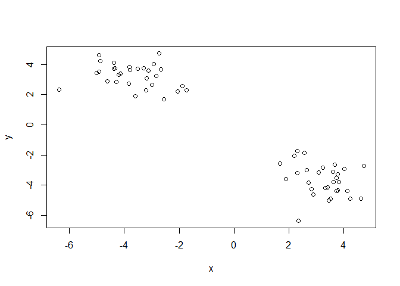
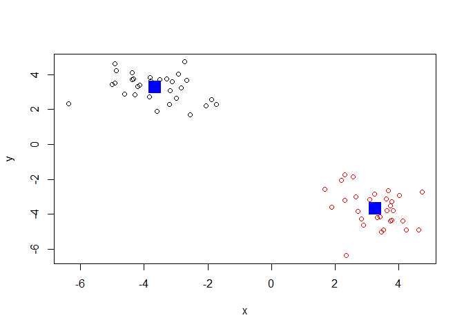
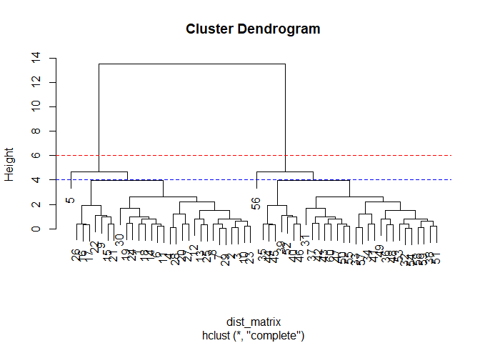
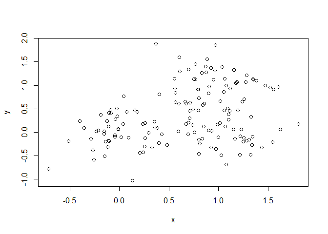
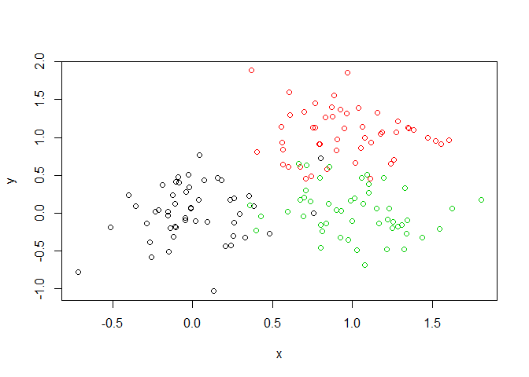
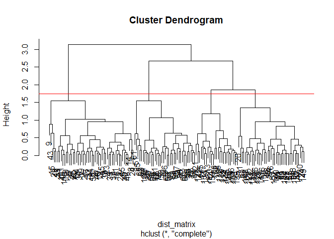
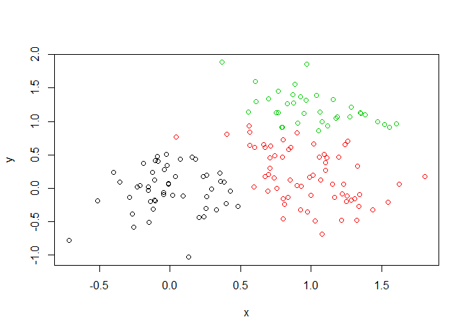
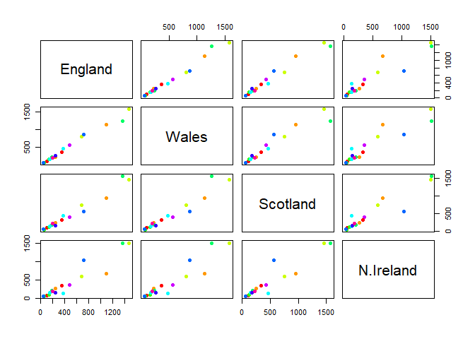
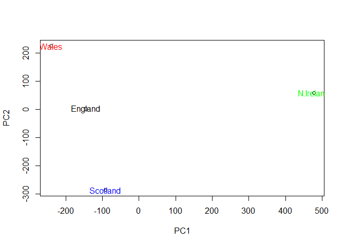

Class09
================
Nathaniel Bloom
2/4/2020

``` r
# Generate some example data for clustering
tmp <- c(rnorm(30,-3), rnorm(30,3))
x <- cbind(x=tmp, y=rev(tmp))
plot(x)
```

<!-- -->

``` r
km <- kmeans(x, centers=2, nstart=20)
print(km)
```

    ## K-means clustering with 2 clusters of sizes 30, 30
    ## 
    ## Cluster means:
    ##           x         y
    ## 1 -3.670674  3.262022
    ## 2  3.262022 -3.670674
    ## 
    ## Clustering vector:
    ##  [1] 1 1 1 1 1 1 1 1 1 1 1 1 1 1 1 1 1 1 1 1 1 1 1 1 1 1 1 1 1 1 2 2 2 2 2 2 2 2
    ## [39] 2 2 2 2 2 2 2 2 2 2 2 2 2 2 2 2 2 2 2 2 2 2
    ## 
    ## Within cluster sum of squares by cluster:
    ## [1] 50.07028 50.07028
    ##  (between_SS / total_SS =  93.5 %)
    ## 
    ## Available components:
    ## 
    ## [1] "cluster"      "centers"      "totss"        "withinss"     "tot.withinss"
    ## [6] "betweenss"    "size"         "iter"         "ifault"

``` r
km$size
```

    ## [1] 30 30

``` r
km$cluster
```

    ##  [1] 1 1 1 1 1 1 1 1 1 1 1 1 1 1 1 1 1 1 1 1 1 1 1 1 1 1 1 1 1 1 2 2 2 2 2 2 2 2
    ## [39] 2 2 2 2 2 2 2 2 2 2 2 2 2 2 2 2 2 2 2 2 2 2

``` r
length(km$cluster)
```

    ## [1] 60

``` r
table(km$cluster)
```

    ## 
    ##  1  2 
    ## 30 30

``` r
km$centers
```

    ##           x         y
    ## 1 -3.670674  3.262022
    ## 2  3.262022 -3.670674

``` r
plot(x, col=km$cluster)#color by clustering results(all 1's one color and all 2's will be different color)
points(km$centers, col="blue", pch=15, cex=2.5) #color the centers blue 
```

<!-- -->
Inspect/print the results Q. How many points are in each cluster? 30 Q.
What ‘component’ of your result object details - cluster size? 30 -
cluster assignment/membership? 30 1’s and 30 2’s - cluster center? x y 1
-2.916908 2.890115 2 2.890115 -2.916908 Plot x colored by the kmeans
cluster assignment and add cluster centers as blue points
points(km$centers, col=“blue”, pch=15, cex=2.5)

\#\#Hierarchical Clustering in R

“hclust()” used for this method of clustering, can reveal structures in
data

``` r
# First we need to calculate point (dis)similarity
# as the Euclidean distance between observations
dist_matrix <- dist(x) #must calculate distance matrix before calling hclust()
# The hclust() function returns a hierarchical
# clustering model
hc <- hclust(d = dist_matrix)
# the print method is not so useful here
hc 
```

    ## 
    ## Call:
    ## hclust(d = dist_matrix)
    ## 
    ## Cluster method   : complete 
    ## Distance         : euclidean 
    ## Number of objects: 60

``` r
plot(hc) #plotting often used to see the results of "hclust()"

# Draws a dendrogram
plot(hc)
abline(h=6, col="red", lty = 2)
cutree(hc, h=6) # Cut by height h
```

    ##  [1] 1 1 1 1 1 1 1 1 1 1 1 1 1 1 1 1 1 1 1 1 1 1 1 1 1 1 1 1 1 1 2 2 2 2 2 2 2 2
    ## [39] 2 2 2 2 2 2 2 2 2 2 2 2 2 2 2 2 2 2 2 2 2 2

``` r
abline(h=4, col="blue", lty = 2)
```

<!-- -->

``` r
cutree(hc, h=4)
```

    ##  [1] 1 1 1 1 2 1 1 1 1 1 1 1 1 1 1 1 1 1 1 1 1 1 1 1 1 1 1 1 1 1 3 3 3 3 3 3 3 3
    ## [39] 3 3 3 3 3 3 3 3 3 3 3 3 3 3 3 3 3 4 3 3 3 3

For cluster membership vector need to cut the tree at certain height to
yield seperate clusetr branches

``` r
gp4 <-cutree(hc, k=6)
table(gp4)
```

    ## gp4
    ##  1  2  3  4  5  6 
    ## 22  1  7 22  7  1

Try and cluster and cut this data with hclust

``` r
# Step 1. Generate some example data for clustering
x <- rbind(
 matrix(rnorm(100, mean=0, sd = 0.3), ncol = 2), # c1
 matrix(rnorm(100, mean = 1, sd = 0.3), ncol = 2), # c2
 matrix(c(rnorm(50, mean = 1, sd = 0.3), # c3
 rnorm(50, mean = 0, sd = 0.3)), ncol = 2))
colnames(x) <- c("x", "y")
# Step 2. Plot the data without clustering
plot(x)
```

<!-- -->

``` r
# Step 3. Generate colors for known clusters
# (just so we can compare to hclust results)
col <- as.factor( rep(c("c1","c2","c3"), each=50) )
plot(x, col=col)
```

<!-- -->

``` r
#do heirarchical clustering 
dist_matrix <- dist(x) #must calculate distance matrix before calling hclust()
# The hclust() function returns a hierarchical
# clustering model
hc <- hclust(d = dist_matrix)
# the print method is not so useful here

plot(hc)

plot(hc)
abline(h=1.75, col="red")
```

<!-- -->

``` r
grps <- cutree(hc, k=3)
grps
```

    ##   [1] 1 1 1 1 1 1 1 1 1 1 1 1 1 1 1 1 1 1 1 2 1 1 1 1 1 1 1 2 1 1 1 1 1 1 1 1 2
    ##  [38] 1 1 1 1 1 1 1 1 1 1 1 1 1 3 2 3 3 3 2 3 3 3 3 3 2 3 2 3 3 2 3 2 3 2 3 3 3
    ##  [75] 3 2 3 3 2 3 2 2 3 3 3 3 2 3 3 3 3 3 2 3 3 3 3 3 2 3 1 2 2 2 2 2 2 2 2 2 1
    ## [112] 2 2 2 2 2 2 2 1 2 2 2 2 2 2 2 2 2 2 2 2 2 2 2 2 2 2 2 2 2 2 2 2 2 2 2 2 2
    ## [149] 2 2

``` r
table(grps)
```

    ## grps
    ##  1  2  3 
    ## 50 64 36

``` r
# 1  2  3  #tells amount of each number in each group 
#57 62 31 
#make plot with cluster results colored by cutree 
plot(x, col=grps)
```

<!-- -->

### PCA

PCA converts the correlations (or lack there of) among all cells into a
representation we can more readily interpret objects that are highly
correlated will cluster together The PCs (i.e. new plot axis) are ranked
by their importance The PCs (i.e. new plot axis) are ranked by the
amount of variance in the original data (i.e. gene expression values)
that they “capture” • We actually get two main things out of a typical
PCA • The new axis (called PCs or Eigenvectors) and • Eigenvalues that
detail the amount of variance captured by each PC

### In class wrksheet

``` r
x <- read.csv("UK_foods.csv", row.names = 1) #remove row names a first column  
nrow(x)
```

    ## [1] 17

``` r
ncol(x)
```

    ## [1] 4

``` r
#[1] 17
#[1] 5

dim(x)
```

    ## [1] 17  4

``` r
# [1] 17  4
#explore the data 
barplot(as.matrix(x), beside=T, col=rainbow(nrow(x)))
```

<!-- -->

``` r
pairs(x, col=rainbow(10), pch=16) #pairwise plots useful with small data sets, compares each country with eachother on each axis and each point represents a food type, points that don't lie along the axis represent differeing values between the countries 
```

<!-- -->

``` r
#better representation is PCA 
```

Principal Component Analysis prcomp()

``` r
pca <- prcomp(t(x))
#pca
```

``` r
summary(pca) #results of PCA (67% varience is in PC1), cumulative shows what proportion of variance due to adding each PC together (96% with PC1 + PC2)
```

    ## Importance of components:
    ##                             PC1      PC2      PC3       PC4
    ## Standard deviation     324.1502 212.7478 73.87622 4.189e-14
    ## Proportion of Variance   0.6744   0.2905  0.03503 0.000e+00
    ## Cumulative Proportion    0.6744   0.9650  1.00000 1.000e+00

what is in the PCA results?

``` r
attributes(pca)
```

    ## $names
    ## [1] "sdev"     "rotation" "center"   "scale"    "x"       
    ## 
    ## $class
    ## [1] "prcomp"

``` r
plot(pca$x[,1], pca$x[,2], xlab = "PC1", ylab = "PC2") #plot variance between countries 
text(pca$x[,1], pca$x[,2], colnames(x), col=c("black", "red", "blue", "green")) 
```

<!-- -->

``` r
## Lets focus on PC1 as it accounts for > 90% of variance 
par(mar=c(10, 3, 0.35, 0))
barplot( pca$rotation[,1], las=2 )
```

<!-- -->

### PCA for gene expression
